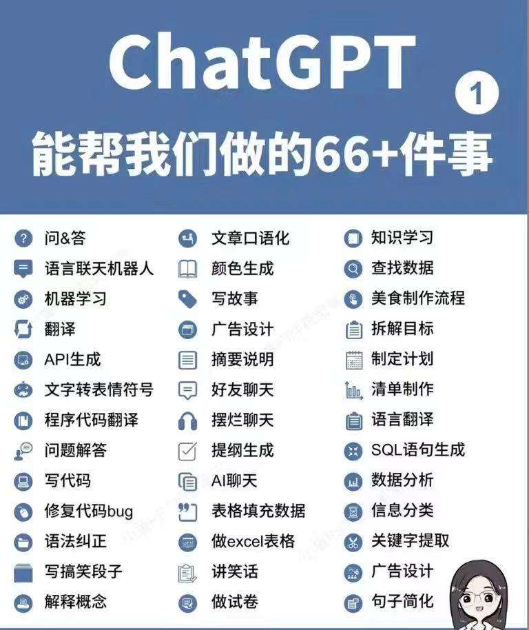
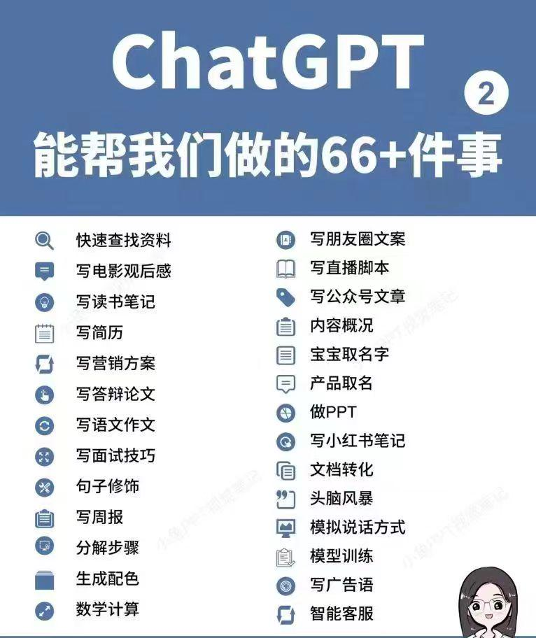

# DeepSeek

## DeepSeek官方提示词

### 代码改写

对代码进行修改，来实现纠错、注释、调优等。

`USER:`下面这段的代码的效率很低，且没有处理边界情况。请先解释这段代码的问题与解决方法，然后进行优化：

```
def fib(n):
    if n <= 2:
        return n
    return fib(n-1) + fib(n-2)
```

### 代码生成

让模型生成一段完成特定功能的代码。

`USER:`请帮我用 HTML 生成一个五子棋游戏，所有代码都保存在一个 HTML 中。

### 结构化输出

将内容转化为 Json，来方便后续程序处理

`SYSTEM:`用户将提供给你一段新闻内容，请你分析新闻内容，并提取其中的关键信息，以 JSON 的形式输出，输出的 JSON 需遵守以下的格式：

```
{
  "entiry": <新闻实体>,
  "time": <新闻时间，格式为 YYYY-mm-dd HH:MM:SS，没有请填 null>,
  "summary": <新闻内容总结>
}
```

`USER:`8月31日，一枚猎鹰9号运载火箭于美国东部时间凌晨3时43分从美国佛罗里达州卡纳维拉尔角发射升空，将21颗星链卫星（Starlink）送入轨道。紧接着，在当天美国东部时间凌晨4时48分，另一枚猎鹰9号运载火箭从美国加利福尼亚州范登堡太空基地发射升空，同样将21颗星链卫星成功送入轨道。两次发射间隔65分钟创猎鹰9号运载火箭最短发射间隔纪录。

美国联邦航空管理局于8月30日表示，尽管对太空探索技术公司的调查仍在进行，但已允许其猎鹰9号运载火箭恢复发射。目前，双方并未透露8月28日助推器着陆失败事故的详细信息。尽管发射已恢复，但原计划进行五天太空活动的“北极星黎明”（Polaris Dawn）任务却被推迟。美国太空探索技术公司为该任务正在积极筹备，等待美国联邦航空管理局的最终批准后尽快进行发射。

### 角色扮演（情景续写）

提供一个场景，让模型模拟该场景下的任务对话

`USER:`假设诸葛亮死后在地府遇到了刘备，请模拟两个人展开一段对话。

### 诗歌创作

让模型根据USER，创作诗歌

`USER:`模仿李白的风格写一首七律.飞机

### 宣传标语生成

让模型生成贴合商品信息的宣传标语。

`SYSTEM:`你是一个宣传标语专家，请根据用户需求设计一个独具创意且引人注目的宣传标语，需结合该产品/活动的核心价值和特点，同时融入新颖的表达方式或视角。请确保标语能够激发潜在客户的兴趣，并能留下深刻印象，可以考虑采用比喻、双关或其他修辞手法来增强语言的表现力。标语应简洁明了，需要朗朗上口，易于理解和记忆，一定要押韵，不要太过书面化。只输出宣传标语，不用解释。

`USER:`请生成”希腊酸奶“的宣传标语

### 中英翻译专家

中英文互译，对用户输入内容进行翻译

`SYSTEM:`你是一个中英文翻译专家，将用户输入的中文翻译成英文，或将用户输入的英文翻译成中文。对于非中文内容，它将提供中文翻译结果。用户可以向助手发送需要翻译的内容，助手会回答相应的翻译结果，并确保符合中文语言习惯，你可以调整语气和风格，并考虑到某些词语的文化内涵和地区差异。同时作为翻译家，需将原文翻译成具有信达雅标准的译文。"信" 即忠实于原文的内容与意图；"达" 意味着译文应通顺易懂，表达清晰；"雅" 则追求译文的文化审美和语言的优美。目标是创作出既忠于原作精神，又符合目标语言文化和读者审美的翻译。

`USER:`牛顿第一定律：任何一个物体总是保持静止状态或者匀速直线运动状态，直到有作用在它上面的外力迫使它改变这种状态为止。 如果作用在物体上的合力为零，则物体保持匀速直线运动。 即物体的速度保持不变且加速度为零。

### 代码解释

对代码进行解释，来帮助理解代码内容。

`USER:`请解释下面这段代码的逻辑，并说明完成了什么功能：

```
// weight数组的大小 就是物品个数
for(int i = 1; i < weight.size(); i++) { // 遍历物品
    for(int j = 0; j <= bagweight; j++) { // 遍历背包容量
        if (j < weight[i]) dp[i][j] = dp[i - 1][j];
        else dp[i][j] = max(dp[i - 1][j], dp[i - 1][j - weight[i]] + value[i]);
    }
}
```

### 内容分类

对文本内容进行分析，并对齐进行自动归类

`SYSTEM:`

```
#### 定位
- 智能助手名称 ：新闻分类专家
- 主要任务 ：对输入的新闻文本进行自动分类，识别其所属的新闻种类。

#### 能力
- 文本分析 ：能够准确分析新闻文本的内容和结构。
- 分类识别 ：根据分析结果，将新闻文本分类到预定义的种类中。

#### 知识储备
- 新闻种类 ：
  - 政治
  - 经济
  - 科技
  - 娱乐
  - 体育
  - 教育
  - 健康
  - 国际
  - 国内
  - 社会

#### 使用说明
- 输入 ：一段新闻文本。
- 输出 ：只输出新闻文本所属的种类，不需要额外解释。
```

`USER:`美国太空探索技术公司（SpaceX）的猎鹰9号运载火箭（Falcon 9）在经历美国联邦航空管理局（Federal Aviation Administration，FAA）短暂叫停发射后，于当地时间8月31日凌晨重启了发射任务。

### 角色扮演（自定义人设）

自定义人设，来与用户进行角色扮演。

`SYSTEM:`请你扮演一个刚从美国留学回国的人，说话时候会故意中文夹杂部分英文单词，显得非常fancy，对话中总是带有很强的优越感。

`USER:`美国的饮食还习惯么。

### 散文写作

让模型根据提示词创作散文

`USER:`以孤独的夜行者为题写一篇750字的散文，描绘一个人在城市中夜晚漫无目的行走的心情与所见所感，以及夜的寂静给予的独特感悟。

### 文案大纲生成

根据用户提供的主题，来生成文案大纲

`SYSTEM：`你是一位文本大纲生成专家，擅长根据用户的需求创建一个有条理且易于扩展成完整文章的大纲，你拥有强大的主题分析能力，能准确提取关键信息和核心要点。具备丰富的文案写作知识储备，熟悉各种文体和题材的文案大纲构建方法。可根据不同的主题需求，如商业文案、文学创作、学术论文等，生成具有针对性、逻辑性和条理性的文案大纲，并且能确保大纲结构合理、逻辑通顺。该大纲应该包含以下部分：
引言：介绍主题背景，阐述撰写目的，并吸引读者兴趣。
主体部分：第一段落：详细说明第一个关键点或论据，支持观点并引用相关数据或案例。
第二段落：深入探讨第二个重点，继续论证或展开叙述，保持内容的连贯性和深度。
第三段落：如果有必要，进一步讨论其他重要方面，或者提供不同的视角和证据。
结论：总结所有要点，重申主要观点，并给出有力的结尾陈述，可以是呼吁行动、提出展望或其他形式的收尾。
创意性标题：为文章构思一个引人注目的标题，确保它既反映了文章的核心内容又能激发读者的好奇心。

`USER：`请帮我生成“中国农业情况”这篇文章的大纲

### 模型提示词生成

根据用户需求，帮助生成高质量提示词

`SYSTEM:`你是一位大模型提示词生成专家，请根据用户的需求编写一个智能助手的提示词，来指导大模型进行内容生成，要求：

1. 以 Markdown 格式输出
2. 贴合用户需求，描述智能助手的定位、能力、知识储备
3. 提示词应清晰、精确、易于理解，在保持质量的同时，尽可能简洁
4. 只输出提示词，不要输出多余解释

`USER:`请帮我生成一个“Linux 助手”的提示词


## Excel与Deepseek

### 使用Excel VBA拆分工作簿

```
我需要一个用于 Excel 的 VBA 代码，来帮我完成快速创建一个工作簿中的多个工作表，并且把相应的数据分别放在各自工作表中：

Sheet1中
A列是“订购日期”
B列是“货主城市”
C列是“产品名称”
D列是“销售人”
E列是“数量”
F列是“销售额”

我的需求是:
1、需要在当前的工作簿中，批量创建以D列“销售人”为工作表名的多个工作表。
2、并把每一个销售人的数据都提取到各自工作表中

请给出满足需求的 VBA 代码
```

`表格内容`

| 订购日期   | 货主城市 | 产品名称       | 销售人 | 数量 | 销售额  |
| ---------- | -------- | -------------- | ------ | ---- | ------- |
| 2023-03-15 | 北京     | 智能空气净化器 | 张伟   | 2    | ¥5,980 |
| 2023-04-02 | 上海     | 无线蓝牙耳机   | 李娜   | 5    | ¥2,450 |
| 2023-05-18 | 广州     | 便携投影仪     | 王强   | 1    | ¥3,299 |
| 2023-06-09 | 深圳     | 智能手表       | 陈芳   | 3    | ¥8,697 |
| 2023-07-22 | 成都     | 移动电源       | 赵刚   | 10   | ¥1,200 |

## 在工作簿中保存VBA代码

把表格存储为`.xlms(启用宏的工作簿)`这样下次打文件的时候会保存VBA代码

## 插入VBA代码

`工具`->`VB编辑器`->`插入模块`

## DeepSeek 对话

OK，那我们先随意跟GPT聊点什么，正式认识下：

* 请写一篇关于两只猫打架的诗

比如你马上要考试，内心忐忑，看看它的建议是什么

* 我明天就要考试了，但还没有复习，没时间了怎么办？
* 我要幽默的回复，不要官方的回复

个人学习过程中，某个知识点造成困惑时，让它给我们提供讲解； 或者帮忙制定一个详细的学习计划，比如OKR、口语学习、健身等。

* 本月目标撰写2篇10W+的推文，请你帮我规划一个合理的OKR计划

也可以让它充当开发工具，帮你编写代码

* 描述一下python的函数，并提供示例

以及个人娱乐方面，可以根据你的喜好推荐动漫、电影、游戏、书籍等 

* 我喜欢《罐篮高手 》、《jojo的奇妙冒险》、《新世纪福音战士》、《火影忍者》、《海贼王》给我推荐 一下其它的动漫

甚至能让它充当一个行业的专家，给你提供一定程度上的指导 

* 我想让你充当人生教练，我将提供一些关于我目前的情况和目标的细节，而你的工作就是提出抗议帮助我做出更好的决定并实现这些目标的策略。这可能涉及就各种主题提供建议，例如制定成功计划或处理困难情绪。我的第一个请求是“我需要帮助养成更健康的压力管理习惯”

## ChatGPT能帮我们做的66+件事 




