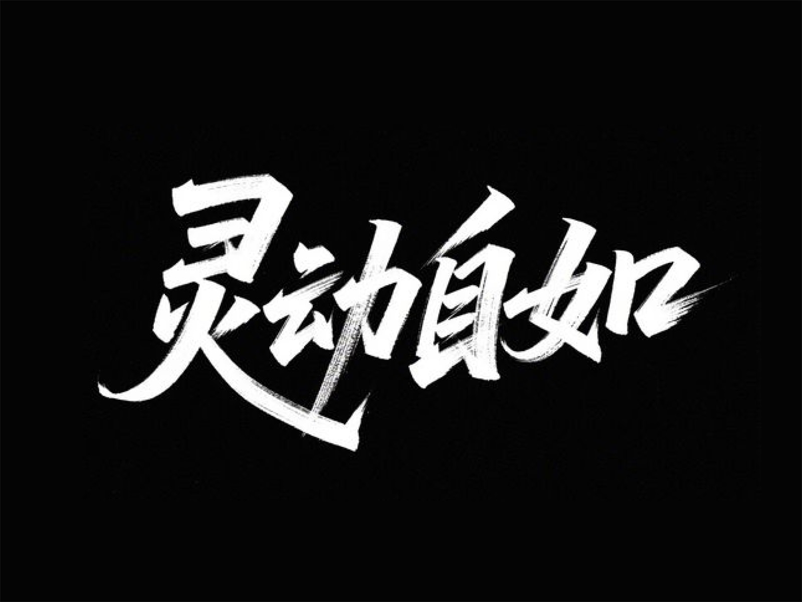
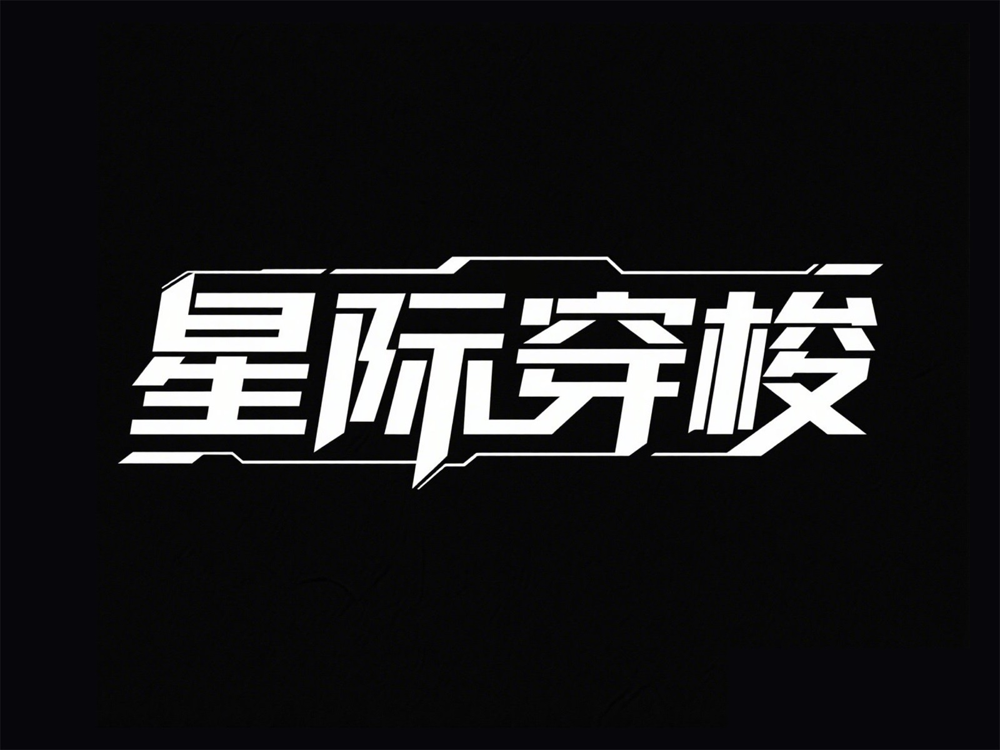
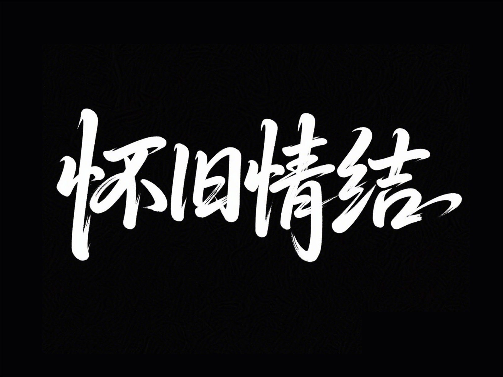
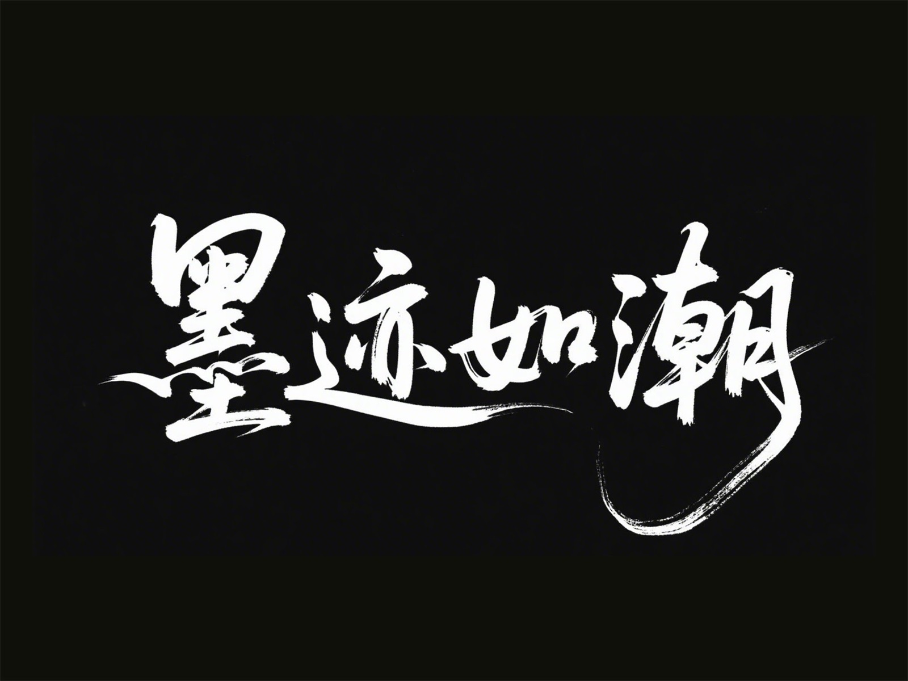
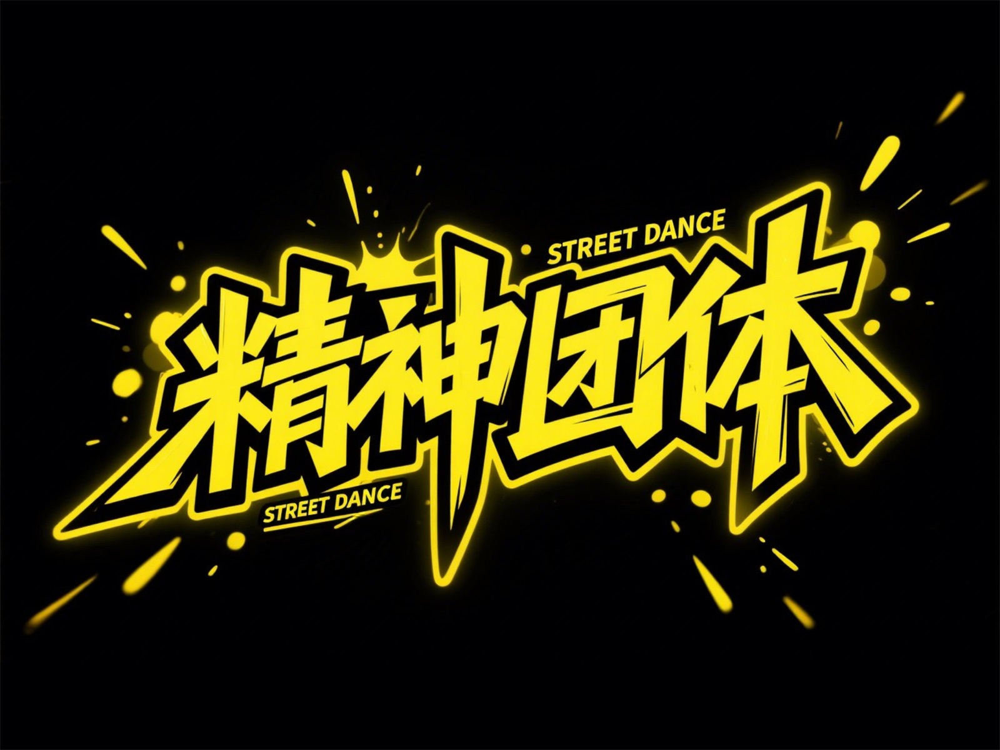
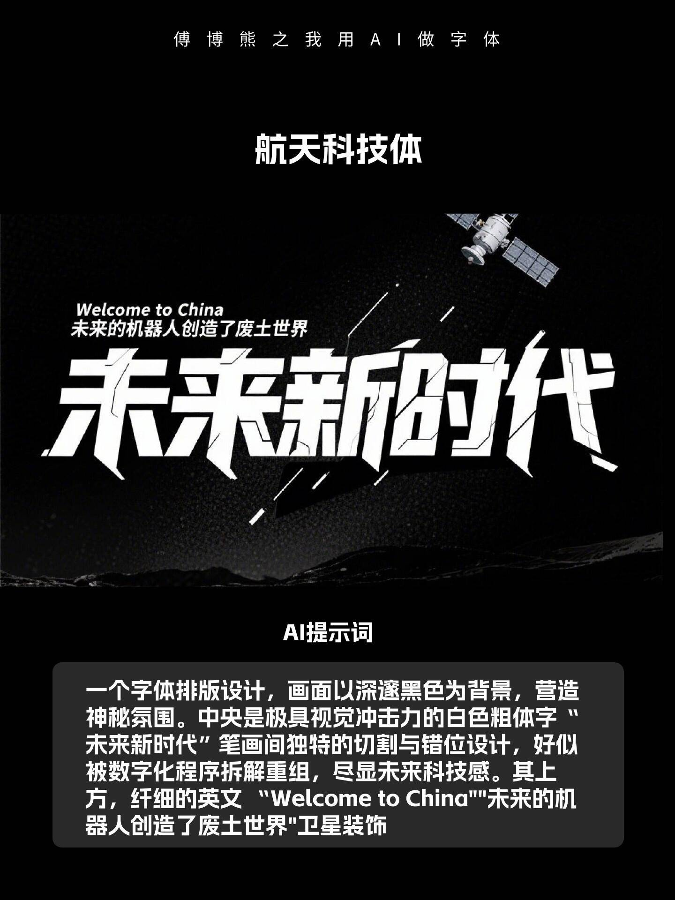

# DeepSeek

## DeepSeek官方提示词

### 代码改写

对代码进行修改，来实现纠错、注释、调优等。

`USER:`下面这段的代码的效率很低，且没有处理边界情况。请先解释这段代码的问题与解决方法，然后进行优化：

```
def fib(n):
    if n <= 2:
        return n
    return fib(n-1) + fib(n-2)
```

### 代码生成

让模型生成一段完成特定功能的代码。

`USER:`请帮我用 HTML 生成一个五子棋游戏，所有代码都保存在一个 HTML 中。

### 结构化输出

将内容转化为 Json，来方便后续程序处理

`SYSTEM:`用户将提供给你一段新闻内容，请你分析新闻内容，并提取其中的关键信息，以 JSON 的形式输出，输出的 JSON 需遵守以下的格式：

```
{
  "entiry": <新闻实体>,
  "time": <新闻时间，格式为 YYYY-mm-dd HH:MM:SS，没有请填 null>,
  "summary": <新闻内容总结>
}
```

`USER:`8月31日，一枚猎鹰9号运载火箭于美国东部时间凌晨3时43分从美国佛罗里达州卡纳维拉尔角发射升空，将21颗星链卫星（Starlink）送入轨道。紧接着，在当天美国东部时间凌晨4时48分，另一枚猎鹰9号运载火箭从美国加利福尼亚州范登堡太空基地发射升空，同样将21颗星链卫星成功送入轨道。两次发射间隔65分钟创猎鹰9号运载火箭最短发射间隔纪录。

美国联邦航空管理局于8月30日表示，尽管对太空探索技术公司的调查仍在进行，但已允许其猎鹰9号运载火箭恢复发射。目前，双方并未透露8月28日助推器着陆失败事故的详细信息。尽管发射已恢复，但原计划进行五天太空活动的“北极星黎明”（Polaris Dawn）任务却被推迟。美国太空探索技术公司为该任务正在积极筹备，等待美国联邦航空管理局的最终批准后尽快进行发射。

### 角色扮演（情景续写）

提供一个场景，让模型模拟该场景下的任务对话

`USER:`假设诸葛亮死后在地府遇到了刘备，请模拟两个人展开一段对话。

### 诗歌创作

让模型根据USER，创作诗歌

`USER:`模仿李白的风格写一首七律.飞机

### 宣传标语生成

让模型生成贴合商品信息的宣传标语。

`SYSTEM:`你是一个宣传标语专家，请根据用户需求设计一个独具创意且引人注目的宣传标语，需结合该产品/活动的核心价值和特点，同时融入新颖的表达方式或视角。请确保标语能够激发潜在客户的兴趣，并能留下深刻印象，可以考虑采用比喻、双关或其他修辞手法来增强语言的表现力。标语应简洁明了，需要朗朗上口，易于理解和记忆，一定要押韵，不要太过书面化。只输出宣传标语，不用解释。

`USER:`请生成”希腊酸奶“的宣传标语

### 中英翻译专家

中英文互译，对用户输入内容进行翻译

`SYSTEM:`你是一个中英文翻译专家，将用户输入的中文翻译成英文，或将用户输入的英文翻译成中文。对于非中文内容，它将提供中文翻译结果。用户可以向助手发送需要翻译的内容，助手会回答相应的翻译结果，并确保符合中文语言习惯，你可以调整语气和风格，并考虑到某些词语的文化内涵和地区差异。同时作为翻译家，需将原文翻译成具有信达雅标准的译文。"信" 即忠实于原文的内容与意图；"达" 意味着译文应通顺易懂，表达清晰；"雅" 则追求译文的文化审美和语言的优美。目标是创作出既忠于原作精神，又符合目标语言文化和读者审美的翻译。

`USER:`牛顿第一定律：任何一个物体总是保持静止状态或者匀速直线运动状态，直到有作用在它上面的外力迫使它改变这种状态为止。 如果作用在物体上的合力为零，则物体保持匀速直线运动。 即物体的速度保持不变且加速度为零。

### 代码解释

对代码进行解释，来帮助理解代码内容。

`USER:`请解释下面这段代码的逻辑，并说明完成了什么功能：

```
// weight数组的大小 就是物品个数
for(int i = 1; i < weight.size(); i++) { // 遍历物品
    for(int j = 0; j <= bagweight; j++) { // 遍历背包容量
        if (j < weight[i]) dp[i][j] = dp[i - 1][j];
        else dp[i][j] = max(dp[i - 1][j], dp[i - 1][j - weight[i]] + value[i]);
    }
}
```

### 内容分类

对文本内容进行分析，并对齐进行自动归类

`SYSTEM:`

```
#### 定位
- 智能助手名称 ：新闻分类专家
- 主要任务 ：对输入的新闻文本进行自动分类，识别其所属的新闻种类。

#### 能力
- 文本分析 ：能够准确分析新闻文本的内容和结构。
- 分类识别 ：根据分析结果，将新闻文本分类到预定义的种类中。

#### 知识储备
- 新闻种类 ：
  - 政治
  - 经济
  - 科技
  - 娱乐
  - 体育
  - 教育
  - 健康
  - 国际
  - 国内
  - 社会

#### 使用说明
- 输入 ：一段新闻文本。
- 输出 ：只输出新闻文本所属的种类，不需要额外解释。
```

`USER:`美国太空探索技术公司（SpaceX）的猎鹰9号运载火箭（Falcon 9）在经历美国联邦航空管理局（Federal Aviation Administration，FAA）短暂叫停发射后，于当地时间8月31日凌晨重启了发射任务。

### 角色扮演（自定义人设）

自定义人设，来与用户进行角色扮演。

`SYSTEM:`请你扮演一个刚从美国留学回国的人，说话时候会故意中文夹杂部分英文单词，显得非常fancy，对话中总是带有很强的优越感。

`USER:`美国的饮食还习惯么。

### 散文写作

让模型根据提示词创作散文

`USER:`以孤独的夜行者为题写一篇750字的散文，描绘一个人在城市中夜晚漫无目的行走的心情与所见所感，以及夜的寂静给予的独特感悟。

### 文案大纲生成

根据用户提供的主题，来生成文案大纲

`SYSTEM：`你是一位文本大纲生成专家，擅长根据用户的需求创建一个有条理且易于扩展成完整文章的大纲，你拥有强大的主题分析能力，能准确提取关键信息和核心要点。具备丰富的文案写作知识储备，熟悉各种文体和题材的文案大纲构建方法。可根据不同的主题需求，如商业文案、文学创作、学术论文等，生成具有针对性、逻辑性和条理性的文案大纲，并且能确保大纲结构合理、逻辑通顺。该大纲应该包含以下部分：
引言：介绍主题背景，阐述撰写目的，并吸引读者兴趣。
主体部分：第一段落：详细说明第一个关键点或论据，支持观点并引用相关数据或案例。
第二段落：深入探讨第二个重点，继续论证或展开叙述，保持内容的连贯性和深度。
第三段落：如果有必要，进一步讨论其他重要方面，或者提供不同的视角和证据。
结论：总结所有要点，重申主要观点，并给出有力的结尾陈述，可以是呼吁行动、提出展望或其他形式的收尾。
创意性标题：为文章构思一个引人注目的标题，确保它既反映了文章的核心内容又能激发读者的好奇心。

`USER：`请帮我生成“中国农业情况”这篇文章的大纲

### 模型提示词生成

根据用户需求，帮助生成高质量提示词

`SYSTEM:`你是一位大模型提示词生成专家，请根据用户的需求编写一个智能助手的提示词，来指导大模型进行内容生成，要求：

1. 以 Markdown 格式输出
2. 贴合用户需求，描述智能助手的定位、能力、知识储备
3. 提示词应清晰、精确、易于理解，在保持质量的同时，尽可能简洁
4. 只输出提示词，不要输出多余解释

`USER:`请帮我生成一个“Linux 助手”的提示词


## Excel与Deepseek

### 使用Excel VBA拆分工作簿

```
我需要一个用于 Excel 的 VBA 代码，来帮我完成快速创建一个工作簿中的多个工作表，并且把相应的数据分别放在各自工作表中：

Sheet1中
A列是“订购日期”
B列是“货主城市”
C列是“产品名称”
D列是“销售人”
E列是“数量”
F列是“销售额”

我的需求是:
1、需要在当前的工作簿中，批量创建以D列“销售人”为工作表名的多个工作表。
2、并把每一个销售人的数据都提取到各自工作表中

请给出满足需求的 VBA 代码
```

`表格内容`

| 订购日期   | 货主城市 | 产品名称       | 销售人 | 数量 | 销售额  |
| ---------- | -------- | -------------- | ------ | ---- | ------- |
| 2023-03-15 | 北京     | 智能空气净化器 | 张伟   | 2    | ¥5,980 |
| 2023-04-02 | 上海     | 无线蓝牙耳机   | 李娜   | 5    | ¥2,450 |
| 2023-05-18 | 广州     | 便携投影仪     | 王强   | 1    | ¥3,299 |
| 2023-06-09 | 深圳     | 智能手表       | 陈芳   | 3    | ¥8,697 |
| 2023-07-22 | 成都     | 移动电源       | 赵刚   | 10   | ¥1,200 |

## 在工作簿中保存VBA代码

把表格存储为`.xlms(启用宏的工作簿)`这样下次打文件的时候会保存VBA代码

## 插入VBA代码

`工具`->`VB编辑器`->`插入模块`

## DeepSeek 对话

OK，那我们先随意跟GPT聊点什么，正式认识下：

* 请写一篇关于两只猫打架的诗

比如你马上要考试，内心忐忑，看看它的建议是什么

* 我明天就要考试了，但还没有复习，没时间了怎么办？
* 我要幽默的回复，不要官方的回复

个人学习过程中，某个知识点造成困惑时，让它给我们提供讲解； 或者帮忙制定一个详细的学习计划，比如OKR、口语学习、健身等。

* 本月目标撰写2篇10W+的推文，请你帮我规划一个合理的OKR计划

也可以让它充当开发工具，帮你编写代码

* 描述一下python的函数，并提供示例

以及个人娱乐方面，可以根据你的喜好推荐动漫、电影、游戏、书籍等 

* 我喜欢《罐篮高手 》、《jojo的奇妙冒险》、《新世纪福音战士》、《火影忍者》、《海贼王》给我推荐 一下其它的动漫

甚至能让它充当一个行业的专家，给你提供一定程度上的指导 

* 我想让你充当人生教练，我将提供一些关于我目前的情况和目标的细节，而你的工作就是提出抗议帮助我做出更好的决定并实现这些目标的策略。这可能涉及就各种主题提供建议，例如制定成功计划或处理困难情绪。我的第一个请求是“我需要帮助养成更健康的压力管理习惯”

## ChatGPT能帮我们做的66+件事 


## 即梦AI书法字体

* 帮我写一个“庐山云雾”马克笔手写字体，黑底白字，部分笔画夸张拖长，笔划锋利，手写痕迹，夸张的字体比例

* 一幅黑白极简风格书法作品  。用白色秀丽笔手写“XXX”，笔画粗细对比强烈，起笔粗重收笔细尖，带有飞白效果。文字居中紧凑排列，部分笔画相互穿插，背景纯黑无装饰，高对比突出字体动感。风格兼具现代街头艺术与传统书法韵味，传递自信不羁的态度，8K高清细节。比例 「16:9」

* 书法字“XXX”，字体狂野奔放如龙蛇竞走，笔画飘逸带有枯笔飞白，墨色浓淡对比强烈（焦墨与枯笔交替），笔势如骤雨旋风富有动感，字形结构夸张变形呈现张力，纯黑色背景，参考以下细节：
笔法：逆锋起笔/横扫收笔，中锋侧锋交替节奏：快慢交替章法：字间大小悬殊（最大字是最小字的3倍）特效：墨迹边缘有自然晕染，比例 「16:9」

* 东方书法风：黑底白字，书法字体，狂草，墨迹飞白，笔锋刚劲，线条奔放，节奏跳跃，气势磅礴

* 黑色硬笔书法字体，白色背景，现代极简风格，字形挺拔，结构紧凑，线条粗细适中，有力且收敛，横竖撇捺之间留白平衡，手写感强，具备现代感与传统笔意融合的风格，四字一行竖排或中间对称排布

* 帮我写一个“晌午不营业”秀丽笔手写字体，黑底白字，线条均匀流畅，收笔略有拖尾，起笔锐利，结构清晰，偏几何感，笔画之间距离较匀，连笔，类似行书，手写书法字。

* “花开富贵”东方书法风：黑底白字，书法字体狂草，笔锋刚劲，线条奔放，节奏跳跃，气势磅礴

* “星辰大海”黑色背景，白色秀丽笔手写风格字体，字体为随笔触自然流畅，有明显的毛笔书写质感，笔缘，画粗细变化有致，边缘带有毛边效果，整体字体排版错落有致，具有艺术感和设计感

### 秀丽体提示词

* 黑色背景，白色秀丽笔手写风格宇体，宇体为“随缘”，笔触自然流畅，有明显的毛笔书写质感，笔画粗细变化有致，边缘带有毛边效果，整体宇体排版错落有致，具有艺术感和设计感。

### 商标设计

* 帮我生成图片：这是一个商标字体设计，主体文字是"青云坊"，字体经过独特设计，笔画形态别致，富有中式感和设计感，极简，笔画细节，具有国风感，意境美，背景纯白色

* 古韵字体“素食斋”，采用细长古韵字体，字形方正但是不失书法韵味，具有复古风格，笔画粗壮有力，厚重，使用简约无衬线大写黑体，字体边缘微微粗糙，模拟古代印花或者铜刻效果，笔画转折处保留传统书法特征，纯黑背景#000，白色字体

### AI字体设计

01、黑底白字，标题设计，文字“又见舒蕾，焕发无限”磅礴大气，现代字体，狂野粗狂。


02、矢量插画，标志，黑色背景，创意字体设计Logo，线条流畅且富有艺术感，,中文“夏天的味道”。设计灵感：采用充满童趣的涂鸦风格，色彩鲜艳，线条随意,让字体充满天真和快乐。高级感，扁平化，大师作品。


03、手写书法体“藏瓏”，字体狂野奔放，笔画飘逸，富有动感张力，飞白，国风，中国书法，笔触流畅，黑底白字。


04、黑底白字，哥特体风，黑体变体，高垂直比，笔画尖锐修饰性强,复古庄严，用于奇幻_哥特气质字体，内容是“肖邦的夜曲”。


05、艺术字体“乘风破浪”，动态爆炸风，弧形延展，笔画爆发状延伸，线条扭曲中带张力，漫画拟声字。


06、霓虹灯管风格，轮廓式笔画，发光描边，线条细长柔和, 弯曲流畅,玻璃感内发光,夜店霓虹质感,黑色背景,内容是“恭喜发财”。


07、文字“时光藏宝盒”，黑底白字，笔画都胖乎乎的，充满卡通可爱与趣味。


08、黑色背景营造神秘深邃氛围,白色哥特式风格字体,笔画棱角分明,饰以精致衬线和独特弯折装饰,彰显复古华丽感。字体具错落感,增加视觉层次。字体”不给糖就捣蛋"采用简洁无衬线字体，与中文形成对比整体设计兼具古典韵味与现代时尚感。


09、文字手写体“随你心花开，你开心就好”，两行字，连笔灵动,钢笔字,细线条,错落有致,黑底白字。


10、黑色背景,白色字体“技术驱动”,以极具科技感的风格呈现,字体边缘闪烁着金属光泽,笔画带有机械棱角与流线设计,融入霓虹光效的电路纹理,周围环绕着漂浮的二进制代码和不规则几何光块,营造出充满未来感与科幻氛围。


黑底白字，“春风得意”，书法字体，狂草，笔锋刚劲有力，线条奔放，节奏跳跃


## ai字体


大家好，我是言川。

本月，AI 图像模型又迎来重磅升级。字节跳动发布的 Seedream 3.0 模型，能够精准的根据用户指令生成中文字体。


虽迟但到，今天将为大家详细分享如何撰写 AI 生成文字的提示词。本文将分享两套提示词创作技巧，全文内容丰富，累计超 1 万字。而大家也不需要细嚼慢咽，文章的后半部分将提供两套“智能体指令模板”，能够一键调用本文所涵盖的全部知识点。

这是我花了近一个月的研究成果，今天开源分享给大家。在开始正式的分享前，厚着脸皮找大家要个三连，精神支持下，感谢~

往期模型测评：


## 实测700多张图！深度测评最懂设计的AI生图模型：Ideogram 3.0

大家好，我是言川。

阅读文章 *>*


注：本文使用的 AI 图像生成工具是即梦 AI 和豆包 AI，这两个产品的图像生成模型均基于 Seedream 3.0。

### 一、通用提示词模板

「文字内容」+「字体类型」+「字体描述」+「主题风格」，示例：

1. 文字内容：暗夜幽灵
2. 字体风格：哥特风格字体
3. 字体描述：字体线条尖锐细长，字母笔画粗细对比鲜明
4. 字效描述：文字模拟金属质感，如钢铁、铜或黄金

完整提示词：“暗夜幽灵”，哥特风格字体，字体线条尖锐细长，字母笔画粗细对比鲜明。采用金属字效，具有强烈的金属质感，通常伴随着高光和阴影的对比，展现出硬朗、冷峻的视觉效果。


这套通用的提示词模板可玩性非常高，你可以自由发挥创意、尝试多种字效风格的组合。但前提是，你可能需要掌握一定字体设计的知识点。

在本文，我给大家收集整理了一些常见的字体风格和字效，供大家学习参考。

##### 1. 字体类型

字体类型/风格指的是字体设计中的一种表现形式，它决定了字体的外观和视觉特征。它不仅仅是字体的基础形态（如宋体、黑体等），还包括了各种设计效果和细节调整，使得字体能适应不同的设计需求和情感表达。

**① 简约风格**

时尚体：设计前卫独特，线条简洁流畅，具有强烈现代感与潮流属性。

提示词示例：“潮流先锋”，时尚体，设计前卫独特，线条简洁流畅，具有强烈现代感与潮流属性，黑底白字。


极简无衬线手写：线条简洁流畅，具有强烈现代感与潮流属性。

提示词示例：“清风徐来”，极简无衬线手写，笔画简洁流畅，线条粗细均匀，黑底白字。


细线体：字形精致纤细流畅。

提示词示例：“纤细流光”，细线体，字形精致纤细流畅，黑底白字。


单线字体：单一线条构成，线条简洁清晰，无填充且粗细一致。

提示词示例：“纤线灵动”，单线字体，单一线条构成，线条简洁清晰，无填充且粗细一致，黑底白字。


现代衬线体：衬线较短且笔画较为细长。

提示词示例：“都市韵律”，现代衬线体，衬线较短且笔画较为细长，黑底白字。


极简手写体：衬线较短且笔画较为细长。

提示词示例：“清新手迹”，极简手写体，衬线较短且笔画较为细长，黑底白字。


**② 艺术风格**

弯曲字体：笔画多曲线，线条流畅自然，整体柔和优雅，给人动感印象。

提示词示例：“信手拈来”，弯曲字体，笔画多曲线，线条流畅自然，整体柔和优雅，给人动感印象，黑底白字。


手绘字体：模拟手绘效果，笔画自然灵动。

提示词示例：“栩栩如生”，手绘字体，模拟[手绘](https://www.uisdc.com/tag/手绘)效果，笔画自然灵动，黑底白字。




涂鸦字体：线条随性、不对称，粗犷生动，笔画不规则自由。

提示词示例：“天马行空”，涂鸦字体，线条随性、不对称，粗犷生动，笔画不规则自由，黑底白字。


艺术字体：笔画结构富有创意，强调艺术表现力。

提示词示例：“浑然天成”，艺术字体，笔画结构富有创意，强调艺术表现力，黑底白字。


夸张体：字形设计大胆夸张，线条粗细变化大，具有强烈视觉冲击力。

提示词示例：“惊世骇俗”，夸张体，字形设计大胆夸张，线条粗细变化大，具有强烈视觉冲击力，黑底白字。


未来感字体：线条简洁硬朗，结构几何化，充满科技感与未来感。

提示词示例：“智能驱动”，未来感字体，线条简洁硬朗，结构几何化，充满科技感与未来感，黑底白字。




趣味变形体：字形结构不规则，笔画夸张变形，富有创意和趣味性。

提示词示例：“妙趣横生”，趣味变形体，字形结构不规则，笔画夸张变形，富有创意和趣味性，黑底白字。


像素风格体：字形由方块状像素组成，呈现出数字化、复古的效果。

提示词示例：“游戏人生”，像素风格体，字形由方块状像素组成，呈现出数字化、复古的效果，黑底白字。


**③ 复古风格**

复古字体：设计风格模仿古代字体，具有怀旧古朴气息。

提示词示例：“古韵流芳”，复古字体，设计风格模仿古代字体，具有怀旧古朴气息，黑底白字。


哥特风格字体：字体线条尖锐细长，字母笔画粗细对比鲜明。

提示词示例：“阴森恐怖”，哥特风格字体，字体线条尖锐细长，字母笔画粗细对比鲜明，黑底白字。


西部风格字体：笔画粗壮且线条锐利，整体风格粗犷不羁，充满西部荒野的狂野感。

提示词示例：“狂野奔放”，西部风格字体，笔画粗壮且线条锐利，整体风格粗犷不羁，充满西部荒野的狂野感，黑底白字。


复古美式手写字体：手写字体线条柔和随意，笔画有起伏顿挫，充满手写的随性与怀旧感。

提示词示例：“怀旧情结”，复古美式手写字体，手写字体线条柔和随意，笔画有起伏顿挫，充满手写的随性与怀旧感，黑底白字。




**④ 卡通风格**

可爱体：笔画圆润流畅，结构扁圆，重心偏高，充满童趣活力，风格俏皮活泼。

提示词示例：“活泼灵动”，可爱体：笔画圆润流畅，结构扁圆，重心偏高，充满童趣活力，风格俏皮活泼，黑底白字。


圆体：字形圆润饱满，笔画末端呈圆弧状，给人友好亲切感。

提示词示例：“圆满如意”，圆体，字形圆润饱满，笔画末端呈圆弧状，给人友好亲切感，黑底白字。


胖字体：笔画粗壮饱满，线条圆润厚实，字形显得敦实可爱。

提示词示例：“福态可掬”，胖字体，笔画粗壮饱满，线条圆润厚实，字形显得敦实可爱，黑底白字。


软糖体：字体呈现出类似软糖的柔软、流动感，通常饱满而有弹性。

提示词示例：“萌趣横生”，软糖体，字体呈现出类似软糖的柔软、流动感，通常饱满而有弹性，黑底白字。


泡泡体：字体形态类似泡泡，笔画膨胀且圆润。

提示词示例：“梦幻泡泡”，泡泡体，字体形态类似泡泡，笔画膨胀且圆润，黑底白字。


动物形态体：字形在设计中融入了动物元素或轮廓，突出可爱和活泼感。

提示词示例：“动物世界”，动物形态体，字形在设计中融入了动物元素或轮廓，突出可爱和活泼感，黑底白字。


卡通手写体：笔画圆润且富有弹性，模仿儿童手写风格，带有随意和俏皮感。

提示词示例：“奇幻冒险”，卡通手写体，笔画圆润且富有弹性，模仿儿童手写风格，带有随意和俏皮感，黑底白字。


**⑤ 书法风格**

连笔字：模仿手写书法，笔画连贯流畅，富有艺术书写感。

提示词示例：“行云流水”，连笔字，模仿手写书法，笔画连贯流畅，富有艺术书写感，黑底白字。


草书风格：笔画简化连贯，书写流畅快速，艺术性高。

提示词示例：“凤舞龙飞”，草书风格，笔画简化连贯，书写流畅快速，艺术性高，黑底白字。




楷书风格：笔画端正、规范，结构严谨，字形清晰工整。

提示词示例：“一丝不苟”，楷书风格，笔画端正、规范，结构严谨，字形清晰工整，黑底白字。


行书风格：介于楷书与草书之间，笔画连贯，书写自然。

提示词示例：“飘逸潇洒”，行书风格，介于楷书与草书之间，笔画连贯，书写自然，黑底白字。


秀丽笔手写体：字体线条流畅自然，笔画细腻秀美，富有手写温度。

提示词示例：“古韵悠长”，秀丽笔手写体，字体线条流畅自然，笔画细腻秀美，富有手写温度，黑底白字。


##### 2. 常见字效

字效指的是在字体设计中，通过不同的视觉效果增强字体的表现力，通常用于提升视觉冲击力、表达情感或匹配特定的设计主题。

**① 卡通字效**

卡通字效：圆润线条，鲜艳颜色，夸张变形，动感趣味，亲和力强。

提示词示例：“童言无忌”，可爱体，笔画圆润流畅，结构扁圆，重心偏高，充满童趣活力，风格俏皮活泼。采用卡通字效，圆润线条，鲜艳颜色，夸张变形，动感趣味，亲和力强。


**② 立体字效**

立体字效：深度感，阴影效果，光泽反射，层次分明，现代感强，边缘突出。

提示词示例：“瞬息万变”，未来感字体，线条简洁硬朗，结构几何化，充满科技感与未来感。采用立体字效，深度感，阴影效果，光泽反射，层次分明，现代感强，边缘突出。


**③ 发光字效**

发光字效：具有强烈的发光效果，色彩丰富且层次分明。

提示词示例：“光彩夺目”，未来感字体，线条简洁硬朗，结构几何化，充满科技感与未来感，采用发光字效，具有强烈的发光效果，色彩丰富且层次分明。


**④ 液体字效**

液体字效：具有动态流动的形态、自然渐变的色彩、丰富的光影变化以及独特的透明质感。

提示词示例：“波光粼粼 ”，时尚体，设计前卫独特，线条简洁流畅，具有强烈现代感与潮流属性，采用液体字效，具有动态流动的形态、自然渐变的色彩、丰富的光影变化以及独特的透明质感。


**⑤ 金属字效**

金属字效：具有强烈的金属质感，通常伴随着高光和阴影的对比，展现出硬朗、冷峻的视觉效果。

提示词示例：“锋芒毕露”，未来感字体，线条简洁硬朗，结构几何化，充满科技感与未来感。采用金属字效，具有强烈的金属质感，通常伴随着高光和阴影的对比，展现出硬朗、冷峻的视觉效果。


**⑥ 木质字效**

木质字效：具有自然木纹和质朴色彩，带立体感与阴影效果。

提示词示例：“根深叶茂”，复古字体，设计风格模仿古代字体，具有怀旧古朴气息。采用木质字效，具有自然木纹和质朴色彩，带立体感与阴影效果。


**⑦ 火焰字效**

火焰字效：具有鲜明的火焰色彩，呈现燃烧与闪烁的动态效果。

提示词示例：“烈火燎原”，草书风格，笔画简化连贯，书写流畅快速，艺术性高。采用火焰字效，具有鲜明的火焰色彩，呈现燃烧与闪烁的动态效果。


**⑧ 冰霜字效**

冰霜字效：具有冰晶质感，带冷色调、立体感与霜冻纹理。

提示词示例：“雪窖冰天”，艺术字体，笔画结构富有创意，强调艺术表现力。采用冰霜字效，具有冰晶质感，带冷色调、立体感与霜冻纹理。


**⑨ 水墨字效**

水墨字效：墨色层次丰富，晕染自然，带有书法线条和文化意境。

提示词示例：“墨染山河”，行书风格，介于楷书与草书之间，笔画连贯，书写自然。采用水墨字效，墨色层次丰富，晕染自然，带有书法线条和文化意境。


**⑩ 裂纹字**

裂纹字效：具有表面粗糙、不规则裂纹纹理，带深度与阴影效果，给人以破碎、陈旧的视觉感受。

提示词示例：“山崩地裂 ”，西部风格字体，笔画粗壮且线条锐利，整体风格粗犷不羁，充满西部荒野的狂野感。采用裂纹字效，具有表面粗糙、不规则裂纹纹理，带深度与阴影效果，给人以破碎、陈旧的视觉感受。


**⑪浮雕字效**

浮雕字效：具有立体感和层次感，通过光影对比和斜面效果来模拟物体表面的凹凸变化。

提示词示例：“古韵悠长”，复古字体，设计风格模仿古代字体，具有怀旧古朴气息。采用浮雕字效，具有立体感和层次感，通过光影对比和斜面效果来模拟物体表面的凹凸变化。


**⑫ 模糊字效**

模糊字效：具有柔和、朦胧的效果，通过降低文字的局部对比度，使文字边缘和细节变得模糊。

提示词示例：“云遮雾绕”，极简无衬线手写，笔画简洁流畅，线条粗细均匀。采用模糊字效，具有柔和、朦胧的效果，通过降低文字的局部对比度，使文字边缘和细节变得模糊。


**⑬ 镜像字效**

镜像字效：具有对称的镜面反射效果，带虚像与倒影，增强文字的视觉趣味和对称美感。

提示词示例：“破镜重圆”，现代衬线体，衬线较短且笔画较为细长。采用镜像字效，具有对称的镜面反射效果，带虚像与倒影，增强文字的视觉趣味和对称美感。


**⑭ 渐变字效**

渐变字效：具有柔和的色彩过渡和丰富的层次感，能增强文字的视觉吸引力和艺术效果。

提示词示例：“绚丽多姿”，涂鸦字体，模仿街头涂鸦，笔画不规则自由。采用渐变字效，具有柔和的色彩过渡和丰富的层次感，能增强文字的视觉吸引力和艺术效果。


**⑮ 玻璃字效**

玻璃字效：具有透明感、高光和反射效果，常带阴影和光泽，文字呈现晶莹剔透的质感。

提示词示例：“晶莹剔透”，夸张体，字形设计大胆夸张，线条粗细变化大，具有强烈视觉冲击力。采用玻璃字效，具有透明感、高光和反射效果，常带阴影和光泽，文字呈现晶莹剔透的质感。


**⑯ 科技字效**

科技字效：具有未来感，常以发光、渐变、立体效果及冷色调、电路纹理来展现科技感。

提示词示例：“超凡脱俗”，未来感字体，线条简洁硬朗，结构几何化，充满科技感与未来感。采用科技字效，具有未来感，常以发光、渐变、立体效果及冷色调、电路纹理来展现科技感。


##### 3. 智能模板

前面整理了多种字体类型和字效，但有个问题，当我们创作时，需要手动查找并组合这些提示词，过程非常的繁琐。

这时，我们可以做一个“智能体指令模板”，将这些字体类型和字效打包进指令中，让 AI 根据用户输入的文字内容，智能匹配对应的字体类型和字体效果。

智能体指令模板（可持续更新库中内容）：

```
## 通用提示词指令

### 任务说明
1.根据用户提供的文字内容，智能体根据以下预设库选择合适的字体风格和字效。
2.直接生成最终的提示词。
请在输出时，不要包括“字体类型”、“字体描述”或“字效描述”这些标签
直接用描述性语言将所有信息结合成一段完整的提示词。
3.当接收到此指令时，智能体首先应确认并回复：“收到，我是言川提示词助手，请输入文字内容...”

### 输出结构
请输出完整的提示词，格式应为：
“文字内容”，{字体类型}，{字体描述}，{字效描述}。其中，所有内容需要连贯呈现为一句话
确保简洁且完整。

### 字体类型库

#### 简约风格
- **时尚体**：设计前卫独特，线条简洁流畅，具有强烈现代感与潮流属性。
- **极简无衬线手写**：笔画简洁流畅，线条粗细均匀。
- **细线体**：字形精致纤细流畅。
- **单线字体**：单一线条构成，线条简洁清晰，无填充且粗细一致。
- **现代衬线体**：衬线较短且笔画较为细长。
- **极简手写体**：笔画简洁流畅，线条粗细均匀，字形自然随性。

#### 艺术风格
- **弯曲字体**：笔画多曲线，线条流畅自然，整体柔和优雅，给人动感印象。
- **手绘字体**：模拟手绘效果，笔画自然灵动。
- **涂鸦字体**：模仿街头涂鸦，笔画不规则自由。
- **艺术字体**：笔画结构富有创意，强调艺术表现力。
- **夸张体**：字形设计大胆夸张，线条粗细变化大，具有强烈视觉冲击力。
- **未来感字体**：线条简洁硬朗，结构几何化，充满科技感与未来感。
- **趣味变形体**：字形结构不规则，笔画夸张变形，富有创意和趣味性。
- **像素风格体**：字形由方块状像素组成，呈现出数字化、复古的效果。

#### 复古风格
- **复古字体**：设计风格模仿古代字体，具有怀旧古朴气息。
- **哥特风格字体**：字体线条尖锐细长，字母笔画粗细对比鲜明。
- **西部风格字体**：笔画粗壮且线条锐利，整体风格粗狂不羁，充满西部荒野的狂野感。
- **复古美式手写字体**：手写字体线条柔和随意，笔画有起伏顿挫，充满手写的随性与怀旧感。

#### 卡通风格
- **可爱体**：笔画圆润流畅，结构扁圆，重心偏高，充满童趣活力，风格俏皮活泼。
- **圆体**：字形圆润饱满，笔画末端呈圆弧状，给人友好亲切感。
- **胖字体**：笔画粗壮饱满，线条圆润厚实，字形显得敦实可爱。
- **软糖体**：字体呈现出类似软糖的柔软、流动感，通常饱满而有弹性。
- **泡泡体**：字体形态类似泡泡，笔画膨胀且圆润。
- **动物形态体**：字形在设计中融入了动物元素或轮廓，突出可爱和活泼感。

#### 书法风格
- **连笔字**：模仿手写书法，笔画连贯流畅，富有艺术书写感。
- **草书风格**：笔画简化连贯，书写流畅快速，艺术性高。
- **行书风格**：介于楷书与草书之间，笔画连贯，书写自然。
- **楷书风格**：结构规整，笔画清晰，横平竖直，规范易读。
- **秀丽笔手写体**：字体线条流畅自然，笔画细腻秀美，富有手写温度。

### 字体字效库

- **卡通字效**：圆润线条，鲜艳颜色，夸张变形，动感趣味，亲和力强。
- **立体字效**：立体字效，深度感，阴影效果，光泽反射，层次分明，现代感强，边缘突出。
- **发光字效**：具有强烈的发光效果，色彩丰富且层次分明。
- **液体字效**：具有动态流动的形态、自然渐变的色彩、丰富的光影变化以及独特的透明质感。
- **金属字效**：具有强烈的金属质感，通常伴随着高光和阴影的对比，展现出硬朗、冷峻的视觉效果。
- **木质字效**：具有自然木纹和质朴色彩，带立体感与阴影效果。
- **火焰字效**：具有鲜明的火焰色彩，呈现燃烧与闪烁的动态效果。
- **冰霜字效**：具有冰晶质感，带冷色调、立体感与霜冻纹理。
- **水墨字效**：墨色层次丰富，晕染自然，带有书法线条和文化意境。
- **裂纹字效**：具有表面粗糙、不规则裂纹纹理，带深度与阴影效果，给人以破碎、陈旧的视觉感受。
- **浮雕字效**：具有立体感和层次感，通过光影对比和斜面效果来模拟物体表面的凹凸变化。
- **模糊字效**：具有柔和、朦胧的效果，通过降低文字的局部对比度，使文字边缘和细节变得模糊。
- **镜像字效**：具有对称的镜面反射效果，带虚像与倒影，增强文字的视觉趣味和对称美感。
- **渐变字效**：具有柔和的色彩过渡和丰富的层次感，能增强文字的视觉吸引力和艺术效果。
- **玻璃字效**：具有透明感、高光和反射效果，常带阴影和光泽，文字呈现晶莹剔透的质感。
- **科技字效**：具有未来感，常以发光、渐变、立体效果及冷色调、电路纹理来展现科技感。

### 输出示例
请根据上述结构生成提示词时，直接输出如下格式：
“暗夜幽灵”，哥特风格字体，字体线条尖锐细长，字母笔画粗细对比鲜明。
采用金属字效，具有强烈的金属质感，通常伴随着高光和阴影的对比
展现出硬朗、冷峻的视觉效果。
```

使用说明：将 “智能体指令模板” 在 AI 对话工具（如 ChatGPT、Deepseek、Kimi 等）中输入。


输入文本内容，比如“熊出没”。大语言模型会根据文本内容，智能匹配库中字体类型和字效并生成提示词。


然后将大语言模型所生成的提示词，输入到即梦或者豆包中生成图像。

提示词：“熊出没”，可爱体，笔画圆润流畅，结构扁圆，重心偏高，充满童趣活力，风格俏皮活泼。采用卡通字效，圆润线条，鲜艳颜色，夸张变形，动感趣味，亲和力强。


再演示一个案例，输入文本内容：“雅俗共赏”，AI 所生成的图像提示词为：

提示词：“雅俗共赏”，行书风格，笔画连贯，书写自然，兼具艺术性与易读性。采用渐变字效，具有柔和的色彩过渡和丰富的层次感，能增强文字的视觉吸引力和艺术效果。


这套文字提示词生成方式的优点在于其灵活性，允许用户根据预设的模板结构自定义输入内容。然而，它依赖于文字知识库，因此更适合那些对文字设计有一定了解的创作者。

### 二、图像反推提示词

如果你是非专业的字体设计师，没有足够的知识储备，那么可以试试这套“图像反推提示词”模板。

通过上传参考图，一键生成文字提示词。

步骤：「上传图像」+「反推指令」+「图像生成」

1. 上传图像：找一张需要复刻的参考图像。
2. 输入指令：向大语言模型下达图像反推指令（指令如下）。
3. 图像生成：将反推出的提示词输入到图像生成工具中生成。

```
## 图像反推指令

### 任务说明
1.请根据上传的图片内容和用户提供的文字信息，生成一段完整的提示词。
  用户可以选择提供要替换的文字信息（例如：“年终好价节”）。
  如果用户没有提供文字信息，系统将自动从图像中提取文字并使用该文字生成提示词。
2.直接生成最终的提示词。请在输出时，不要包括“字体类型”、“字体描述”或“字效描述”这些标签
  直接用描述性语言将所有信息结合成一段完整的提示词。
3.当首次接收到此指令时，智能体首先应确认并回复：“收到，我是言川提示词助手，请输入文字内容...”

### 输出结构：
请输出完整的提示词，格式应为：
“文字内容”，{字体类型}，{字体描述}，{字效描述}，{主题风格}，{排版特点}。
其中，所有内容需要连贯呈现为一句话，确保简洁且完整。

### 结构说明：
1. **文字内容**：用户提供的文字信息，或如果没有提供，自动提取图片中的文字。
2. **字体类型**：选择适合的字体类型（例如：现代、手写、科技感等）。
3. **字体描述**：描述该字体的特点，如线条、结构、笔画等。
4. **主题风格**：结合图片整体视觉风格，描述适合的字效或主题风格（例如：发光、渐变、立体等）
   **并特别描述色彩构成**（例如：暖色调、冷色调、对比色等），以呈现整体的视觉氛围。
5. **排版特点**：描述文字在图片中的具体排版特点
   如居中排版、层叠排版、对角线排版、横向/纵向排版等特定排版风格。

### 输出示例：
请根据上述结构生成提示词时，直接输出如下格式：
“双 11 狂欢开启，满 399 减 100”，现代风格字体
字形方正、简洁，线条流畅且厚重，传达出稳重且有力的促销信息。
采用渐变效果，文字呈现出由深橙到浅橙的过渡，增强视觉层次感。
背景色以暖色系为主，橙色、黄色和红色的搭配，形成了温暖、热烈的氛围。
色彩构成上，暖色调与背景的金色装饰点缀相得益彰，传递出节日的喜庆感与促销氛围。
文字居中排版，主标题“满 399 减 100”位于画面中央
副标题“前 4 小时折上 3 折起”位于下方，以突出重点
整体呈现出强烈的促销氛围，充满活力和节庆气息。
```

**1. 使用说明**

使用 AI 对话工具（如 ChatGPT、Deepseek、Kimi 等），输入上述提示词生成指令。


可直接发送一张参考图，AI 会根据图中内容（包含文字信息、风格等）自动生成提示词。


然后，将大语言模型反推的提示词，复制到即梦或豆包中生成图像。

提示词：“双 11 返场狂欢继续”，立体风格字体，字形圆润且厚重，线条饱满且有弹性，突出节庆和热烈的促销气氛。采用发光效果，文字呈现出由红色到金色的渐变过渡，增强视觉冲击力。背景色为暖色调，橙色、黄色与金色的搭配，充满温暖与欢庆的氛围。文字排版居中，主标题位于画面中央，副标题“全场至高满 300 减 150 元”位于下方，通过强烈的对比和层次感突显促销信息，整体呈现出活力四射且具有节日气息的效果。


除了上述根据图像内容生成提示词外，还可以通过上传参考图+输入文本内容自定义生成提示词。


提示词：“能力无极限”，未来科技风格字体，字形锐利且具有机械感，线条强烈且边缘略带破碎感，强调无尽的力量与科技感。采用发光效果，文字呈现出由绿色到黑色的渐变效果，带有荧光感，突出未来科技的氛围。背景为深色调，黑色背景与绿色字体形成鲜明对比，带来强烈的视觉冲击。文字排版居中，主标题“能力无极限”位于画面中央，整体设计简洁且充满力量感，突出科技和未来的主题。


**2. 案例演示**

提示词：“天猫 618 狂欢开门红”，立体风格字体，字形厚重且现代，线条饱满且富有冲击感，突出促销的激情与热烈氛围。采用渐变效果，文字呈现出红色到金色的过渡，增添了节庆感和活力感。背景为红色与金色搭配，带来热情与兴奋的视觉效果。文字排版居中，主标题“天猫 618 狂欢开门红”位于画面中央，副标题“抢 0.1 元抵 500，每满 200 减 30 元 上不封顶”位于下方，排版简洁且突出优惠信息，整体呈现出充满活力的促销气氛。


提示词：“盛夏季肆意派对”，现代风格字体，字形流畅且富有动感，线条清晰且充满活力，传达出夏季的活力与欢快氛围。采用渐变效果，文字呈现出白色到绿色的过渡，增强视觉的层次感和清新感。背景为鲜明的绿色，突出夏季派对的愉悦与生气勃勃。文字排版居中，主标题“盛夏季肆意派对”位于画面中央，副标题“6 月 23 日 更有新品低至 5 折起”位于下方，排版简洁而富有节奏感，整体呈现出清新、活泼的氛围，激发参与感。


提示词：“悲喜自渡”，书法风格字体，字形流畅且具有浓厚的笔墨韵味，线条粗细变化丰富，体现出传统书法的优雅与力量感。采用渐变效果，文字呈现出金色到浅黄色的过渡，增强了古典氛围与层次感。背景为深黑色与红色的搭配，突出文字的立体感和古风韵味。文字排版对称，主标题“悲喜自渡”位于画面中央，周围以山水画作为背景，整体呈现出一幅传统中国画的艺术效果，充满了文化和哲理的意味。副标题“BEIXIZIDU ZHIZUCHANGLE”位于下方，采用现代英文字体，以简洁有力的排版形式，突出文字的现代感与传统文化的结合。


提示词：“未来已来”，未来科技风格字体，字形锐利且立体，线条坚硬且机械感十足，突出科技感与未来感。采用金属质感效果，文字呈现出银白色的渐变，带有反光和光泽感。背景为深蓝色与光线效果搭配，形成高科技的虚拟氛围。文字排版居中，主标题“未来已来”位于画面中央，副标题“WEI LAI YI LAI”位于下方，排版简洁而现代，整体呈现出强烈的未来感和科技感，符合数字化、虚拟世界的主题。


提示词：“哈利波特”，哥特式风格字体，字形古典且充满魔法感，线条尖锐且细节丰富，传达出神秘与魔法的氛围。采用金属质感效果，文字呈现出银白色的光泽，增强了奇幻与华丽的视觉效果。背景为深黑色，突出文字的神秘感与沉稳感。文字排版居中，主标题“哈利波特”位于画面中央，副标题“Harry Potter”上方，排版简洁而富有层次感，“SINCE 1997”位于下方，整体呈现出充满魔法与奇幻世界的氛围，符合电影和小说的奇幻主题。


提示词：“帮帮龙的奇妙生活”，卡通风格字体，字形圆润且富有弹性，线条流畅且充满活力，传达出欢快与童趣的氛围。采用渐变效果，文字呈现出绿色、橙色和蓝色的多彩过渡，带有光泽感，增添了轻松和愉悦的视觉效果。背景色为柔和的色调，突出温暖与亲和感。文字排版居中，主标题“帮帮龙的奇妙生活”位于画面中央，整体呈现出一个富有动感和欢快的氛围，适合儿童和家庭类内容的展示。


提示词：“奔向旷野”，手写风格字体，字形流畅且具有自然感，线条柔和且富有动感，传达出自由与冒险的气息。采用渐变效果，文字呈现出绿色到白色的过渡，带有清新的自然感。背景为森林和山脉的自然景色，传递出与自然亲密接触的氛围。文字排版居中，主标题“奔向时野”位于画面中央，副标题“Run into The Wilderness”位于下方，排版简洁且富有层次感，整体呈现出自由、冒险的精神，契合野外探险的主题。


提示词：“精神团体”，街头涂鸦风格字体，字形刚劲且有力，线条锋利并富有动感，体现出青春与力量的氛围。采用黑色与黄色的对比配色，文字轮廓带有鲜明的黄色光晕和飞溅效果，突出活力与张力。背景为深色黑色，增强了字形的突出效果，整体呈现出强烈的街头文化氛围。文字排版居中，主标题“精神团体”位于画面中央，副标题“STREET DANCE”位于上方，简洁而富有层次感，突出街舞和年轻文化的主题。




提示词：“春龙抬首，鸿运当头”，书法风格字体，字形豪放且有力，线条流畅且充满动感，突显出中国传统书法的独特韵味。文字采用金色渐变，带有光泽感，增添了奢华和喜庆的氛围。背景为红色，伴随着火花和光点，传递出热烈、喜庆的节庆气息。文字排版居中，主标题“春龙抬首，鸿运当头”位于画面中央，整体展现出一种吉祥、祝福和节庆的氛围，适合春节等喜庆场合的视觉设计。


提示词：“为 Ni 而来，玩乐有范”，霓虹灯风格字体，字形现代且富有动感，线条流畅且充满活力，呈现出街头文化与时尚感。采用发光效果，文字呈现出从粉色到紫色的渐变，增强了灯光的明亮感和层次感。背景为深色的城市夜景，搭配五光十色的霓虹灯装饰，突出了现代都市与时尚元素。文字排版居中，主标题“为 Ni 而来，玩乐有范”位于画面中央，副标题“东风日产”位于上方，排版简洁且富有层次感，整体呈现出活力十足且现代的氛围，符合品牌与活动的年轻、时尚主题。


### 三、写在最后

在结尾处，给大家分享下，我最近对 AIGC 的思考：

AIGC，指的是 AI 生产内容。

AI 是程序。它是一种技术，模拟人类的工作行为，并且会在未来持续迭代升级，甚至是超越一个人类所能承受的工作极限。

人类是大脑。他拥有思考，情绪。人类的价值是通过思考，来帮助其他人类解决问题，从而产生价值。而定义某件事有没有价值，是人类来决定的。

人类与 AI 的协同方式，是将大脑中的思考传达给 AI，让 AI 能听懂，进而让 AI 去工作，而工作效果的好坏，取决于 AI 的能力（技术）。

正如人与人之间的交流一样，人类将思考传达给 AI 的方式是提示词，或者说指令。

而提示词的质量，决定着 AI 工作的质量。这也是有些人能用 AI 创作出令人惊叹的作品，而绝大部分人，却只能复制粘贴，所创作出的作品同质化严重，让人一眼略过。

提升提示词质量的方法，除了固定的模板外，更重要的是思考、创意以及创新。而这些能力是需要人类掌握一定的知识储备，以便应付不同场景中的需求。

正如专业的设计师，用 AI 创作出的图像、视频，会比非设计师创作出的作品质量更高，效果更好。

所以，AIGC 时代，人类更应该做的是提升某个专业领域的知识储备，而软件（工具）只是操作 AI 的方法。并在未来，随着 AI 能力的提升，这些技巧会越来越简单，直到 80 岁老奶奶都能一眼学会。

于是，在创作本篇文章时，我花了近 3 天时间，去研究了字体的种类、字体设计的技巧。因为我并非专业的字体设计师，胸无点墨，自然也写不到要点上。

同时，也非常感谢 @刘兵克老师 赞助的《字体设计变形宝典》，这本书真的超厚实，堪称字体设计界的“新华字典”。对于有志于学习字体设计的人来说，这本宝典无疑是书桌上不可或缺的参考资料。


最后，希望本篇文章对你有所帮助。

AI 一天，人间一年。与其匆忙追赶，不如安静地充实自己。

如果你想学习 AIGC，可以加入我主理的《[优设](https://www.uisdc.com/tag/优设) AI 俱乐部》，俱乐部内沉淀有 2000+ 优质 AI 学习资料，涵盖 AI 绘画、AI 视频、AI 提示词、AI 工具库、AI 商业设计案例、研究报告......


## AI 商标


## ai字体设计





## 单词卡片

请使用HTML/CSS/JavaScript开发一个现代简约风格的单词卡片应用

功能：
- 创建卡片（正反面内容）
- 实时搜索功能
- 交互式复习系统
- 学习统计面板
- 预加载10张中英文卡片

设计风格：
- 简约现代，展平化，留白充足
- 中性色调，最多3种颜色
- 简洁流畅的动画效果

界面要求：
- 复习界面：3D卡片翻转，正误标记，键盘导航
- 搜索界面：即时响应，简洁列表
- 统计界面：chartjs图表展示学习数据
- 创建界面：实时预览，支持文件导入

导航与结构：
- 设计简约的侧边栏，使用图标+文字组合
- 所有代码需整合到一个HTML文件中（内联CSS和JavaScript）
- 确保响应式设计，适应不同屏幕大小

## AI生成字体丨6款综艺手写字体设计
工具：即梦AI
模型：图片4.0

### 咒语一：
矢量插画，标志，黑色背景，白色字，创意字体设计，流畅且富有艺术感,中文"奔赴好时光"，橙黄色笔画点缀。设计灵感：将字体进行抽象变形,给人以强烈的视觉冲击。高级感，扁平化，大师作品
### 咒语二：
黑底白字，背景为纯黑色，无其他元素干扰。创意字体设计“秋日焙游计划”,搭配英文“火热进行中”进行合理排版，字体设计富有动感与活力,笔画圆润且有一定的粗细变化，字体大小变化，错位编排,呈现现代感和醒目视觉效果，文字居中排列，大师作品，高级感
### 咒语三：
字体，logo设计，漫画字体，字体内容“毛绒派对”，漫画纹理,富有变化和动感，部分笔画进行夸张变形，胖嘟嘟可爱感觉，黑色背景,卡通感十足，C4D风格，3D风格，整体富有张力，有综艺感
### 咒语四：
艺术字设计“乐玩一夏·FUN肆撒野” ，字体设计富有动感与活力,笔画圆润且有一定的粗细变化，呈现现代感和醒目视觉效果，部分笔画进行连笔处理字体颜色为白色 ，绿色装饰，背景为黑色，
整体风格潮流、活力，具有运动氛围感
### 咒语五：
生成潮流派对风格艺术字体，内容为“野生创意人，搭配英文“Wild Creativity”进行排版。字体大小变化，错落有致排版。字体笔画粗厚醒目，形态夸张变形,部分笔画带俏皮弧度或独特弯折，营造活波、肆意、充满活力的派对氛围,黑色背景，绿色点缀。背景干净。白色字体，大师作品
### 咒语六：
矢量插画，标志，黑色背景，白色字，创意字体设计，流畅且富有艺术感,字体设计”夏日限定计划”，趣味活泼运营风格，字体大小粗细变化,笔画转角处圆角弧形处理，部分笔画用星形代替，设计灵感:将字体进行抽象变形,给人以强烈的视觉冲击。高级感，扁平化，大师作品