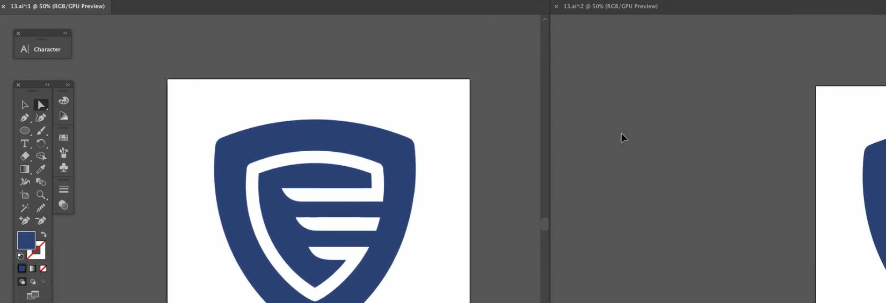
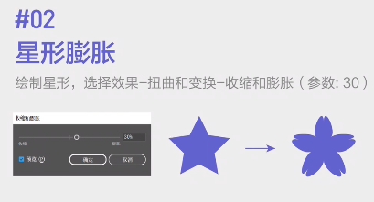
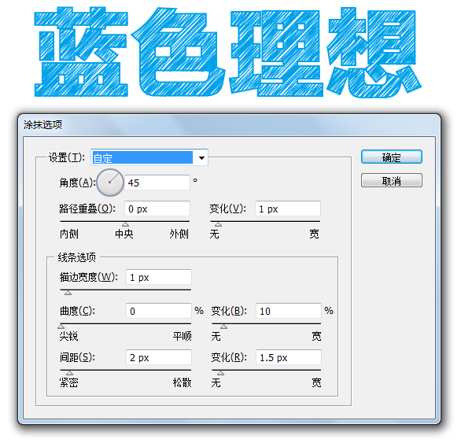
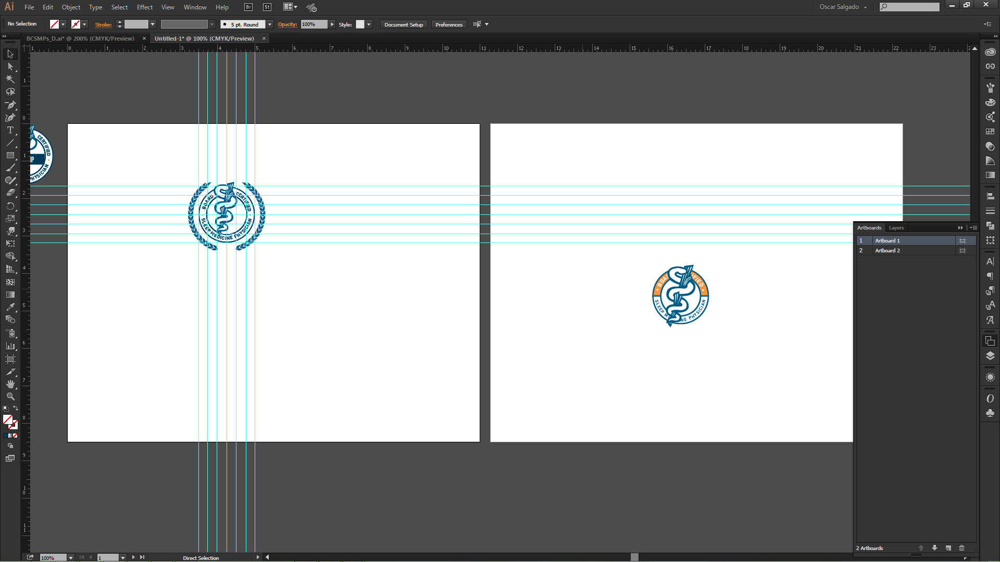
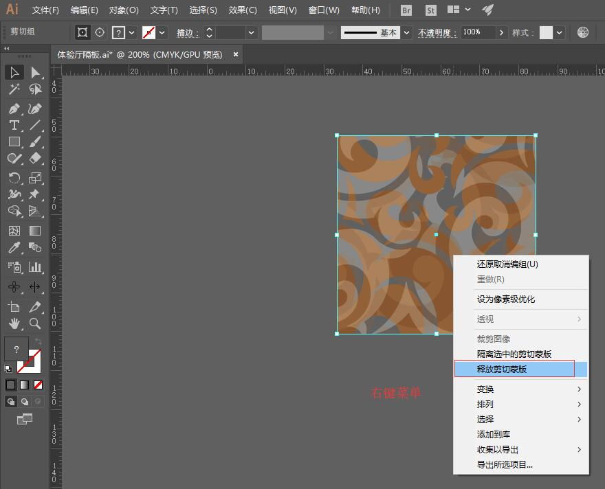

# adobe-illustrator 小技巧

## 回形纹的画法

## 折角

## 中国风图案制作

## 绳子制作

## 标题文本快速转段落文本

段落文本和标题文本是文字排版中经常用到的 2 种形式，那你知道快速切换 2 种文本形式的方法吗？其实非常简单：直接选中原来的文本框，将鼠标悬浮到在文本框右侧中间凸出的小端点上，出现带 **「T」** 的小标记时快速双击鼠标左键，就可以直接将标题文本变成段落文本了，使用相同的方法也能将段落文本快速切换为标题文本。

## 西文的正确竖排方式

对西文进行垂直方向排版的时候，发现文字组变成竖排了，但是字母本身的方向却没有发生改变。这个时候只要点开字符面板右上角隐藏选项，取消勾选排 **「标准垂直罗马对齐方式」** 就可以啦~

刚刚接触文字排版的小伙伴还是要注意，西文竖排最好使用上述的方式。将文字组之间进行旋转的操作并不规范，虽然最终结果一样但是会给后期调整带来不必要的麻烦。

## 字符缩放选项的妙用

一般来说不建议大家使用字符缩放选项对文字进行处理，因为会破坏文字原有的结构美感，但是这不意味着我们字符缩放工具就没有用处了。

大家在处理文字排版中的破折号的时候，有时会发现有时候破折号的长度不够。改用直线工具代替破折号虽然解决了长度问题，但文字组一旦发生位置、字重等变动就需要对直线进行重新调整，非常麻烦。这时候缩放选项就能帮我们解决这个问题。

「具体操作」选中破折号，用水平缩放选项将其调整至合适的长度。这样破折号的样式就能自动与文字保持一直，还可以直接用基线偏移选项对破折号的位置进行微调。

## 比例间距选项

比例间距简单的说就是文字本身的边框（字面框）与文本定界框（字身框）之间的距离。对字符应用比例间距，会使字符周围的原有空间按比例压缩。

我们进行文字排版时，会出现的一种情况是以引号、括号、书名号等符号开头的文字组无法直接与其余的行文字达到边缘对齐，这时候就可以用使用比例缩放工具，选中符号后调节比例至合适位置，就能轻松解决这个问题了。

## 文本快速拆分为可编辑单字

上一期有小伙伴在评论区问有没有将文本快速拆分为单个文字的方法，我查了一下还真有，具体的操作方法如下：

选中文字后，在字符面板的「 字符旋转 」一栏将数值设置为 0.01°，然后选择「对象-拼合透明度」，在弹出的窗口中将「 栅格/矢量平衡 」调为 100，「 线稿图和文本分辨率 」以及「 渐变网格分辨率 」分别设置为 300 ppi 和 150 ppi，其余不变。确定后会看到文本中文字左下角出现一个小点，即表示拼合成功。单击右键取消编组，文字就是可编辑的单字状态了。

## 快速插入特殊符号

在 Ai 插入特殊的符号、单位或者字符，有 2 种方式可供选择。一种是 Ai 自带的特殊符号，在「 文字- 插入特殊字符」中可以找到，包含版权符号、注册商标、分节符等，但是内容很有限。

另一种方法就是用输入法自带的符号库，以搜狗输入法为例，其符号大全内包含各种符号标点、序号、单位、注音、英日韩俄语字符，非常方便，在输入法的状态栏显示在桌面的情况下，按快捷键 Ctrl+shift+Z（默认是这个设置）就能调出符号大全面板。

## 快速输入垂直方向文字

输入垂直方向的文字除了在文字工具里选择直排文字外，还有一种更简单的办法就是在输入前按住 shift 键，光标会由垂直变为水平状态，这时候填充的文字就会是垂直竖排的了。

## 引号出格悬挂

一段多行段落文本如果被引号括起来，会出现引号占位而文字不对齐的情况，不是很美观。这时候我们打开段落文本，选择隐藏选项里面的「 罗马式悬挂标点」，引号就会悬挂在文本外侧。需要注意这个功能只对段落文本起作用。

## OpenType 的分数字功能

OpenType 的分数字功能可以将水平排版的“月/日”排版变成斜角错位的形式，做日期排版非常方便，此外也可以用作分数形式的排版。需要注意的是此功能需要使用具有 OpenType 的字体。

## OpenType 的变高数字

很多小伙伴在做日期排版的时候都遇到过那种数字高低不对齐的特殊形式数字 ，使用具有 OpenType 特性的字体就能轻松实现这种效果。具体操作方法：选择一种 OpenType 字体（在字体列表后带有一个“O”标志的，带“TT”的不行），然后点击「窗口-文字-OpenType」调出 OpenType 窗口，点开「数字」一栏的下拉列表选择“变高，变宽”，数字的高度马上就变得高低不齐了。

## 路径翻转

按 `P`切换致钢笔工具，按住 `alt`点击段点即可转换

## 描边文字

## 设置默认字符样式

## 多窗口

一个窗口设计，另一个窗口看效果，`窗口-新建窗口`

## 一些小技巧画几何图形

## CPU预览与GPU预览

`ctrl+e`有可能开启了cpu预览，注意检查，建议使用GPU预览。

## 对齐两个顶点

选择上两个顶点后，按ctrl+alt+J,在对话框中选择“两者兼有”，就能对齐了。

## 文字有符号没法局中

## 色板颜色都不见了

## 锚点怎么都对不齐

## 图形不能旋转缩放

## 画笔工具使用不了

## 文字没法和图形对齐

## 图形只有线条没有颜色

## 莫名其妙的网格

## 预览边界

## 几何图形01

收缩与膨胀调整为负值

## 几何图形02

## 制作发散效果

## 显示定界框

`CTRL+SHIFT+B`视图>显示定界框

## 全局色

新建一个全局色，应用给画布中的对象，当色板中该全局色发生修改时，画布中所有应用了此全局色的对象的颜色都会发生修改，当画布中对象特别多时非常有用

## 轻松应用颜色

使用颜色的深浅是必不可少的，当我创建有光泽的按钮和图标。在的光泽按钮和Web 2.0的贴纸教程，我用青色，因为它很容易进入青色的百分比，给我快速深浅。如果你需要亮区和暗色调的混合色是什么？一个简单的方法是**按住 `Shift`键**，当你在颜色面板中拖动滑块！

## 清洁路径

最近，我一直在用我的素描风格的画笔插图和教程。在一些这些插图，笔触需要将扩大到可编辑的路径。扩大时，你也可以得到一堆填补路径。要清理，只需转到对象>路径>清理和检查未上色的对象“复选框。您也可以使用此功能，摆脱空文本框和杂散点！

## 制作网格

制作单页印刷品或小册子时，使用「分割为网格」工具，可以极快地给页面打上网格。

## 变换窗口中可以输入百分比

## 快速制作页脚

在做画册的时候，有时候会在画板里做页眉和页脚，要是每一页的去复制粘贴，再对位置（每一页的位置一样）是件小小的麻烦工作。把页眉和页脚成组，复制。在编辑菜单中选择“在所有画板上粘贴”或按快捷键 `alt+shift+ctrl+v`

## 用形状生成工具画爱心

## `~`键的重复效果

无限重复的效果就是 `~`键做出来的！选择矩形工具/直线段工具，然后按住 `~`键不放。

## 使用多边形工具

拉出图案按着方向键的 `↑`键，迅速增加描边，按住 `↓`键，迅速减少描边！

## 复合路径

1. 选中要使用的复杂路径的图形，然后对象—扩展。
2. 打开路径查找器，打开菜单选择建立复合形状。
3. 选择材质贴图置于图形下层，选中两者建立剪切蒙版即可。

## 快速切割图形

使用橡皮擦工具时，按住 `ALT`键拖动,能以矩形的形式切割图形，该操作适用于单个或多个对象。我们可以利用此操作快速进行减去矩形形状的布尔运算。

## 快速绘制图形内部

在AI做镶嵌内容时，总是需要布尔运算或者剪切蒙版来制作。但是其实我们只需要使用【绘图模式】就能快速的解决该问题。按 `shift+D`可以切换绘图模式

## 快速调整星形形状

在绘制星形形状时，总以为角大小在创建时是固定的，所以绘制星形形状经常绘制完再去调整那些星星的角。但是我们只需要在绘制的时候，按住 `Ctrl`键(win)或 `command`(mac)即可拖动鼠标来调整星星的角的大小。

## AI由于许可限制，无法将字体FZHTJW--GB1-0嵌入到 PDF文档。描边的文本将不可见

是字体有版权，你保存时把兼容PDF勾去掉就好。

## 制作副本

“效果”>"扭曲和变换">"变换",**可以快速制作副本**。

## 自定义动作对齐

| 1              | 2                     | 3                  |
| -------------- | --------------------- | ------------------ |
| `f2`居中对齐 | `shift+f2` 左对齐   | `ctrl+f2` 右对齐 |
| `f3`水平对齐 | `shift+f3`顶对齐    | `crtl+f3`底对齐  |
| `f4`水平分布 | `shift+f4` 垂直分布 | `f5`扩展         |

## 粉笔字效果

## 在AI里未转曲线时文字做渐变的方法

- 方法A：在AI中未转成曲线的文字是无法使用渐变填充的,使用以下方法就可以了,还有其它的方法大家可以告诉我.
  1、首先打上你要的字
  2、把字应用一下图形样式里中的默认样式,要记得是图形样式里的第一个样式默认,而不是其它样式
  3、然后把字体里的描边再变成无,在这个基础上就可以应用渐变了,还能编辑字体.
  选择要填充成渐变的文字，然后应用刚才定义的图形样式。
- 方法B：还有一个方法,就是用字符的外观也可以填充渐变,方法是:打上字,然后在字的外观面板上点上面的三角下拉菜单,选择添加新填充,然后在面板上双击新填充,就会出来填充面板,就可以应用渐变了,这种方法比较可靠。

## 快速切割对象

橡皮擦工具，鼠标拖拽时按住 `Alt`键即可拉出一个虚线框，松开鼠标后，对象就直接被虚线框切割了，是不是很快很方便？

切割效果如下：

## 利用拼合透明度裁剪位图

第一步，在需要切出的地方画一个矩形，并填充除了黑、白、灰以外的任意颜色；
第二步，将该对象的透明度设置为0，并去掉描边。
第三步，执行菜单的"对象">"拼合透明度"命令，无需任何设置，点击"确定"。
第四步，取消群组，你会发现想要的区域已经完好无损地切出来啦~简单吧

## 查找最接近的专色

对于平面及印刷的童鞋，你可曾翻遍Pantone色卡本（当然不止潘通一种啦）却依然找不到与目标接近的专色？ 现在，你只需在AI里操作几下，然后直接去色卡本找那个编号，省下的时间去喝杯咖啡吧~
**第一步** 选中对象，点击"颜色"面板右上角，出现下拉菜单，然后点击"创建新色板"

**第二步** 建立色板后，切换到"颜色参考"面板，点击面板下方图标，出现下拉菜单，然后点击"色标簿"\PANTONE+ Solid Coated（这里可选择自己需要查找的色卡类型）

**第三步** 色卡类型选好后，单击"颜色参考"面板推荐的颜色，然后切换到"颜色"面板，最接近目标的专色号就呈现在你的面前。

## 精确分布对象

AI更偏于创作，而不像Autodesk的软件那样有极高的精确度，但AI也可以通过具体数值来控制对象属性，其中最实用也常被忽略的莫过于"分布间距"这个功能了。

上面两行分别是"对齐对象"和"分布对象"，大家肯定不陌生，而下面的"分布间距"是根据具体参数来分布多个对象的，例子在下面。

## 使用吸管工具复制样式

关于吸管工具的用法，这里只介绍它与快捷键组合后的功能。 与 `Shift`键组合：仅提取目标颜色并应用到当前属性，以下图为例，红色矩形提取黑色来填充而不影响描边。

与 `Alt`键组合：提取并应用当前软件设置的属性（很重要，提高效率的必备良药）

按住 `Alt键`后，吸管图标会变成这样

与 `Alt`键组合可以提取并应用的对象属性很多，比如填充/描边的颜色，文字的字体字号等

快捷键 `”i”`，吸管工具除了取色，还可以填色，选择吸管工具后，`Alt+鼠标左键`点由即可给其他形状填色。

## 画板的模版功能

此功能比较简单，仅以下几点稍加留意即可：
画板的堆叠顺序 先命名画板再导出文件更易管理 多画板文件的模版应用 多画板另存时单独选择，如下图

## 制表符很有用，用于对齐

你先将光标插入到某文字前，按下 `tab`键，比如

| 姓名 | 年纪 | 收入 |
| ---- | ---: | ---: |
| 小二 |   19 |  200 |

在这些单词前插入 `tab`键
然后再将他们都选中，再打开制表符 ，在标尺上添加制表符，就看出效果来了
补答：四个制表符分别叫：左对齐 右对齐 居中对齐和小数点对齐。

## 多重填充与多重描边

首先新建一个文档，文档的大小自定单位是像素，颜色模式选为 RGB，并确认「使新建对象与像素网格对齐」没有被勾选上。如图：

AI 在 CS5 开始，支持将对象对齐到像素网格，这一点在 UI 设计中非常重要。但是一开始新建项目，不建议大家勾选上，开始就勾选带来的麻烦远远多于方便然后，开始画按钮了。所以，新建一个图层，命名为”Button”。再新建一个矩形。

再给按钮换一个底色，颜色色值自定义哈。接下来，要进入重头戏了。点击「外观」面板下的「添加新填色」按钮（即 “fx” 按钮左边的那个），再新建一个填色层，颜色为纯白到纯黑的渐变，方向是从上到下，透明度为 20%?30%?看实际效果吧，混合模式为「明度」。完成后画板和外观面板看起来应该类似这样：

可以看到，通过一个底色填色层，和一个明暗渐变填色层，我们成功地做出了色彩明暗渐变效果。这，就是多重填充的应用之一。另外再解释一下，混合模式选择「明度」的意思是，取下层对象的色相和饱和度，取上层对象的明度（亮度）作为最终颜色输出。因此，这样可以做出一个颜色只在明度上的渐变，而不会影响色相和饱和度。（又一个知识点哈）给矩形的描边设置为一个像素，颜色为 `#7F7F7F` 描边。这样，按钮的基本描边就做出来了。描边选择“内侧对齐”

接下来，在AI中你还可以再新建一个描边，颜色设置为纯白，依然是内侧对齐，透明度为 50%。并在外观面板里，把这个描边置于灰色描边的下方，如图：

按钮看上去没有什么变化。不过接下来，就是见证奇迹的时刻了。给半透明白色描边加上一个「变换」效果，「移动」参数设置为 1 像素：

最后用多重填充多描边做的按钮

然后你可以给按钮改变颜色，只需要对第一次填充的颜色进行修改就可以啦

## 导出选中的对象

如何导出选定对象？选中对象，"对象">"画板">"适合选中的图稿"，导出时勾选“使用画板”。

## 不同颜色模式切换

`Shift+单击颜色条`，可在几种颜色模式依次切换。

## 选中重叠的对象

选择工具，按住 `ctrl`鼠标左键连续点击，即可上下对象切换选择（ps：其它工具也可以）

## 移动设置面板

1. 工具箱中双击移动工具图标，调出移动设置面板；
2. "对象">"变换">"移动"；
3. 按下快捷键：`ctrl+shift+M`以上三个方法都可以调出下面的“移动”对话框;
4. 选中对像后，按 `Enter`。

## 半色调

打开"色板"面板，选择汉宝图标（三横），选取打开色板库＞图案＞基本图形＞基本图形_点。

## 对齐方式

文字对齐方式：如果你正在弄给户型图标尺类的工作，客户肯定会让你经常改标尺的字号和字体，你事先点一下居中对齐，对于后期客户怎么更改，你都可以一键更改了，如果不是居中对齐分布，后期你会欲哭无泪的。

## 圆角设置

Ai从CC版本加入实时圆角功能，还是很好用的。

- 直接选择工具，放在圆角控件上按住左键拖动，即可对整个对象作圆角；
- 按alt点击左键可切换圆角类型；
- 单击圆角控件控制单个圆角，按 `shift`加选角；
- 双击控件调出圆角选项菜单，可以准确控制圆角

## 快速切换竖排文字

将横排文字切换为竖排，常规做法是在菜单栏中找到"文字">"文字方向"，选择水平/垂直进行切换。在这里我们介绍一种快速切换竖排文字的方式：激活文字工具 `T`后，按着 `shift`键就可以了。

## 多段落文本拆分

当一个文本图层是多段落文字的时候，我们想要将它拆分开，变成每行都是独立的文本，可以通过拼合透明度来解决。
需要选中文本，打开菜单栏"对象">"拼合透明度"，再将整个文本解除编组（`ctrl+shift+G`）即可。

## 矢量形状转换为参考线

AI中的参考线不仅可以通过调出标尺（`ctrl+R`）后拖拽得到，还能够将矢量形状转换为参考线（不管什么样的矢量形状，很厉害吧～）。
我们选中一个矢量形状，按快捷键 `ctrl+5`，就将它变成了参考线。想要还原形状，释放参考线的快捷键为 `ctrl+atl+5`。

## 内部绘图模式

我们在绘制一个形状后，选中该对象，在工具栏底部选择"内部绘图"模式(或按 `shift+D`)，接下来，我们使用工具绘制图形时就会出现在对象的内部，实现类似于剪切蒙版的效果。

## AI简单制作放射光线效果

- A方法
  

- B方法
  

## 查找字体

1. 当使用文字段落较多的时候，想更换字体个个换很麻烦，这时候可以用查找字体一键解决，打开文字-查找字体。
2. 做过印刷的朋友应该都知道，提交给印刷厂商的时候，是一定要把所有文字转曲的，避免印刷厂商因缺失字体造成损失。利用查找字体可以查看是否有字体没转曲，文档中的字体没有字体显示，就是全部转曲啦。
3. 但是实际情况我们通常都是先全选(`ctrl+a`)然后进行转曲( `ctri+shift+o`),但是要注意的是锁定隐藏的对象全选是选不中的，先确保没有锁定隐藏。
4. 也可以“选择”>“对象”>“文本对象”，即可选择所有文字。再转曲

## 快捷键

## 快速编辑形状

**方向键箭头键**将增加星形工具和多边形工具上的点。这些键还将在“螺旋工具”上添加线段，并将列和行添加到“矩形网格工具”和“极坐标网格工具”中。

空格键拖动时按住空格键将重新定位形状。

`⌘`/ `Ctrl`拖动时按住 `⌘`/ `Ctrl`键将固定星形工具的内半径，并在螺旋工具中添加或减去衰减。

Tilde（`〜`）拖动时按住Tilde（`〜`）将根据拖动的长度和速度重复形状。

## 快速选择补色

## 隐藏图层

要隔离复杂文件中的图层，请按住 `Option`键并单击（按住 `Alt`键单击）某个图层上的“可见性”(眼睛)图标以隐藏所有其他图层。按住 `Option`键并单击（按住 `Alt`键单击）可见性图标以显示所有图层。您还可以按住 `Option`键单击（按住 `Alt`键单击）并拖动多个图层，一次隔离多个图层。

## 反向笔刷笔划

首先，选择路径，然后使用钢笔工具（`p`）单击端点，创建朝向该点的新方向。

## 设置对象的实际大小

如果您需要具有描边的对象具有精确尺寸，您可能会很快感到沮丧。默认情况下，Illustrator不会考虑描边的尺寸。您可以通过浏览首选项>常规>使用预览边界，把勾打上。

## 从网格形状中提取路径

我喜欢使用网格时可以获得的结果，但有时我不喜欢尝试编辑它们。当路径转换为Mesh对象时，它不再是Path。如果您希望将原始路径用于其他目的，这可能会令人沮丧。要提取原始路径，请选择“ 网格对象”，转到“ 对象”>“路径”>“偏移路径”，然后输入0。现在你有副本！

## 使用保存选择节省时间

在Illustrator中选择多个对象对提高工作效率至关重要。Illustrator有一些很棒的选择功能：`选择相同，选择对象，魔术棒`等。我一直使用的一个选择功能是保存选择。我通常会在插图中尽早保存选择，以便轻松返回到它们，即使笔画，填充和其他属性已被修改。
**保存选择**
首先，选择要保存的所有内容，然后选择"选择">"保存"。在"保存选择"对话框中，您可以根据需要为选择命名。现在，您可以在"选择"菜单的底部访问已保存的选项！您可以通过"选择">"编辑选择"来重命名和删除这些"已保存的选择"，以打开 `编辑选择`对话框。

## 将元数据添加到文件

可以轻松地将诸如作者，描述，关键字，版权信息等元数据添加到Illustrator文件中。要添加元数据，请转到"文件">"文件信息"，以打开文件信息对话框。您可以从对话框的右上箭头按钮将元数据另存为元数据模板。此外，每次保存时。Illustrator都会自动添加字体，样本和颜色组等特定信息。

## 创建复合形状时同时展开

这是一个快速提示，但任何有助于提高生产力的事情都值得一提。使用"路径查找器"面板，您可以通过按所需按钮创建不同的复合形状。您可以通过按面板中的 `展开`按钮来扩展形状。按下按钮组合这两个步骤，而不是按下展开按钮，按住 `Alt`、`Option`。

## 多个画板时参考线

在设置参考线之前，请切换到画板工具（`Shift+O`），然后拖出参考线。您会注意到，当您执行此操作时，参考线将在画板边缘完成，而不是在整个工作区域内跑掉。当您移动画板时，导板将随之移动。

## 快速选择当前画板中图稿

使用多个画板时的另一个快速提示。当您全选（`Command+A`）时，Illustrator将选择每个画板中的所有艺术作品。这在某些情况下很棒，但有时您想要选择活动画板中的所有艺术作品而不是其他作品。没问题！只需使用键盘快捷键 `Command+Option+A`（Mac）或 `Ctrl+Alt+A`（Win）！

## 快速重置3D选项

在“3D选项”对话框中重置3D选项的一种非常快速的方法是按 `Option`（`Alt`）键。按下后，“取消”按钮将变为“重置”按钮，按下该按钮将重置第一次打开对话框时的值。

## 在打开的选项卡文档之间快速切换

我相信你们中的一些人已经知道了这一点，但是如果你们不知道，那么在Illustrator CS4和CS5中处理选项卡式文档时可以节省一些时间。按 `Command（Windows上的控制）+〜（波浪号键）`在打开的选项卡式Illustrator文档之间切换。太漂亮了
！

## 快速预览图形样式

我相信现在你们都知道我喜欢在Illustrator中使用“外观”面板和“图形样式”。在一个文档中，我可以有许多相似和复杂的图形样式，并且“图形样式”面板中的缩略图图像并不总是代表我想要的样式。幸运的是，您可以快速预览所选对象的图形样式！
预览图形样式,要快速预览图形样式，请按住 `Control`并单击所需的图形样式。太酷了！在下面的示例中。在“图形样式”面板中查看缩略图时，我有三种非常相似的样式。我想要一个特定的云图标，所以我选择图标并按住 `Control`并单击每个样式，直到找到我想要的。

另一个选项是仅标记每个图形样式，并在“图形样式”面板的弹出菜单中选择“大列表视图”。

## 粘贴层

您是否知道，在启用了粘贴修复图层的情况下，Illustrator中的粘贴对象会保留其图层顺序，如果没有，则会为您创建图层！从“图层”面板(单击“图层”面板右上角的设置按钮。)的弹出菜单中启用“贴贴时记住图层位置”此功能。在文档之间粘贴时，此功能非常有用！

## 默认角半径

您是否知道可以更改“圆角矩形”工具的Illustrator默认角半径？只需转到“常规首选项”，然后在“角半径”字段中更改默认值。如果您正在处理需要多个具有相同圆角半径的圆角矩形的项目，这非常有用。不用担心，您可以在“圆角矩形”工具对话框中基于每个对象轻松覆盖此值。

## 一个文本块来自许多人

您是否知道可以使用“选择”工具选择所有区域文本框和点类型对象，复制它们，绘制新的“区域”文本框并粘贴？这似乎是显而易见的或基本的，但如果您不了解它，这是一个非常方便的提示。文本将以出现的堆叠顺序流入框中。您也不必担心选择其他非文本元素，因为它们不会被粘贴。

## 约束角度

您是否知道可以在Illustrator中调整X和Y轴？选择首选项>常规>约束角度。您输入的值将影响Illustrator中的所有工具和修改键。这对于创建等距对象或处理需要在特定角度对齐对象的项目非常有用。你更改了你的Constrain Angle吗？如果你这样做，你用它做什么？

## 快速导航画板

我一直在Illustrator文档上使用多个画板，并且不知道如果没有它们我将如何工作。我将它们用于版本控制，多个概念，徽标变体等。如果你像我一样，有时在文档上导航多个画板可能会很麻烦。幸运的是，有一个键盘快捷键！快速导航画板,在键盘上，按 `Shift-Page Up`和 `Shift-Page Down`可从一个画板导航到另一个画板。

## 宽度工具

按 `alt`键可以调一边的宽度，位置也可以移动。

## 路径查找器

选择路径选择器时，按住alt保留原有路径，方便以后修改。

## 清除最近打开文件列表

首选项>文件处理和剪切板>文件>要显示的最近使用的文件数>设置为0

## 拆分成网格

当我想到我在Illustrator中使用最多的功能时，我很惊讶其中一个顶级功能是Illustrator的Split Into Grid。我只把它用于几件特定的东西，但我一直在做这些事情。如果你没有使用Split Into Grid功能或者对它不了解，我想你会喜欢这些技巧。如果你将Split Into Grid用于其他任何事情，请告诉我。
拆分成网格
Split Into Grid函数的前提（我将从现在开始称之为SIG）非常简单。Illustrator将获取任何对象并将其拆分为指定数量的相等大小的矩形。要激活该功能，请选择对象，然后选择“对象”&gt;“路径”&gt;“拆分为网格”。打开SIG对话框，您可以更改行数，列数，装订线尺寸，Illustrator将自动计算矩形的高度和宽度。选中“添加指南”复选框，Illustrator将为您在行和列的边框处绘制指南。
用例
在阅读SIG功能的描述后，我确信您已经在考虑可以做什么了。以下是我最常见的一些用例。

**快速创建画板**
每当我创建一组图标，插图，徽标组合，ui设计等时，我通常会从一个画板开始创建初始主题和尺寸。初始概念完成后，我在同一文档中构建系列的其余部分，而不是使用指定数量的Artboards创建新文档。我首先绘制一个足够大的矩形，以包含该系列中所有必需的Artboards，然后使用SIG功能。创建新的矩形后，我选择Object&gt; Artboards&gt; Convert to Artboards。这是在文档中创建一致的画板的快速方法。

**网格布局**
Illustrator的SIG功能的另一个大用例是基于网格的布局。我使用SIG创建线框，网页设计，书籍封面，CD封面，图标集，标志等。SIG的“添加指南”功能很有用，但我喜欢通过选择矩形然后转到“视图”&gt;“指南”&gt;“制作指南”将新矩形转换为指南。轰隆隆......即时准确的网格设计！

**成分指南**
我使用SIG功能的另一种方法是用于组合指南。通过一些插图，我使用一个简单的组合网格。它通常是一个基本的3×3网格，没有像我用于布局的网格那样具体。只是一个网格，我可以编辑主要的组成元素。我通常将这些网格转换为与网格布局类似的指南。

你呢？我相信你们中的一些人对Split Into Grid功能有一些很好的用例。请分享！

## 叠印与套印和陷印区别

## 色彩原理

## 加法三颜色光的混合--RGB

**R**+**G**=**Y**

**G**+**B**=**C**

**B**+**R**=**M**

## 减法三原料的混合--CMYK

**C**+**M**=**B**

**M**+**Y**=**R**

**Y**+**C**=**G**

k

## 选择所选对象下一个对象

`option+command+]`上方的下一个对象

`option+command+[`下方的下一个对象

## 切换度量单位

win `Alt + Shift + Ctrl + U`

mac `Option + Shift + Command + U`

## 文本框

`CTRL+SHIFT+L`：文本左对齐

`CTRL+SHIFT+R`：文本右对齐

`CTRL+SHIFT+C`：文本居中对齐

## 实色填充、渐变填充、无填充之间快速切换

在用AI时选中一个物体后，按键盘上的逗号、句号、问号键可以分别填充AI工具箱下方的三种填充类型，即实色填充、渐变填充、无填充

## 对像对齐页面中间的方法

选择你想要对齐页面中间的对像，`CTRL+X`,`CTRL+0`,`CTRL+V`

## 无法粘贴对象，请求的变换将使一些对象完全脱离绘图区域

视图—>参考线—>清除参考线

## 选择工具不显示锚点

你按 `CTRL+H`就可以恢复了。

## A-Z快捷键

## 形状生成器工具

## 添加描点

## 刻刀

## 画笔工具选项

## 让AI实现文字打散（不转曲）

一直以来被AI不能打散文字所困扰，不如CD来的快捷有效，通常是转曲后再解组，
想再要编辑比较麻烦，现在有了这个方法，原来AI也有这样的功能。。。。

废话少说，看教程

１、原图

２、Ctrl+T，打开文字控制面板，将所想要打散的字旋转0.01度（此为关键）

３、打开“对象”——拼合透明度“，对话框，拼合

４、第一次解组，分成一行行了

５、再次解组，就变成一个个了

## 方头端点

## 直排内横排

## 画黄金分割线

## 怎么把一个图片转换成黑白矢量图

## 解决白色和黑色压印技巧

1.全选
2.在属性面板中叠印处点两下（取消所有叠印）
3.接着选 滤镜/颜色/黑色叠印成就了
4.这样就解决了白色叠印的头疼问题，也解决了黑色没有全部叠印的困难

## 页面切换技巧

在开多个AI文档的情况下。来回切换是有点麻烦的 ，点来点去有点慢(CTRL+F6，，可以来回切换)

## 巧用ALT键切换吸管和油漆筒工具

当选在吸管（或油漆筒工具）时按ALT可以切换成油漆筒工具（或吸管）
松开ALT便可还原。。当吸管吸过填充时不用切换工具就可完成操作了

## 调整圆角矩形的圆角大小

1.选择圆角矩形工具
2.按住上下方向键便可增大和缩小圆角
3.按左可以画矩形，换右可以画左右各是半圆的（像操场跑道）图形

## 文字工具的垂直方式

选中文字工具时，按SHIFT点一下便是垂直输入

## 正五角星

AI里的五角星大家都知道它是个胖的，按着ALT键画五角星就是正的了

## AI中使对象在页面中居中的小技巧

选择你想要对齐页面中间的对像，CTRL+X,CTRL+0,CTRL+V

## 如何快速出血,加角线

第一步 按CTRL+K 调出 常规——使用日式裁切标记
第二步 滤镜——创建——裁切标记

## AI中F2是剪切,F3是复制,F4是粘贴

## 按着shift＋单击色普会更改其模式

## esc工具可以快速在文字工具到移动工具的转换

## 锁定/隐藏没有选择的物体

锁定没有选择的物体 【Ctrl】+【Alt】+【Shift】+【2】

隐藏没有选择的物体 【Ctrl】+【Alt】+【Shift】+【3】

## 三秒搞定取消所有白色叠印

全选对像

选择滤镜－颜色－叠印黑色，如下设置：

下拉菜单选择移去黑色，百分比改为0

填充描边前打勾，包括黑色和CMY（B）和包括黑色专色前打勾确定OK！

## ai文件总是删不掉

删除或者重命名aiicon.dll文件。
aiicon.dll文件位于C:\Program Files\Common Files\Adobe\Shell.文件目录中，如果你希望使它重新活动的话，再次把它的名称改为aiicon.dll即可。

## 调整位置

AI画东西的时候,按住鼠标不放,再按住空格键,可以移动移动,调整位置;

## 其它技巧

1. 对齐设定参照物－－如果想对齐到A，那么将AB都选中之后，再单击一下A物件（不要按shift键单击，这样只会取消A的选择），再按对齐按钮的时候，B就会对齐到A，如果你在同时选中AB之后不单击一下A，A和B 的对齐就没有参照，这样A和B都会动；如果不是很复杂的图形,可以按Ctrl+U,打开智能参考线,手动对齐.
2. 段落文字拆分成行，行文字拆分成单字－－对象>拼合透明度，然后解群组再，对象>拼合透明度;
3. 吸管工具高级应用－－配合shift键可实现仅仅吸取当前色（不全部吸取物件属性），配合alt箭可实现反向吸取。
4. 边框随整体一起放大缩小－－双击 比例缩放工具，勾选 比例缩放描边和效果。
5. 园角矩形绘制和调整－－效果>转换为形状>园角矩形.
6. 加深或调亮颜色－－在 颜色 面板上用箭头调整颜色时，同时按住shift或者control
7. 改变色系(cmyk,rgb转换)－－在 颜色 面板上 用吸管吸取颜色时，同时按住shift.
8. ai可以实现同时选取多个节点，然后对齐节点，这是和cd不同之处
9. 改变直线为弧线的最快工具应该用－－改变形状工具（在比例缩放工具下）
10. 如何仅仅输出选取区域－－用裁剪区域工具
11. 自由变换工具运用－－鼠标点住图形一角(此时鼠标为双箭头)，然后（注意是然后），按ctrl键，此时，鼠标会变成单小三角形，ok可以随意拉动变形图形了
12. 放大缩小视图－－alt配合鼠标滚轮
13. 透明渐变的最快方法－－选取需要透明渐变的图形 > 复制 > 粘贴在其上（要重合） > 点色板面板中的渐变色(改变的仅仅是上层图形) > 选取上下两个图形 > 在透明度面板右上角的小三角形菜单中选 > 建立不透明蒙板，完成！如何调整－－ 不透明面板 > 点中右边的缩略图 > 图层面板 变成了 不透明蒙板 图层 > 点中 不透明蒙板图层面板 中的 图层 >再 点渐变工具（g)在视图中 （按住鼠标左箭 随意拉渐变） 调整 渐变效果！
14. 仅仅隐藏面板－－shift+tab
15. 制表符（数据对齐的利器）－－选中文字，然后，ctrl/苹果键＋shift＋T（结合Tab键，空格键用）
16. 为对齐设置快捷键（如果你认为有必要）———通过动作面板 实现，8过只能设置F1-9为快捷键

## AI合并图层

画布上右键“建立复合路径”或快捷键：Ctrl+8

## ai图形透视

按E，鼠标点住不放手，注意哦，是要先点住不放手。再按：CTRL+ALT+SHIFT

## ai反相圆角

## ai不透明度蒙版

## AI渐变调色，选择滑杆一端，再在左侧填色区直接粘贴即可

## ai批量修改颜色

编辑--编辑颜色--重置颜色图稿。全选需要一次更换颜色的对象，

## 渐变吸颜色

按I选吸管再按住Shift吸取颜色

## 更改文字大小

文字大2点像素 Ctrl+Shift+<

文字大10点像素 Ctrl+Shift+Alt+<

## AI快速合并图形方法

选中图层复制粘贴至PS中，图形全部合并（合并图形组件）。

## 精准对齐

视图  -  对齐网络，可使用精准对齐。对齐像素，可以去掉宽高度后面的小数点。

## 快速复制一张JPG图片

ctrl+a全选，ctrl+shift+c，快速复制一张JPG图片。

## ai 链接图片全部嵌入

快速嵌入方法1
在AI工具栏——窗口——链接，打开链接面板，看图片后面是否有小图标，有表示已经嵌入，没有表示还没嵌入。

快速嵌入方法2
文件另存为——在选项面板中打钩“包含链接文件”和“嵌入ICC配置文件”这样保存处理的文件也会嵌入文件。

## ai 批量释放剪辑蒙版

Ctrl+AIt+7

## 转曲文字

Illustrator 一键文字转曲，首先选择所有图片（组合或不组合，可全部选），再按 shift+ctrl+O

## 分布对象

AI更偏于创作，而不像Autodesk的软件那样有极高的精确度，但AI也可以通过具体数值来控制对象属性，其中最实用也常被忽略的莫过于"分布间距"这个功能了。

上面两行分别是"对齐对象"和"分布对象"，大家肯定不陌生，而下面的"分布间距"是根据具体参数来分布多个对象的，例子在下面。

## 建立图案

1. AI图案 - 对象 - 图案 - 建立
   
2. 打开色板面板，直接将图案拖入也可。
   
   

## 缩放描边和效果

ctrl+k调出首选项——常规——勾选——缩放描边和效果

## ai 物体紧挨着物体

AI中选中智能参考线，然后也同样是用选择工具点中一边拖到另外一条线上去，就可以对齐了。

左边是上下零间距，右边是左右零间距

## 快速替换ai中缺失文本字体

## ai剪切组转换成路径图形方法

[对图形进行多种变色](http://www.xueui.cn/tutorials/other-tutorials/how-to-use-ai.html)

## 重复复制

按下R键，切换到旋转工具，按住ALT键的同时，单击椭圆最下面的锚点，将中心点从中间移动到椭圆下面中间位置。按下ai再制快捷键CTRL+D。

## Ctrl+Shift 双击参考线可将参考线变成对象

在选择直接选择工具时，按alt可以切换到组选择工具

AI中F2是剪切，F3是复制，F4是粘贴。

## 段落文字拆分成行

段落文字拆分成行，行文字拆分成单字－－对象>拼合透明度，然后解群组再，对象>拼合透明度;

## 吸管工具高级应用

吸管工具高级应用－－配合shift键可实现仅仅吸取当前色（不全部吸取物件属性），配合alt箭可实现反向吸取。

ai可以实现同时选取多个节点，然后对齐节点，这是和cd不同之处

放大缩小视图－－alt配合鼠标滚轮

## 锁定

ctrl+2 锁定图层

ctrl+alt+2 全部解锁图层

shift+ctrl+alt+2  选中某图层，除此之外被锁定

## 隐藏

ctrl+3 隐藏图层

ctrl+alt+3 显示被隐藏图层

shift+ctrl+alt+3  选中某图层，除此之外被隐藏

ctrl+0 画布满屏显示

ctrl+1 画布100%显示

## ai 关闭与像素对齐

关闭与像素对齐:打开变换面板---去掉勾选，对齐像素网络。

## 位图图片

选择文件---置入，方便修改，点击“编辑原稿”。如果己经嵌入，点击“取消嵌入”，然后将保存的图片打开ps进行处理保存，这时侯进入ai更新链接即可。【最好的方法】

## AI不能删除网格渐变的解决方法？

直接复制新的路径。对象----路径----偏移路径，偏移数值设置为：0

## AI路径不能合并的解决方法？ai复合形状不能使用“创建渐变网格”

在图形等比分上，画一条直线，然后使用“形状生成器工具”，这时生成的图形是可以使用大部份操作的。

## 蒙板

a 剪切蒙板【例：将图片置下一层，对象置上一怪，两对象全选，再设置蒙板。

b不透明蒙板【窗口----透明度----小三角选择，建立不透明蒙板，选中小白色框，描绘渐变、径向渐变等对象，即可出效果。

c 图层蒙板【将需要的图形置于最上层，点击图层面板中“建立/释放图层蒙板”

## ai位图生成矢量图高级研究

a 新建文件----置入一张位图，选择“窗口”----“图像描摹”。在“描摹选项”调整“预设”为黑白微标，“模式”为黑白，“阈值”根据预览而定。

点击“扩展”生展分层路径。

## 怎么样图片渐变色应用于矢量对象上？

## 吸取图片色，新建色板，单击确定

将保存的色块拖动至渐变的色块上。

## 文字

文字---输入文字----拼合适明度，这时字体就可以单独操作了。

## 路径边框填渐变色方法

路径边框填渐变色方法：对象----路径---轮廓化描边

## 对齐参照?

你要将A和B对齐，按shift键将AB都选中之后再单击一下你要对齐到物件，按对齐按钮即可。

想对齐到A，那么将AB都选中之后，再单击一下A物件（不要按shift键单击，这样只会取消A的选择），再按对齐按钮的时候，B就会对齐到A，如果你在同时选中AB之后不单击一下A，A和B的对齐就没有参照，这样A和B都会动的。

## illustrator 与 photoshop 互通处理图片？

做图片时先将图片存储在与ai一个文件夹，不要嵌入，直接打开图片进行处理，打开ai时，会提示更新。

## 创建多个对象剪贴蒙板?

蒙板图形要放在被剪切图形之上，被剪切图形要是多个还要群组，然后框选所有图形，CTRL+7
illustrator创建蒙板后，要删除被蒙板的物体，直接删除后进行填色

Illustrator 做网页要选择“模拟Illustrator 6.0 “模式，才可以。因为默认是打印模式。快捷键Shift+Ctrl+k

## 里如何裁剪图片？

在图片的上方，画一个你想要的形状（如正方形）然后形状和图片同时选取快捷键ctrl+7即可。

## 如果在中新建多个画板？

shift+o即可，在上栏可输入名称，导出时选择画板全部，即可导出所有的单独文件。

Illustrator用于网页中的图片需要全部删格化，不删格化会出现锯齿。Illustrator删格化快捷键？
ctrl+shift+o

## 关闭或退出透视网格

1. 点取透视工具的时候，画板上会形成透视网，还有一个左上角浮动的圆形小面板，你在小面板上点击那个小X就关闭。
2. 也可以直接按快捷键Ctrl+Shift+I；
3. 或者再“视图”菜单下的“透视网格”中选择“隐藏网格”。

## 路径查找器实例讲解

## 用AI辅助配色

色彩搭配一直是设计中非常重要但又很难掌握的一门学问。关于颜色的选择与搭配，其实AI有提供一款参考工具，该工具可以在窗口菜单栏中的下方找到，快捷键为Shift+F3。

打开颜色参考面板后，只要你点选某一个颜色，该面板顶部就会出现系统自动生成另外4个颜色，点击面板中的编辑图标就可以进入编辑面板，这里面有很多参数可以调节，我这里就不详细说了，大家可以自己去试试。这些颜色与搭配关系都是系统根据色彩的不同属性与色值生成的，效果一般都不会太差。

当然，这只不过是配色的一种方法而已，设计主题、品牌调性才是配色最需要考虑的因素，所以不要照搬配色工具。

## 巧用橡皮擦工具

## 利用拼合透明度裁切位图

## 互补色、对比色、邻近色、同类色

## 超椭圆画法

先绘制一个圆型，再圆型上再绘制一个方型，把圆型的四个描点拖动贴合到方型上就画好了。

## 3D 文字

## 重新着色稿

## 复合路径与外观窗口

## 镜面绘图

## 噪点效果

AI里绘制矢量插画时，实现沙沙的噪点效果

## 复古印章

AI也能做印章效果，教你做出矢量的复古拓印风

## 螺旋旋涡效果

## 欧普风3D字效

快速掌握AI中创建符号和3D功能的简单运用

## 超酷炫的粒子曲面

超酷炫的粒子曲面

## 3D渐变球体

## 3D大花球

## 变量宽度配置

## 羽毛

## 绘图模式

## 形状生成工具和实时上色工具

## 放射式光效

## 螺旋线条图案

## 小技巧

## 一些小技巧

甜甜圈立体字

字层次感

科技背景

文字凹陷

平滑渐变

立体圆管字

发光字

文字炸毛

向量效果人像画

## Ai设计制作出打凹/雪烙效果

## 怎么把一个用图案填充的形状，转化成矢量图

*1.* 选中你要编辑的图片，然后点对象-扩展

*2*. 然后在图形上点右键 取消编组

*3*. 再次在图形上点击右键-释放剪切蒙版

*4*. 再次选择释放后的图形，右键 取消编组，即可编辑了。

## 拉圆角小技巧

## 自带线框文字

效果转化为形状->圆角

## 制作粉末文字

## 版画风

## 鼠标滚轮即可控制虚线间距

## 环形文字

## AI 拉圆角

## 颜色反差效果

1.选择图案与文字进行编组；2.效果->路径查找器-差集

## 鱼纹

