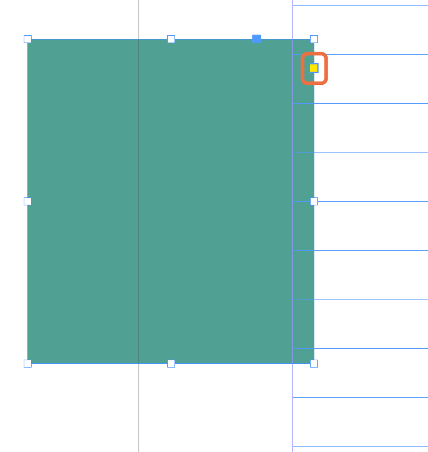
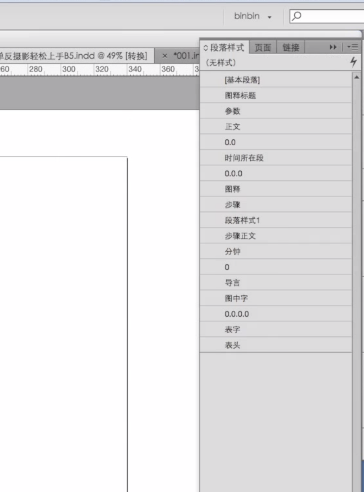

# adobe indesign

## 快捷键

`CTRL+SHIFT+单击`可激活主页单独进行修改。
`ctrl-shift-+` 上标

## 基线网格

在“首选项”-“网格”里面设置“基线网格”。在“段落样式”-“网格设置”-“网格对齐方式”选择“基线”

## 文字置入

文字置入时，弹出的对话框中勾选“显示导入选项”。把所有样式去掉。按Shift可以把所有文字置入。

## 设计书籍时先设计样章

设计3〜5页。设计2〜3个方案。

## 设计一个版面包括页眉页脚后

可以把样式复制为主页。单击汉宝图标，选择“主页”，“存储为主页”即可复制为主页。

## 改变形状样式

单击红框，接着按`shift`可以修改右上角为圆角

## 选中矩形框工具后

按住向上或向右键头可以画好多的矩形。

## 主页可以嵌使用

书籍很多章节时可以使用。

## 复合字体

已打一个文档后，再打开另一个文档，会有可能弹出己存在或多个复合字体时，先把原先的复合字体删除掉，再新载入新的复合字体即可。

## 查找空段

删除所有空段，在查找更改对话框中，选中GREP选项卡。在查找内容中输入“^\r”；更改内容里不填东西。即可把所有的空段找到并删除。

## 查找空格

删除所有空格，在查找更改对话框中，选中GREP选项卡。在查找内容中输入“ +”；“重复”->"一次或多次"。更改内容里不填东西。即可把所有的空格找到并删除。

## 排文字时注意事项

1. 段落文字不要孤行。
2. 标题不能在最后

## 排图片时注意事项

1. 图片一定要排齐

## 书籍的主要构成

1. 书籍封面有折回来的一些页面那个叫做“书籍勒口”，保护书籍封面。
2. 书籍封面与书籍封底有中间那部份叫书脊。
3. 腰封（1/3）
4. 打开书籍后，有一个空白的页面。那个叫环衬。有的有，有的没有
5. 彩插
6. 扉页
7. 序言
8. 版权
9. 前言
10. 目录
11. 正文

## 书籍经过的几个步骤

* 作者写作
* 编辑检查
* 美编设计
* 返还修改

## 让InDesign帮你做数学题`+-*/`

选中物件后，在左上角的XYWH后的输入栏中，直接输入加减乘除的算式后，InDesign会自动帮你计算，并且输入单位是有效的。在宽度与高度框中可以运算。

## 快速变换文字外观

吸管工具可以吸取文字的字体、颜色和大小，灵活使用可以快速改变其它文本的样貌。

## 图层

如何在层叠的图层中进行选择：Ctrl+左击

虚线框=这是一个组

编组：Ctrl+g

取消编组：Ctrl+Shift+g

如何在层层编组中进行选择：双击/ESC

图层面板功能介绍关键词：图层；图层组；小正方形发亮=图层被选中；新建图层；拖动发亮的正方形=移动内容位置；点击正方形=选中内容

锁定：Ctrl+L

解锁：Ctrl+Alt+L

分层,在图层上面，新建两个图层，文字、图片分开两个图层

## 换内容改字体

快速替换文本内容、修改文本样貌。

【文字】-【查找字体】

【编辑】-【查找/更改】，左击【更改格式】的内容框会弹出设定框，按右下方的垃圾桶图标删除修改信息。

快捷修改ps文档的方式：Alt+双击

保存：Ctrl+s

## 段落样式

批量修改文本样貌

【窗口】-【样式】-【段落样式】

创建：以一个修改好的文本样本为基础，点击【段落样式】面板的右上角，选择【新建段落样式】，取名字，注意将“样式应用于选区”勾上。

使用：选中文本内容/置入光标，点击一下创建好的样式。

再编辑：在创建好的样式上右击，选择“编辑XXX”，修改的信息会覆盖在所有应用过这个样式的内容上

在文本上直接修改会产生【+】号，可以选择 1.不管 2.清除 3.右击选择“重新定义样式”。

想要修改大批量的内容时，可以修改一个单词，然后选择“重新定义样式”来覆盖全部。

可以建一个段落

样式。用于内页。更方便。比如内页、标题、副标题等样式。

## 字符样式

批量修改字符样貌
【窗口】-【样式】-【字符样式】
创建：以一个修改好的字符样本为基础，点击【字符样式】面板的右上角，选择【新建字符样式】，取名字，注意将“样式应用于选区”勾上。
使用：选中字符，点击一下创建好的样式。
再编辑：在创建好的样式上右击，选择“编辑XXX”，修改的信息会覆盖在所有应用过这个样式的内容上

## 特殊颜色

【色板】-【右上角杠杠杠杠】-【新建颜色色板】

颜色类型：专色-使用特殊Pantone墨水；印刷色-普通墨水

颜色模式：CMYK-打印用；RGB-屏幕上看

选颜色时最好根据已经打印出来的色卡来选，以减少色差可能。

常用配色网站：Adobe Color CC，可查看各种颜色数值，到【探索】中可查看别人的色板，选择【编辑副本】查看颜色数值。

色板面板上方的【正方形】代表框架，【T】代表文字，点击它们可以给相应的部分上色。

## 其它

* 段前距大于段后距，书籍，外边距小，内边距大。
* 1.图层2.主页3.段落样式。
* 可以设置对像样式，可以批量使用。
* 提取word中的图像。
* 按Option键双击可以快速打开
* 教程**推荐Lynda的视频，英文有字幕。质量非常高。**
* 有一个页面应用主页页面的样式，想单独这一页的效果。按住shift+command+双击；
