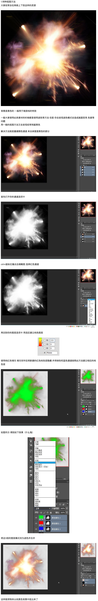
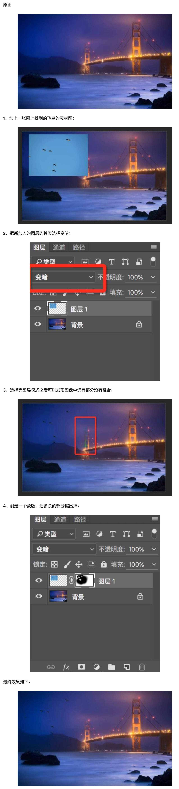
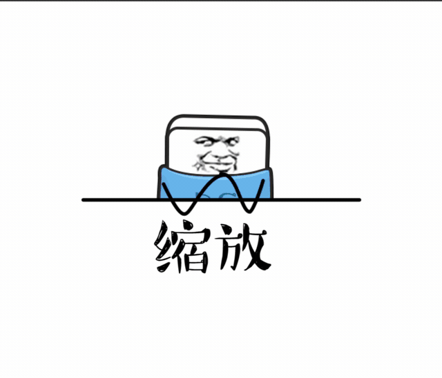

# Adobe photoshop 小技巧

## 导出切片

优化文件大小

发现，联系、重组

## 去除黑背景

## 铅笔线稿制作

## 内容识别缩放

打开 PS，导入要修改的图片。首先，先点击图层后面的这个锁，把背景图层变成普通图层，才能进行后面的步骤。

再选择左边【工具栏】的【裁剪工具】，在左上角，选择想改成的比例，这里我们选择 4：3 ，把图片拉大，直到整张图片都在框里。因为这张图片的背景比较简单，所以可以直接点击这里的【内容识别】，然后点击这个对勾，这时，图片已经被补全了，主体的比例也没有发生改变。

我们换一张背景比较复杂的图，按照刚才的方法来改变一下它的大小。可以看到，这里处理的就很不自然了。退回到选比例的那一步，在左边工具栏找到【套索工具】，给主体建立一个选区，然后右键选区，选择【存储选区】。给选区起个名字，保存。

Ctrl+D 取消选区。左上角选择【编辑】-【内容识别缩放】，找到【保护】，点开，选择刚刚存储的选区。现在可以改变图的大小了。我们发现在拉到这个位置的时候，主体又发生了一点变形，可以用套索工具再一次把主体圈出来，重复上面的步骤。就完成了。

## 替换颜色

色彩较纯时渐变映射替换效果更强，杂色的情况，适合使用替换颜色功能;

图像->调整->渐变映射

## 渐变映射

图像->调整->渐变映射

左侧滑块设置颜色替代的是图像深色（暗部），右侧替代的是亮色颜色设置（这部）。

用魔棒抠图填充精细度难以保障，还是用渐变映射，一步到位。

## 变暗

## 叠加

## 变亮

## 移花接木

我们有时候需要把一个人或者物体从A点移动到B点，这仿佛需要移花接木的本领，但是实际上也是很简单的事情。

直接使用PS的内容感知移动工具，把你要移动的物体做一个选区，然后拉到想要放置的新位置即可。

## 焦点区域抠图

执行 `选择`—>`焦点区域`

## 改变身材

复制一个图层，然后选择`编辑`—>`内容识别缩放`（快捷键`ALT+SHIFT+CTRL+C`）。

这时候你再拉动身体试一下，可以发现腿变长了，但是上半身和面部没有改变！是不是很厉害！

## 让图片清晰的方法

## 烫金效果

## photoshop 批处理

## photoshop 图层混合模式

## 图层对齐

## 对齐像素

## 修复边缘

## 智能参考线

## 蒙板

## 字间距

## 凸版印刷

## PS 技巧

## 故障风

## 快速调整画笔

## 制作印章

## PS动效

