# Blender 学习笔记

## 视图

### 1、基本操作

放大缩小视图————鼠标中键滚动▼

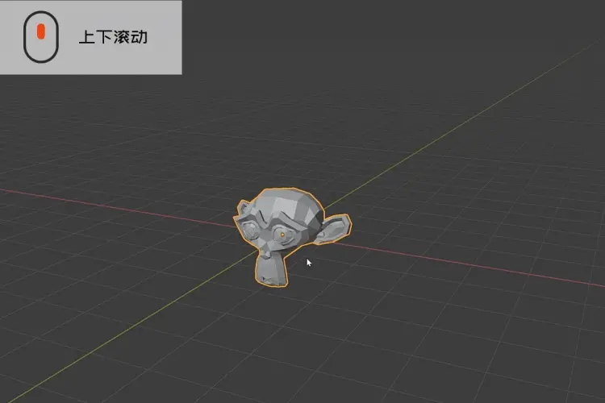

旋转视图————鼠标中键按住旋转▼

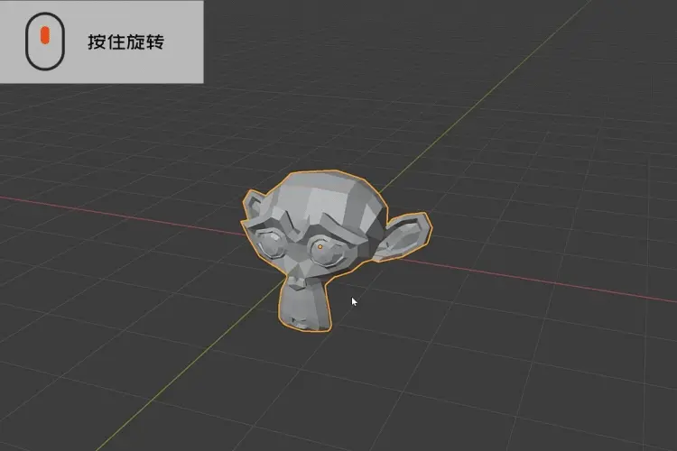

平移视图————Shift+鼠标中键按住滑动▼

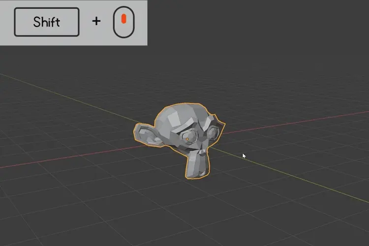

### 2、视图菜单【~】

Esc下面那个按键，雷达圆盘模式，我更喜欢这种切换模式，因为苹果电脑没有小键盘，另外就是还是可以单手操作的原因；视图菜单里不仅包含三视图，同时还有摄像机视图和最大化显示当前物体。

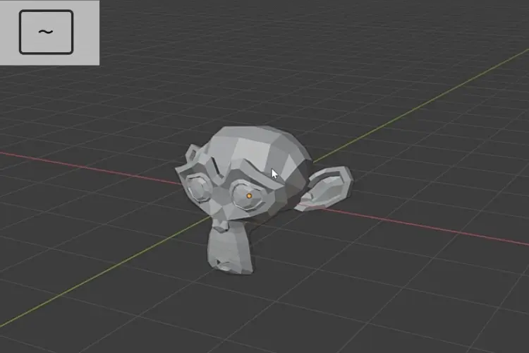

### 3、6视图快速切换

【Alt+鼠标中键按住拖动】可以在6个视图中来回快速切换，这个方式我经常使用，因为通过视图菜单进入的视图可能不是自己想要的，亦或是想查看模型在各个视图下的效果，很多人都不知道这个哦

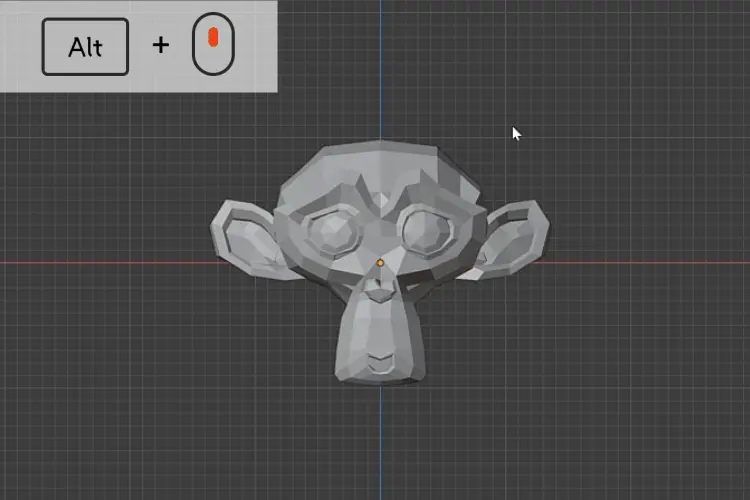

### 4、隔离模式

视口内模型太多难免会产生遮挡，此时按快捷键【/】进入隔离模式，会让视口瞬间清爽~

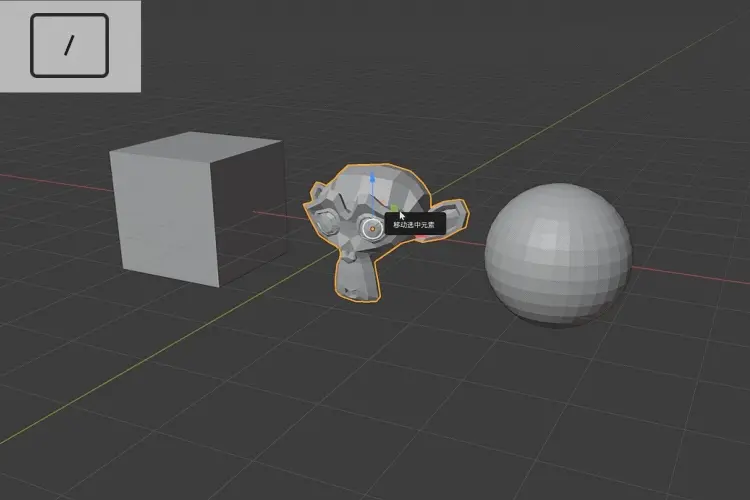

### 5、视图着色方式菜单

视图着色方式分为线框预览、实体预览、材质预览、渲染预览，在做三维的过程中间我们会不停的在各个着色方式之间切换，按快捷键【z】就可以快速调出着色方式菜单进行切换。

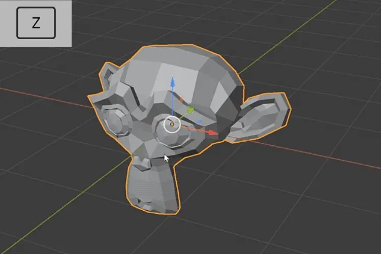

### 6、视图着色方式快速切换

快速进入到透显模式（超超超级常用）

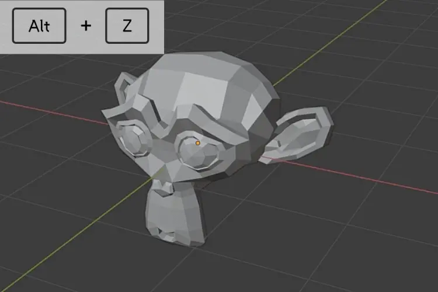

快速进入到线框模式▼

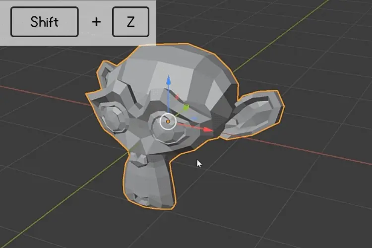

### 7、轴心点菜单

切换到不同轴心点状态下对模型进行操作是经常发生的，按快捷键【>】可以快速打开轴心点菜单选择相应轴心点。

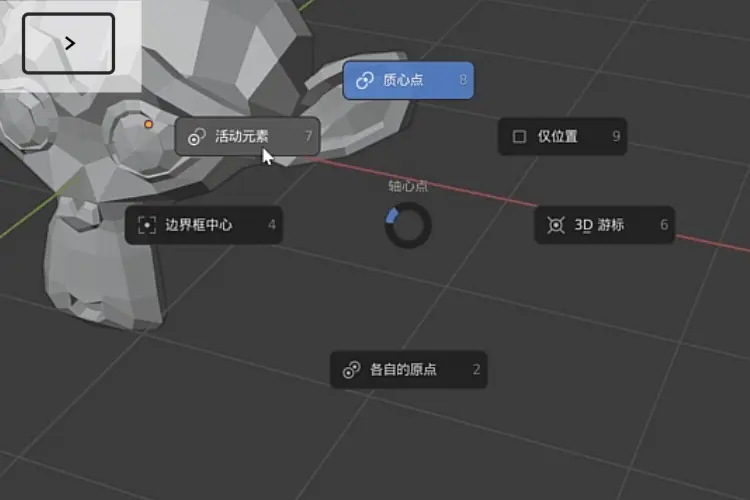

### 8、坐标系菜单

建模过程中因为模型角度改变，时常要在不同坐标系下进行操作，按【<】进入变换坐标系菜单，可以快速选择相应的坐标系。

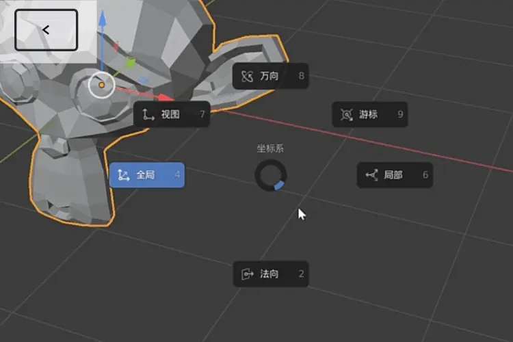

### 9、最大化当前视图

尤其在做动画调节曲线或者blender视口较多的时候，这就是一个可以瞬间非常大快人心的犀利操作了。

同时也是解决你显示器太小的方案（哈哈哈）。

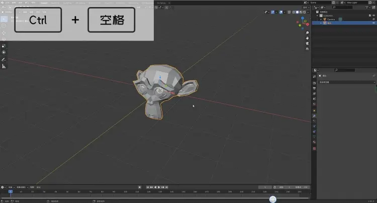

### 10、四视图模式切换

对于c4d和3dmax过来的朋友初期在视图操作上可能不太习惯，因为blender默认只显示一个透视图，可以按【ctrl+alt+q】瞬间切换到四视口状态找回熟悉的感觉。

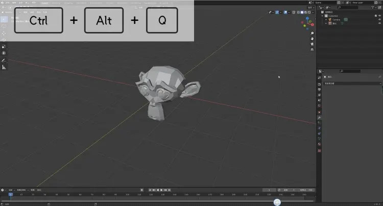

点编辑 `ctrl+V`

边编辑 `ctrl+E`

面编辑 `ctrl+F`

## 灯光

图案灯光，关键词搜索“leaf gobo texture”
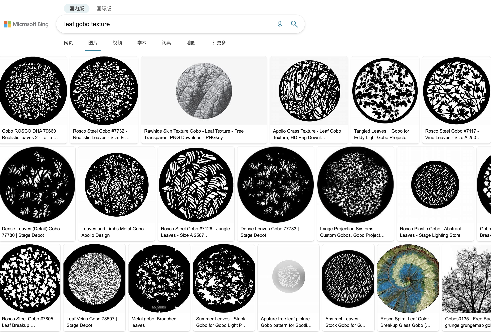

**灯光小技巧**
1. 选择灯光，按'shift+t'灯光的朝向会跟随着鼠标的移动而移动。
2. 在侧边栏中选择“约束”，“标准跟踪”这样不管灯光移动到哪里都会随着移动。
3. 调整灯光的远近，先选择灯光，按'g'，再按'zz'。
4. 快速调整灯光的能量，选择灯光右击选择"调整灯光的能量"，左右移动鼠标即可快速调整。
5. 按'shift+s'把3d游标移动物体上。按'.'把轴心点选择到'3d'游标。这样再'rr'可自由的对灯光进行摇移。

## 插件

* 导入-导出：import image as planes
* 界面:Copy Attributes Menu
* 界面：Dynamic Context Menu；动态上下文插件
* 界面:Modifier Tools；编辑器全部应用插件
* 添加网格:A.N.T LANDSCAPE；地形工具
* 图像绘制:Paint Paltttes
* 物体:Bool Tool
* 物体:Align Tools;对齐插件
* 网格:3D-Print Toolbox
* 网格:Edit Mesh Tools
* 网格:F2
* 网格:LoopTools
* 网格:tinyCAD Mesh tools
* 网格:Edit Mesh Tools

## 语言切换快捷键设置

键位映射->窗口->新建一个

下面这两个是设置的值

wm.context_toggle

preferences.view.use_translate_interface

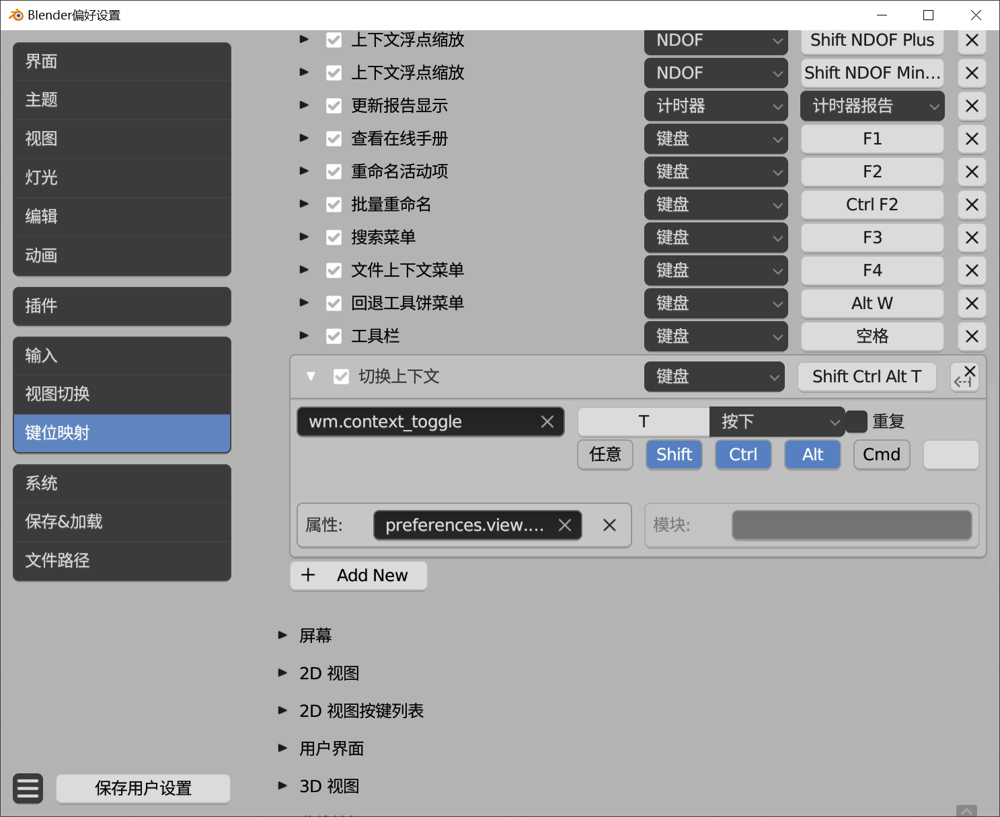

在编辑模式中的线模式，选中要分离的线。按 `V`即可分离选中项。

## 快速加视图级细分

1. 偏好设置里面，把“模拟数据键盘”勾去掉。
2. 选中对像，按 `control+3`进行细分（3是三级细分，2是二级细分。。。）

## 快捷键大全图

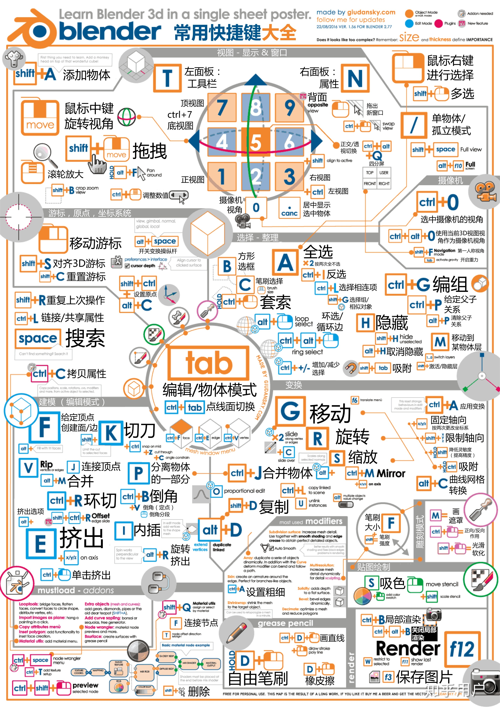

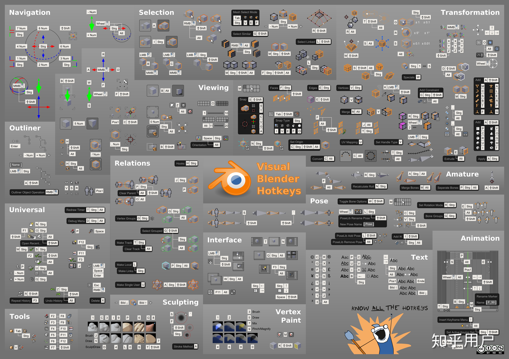

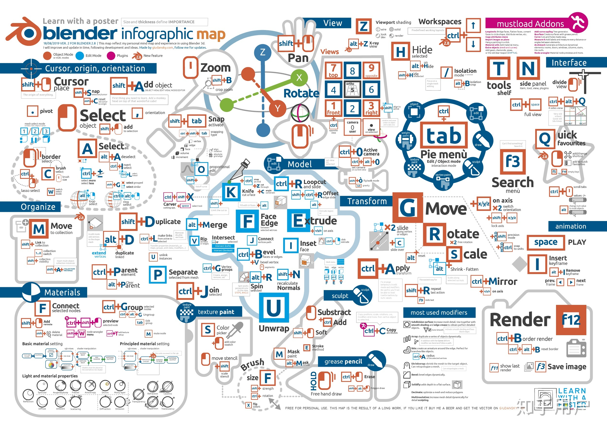

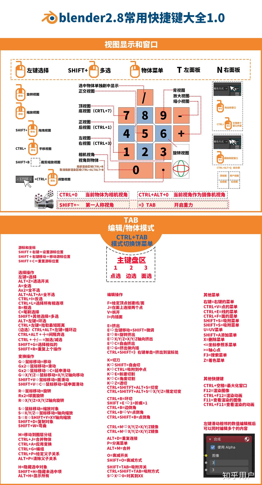

## 如何快速聚焦某个物体？

一般我们是使用小键盘上的句号，但是有人没有小键盘，这时候我们就需要用到波浪线 `~`，然后选择`查看所选`即可。同样的道理也可以用来看具体的某个点或者线。想要快速回到初始全选所有物体，按聚焦快捷键即可。

##  如何快速压平线条?

第一种：使用快捷键（S+Y+0），第二种:使用缩放轴，将缩放轴的数值改为0即可。

## 重新调出物体属性框

我们建模过程中经常会遇到这种情况，在进行一个操作后，左边会弹出属性框供我们调整，如果你不小心点击空白处，这个框就会消失，那么如何重新调出这个对话框呢？这时候我们只需要按下键盘的`F9`即可，它就会在我们的鼠标指针处显示刚刚操作对应的属性框。不过这个仅限于上一次操作。如果你后续有其他操作，这个是不起作用的。

## 中心点与3D游标

`shift+s` 打开游标/选中项对齐菜单

`alt+g` 将物体归位到世界原点

## 包装盒

包小盒网站（选盒型 + 设尺寸）
        ↓  F12 控制台提取 SVG 刀版
Illustrator（清理刀版 → 按纸厚留 1mm 间隙 → 处理插舌）
        ↓  导入 SVG（以蜡笔方式）
Blender（转曲线→网格 → 焊接顶点 → 补面 → 修轮廓 → 修正法向）
        ↓  从视角投影 UV → 导出 UV 布局图（SVG, 3000px）
        ↓  沿边折叠 90°（3D 游标 + Ctrl+加号加选）
        ↓  倒角 + 实体化（厚度）
Illustrator / PS（在 UV 布局图上画贴图 → 导出）
        ↓  基础色 → 图像纹理 → 材质偏移处理内壁 → 金属度/粗糙度做覆膜
成品渲染

不花钱拿到包装刀版矢量图（包小盒 + 浏览器 F12 提取 SVG）→ 在 Illustrator 里按纸张厚度处理展开图 → 导入 Blender 清理布线、折叠成型、加倒角与厚度 → 导出 UV 布局图并回 AI/PS 画贴图 → 贴回材质做出覆膜质感。

## 扑克牌

正背材质贴图,将【几何数据】节点的“背面”输出连接到【混合着色器】的“系数”输入端口。这样，当背面输出为 1 时（背面），Mix Shader 将选择第二个着色器；当输出为 0 时（正面），选择第一个着色器。

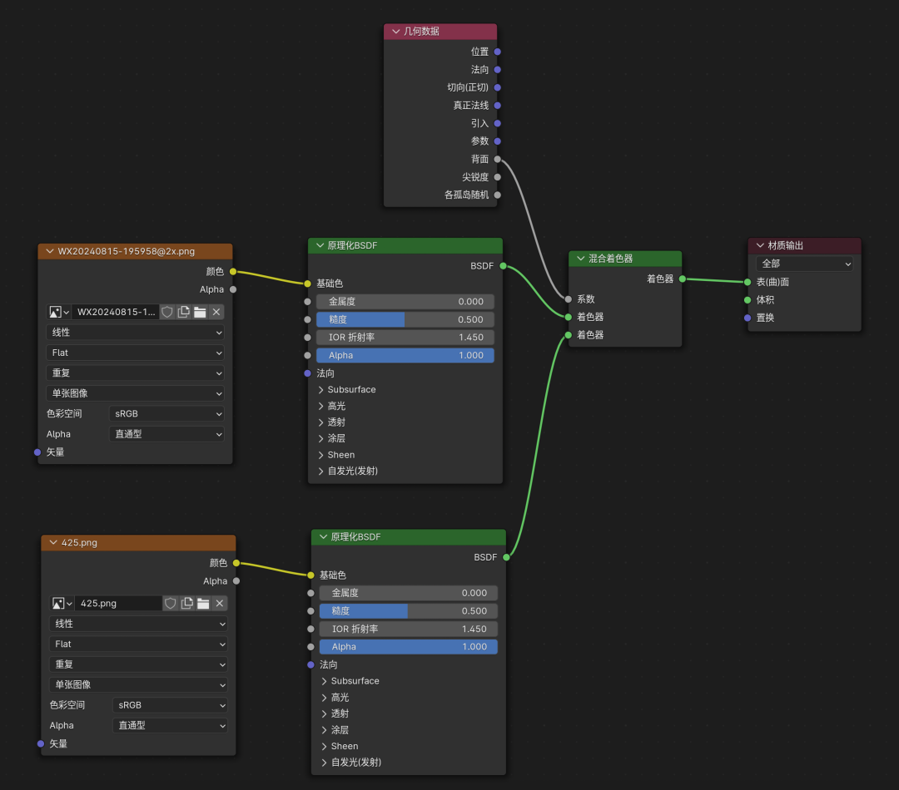

* Position（位置）功能：输出当前几何体的全局位置坐标。每个顶点、边或面的位置将作为一个向量（X、Y、Z）提供。应用场景：用于基于对象的位置来改变材质效果。例如，随着物体在场景中移动，颜色可以根据位置变化。

* Normal（法向）功能：输出几何体表面法线的方向，法线是垂直于表面的向量。应用场景：用于控制光照效果，如高光和阴影的计算，或在着色过程中实现细节的添加，例如法线贴图的应用。

* Tangent（切向/正切）功能：输出表面切线方向，通常用于计算物体的法线贴图的切线空间。应用场景：在法线贴图中使用切线空间来精确控制表面细节方向，使材质看起来更加逼真。

* True Normal（真实法线） 功能：输出平滑阴影下未被修改的法线，通常在修改法线数据后使用该参数来保留原始法线信息。应用场景：在需要保留或恢复原始法线数据的材质效果中使用，通常用于特殊的光照或渲染效果。

* Incoming（引入）功能：输出从光源到表面的入射光方向向量。应用场景：用于创建基于光照方向的材质效果，如在光源直射的表面上产生不同的反射或散射效果。

* Parametric（参数） 功能：输出几何体在曲面空间的参数化坐标，这通常用于曲面体，例如 NURBS 曲线或曲面。应用场景：在使用曲面体时，基于参数化坐标来调整材质效果，使其与曲面形状更好地匹配。

* Backfacing（背面） 功能：输出一个布尔值，指示当前表面是否背向摄像机。如果为 true，则表示表面背向摄像机。应用场景：用于创建双面材质效果，或对背面进行特殊处理，例如在双面渲染中使用不同的颜色或透明度。

* Pointiness（尖锐度）功能：输出每个顶点或面根据相邻面的角度计算出的尖锐度值。这在某些渲染器中也被称为“曲率”。应用场景：用于模拟磨损、边缘突出或生成类似污垢积累的效果，使物体更具真实感。

* Random Per Island（各孤岛随机） 功能：*输出一个随机值，针对同一对象中不同的 UV 孤岛（相连的面组）生成。应用场景：在对象的不同部分生成随机化的材质效果，如多种颜色的分布或随机化的纹理应用。

这些输出参数为创建各种复杂的材质效果提供了基础，可以根据具体的需求组合使用，创造出非常多样化的视觉效果。