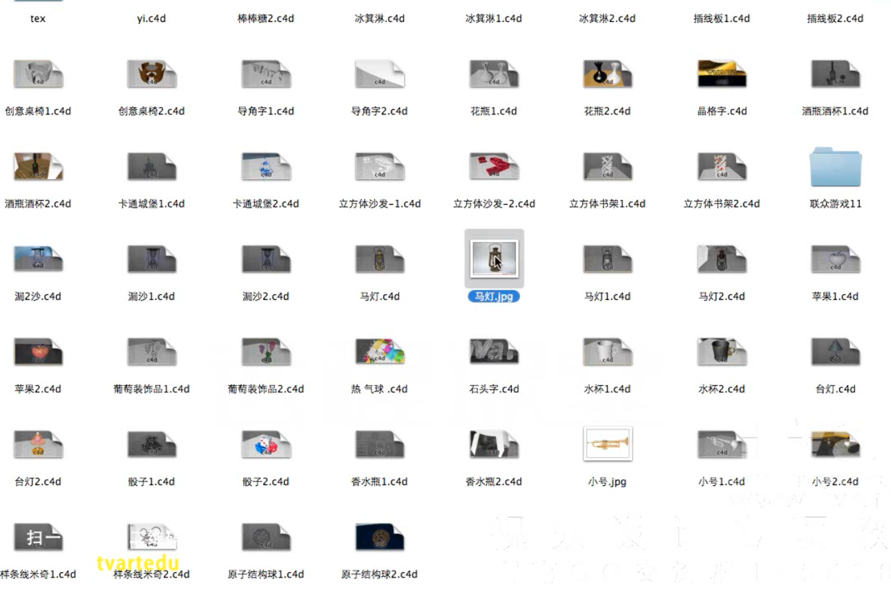
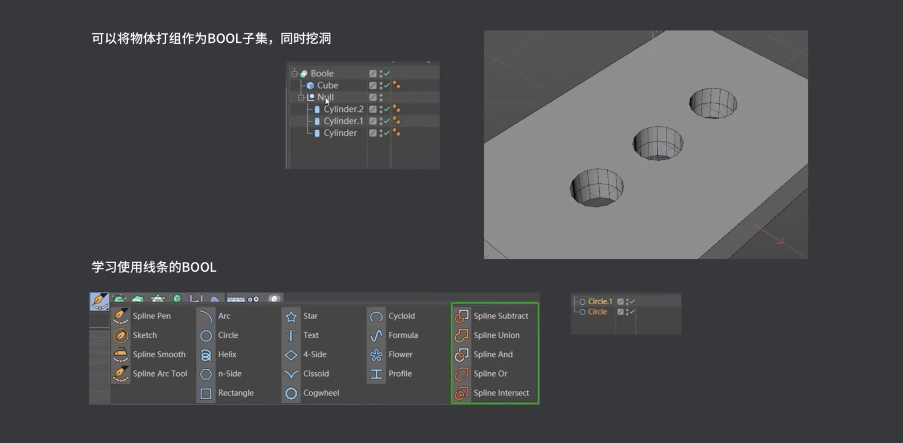
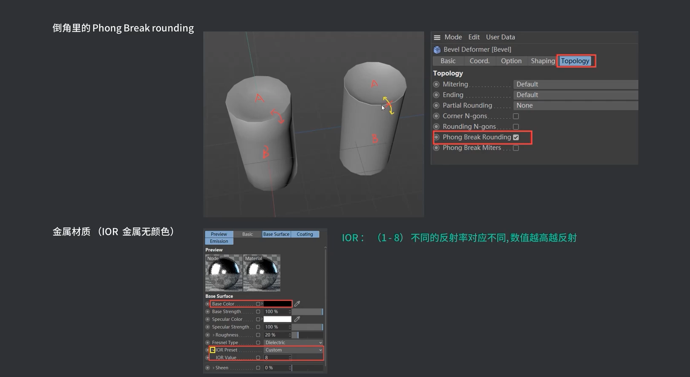
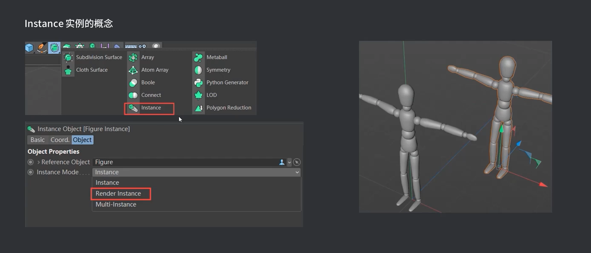
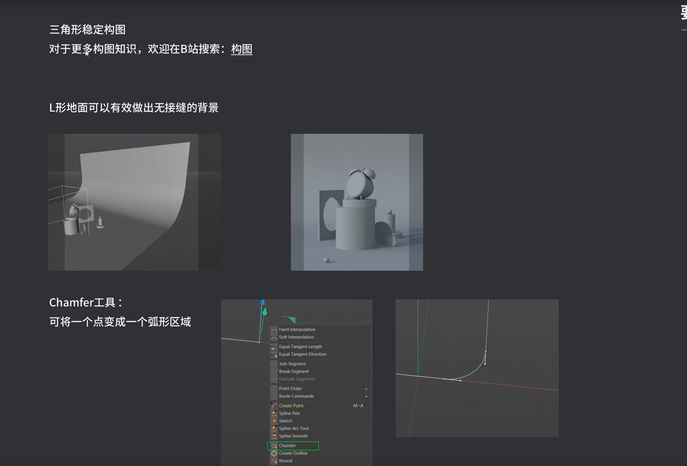
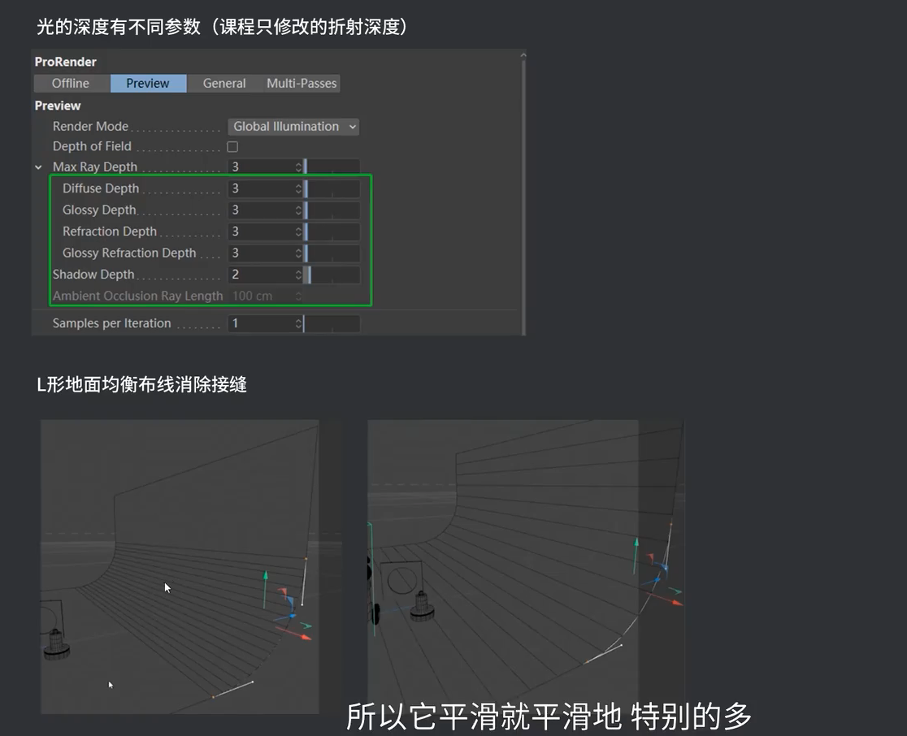
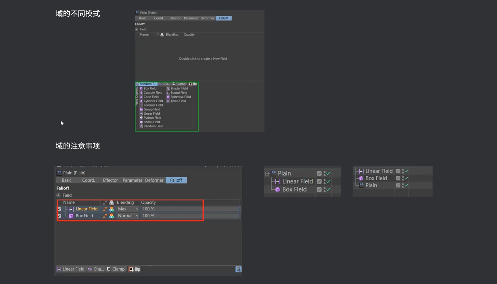

# C4D

## 快捷键

`E`移动、`T`缩放 、`R`旋转

`9`实时选择

同时按`shift`移动、缩放、旋转会按`5`度移动。

`空格`移动、缩放 、旋转可以来回切换

`w`坐标系统

`ctrl+R`或`command+R`渲染活动视图

`shift+R`渲染到图片查看器

`command+B`渲染器设置

在样条中，想新增点，按`ctrl`键可以新增；另外按`shift`键可以修改一边角为直角；

在`正视图`->`shift+V`->`背景`，还可以设置图片`透明`度

## 练习

## 鼠标中键，可以切换视图

建模proe、SOLIDWORKS、MAYA

## 选择、旋转、移动、缩放

`Alt+鼠标左`旋转、`Alt+中间`移动、`Alt+右键`缩放

Mac 电脑

`1+鼠标左`移动、`2+鼠标左`缩放、`3+鼠标左`旋转

## 旋转

`Alt+shift鼠标左/滚轮/右键`旋转

勾选“对象轴心”可以跟据自己的轴心旋转

## 群组对象

`alt+G`

## 鼠标点击中键，查看视图模式。三视图

## 在透视图中，按alt可以查各个角度

9选择、E移动，R旋转，T缩放、转换成编辑模式C
C完后，选择时勾选“仅选择可见元素”可选择所有的面。
对像轴L

视窗独显

## 物体局中到画面中间

选中物体后按`S`键会使选中的物体局中到画面中间

## 对象轴线

对象轴线-建立模型，按住`alt`键。

## 钢笔

按`shift`调整杠杆；

## 父子级

## 选择

按`U`键，快捷菜单。

## 环境与HDR360度贴图

## 摄像机的使用

## 渲染设置

## 滤镜的使用

## 摄影机景深

## 贝塞尔面工具

## 标准渲染窗口切换为ProProRedProRender渲染

新建的材质会出现错误，新建一个节点材质，按alt+拖动，可替换坏的材质。

## 按“。”号可以给模形加权重

## 找不到路径

导入ai文件后，找不到路径，选中”对象“，按`s`键后可以看到图形。

`H`最大化显示。

`V`二维视图不小心歪了，按下快捷键V，可恢复默认场景。

## 泡泡

`模拟`->"发射器"

## 点线面变成直线

我们需要把一个面或先变成垂直的，我们可以使用“缩放工具”，全选需要打平的点或面，按住`shift`缩放到百分0即可。

## 样条变轮廓

选中“样条”后，右键选择“创建轮廓”
