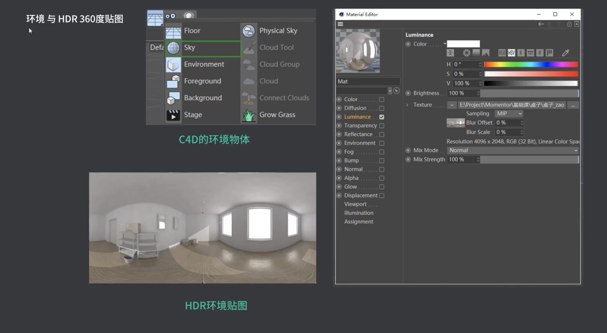
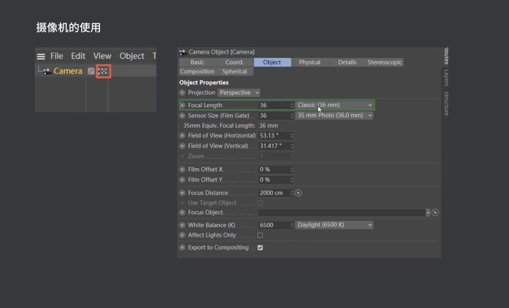
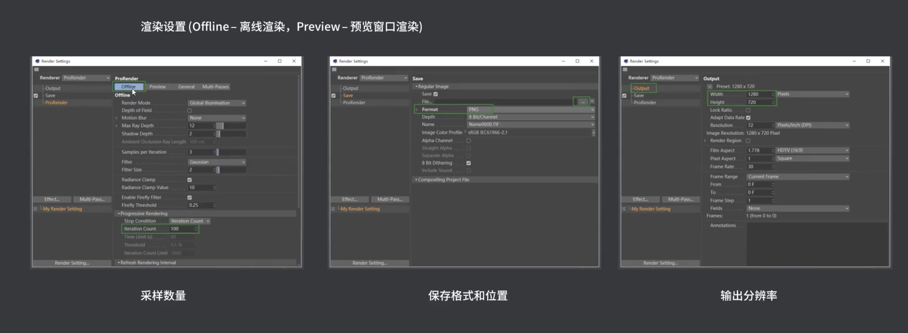
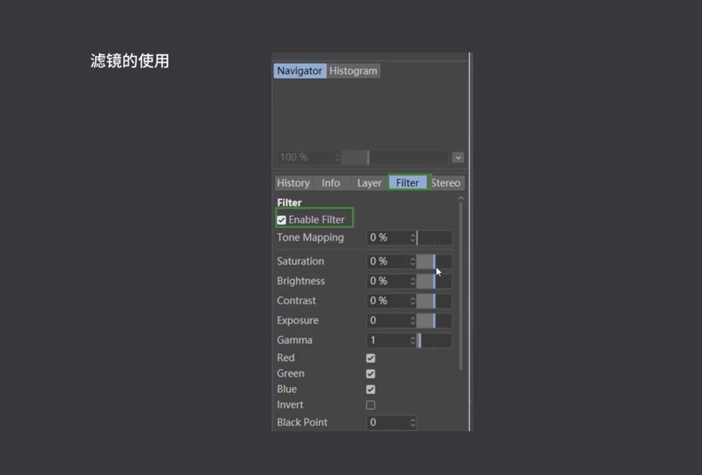
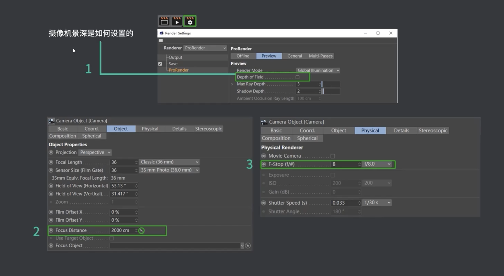
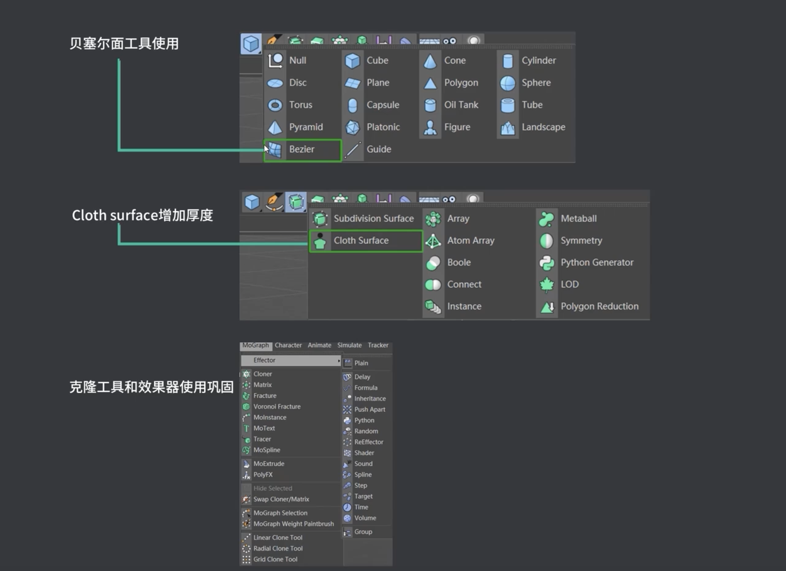

# C4D

建模proe、SOLIDWORKS、MAYA

## 选择、旋转、移动、缩放

`Alt+鼠标左`旋转、`Alt+中间`移动、`Alt+右键`缩放

## 旋转

`Alt+shift鼠标左/滚轮/右键`旋转

勾选“对象轴心”可以跟据自己的轴心旋转

## 群组对象

`alt+G`

## 鼠标点击中键，查看视图模式。三视图

## 在透视图中，按alt可以查各个角度

## 快捷键

9选择、E移动，R旋转，T缩放、转换成编辑模式C
C完后，选择时勾选“仅选择可见元素”可选择所有的面。
对像轴L

视窗独显

## 对象轴线

对象轴线-建立模型，按住`alt`键。

## 钢笔

按`shift`调整杠杆；

## 父子级

## 选择

按`U`键，快捷菜单。

## 环境与HDR360度贴图

## 摄像机的使用

## 渲染设置

## 滤镜的使用

## 摄影机景深

## 贝塞尔面工具

