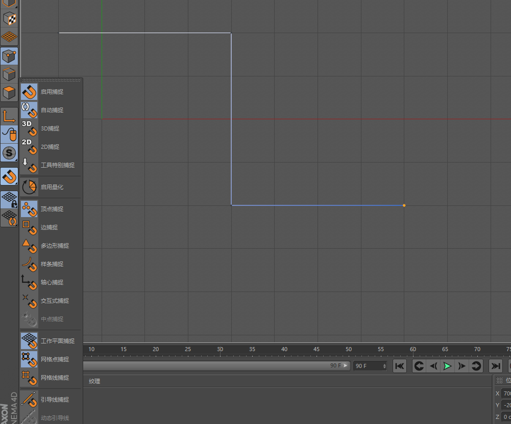
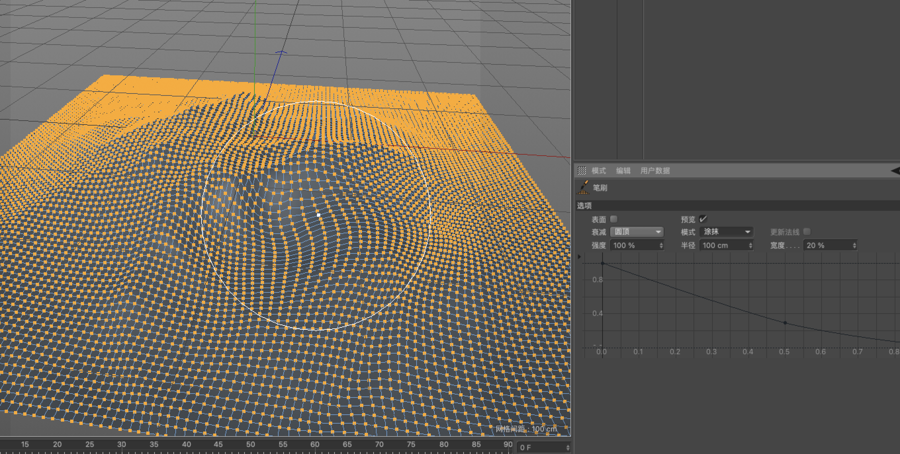
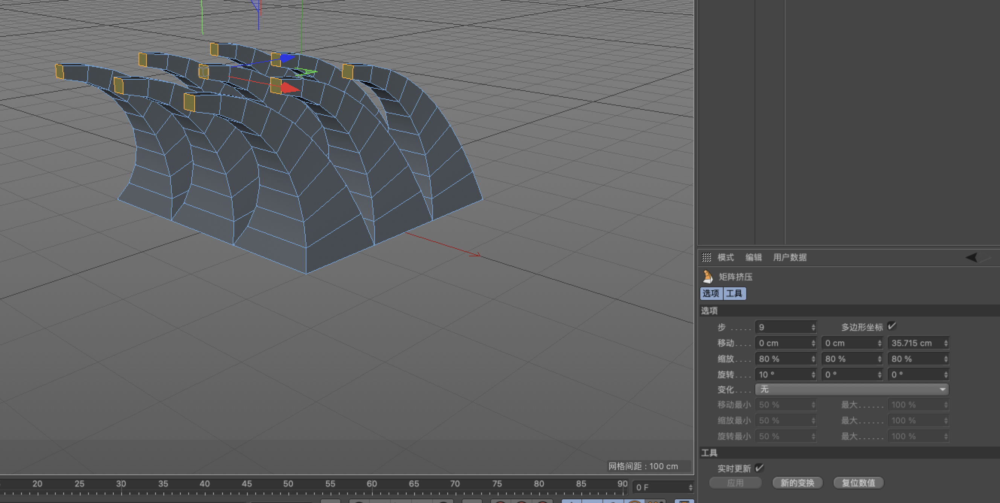
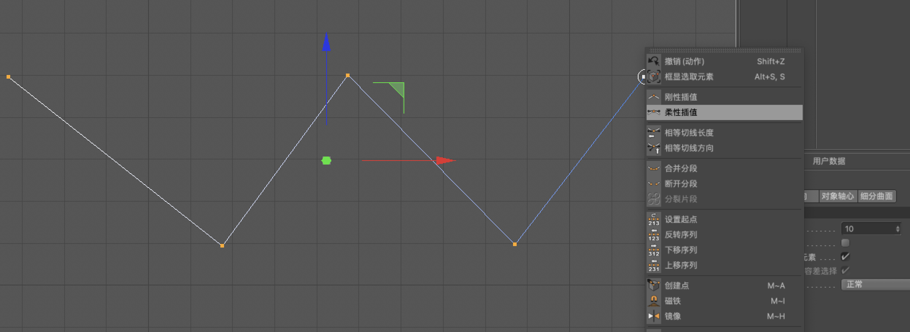
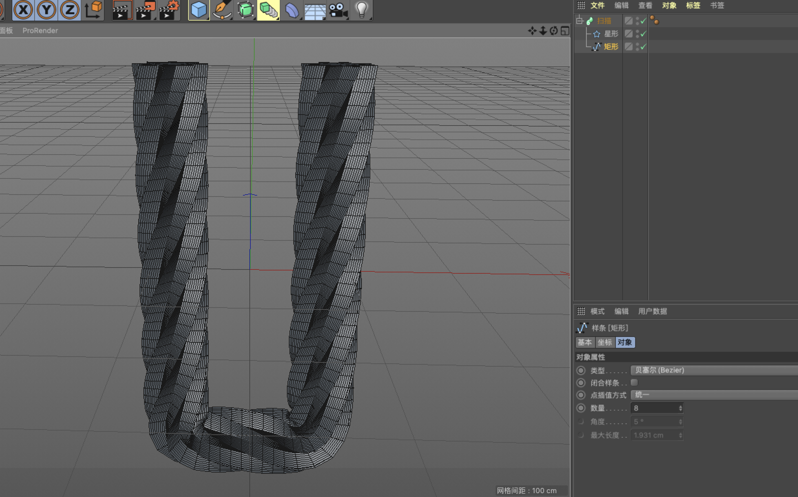
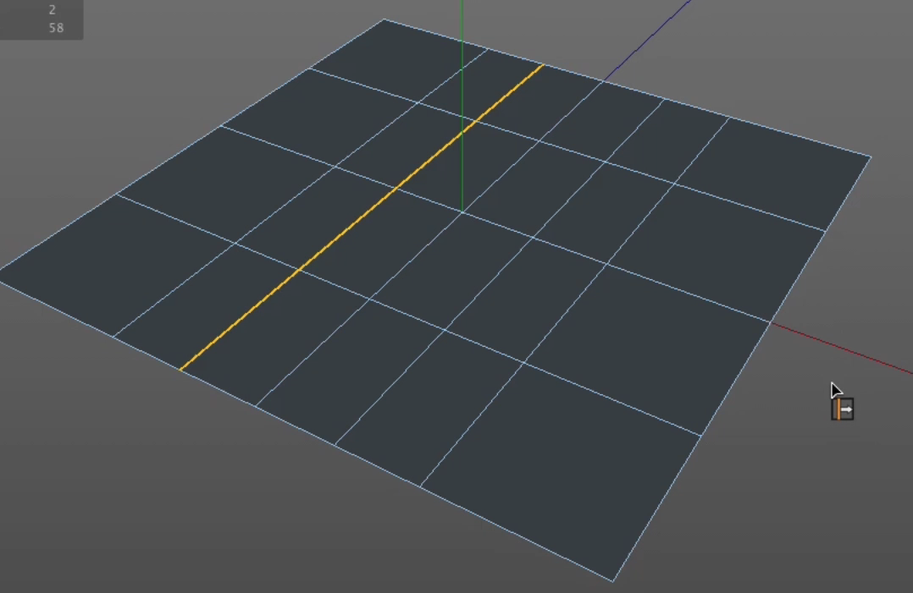
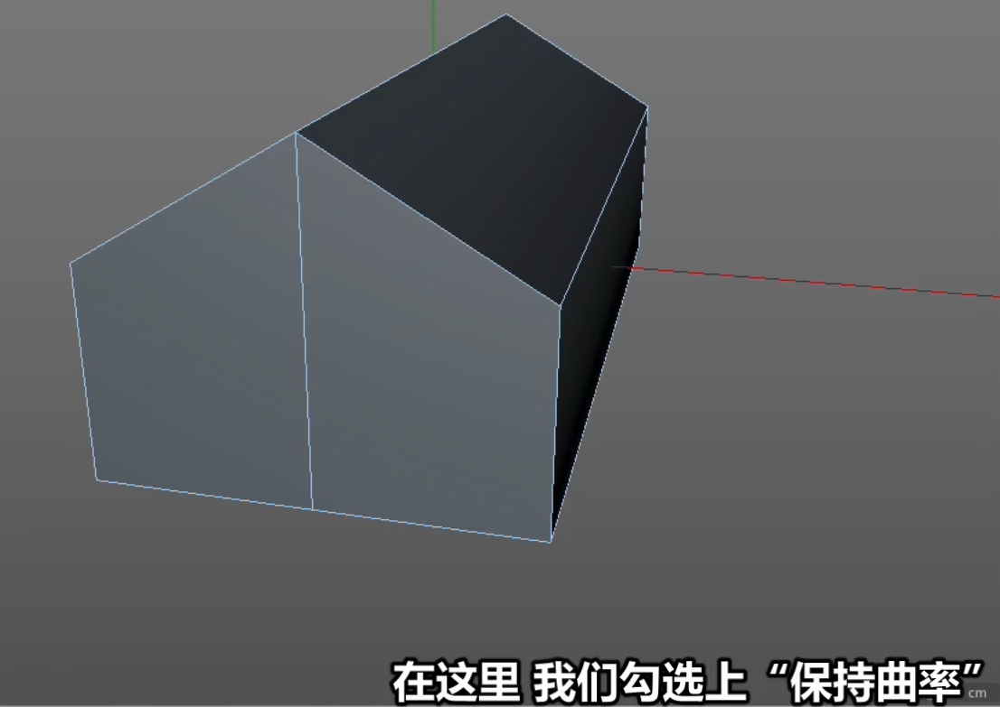
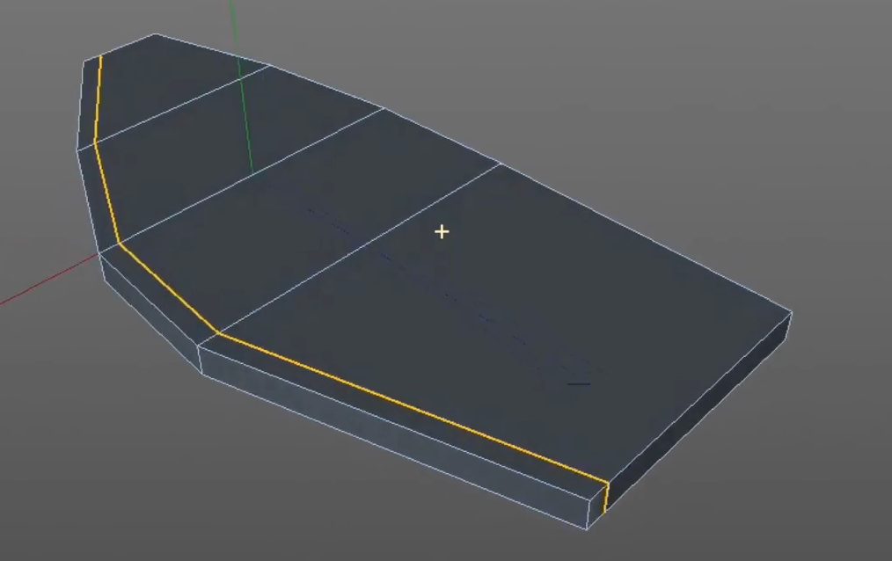
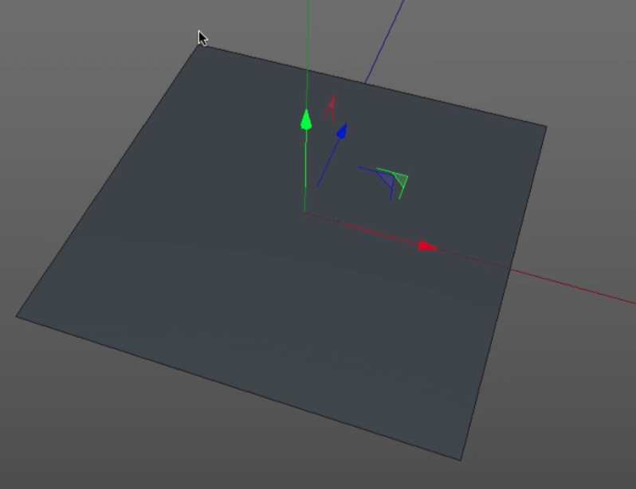
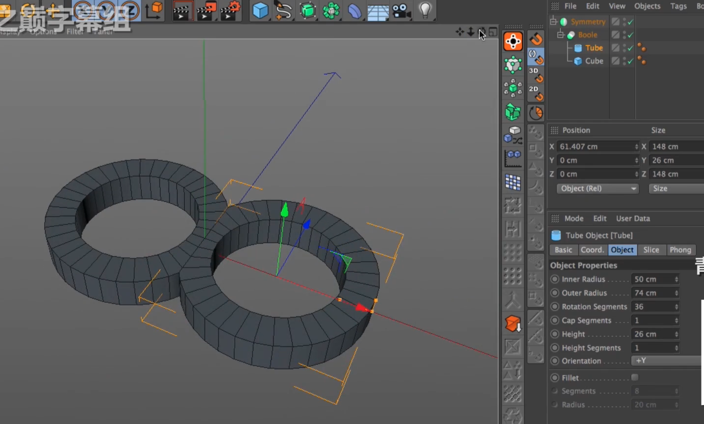

# C4D

## 硬边建模

1. 方案1，可以对像加入层颜色。方便后续设置渲染不渲染。
2. 方法2，在层后面有两个点来设置渲染。

查看菜单下面可以设置全部展开对像，全部折叠对像。

转到激活第一对像（`S`）快速定位到选择的对像上。

对像编组(`ALT+G`)

### 捕捉

正视图，启用捕捉，工作平面捕捉，网格点捕捉。

### 创建点

在“点”模式下面，可以创建点（`M~A`）,同时点的位置也可以调整到想要的位置上。

### 桥接

对像-“连接对像+删除”可以将两个对象连接成一个对象。

方法一：在边模式下面，通过桥接(`M~B`)，可以把空的两个对像连接起来。
方法二：选择要封闭的对象，右击选择“封闭多边型空洞”快键（`M~D`）

### 笔刷

在点模式下面，笔刷（`M~C`）

### 连接点/边

连接点/边（`M~M`）

### 多边形画笔

点模式下，选择其中一边，按住`cmd`键可以画一个面出来。另外按住`cmd+shift`再单击一下鼠标，可以画一个圆出来。

### 熨烫

一般是配合笔刷来使用。

### 线性切割

线性切割（自由切割），结束按空格。

### 平面切割

有一个固定的方向

### 循环/路径切割

循环/路径切割（`M~L`）

### 磁铁

### 镜像

在面的模式下镜像。

### 滑动

在边的模式

### 旋转边

### 缝合

二点转换成一点

### 焊接

### 倒角

### 挤压

### 内部挤压

### 阵列

### 克隆

### 矩阵挤压

### 偏移

偏移

提取面

### 三角面

面模式下。正方形变成三角形

## 曲线建模

### 画笔工具

在顶视图上，画的刚性的线段，右击可以使他变成柔性的线段

### 草绘

类似于毛笔

### 平滑样条

### 样条弧线

### 齿轮

C4d 齿轮很强大，可以有很多参数设置

### 矢量化

黑白照片，可以提取样条

## 旋转

一条线段

## 放样

二条线段以上

## 扫描

只要两条线段

## 渲染

1. 渲染到活动视图（cmd+r）测试性的渲染
2. 渲染到图片查看器（shift+r）真正渲染，可输出图片，AE。
3. 渲染设置（cmd+B）

 CPU渲染（标准、物理）， GPU渲染（ProRender,OC）

## 两种建模方法

## 贴图教学

 

## Octane渲染器

www.gfxcamp.com

Octane 3.07 r2

最常用的是`pt`与`dl`

## 拓扑建简单模型

画好一个简单面后，按`U~S`细分；

选择对象，平滑着色断开-全选-实体倒角。

## 拓扑建模

选择循环边，`u~f`填充，`u~k`减选，缩小多边形的选集。

## 样条VS细分曲面

按住`。`拖动鼠标左角可以调整成锐角。

在细分模式下，选中物体，按`q`可以快速切换细分与没有细分效果；

使用滑动工具，按cmd或ctrl键，拖动左键使用。

## 收缩包裹变型器

## 建模轴向工具

只有在点、线、面模式下才会起作用。

可以改变旋转默认角度；

## 径向对称

旋转的地方可以计算例如(`360/(16(边数)*2)`),开启`启用轴心`，把值改为零，应用。最后把`启用轴心`关闭。

使用`阵列`比克隆好用；

阵列工具并不能很好的地把边进行融合，比如加入细分会出现断边分布。为对像添加一个`连接`再加上细分就好了。

另外一种方法是使用`网格-克隆-克隆`

## 对称的妙用

选中对象，按住`alt`的同时，在形状生成器选择`对称`。这时中心轴是在世界坐标中心。可以选中对象移动对象的位置来改变对称位置。

另外一种方法，可以先移动对象位置，然后在形状生成器选择`对称`，把对象拖入对称中成为子层级。这时会生成一个跟选择对象一个的镜像文件。

`zy`是左右，`xy`是前后，`xz`是上下。

对称有两个很有用的选项`在轴心上限制点`和`删除轴心的多边型`

选中对象的面后，按`u-i`可以反相选择其它面，最后再优化`u-o`一下。

解决对称撺插问题：

## 滑动工具的妙用

`滑动工具(M-O)`。

在使用`滑动工具`的时候，按住`Ctrl`可以复制出一个边出来。

## 钻石分面

可用于分裂两个不同的表面。

多边形画笔`M-E`,建完面后使用慰烫（`M-G`）能使用线条变平滑

## 法线与顶点法

`网格`->`移动工具`,  `沿法线移动`、`沿法线缩放`、`沿法线旋转`  

## 循环边

1. 控制循环边布线方法

   选择那些边，`网格`->`前切`->`边接点/边(m-m)`,对齐法线`UA`

   选中面的颜色可以用来判断法线的正反，如果选中的面颜色是**青色**，则表明法线是反的。

2. 创建循环边的方法

## 布线原则

使用四边型，渲染快；

## 改线

第一种，使用`焊接`（m-q）

第二种，使用`旋转边(m-v)`

第三种，在边模式下，选择`路径选择（u-m）`,使用`导角`，`偏移`设置一个值，`细分`设置为1，另外再`斜角`中设置值为`均匀`，N-Gon就消失了。

**检查极点**，`模式`->`建模`->`网格检测`

三视图（正视图、右视图、顶视图)

粒子，模拟->粒子->发射器(显示对象)

显示标签、振动标签、对齐曲线标签、合成标签

B样条

`F1`(透视视图)

`alt+R` （交互式区域渲染）可以看最终效果

`shift+R` 渲染到图片查看器

渲染设置中，`输出`->`锁定比率`（会等比缩放），在输入框中输入`*2`图像会增加一倍。**小技巧**按住`ctrl+单击`会出现一个吸管，可以在状态栏中看到色值；

材质，`凹凸`可以制作粗糙表面，另外一个`置换`也可以；

`s`可以拉进物体

在材质球中，按`alt`拖动材质球可以把新的球应到物体上，把旧的材质球删删除。

各向异性，可以创建金属拉丝效果

在自然环境中调整材质。这样能调整出正确的材质。

区域灯光中，细节->衰减->方倒数（物理精度），这种衰减更加接近真实

在材质对话框中，右击`...`可以`复制`、`粘贴`。还可以重置复位默认设置；

## 多边形画笔

网格->创建对象-多边形画笔，属性"绘制模式"中设置为"面"模式

在边上`双击`，可以选中连续不断的边。

布要要四方型，更好编辑；

焊接，在点模式下，按住`command`或`ctrl`;

`8`套索选择、`9`实时选择、`0`框选

按`U`会弹出选择菜单；

`command+d`工程设置

`H`、`S`、`O`

`NA`、`NB`、`NG`

按`enter`可以点、线，面轮换；

选择边模式，把边选上后、右击`提取样条`后，选择点模式，右击选择`优化`。另外`网格`菜单->`轴心`->`轴局中到对象`

## 灯光设置

### 场景渲染设置

在天空加入，一个hdr

双击新建材质

材质给天空

设置

渲染

## 渲染设置

### 如何渲染的更快

全局光照缓存设置

3.物理设置

4.尺寸改下

## 材质设置

### 颜色

颜色（把颜色理解为油漆或者颜料）

## 金属

**公式:1.无颜料油漆+2.有反射+3.粗糙度+4.折射率+5.金属反射颜色**
**总结：如何区分金属类型（软硬）**

看金属软硬  越黑越硬

调IOR：越大越硬

去掉颜色勾选

添加反射

添加粗糙度

添加折射率

添加金属反射颜色

## 塑料

**公式:1.有颜料油漆+2.有反射+3.粗糙度+4.折射率+5.金属反射颜色**
**总结：如何区分塑料类型**

高光部分，越亮反射越强，

折射率越大反射越强（折射率最小1）

添加油漆

添加反射

3.添加粗糙度

4.添加折射率

5.添加金属反射颜色

## 透明

**透明常见。1.常规透明玻璃杯 2.磨砂玻璃杯3.彩色玻璃杯（含1.有色玻璃2.透光玻璃）**
常规透明玻璃杯
   **公式:1.无颜料油漆+2.有反射+3.透明+4.折射率**

如何区分类型：（看软硬）

1.折射率越高 玻璃越硬。

不需要单独添加反射

2.磨砂玻璃杯

多了模糊值

3.彩色玻璃杯（含1.有色玻璃2.透光玻璃）

有色玻璃

注意:颜色的深浅影响了不透明度

4.透光玻璃

注意：

吸收距离越高，玻璃透光，

厚薄，颜色对比差别大

吸收距离越低，厚薄，颜色对比差别小

## 发光

发光内发光，辉光外发光

## 样条

在空白处单击，选择`平滑`可对线条进行平滑，对线条会进行较大的改变；也可以已在空白处单击，选择`细分`后面的设置，输入值对线条进行平滑，后面这个操作不会对样条进行较大的变化。

## 快捷键

`E`移动、`T`缩放 、`R`旋转

`9`实时选择

同时按`shift`移动、缩放、旋转会按`5`度移动。

`空格`移动、缩放 、旋转可以来回切换

`w`坐标系统

`ctrl+R`或`command+R`渲染活动视图

`shift+R`渲染到图片查看器

`command+B`渲染器设置

在样条中，想新增点，按`ctrl`键可以新增；另外按`shift`键可以修改一边角为直角；

在`正视图`->`shift+V`->`背景`，还可以设置图片`透明`度

挤压快捷键是`D`、内部挤压`I`

## 练习

## 鼠标中键，可以切换视图

建模proe、SOLIDWORKS、MAYA

## 选择、旋转、移动、缩放

`Alt+鼠标左`旋转、`Alt+中间`移动、`Alt+右键`缩放

Mac 电脑

`1+鼠标左`移动、`2+鼠标左`缩放、`3+鼠标左`旋转

## 旋转

`Alt+shift鼠标左/滚轮/右键`旋转

勾选“对象轴心”可以跟据自己的轴心旋转

## 群组对象

`alt+G`

## 鼠标点击中键，查看视图模式。三视图

## 在透视图中，按alt可以查各个角度

9选择、E移动，R旋转，T缩放、转换成编辑模式C
C完后，选择时勾选“仅选择可见元素”可选择所有的面。
对像轴L

视窗独显

## 物体局中到画面中间

选中物体后按`S`键会使选中的物体局中到画面中间

## 对象轴线

对象轴线-建立模型，按住`alt`键。

## 钢笔

按`shift`调整杠杆；

## 父子级

## 选择

按`U`键，快捷菜单。

## 环境与HDR360度贴图

## 摄像机的使用

## C$D渲染设置

## 滤镜的使用

## 摄影机景深

## 贝塞尔面工具

## 标准渲染窗口切换为ProProRedProRender渲染

新建的材质会出现错误，新建一个节点材质，按alt+拖动，可替换坏的材质。

## 按“。”号可以给模形加权重

## 找不到路径

导入ai文件后，找不到路径，选中”对象“，按`s`键后可以看到图形。

`H`最大化显示。

`V`二维视图不小心歪了，按下快捷键V，可恢复默认场景。

## 泡泡

`模拟`->"发射器"

## 点线面变成直线

我们需要把一个面或先变成垂直的，我们可以使用“缩放工具”，全选需要打平的点或面，按住`shift`缩放到百分0即可。

## 样条变轮廓

选中“样条”后，右键选择“创建轮廓”

## 拆UV

1. 先选择要拆的线；
2. 松驰

## c4d多边形画笔工具为什么挤压的时候没有办法封顶？

r20版本刚刚也是这个问题困扰了我，就是你挤压的是鼠标一定要在空白处滑动

选择对象，勾选封顶选项，然后按住ctrl+鼠标在空白处滑动才会有封顶。

## C4D Octane 渲染器

RGB颜色，点击颜色块可以弹出对话框进行选颜色。

渲染窗口中，左下角会有提示信息(只要单击就可以隐藏/显示)

## Arnold(阿诺德)渲染器

一些重设置，采样和光线深度；

## 建模布线原则

要用四边型，远离三角型与N-Gons。

必须切换回`移动`(或按`E`)、`缩放`、`旋转`工具，工具状态下，才可以双击边选择整条边。

> **极点**，一个顶点连接超过5条边或者是4条边的顶点。

溶解(`u~z`)留点，消除（`m~n`）不留点。

## 改线

多边形画笔（`m~e`）选择面模式。

焊接工具（`m~q`）

模式->建模->风格检测->启用网格检测

错误的布线：

改线旋转边`m~v`

极点可以存在，但不要在转折处，在平面上不影响。

创建极点，得控制走向。

切边工具`M~F`

循环切割`k~l`

路径选择`u~m`

`倒角`->`拓扑`->`斜角`->`均匀`。

## 循环边

环状选择（`u~b`）

环状切割（`k`l`）

移除N-Gons（`U～E`）

循环边创建的方法：

1. 选面内部挤压；

2. 选边挤压或选面的外部路径倒角(倒角->拓扑->斜角->均匀)

## 法线原理与顶点法线设置

法线分为：多边型法线与顶点法线；

Shift+V 视图设置，显示，勾选多边型法线；在面模式下，有一个小白短线（法线位于多边型的中央）；

插件（Vertex Normal Tool）顶点法线编辑器；

法线方向代表着所在多边形的朝向

选择->选择平滑着色断开（`U~N`）,为了快速选择边缘线条。再激活倒角工具。

先内部挤压再倒角了。。。

右键里面就有 沿法线缩放

## 钻石分面

钻石分面的作用就是把两边走向分开不同的方向；另外一个作用就是钻石的另一侧，面的数量会增加。

笔刷工具（`M~C`）

## 滑动工具

滑动工具（`M~O`）

按住`command`键，然后滑动才能克隆新的线条。

选中一个角的线条滑动可以使这个角变硬朗，并不会影响其它几体。

使用滑动工具的同时，先按`command`复制，在按`shift`左右拖动，就可以上下移动。可以实现类似倒角工具的功能。

选中一条边，按`command`滑动，类似于切线工具。

滑动工具，勾选保持曲率

使用滑动工具，得到一条切线跟边缘相等距离。

滑动工具中，勾选“限制”，可以左右两边来回的加切线

## 对称工具

ZY，左右对称

XY，前后对称

XZ，上下对称

对称的三种方法：

1. 默认对称的时候都位于世界中心上。
2. 先移动对象后，再按`alt`键添加对称，这时轴心会在物体上。
3. 先移动了对象，你想把对象按世界轴心对称，先创建一个对称，再把那个要创建对称的对象移到对称的子层级下就行了。

在对称的时候，选中对象按住`alt`会直接对象会成为对称子层级。

选中两条线，按m-m，选择`连接点/边`，会在平面中间加一条线；

对称中两个重要的参数：1.在轴心上限制点；2.删除轴心上的多边形。

在对称中发现点没有对齐，可以切换到“对称对象”面板里面的“对像”面板，把公差调大，这时两个面就会对齐。

为对象添加了细分曲面后，如果其中一个点想调整为尖锐的角。可以选中该点按`。`拖动鼠标左键调尖锐角。

进入面模式后，按`U~I`可以反选。

使用对称会出现对象相互穿插问题，怎么解决呢？

创建一个很大的立方体，把分段数都调为1，把尺寸调成一个很大的值。把想要对称的对象和刚创建很大的立方体先进行步尔运算。再对称。

