# C4D 建模宝典

## 建模布线原则

要用四边型，远离三角型与N-Gons。

必须切换回`移动`(或按`E`)、`缩放`、`旋转`工具，工具状态下，才可以双击边选择整条边。

> **极点**，一个顶点连接超过5条边或者是4条边的顶点。

溶解(`u~z`)留点，消除（`m~n`）不留点。

## 改线

多边形画笔（`m~e`）选择面模式。

焊接工具（`m~q`）

模式->建模->风格检测->启用网格检测

错误的布线：

改线旋转边`m~v`

极点可以存在，但不要在转折处，在平面上不影响。

创建极点，得控制走向。

切边工具`M~F`

循环切割`k~l`

路径选择`u~m`

`倒角`->`拓扑`->`斜角`->`均匀`。

## 循环边

环状选择（`u~b`）

环状切割（`k`l`）

移除N-Gons（`U～E`）

循环边创建的方法：

1. 选面内部挤压；

2. 选边挤压或选面的外部路径倒角(倒角->拓扑->斜角->均匀)

## 法线原理与顶点法线设置

法线分为：多边型法线与顶点法线；

Shift+V 视图设置，显示，勾选多边型法线；在面模式下，有一个小白短线（法线位于多边型的中央）；

插件（Vertex Normal Tool）顶点法线编辑器；

法线方向代表着所在多边形的朝向

选择->选择平滑着色断开（`U~N`）,为了快速选择边缘线条。再激活倒角工具。

先内部挤压再倒角了。。。

右键里面就有 沿法线缩放

## 钻石分面

钻石分面的作用就是把两边走向分开不同的方向；另外一个作用就是钻石的另一侧，面的数量会增加。

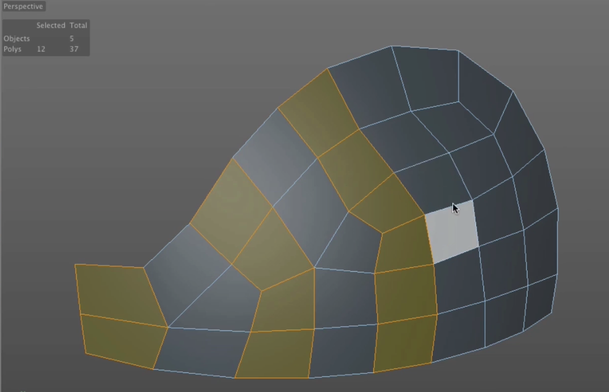

笔刷工具（`M~C`）

## 滑动工具

滑动工具（`M~O`）

按住`command`键，然后滑动才能克隆新的线条。

选中一个角的线条滑动可以使这个角变硬朗，并不会影响其它几体。

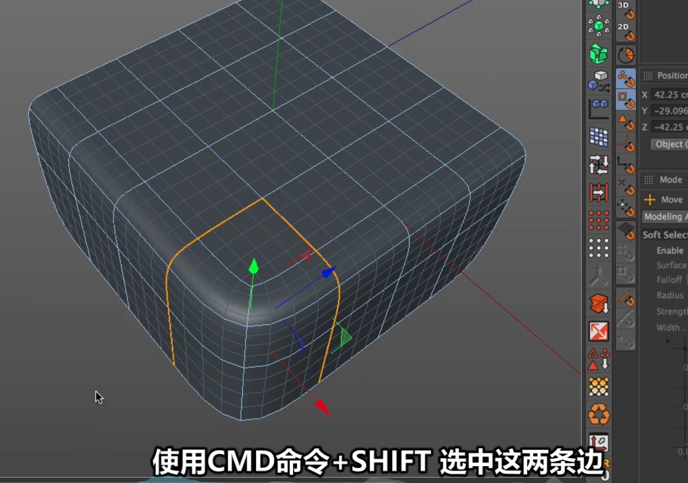

使用滑动工具的同时，先按`command`复制，在按`shift`左右拖动，就可以上下移动。可以实现类似倒角工具的功能。

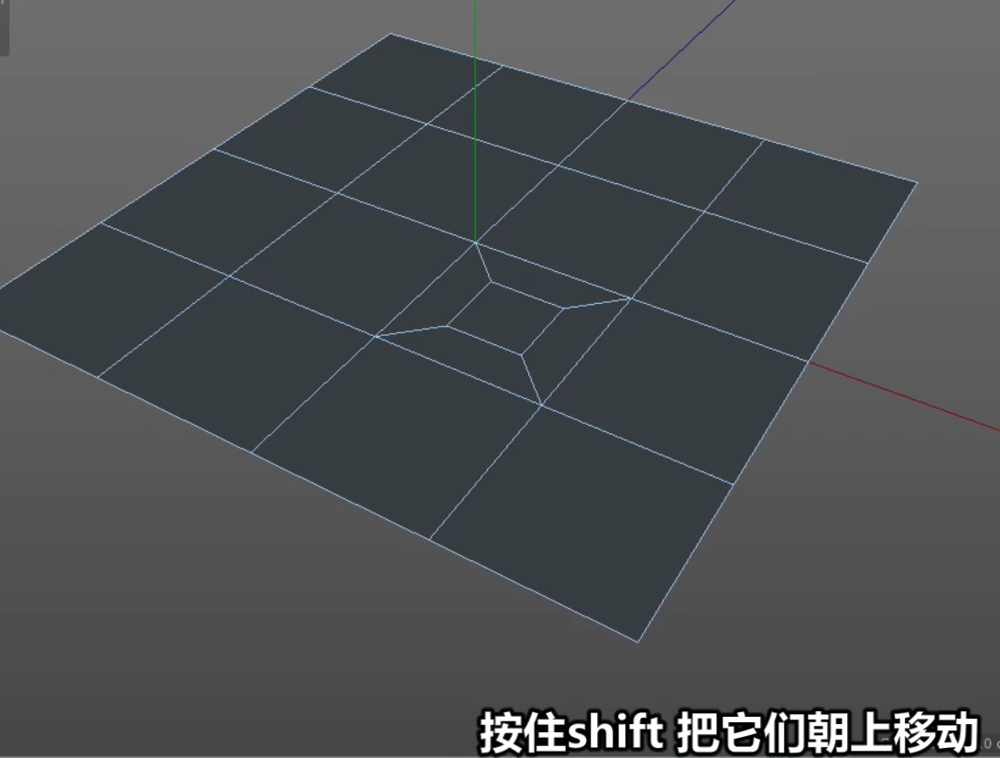

选中一条边，按`command`滑动，类似于切线工具。

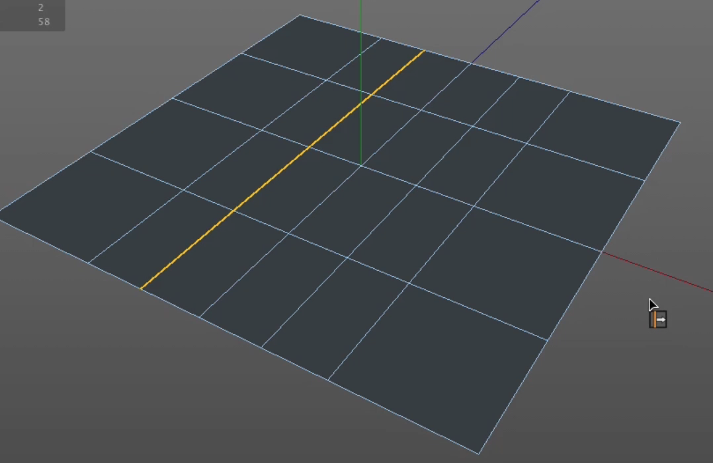

滑动工具，勾选保持曲率

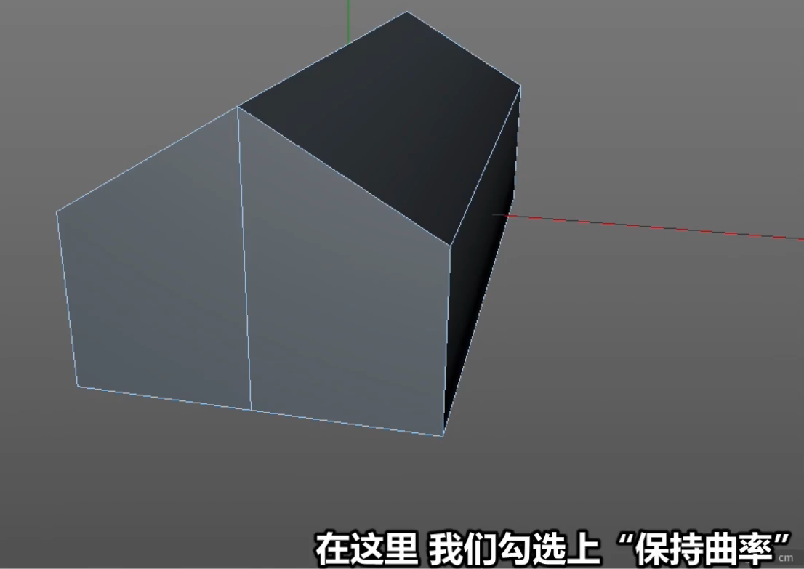

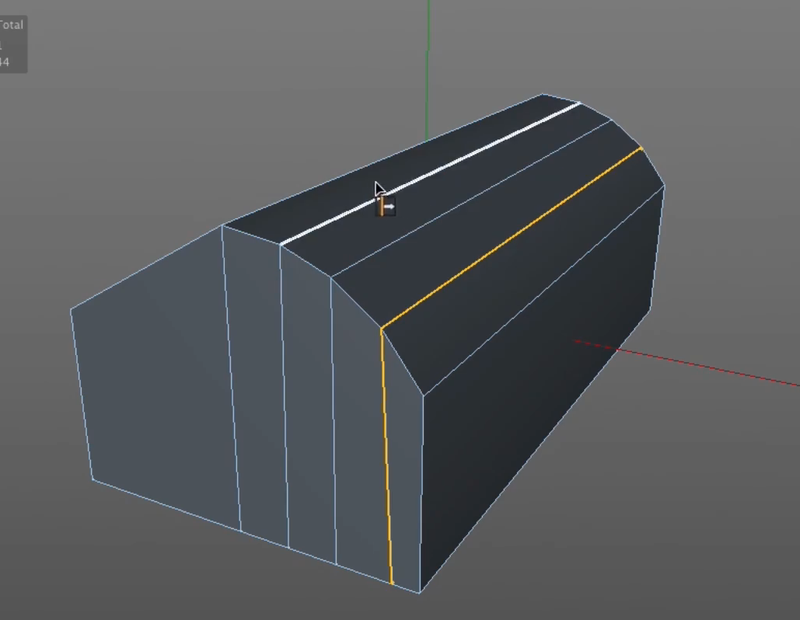

使用滑动工具，得到一条切线跟边缘相等距离。

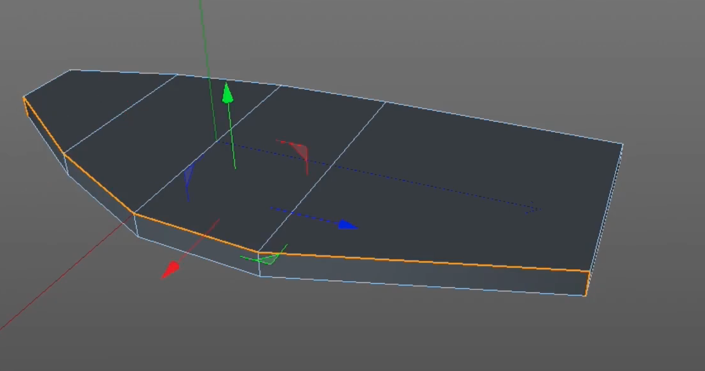

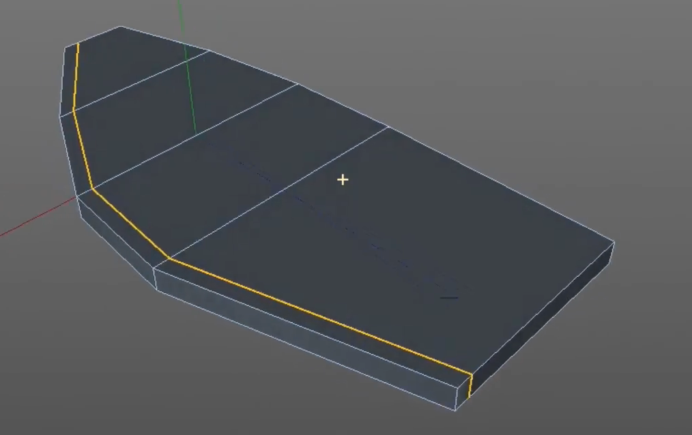

滑动工具中，勾选“限制”，可以左右两边来回的加切线

## 对称工具

ZY，左右对称

XY，前后对称

XZ，上下对称

对称的三种方法：

1. 默认对称的时候都位于世界中心上。
2. 先移动对象后，再按`alt`键添加对称，这时轴心会在物体上。
3. 先移动了对象，你想把对象按世界轴心对称，先创建一个对称，再把那个要创建对称的对象移到对称的子层级下就行了。

在对称的时候，选中对象按住`alt`会直接对象会成为对称子层级。

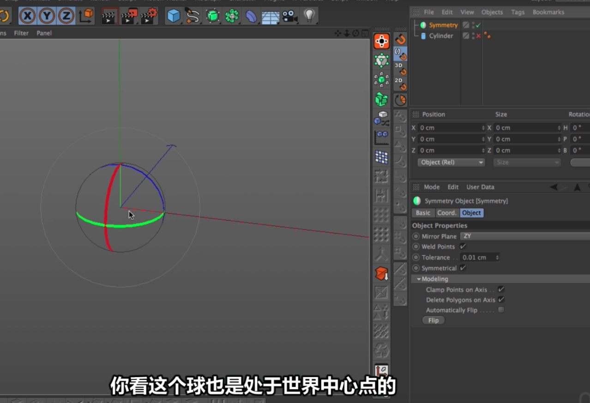

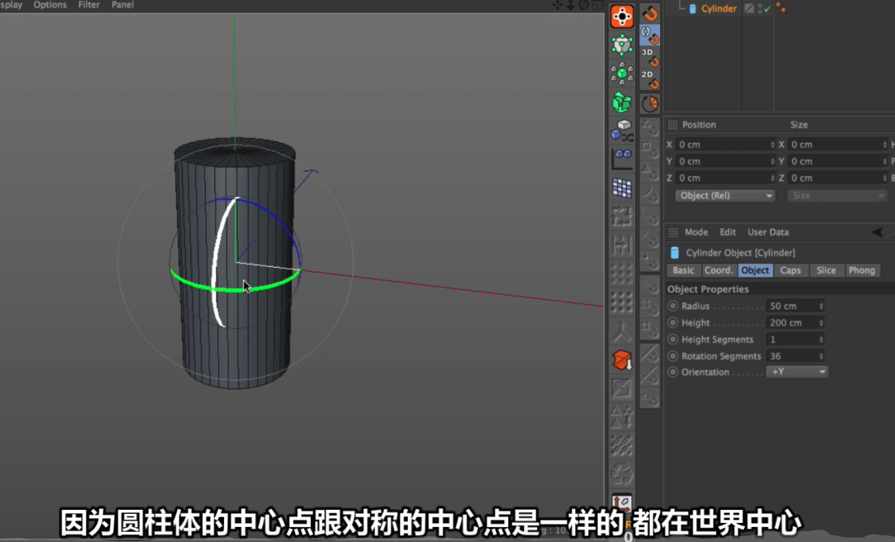

选中两条线，按m-m，选择`连接点/边`，会在平面中间加一条线；

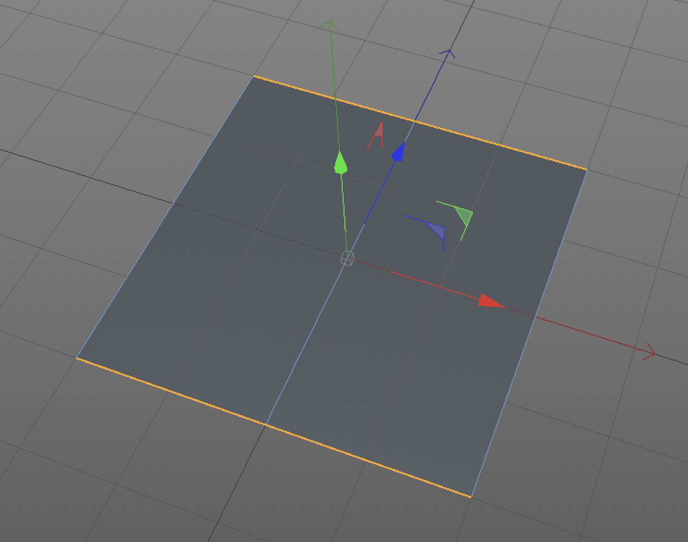

对称中两个重要的参数：1.在轴心上限制点；2.删除轴心上的多边形。

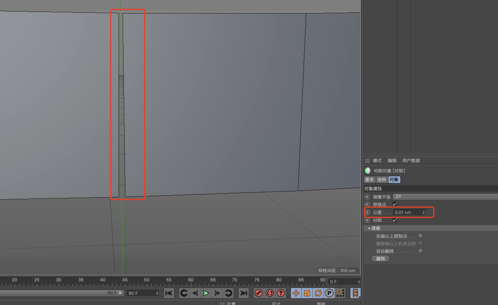

在对称中发现点没有对齐，可以切换到“对称对象”面板里面的“对像”面板，把公差调大，这时两个面就会对齐。

为对象添加了细分曲面后，如果其中一个点想调整为尖锐的角。可以选中该点按`。`拖动鼠标左键调尖锐角。

进入面模式后，按`U~I`可以反选。

使用对称会出现对象相互穿插问题，怎么解决呢？

创建一个很大的立方体，把分段数都调为1，把尺寸调成一个很大的值。把想要对称的对象和刚创建很大的立方体先进行步尔运算。再对称。

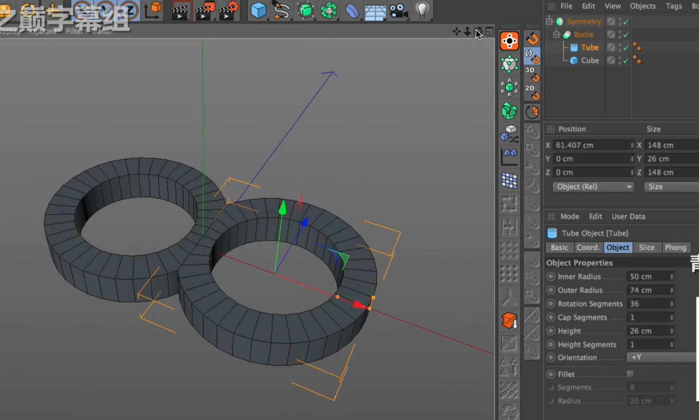
