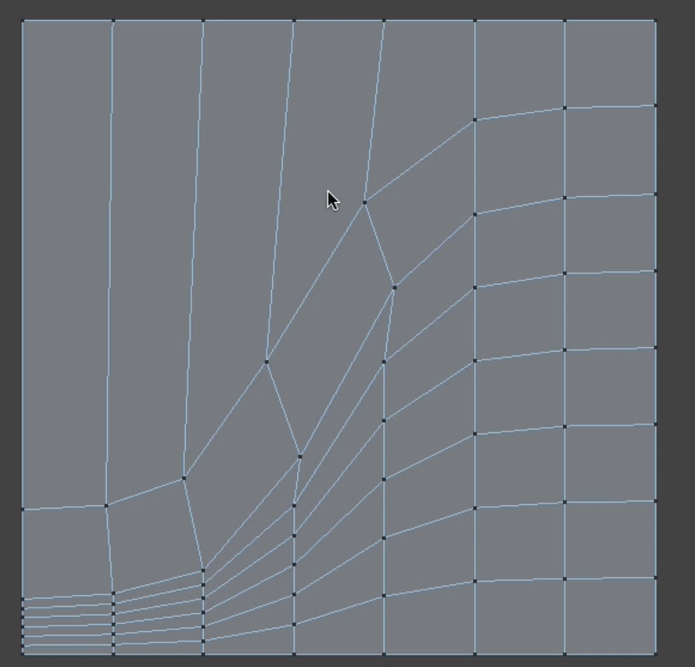
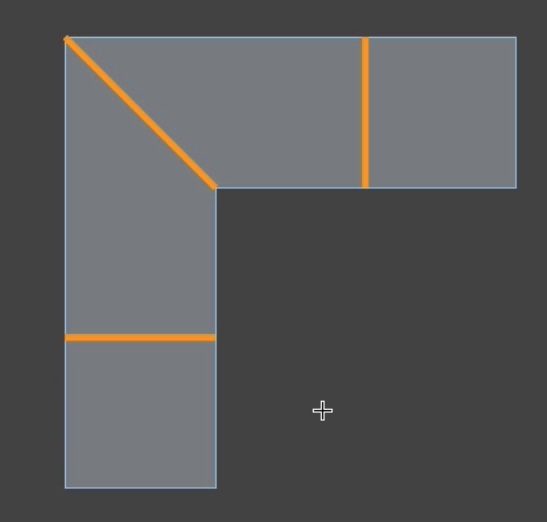
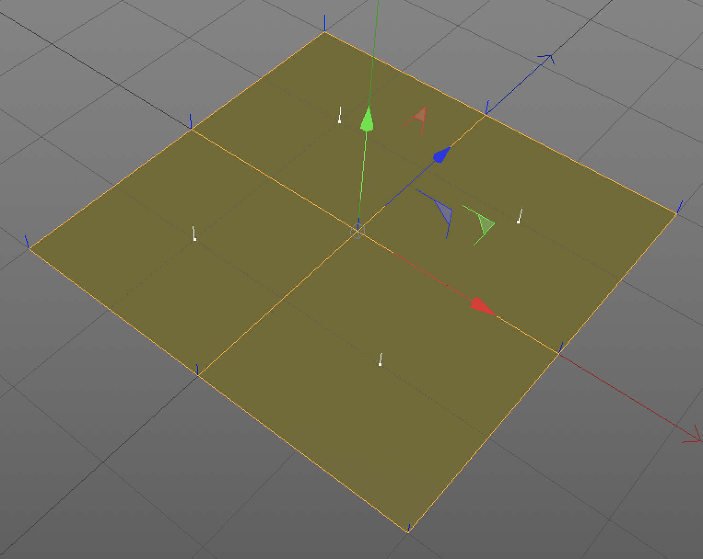

# C4D 建模宝典

## 建模布线原则

要用四边型，远离三角型与N-Gons。

必须切换回`移动`(或按`E`)、`缩放`、`旋转`工具，工具状态下，才可以双击边选择整条边。

> **极点**，一个顶点连接超过5条边或者是4条边的顶点。

溶解(`u~z`)留点，消除（`m~n`）不留点。

## 改线

多边形画笔（`m~e`）选择面模式。

焊接工具（`m~q`）

模式->建模->风格检测->启用网格检测

错误的布线：

改线旋转边`m~v`

极点可以存在，但不要在转折处，在平面上不影响。

创建极点，得控制走向。

切边工具`M~F`

循环切割`k~l`

路径选择`u~m`

`倒角`->`拓扑`->`斜角`->`均匀`。

## 循环边

环状选择（`u~b`）

环状切割（`k`l`）

移除N-Gons（`U～E`）

循环边创建的方法：

1. 选面内部挤压；

2. 选边挤压或选面的外部路径倒角(倒角->拓扑->斜角->均匀)

## 法线原理与顶点法线设置

法线分为：多边型法线与顶点法线；

Shift+V 视图设置，显示，勾选多边型法线；在面模式下，有一个小白短线（法线位于多边型的中央）；

插件（Vertex Normal Tool）顶点法线编辑器；

法线方向代表着所在多边形的朝向

选择->选择平滑着色断开（`U~N`）,为了快速选择边缘线条。再激活倒角工具。
