# 你早该这么玩Excel

## 十宗罪

### 一宗罪：多余的标题

   在工作簿名称上取名或者在工作表中命名。

   | 技巧 | 技巧描述 |                |
   | ---- | -------- | -------------- |
   |      | 工作簿   | 工作表         |
   | 新建 | ctrl+n   | shift+F11      |
   | 切换 | ctrl+tab | ctrl+pgdn/pgup |

### 二宗罪：字段顺序不合理

   - 时间，
   - 人物
   - 人物属性
   - 事件
   - 事件属性

   对工作的理解，对细节的把握

   | 技巧     | 技巧描述           |
   | -------- | ------------------ |
   | 列换位   | 选中列，shift+左键 |
   | 插入多列 | 选中多列，右键选项 |

### 三宗罪：数据摆放不连续（用空列割开）

上下左右的数据“全挨着”

| 技巧     | 技巧描述                 |
| -------- | ------------------------ |
| 删除多列 | 定位空值（F5），删除整列 |

**转置，选择性粘贴，选转置。**

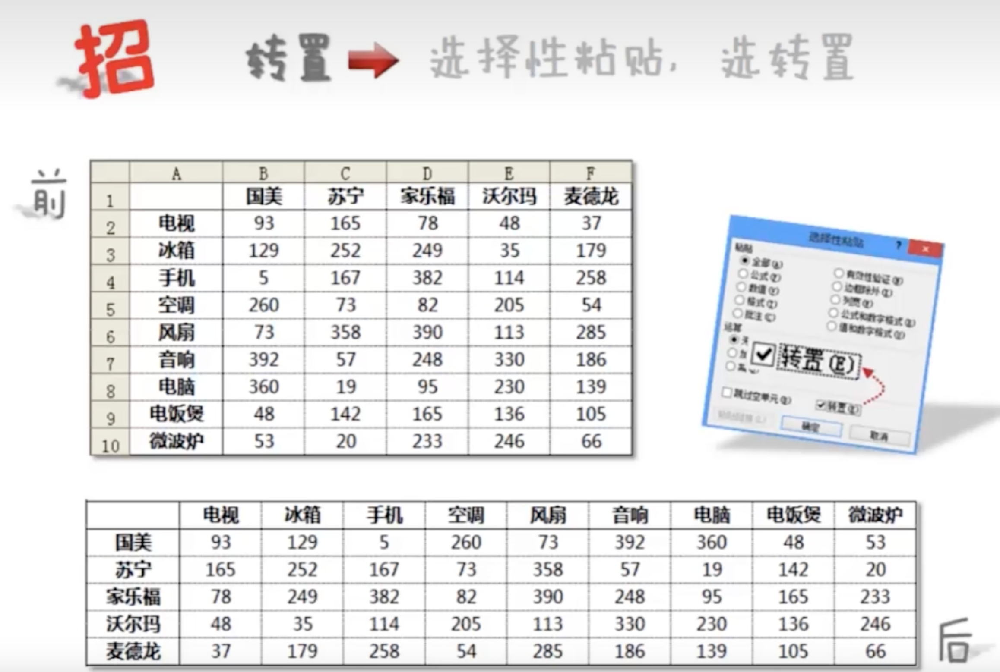

**乘80%，选择性粘贴，选运算**

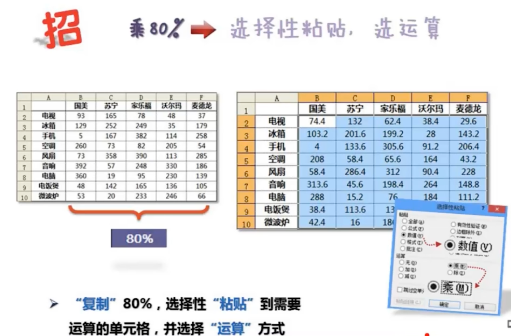

### 四宗罪：合计行破坏源表

合计行，莫用手填，excel帮你变

### 五宗罪：多表头引发问题

紧贴数据，一列一标题。不能合并（跨列，跨行）。

Excel 引导规范：同属性字段一列记录

| 技巧      | 技巧描述        |
| --------- | --------------- |
| 输入“勾”  | alt+小键盘41420 |
| Code&char | 得代码&得字符   |

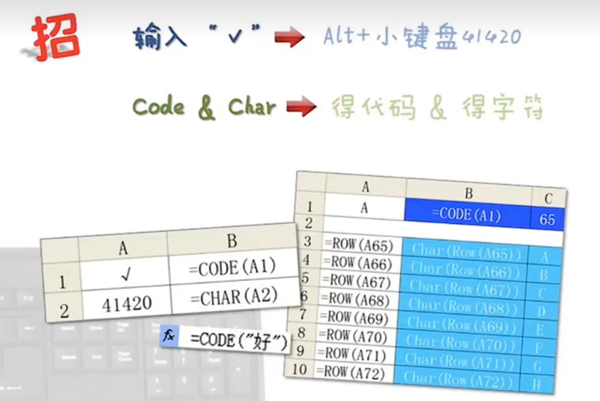

**自动更正，自动更正选项功能**

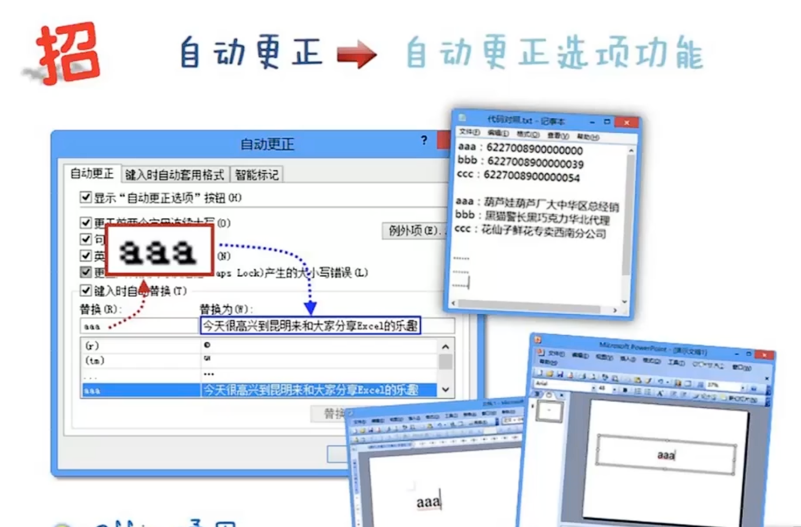

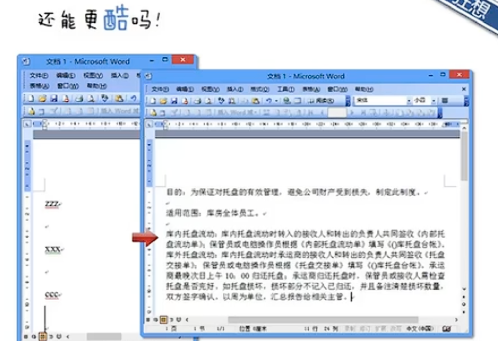

### 六宗罪：合并单元格后患无穷

排序后，会出错。

复制后，会出错。

数据打死“不合并”

**定位，F5（先选上这些空值单元格）**

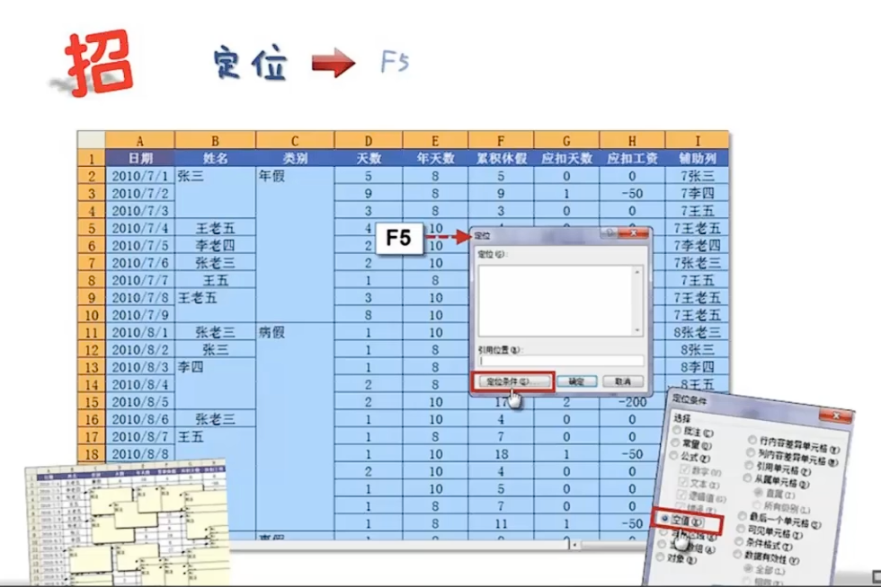

**批量录入，CTRL+Enter（先ctrl，后entter）**

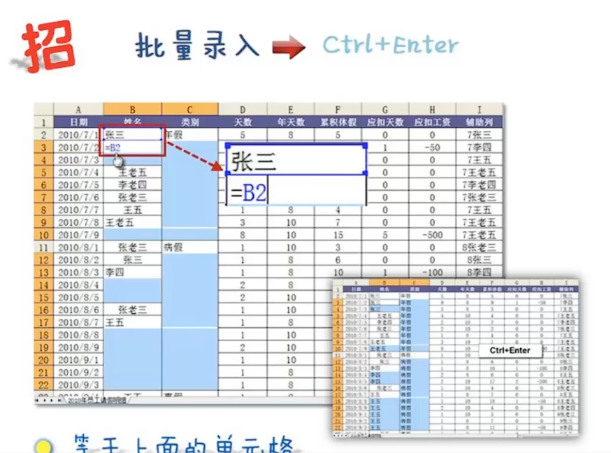

**取名字，选定区域，名称框命名**

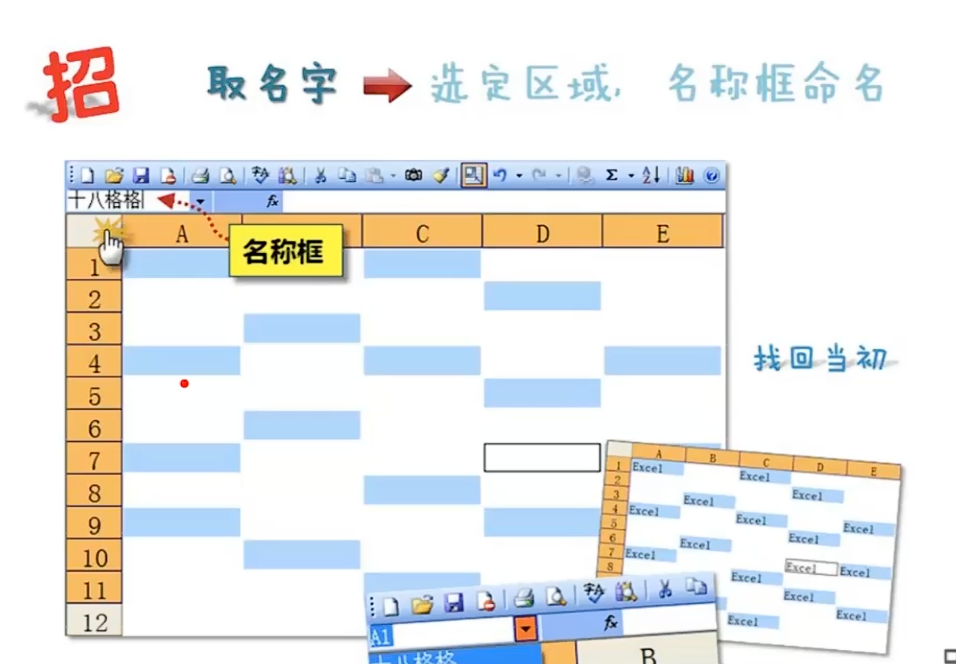

**制作工资条**

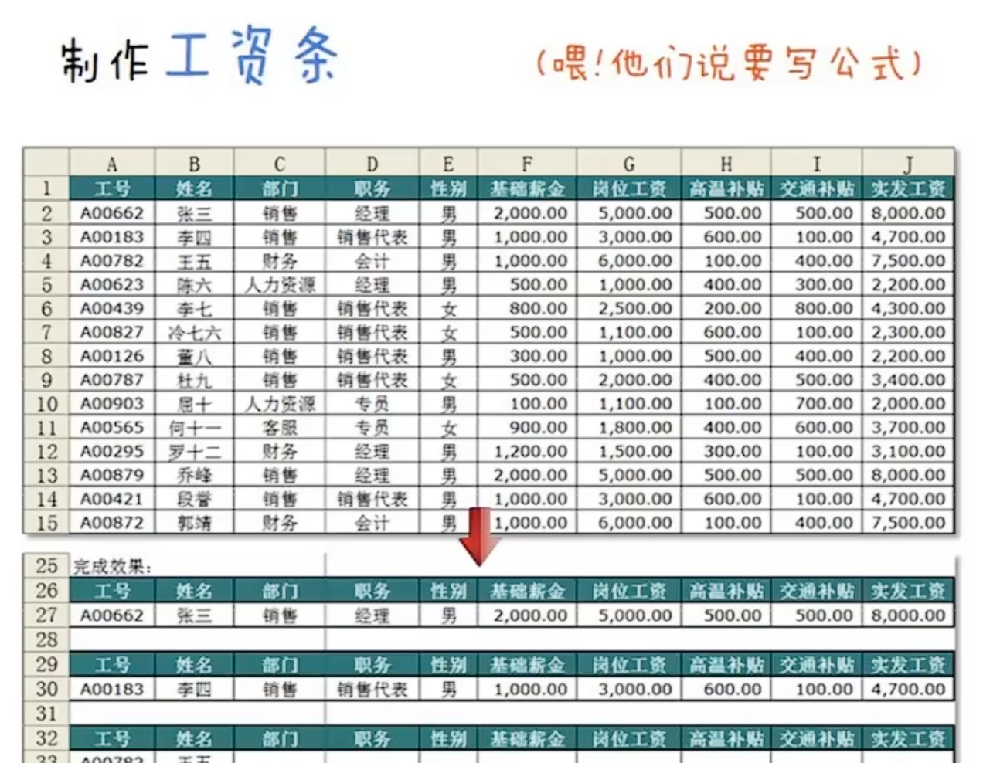

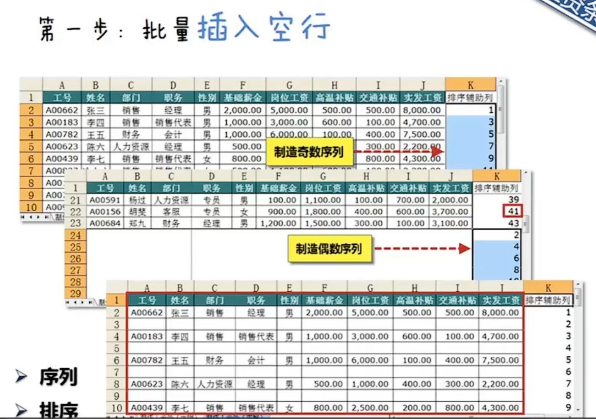

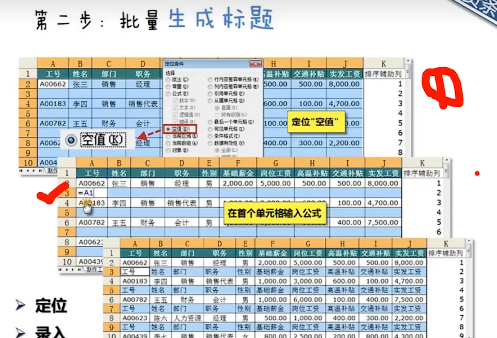

### 七宗罪：源数据缺胳膊少腿儿

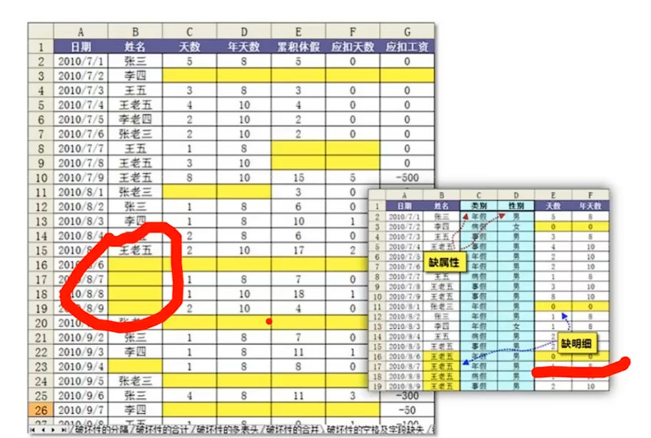

缺属性，缺明细

字段设定：分析、拓展，补全

流程解析：工作顺序、录入方式

### 八宗罪：分手容易牵手难
