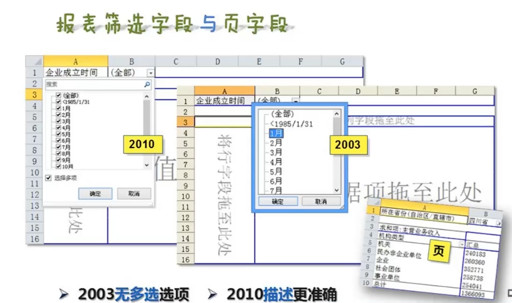
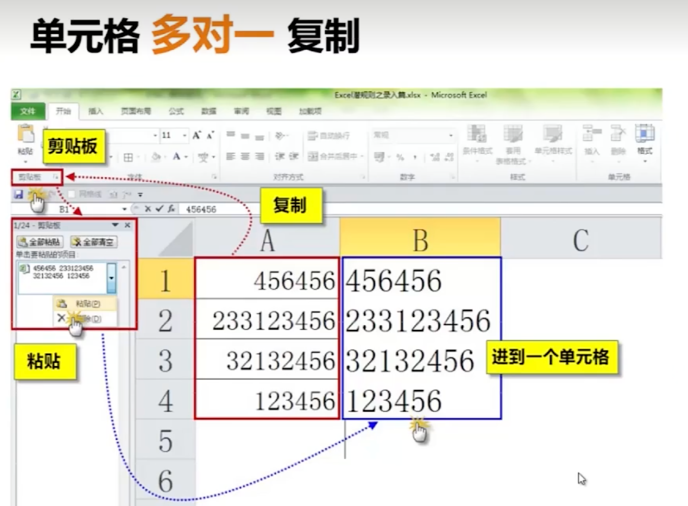
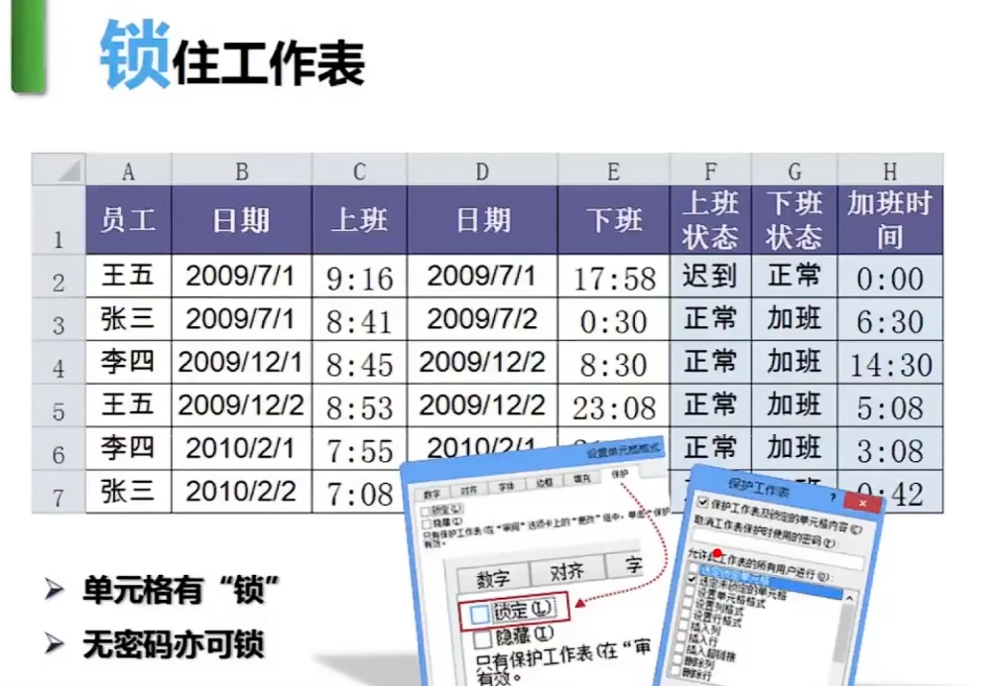

# 你早该这么玩Excel

## 十宗罪

### 一宗罪：多余的标题

   在工作簿名称上取名或者在工作表中命名。

   | 技巧 | 技巧描述 |                |
   | ---- | -------- | -------------- |
   |      | 工作簿   | 工作表         |
   | 新建 | ctrl+n   | shift+F11      |
   | 切换 | ctrl+tab | ctrl+pgdn/pgup |

### 二宗罪：字段顺序不合理

   - 时间，
   - 人物
   - 人物属性
   - 事件
   - 事件属性

   对工作的理解，对细节的把握

   顺着流程排字段

   | 技巧     | 技巧描述           |
   | -------- | ------------------ |
   | 列换位   | 选中列，shift+左键 |
   | 插入多列 | 选中多列，右键选项 |

Excel只能筛选行，不能筛选列。如果要快速删除多个空白列，则需要借助数据转置批量完成。

第一步：复制所有数据；

第二步：在待粘贴处，右键点选“选择性粘贴”，勾选“转置”并确定；

第三步：在任意列筛选“空白”并删除所有空白行；

第四步：再次使用数据“转置”完成。

**注意：**
（1）定期备份Excel文件，在非系统盘中至少要有一份备份文件，并定期更新：

（2）切忌在源数据表中做实验，另存一份临时文件，随你怎么玩。

### 三宗罪：数据摆放不连续（用空列割开）

上下左右的数据“全挨着”

| 技巧     | 技巧描述                 |
| -------- | ------------------------ |
| 删除多列 | 定位空值（F5），删除整列 |

**转置，选择性粘贴，选转置。**

**乘80%，选择性粘贴，选运算**

### 四宗罪：合计行破坏源表

合计行，莫用手填，excel帮你变

### 五宗罪：多表头引发问题

紧贴数据，一列一标题。不能合并（跨列，跨行）。

Excel 引导规范：同属性字段一列记录

| 技巧      | 技巧描述        |
| --------- | --------------- |
| 输入“勾”  | alt+小键盘41420 |
| Code&char | 得代码&得字符   |

**自动更正，自动更正选项功能**

### 六宗罪：合并单元格后患无穷

排序后，会出错。

复制后，会出错。

数据打死“不合并”

合并单元格严重破坏了数据结构。

**定位，F5（先选上这些空值单元格）**

**批量录入，CTRL+Enter（先ctrl，后entter）**

**取名字，选定区域，名称框命名**

**制作工资条**

### 七宗罪：源数据缺胳膊少腿儿

缺属性，缺明细

字段设定：分析、拓展，补全

流程解析：工作顺序、录入方式

### 八宗罪：分手容易牵手难

源数据累积在“一张表”

源表使用小贴士“备份”，“另存为”

剪贴板多表归一

切换与复制(复制)

### 九宗罪：Excel错当word用

摘要 or 字段

切开单元格

分列，数据->分列

合并

### 十宗罪：分类汇总变成手工活儿

照相机，选择->拍照->洗照片

## 数据透视表

手工->公式->透视表

透视表，简单，快捷，准确，不怕错

### 数据透视表是做数据分析的。

调用透视表:

`alt+d` -> Pivot table

### 汇总表“躺着”不如“站着”

104万行高，1万行宽高个子，可不是矮胖子。

站着更好。

### 双击显示数据名细

“点”哪儿，“看”哪儿

### 手动与自动刷新数据

手动

自动

### 新增的数据能被自动添加吗？

### 数据透视表一个生多个

复制->粘贴、字段单独设置。

### 小心数据泄露

### 汇总数排排站

### 更新时锁定列宽

### 计数、差异及差异百分比

### 占行/列/总和百分比与父级

可以统计各月的份额

### 重复所有项目的标签

设计->报表布局->重复所有项目标签

### 差异

比上个月多/少了多少

### 日期字段变化多端（组合）

####  年、月、日、季度

#### 41495与日期快捷键

#### 哪一年成立的公司最赚钱；

#### 不同年不同季度的营业状态

#### 截止2000/1/1的营业收入总和

起止于，前面的勾不要勾选择。

#### 日期不能分组的由来：日期错误

#### 不能分组的由来：空格

#### 表格（列表）

#### 组合也可以是数字

#### 按收入分级（组合）

分组，按步长设置。统计

### 将一个透视表拆成多个

分手容易牵手难

1、一个产品一页，错误做法。2、入库，出库分成两个字段也是错误做法。3、一面一页也是错误做法。

报表筛选段与页字段

### 在透视表中调用自动筛选

透视表不能筛选，在汇总的隔壁就能筛选。

### 源数据二维变一维

转换后的操作与效果

### 复杂数据结构的二维变一维

## 图表

### 经营决策

1、提高B产品的宣传；2、重点发展  A产品；3、砍掉产品B

普通的图表，数据区域以及图表是“固定”的。

### 数据透视图

会动的数据透视图。

1. 先做透视表
2. 后做透视图
3. 图可随心变
4. 图与表联动

贴贴为“图片”或“”链接

断开与透视表的连接

正负图让对比更清晰

使用切片器的产品销售报表

选产品，得结果

## 录入

### .xls和.xlsx格式区别

插入的空白行是从哪来的？插入一行，是最后一行滚动上去的。

### 单元格很“挑食”

数和量分列记录；“约”在标题栏

地址，要分开写。后续才好分析。

正确的做法

- 爱词不爱句
- 同属性一列记录
- 不同属性分列记录
- 一列数据一种属性

### 向左走，向右走

默认靠左是文本；

默认靠右是数字；

### 眼见为“虚”

- “;;;”隐藏

- “@”
- “#”
- “特殊”

### 怎样才能“虚”为实？

把excel内容贴粘到world里，再把内容贴回excel。

### 单元格多对一复制

### 日期为什么变数字

### 录入序列

### Excel 有把好记性

### 批量录入

ctrl+enter

## 数据处理

### 查找与替换

可以按格式查找。

### 排序

True、false、文本、Z～A….1、0、1、-1…

### 增加一列（辅助）排序，后面更好还原

### 筛选后“巧复制”

### 同行，同列，不同。复制

同行与同列可以复制。不同行不同列不能复制。

### 剪切

一拖一放公式变成值

### 神秘的换行符

可以把换行符换成空。（alt+10）换行符

### 单元格好聚好散

### 汇总表一键批量求和

### 色即是空，空才是空

B1单元格什么没填值是空。C1是字符串。D1是0

Isblank:判断是不是空

Isnumber:判断是不是数据

Len:算单元格有几个字符

tab选函数，ctrl+a调用参数面板

### 不同寻常的True和False

TRUE+FALSE=1

a4+a5=1

### if判断句

### 锁定工作表

单元格设置，ctrl+1，切换到保护。可以锁定

## 函数

### 公式与函数

一个公式可以包含多个函数。

### 公式主要用途

#### 计算

#### 判断

#### 转换

### 怎么学，学什么

### 嵌套

### 制作不复复的随机数

### F9

### sumif

### sumif多条件求和制作多条件

### sumif 求进出金额

### sumif动态引用

