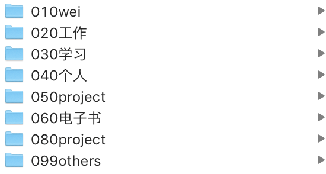
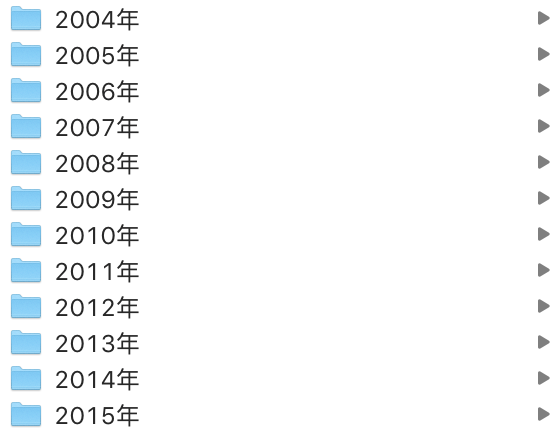

# 文件管理技巧

## TIP1：工作和生活文件夹

对于很多人来说，最简单的就是创建一个工作文件夹和一个生活文件夹，分别用来保存工作资料和生活信息，方便查找。文件夹类别不要过多，也不宜太细（查询打开都很不易）。

## TIP2：文件夹名中添加一个三位数字

当你分配一个文件夹名称从零开始的文件夹名称，如“010”或“020” **三位数字** 添加到文件夹名称前，效率是大大的提高。

为什么是三位数而不是两位数呢？

在分配号码时，推荐三位数“010”而不是“01”。这是因为可以让添加新文件夹时更容易编辑。

如果上面的例子，如果你想添加一个名为“生活”的文件在“工作”下方，也就是“03”和“04”的新文件夹按数字顺序下降所有文件夹名称数字每个都需要改。

但是如果您使用3位数管理名称，则只需对新文件名修改为“021生活”即可，序号还是升序排列。

**另外可以建一个名为`099-others`文件夹用于存储临时文件。**用于远离主要文件夹。

## TIP3：减少折叠文件夹的数量

文件夹里文件夹数量一些问题，如果文件夹内有10〜20个文件夹或更多的文件夹时，不友好，也不好管理。

在这种情况下，我们可以创建一个名为“-OLD”的文件夹存储旧文件低使用率的文件夹

另外常用的文件可以在文件夹名前面加一个 **`★`**。这样更容易看到**最常用的文件夹**

## TIP4：在侧栏创建快捷方式

- 在windows和MAC上都可以创建快捷方式，可以快速访问文件夹，提高效率。windows10的快速访问栏可以方便的查看查看最常用的文件夹和文件，提高使用和工作效率，如果想把其他的文件夹加到快速访问列表。找到一个想加入到快速访问列表的文件夹，并点击右键。从文件夹右键菜单中选择固定到“快速访问”，在文件资源管理器点击“快速访问”，文件夹加入到了快速访问列表，和右边的常用文件夹列表，并且有小别针的图标。
- 在MAC上，您只需将文件夹移动（拖动）到侧边栏即可。

## TIP5：使用笔记工具存储文档

所有的知识点都记录在印象笔记、有道云笔记或为知笔记等。
所有的有价值比较重要的文件、比较大的文件最后都会放到云盘中。

## TIP6：文件名命名

- 文件夹命名
**序号-文件夹名称-开始日期-结束日期**
例：010-XXXX项目-20190910-20191011
**项目**、**非项目**
项目文件夹需要建文件夹，非项目文件是不需要文件夹单独一个文件

- 文件名命名
**序号-项目名称-文件名-版本号-日期.文件后缀**
例：010-XXXX项目-产品定义-v1.0-20190910.pdf

|修订日期|公司名（简称）|项目名|版本号|
|---|---|---|---|
|20181118|佳诚|海报设计|v1.0|

每个类别之前用 `-`分隔开。
例：`20181118-佳诚-海报设计-v1.0.psd`

命名规则为：`人物-事件-地点-时间-描述-序列号`。

    * 人物：就是文件的所属人或描述的主体。
    * 事件：就是文件主体名称，描述文件是什么或者文件记录的是什么。
    * 地点：文件创建的地点或者描述的地点。
    * 时间：文件创建的时间或者描述的时间。
    * 描述：对文件内容的附加描述。
    * 序列号：版本号、序号。

以一个PSD为例，命名里面包含了客户名，项目名，项目类型和版本号：

而图片和故事板也采用了类似的方式，在项目类型后面还加上了素材和资源的类型：

## TIP7：重复项目

- 有规率重复的项目如`月刊`文件名可以按`201503`、`201504`、`201505`分类；
- 另外如旅行`照片`没有规律也可以使用地点分类`201203北京`、`201604厦门`、`201808福州`。另外也可以使用人物分类`201203小强`、`201604小王`、`201808小张`

## TIP8：充分利用搜索

- 如果是MAC电脑，安装了Alfred，只要输入 find 或 open 命令，以及待搜索的文件或目录名，列出磁盘中的相关文件，可以快速定位“访达“，相当快捷简单。也可使用系统自带的“聚焦搜索”也很方便。
- 如果是Windows电脑一定要安装Everything，搜索文件特别快比windows电脑系统自带的快很多。

## 文件命名原则

### 命名原则

> 文件命名的原则有三点：
>
> 一是方便我们阅读，我们可以直接从文件名中获得该文件是什么的有效信息。
>
> 二是方便软件进行分词检索，让 Alfred、Everything能更好地搜索到我们的文件。
>
> 最后一点，不能太麻烦，有多少人能坚持做那些明知道正确但非常麻烦的事呢！

### 命名规则

完整的文件名格式是这样的：

`前缀(大分类)?_标题_文件属性(小分类)?_日期(版本?)&备注?.ext`

假设我们给有点东西有限公司出一个项目建设方案，那我们可以将文件进行如下命名：

`有点东西_东雪西送工程_建设方案_20221110(v1).doc`

咋一看确实有点复杂，让我们来拆解一下！

1. 首先是前缀：可选项，我们可以放某某公司、某某部门等，功能是对文件进行一个大的分类

2. 然后是标题：必填项，对文件内容进行说明，例如是东雪西送工程建设方案。

3. 文件属性：可选项，如果这个东雪西送工程不只有建设方案，还有推进计划，我们就可以利用这个字段进行小分类，例如：有点东西_东雪西送工程_推进计划.doc

4. 然后是日期：必填项，当我们不记得文件名只对日期有一丢丢模糊的印象时，可以使用日期时间戳来缩小文件范围，不至于满磁盘乱翻。

5. 版本：可选项，如果你经常被要求改方案，当你改到第十版的时候，老板说，还是第一版更好一点，你就懂得版本控制的好处了。

6. 备注：可选项，用于对文件内容进行补充，大部分场景下，上面几个字段已经足够用了，我自己很少用到备注项。

7. 最后说明一下连接符：除了备注使用`&`符连接之外，其余字段均使用`下横线`进行连接，方便我们阅读。

- 软件派
Clover
Qttab
Fences

- 搜索派
Everything

- 体系派
分类

- 表格派

文件管理目标
1.快速访问
2.分类管理

问题点：
分类太多
路径太长
