# 字体设计

## 字体类型

甲骨文、篆体、隶书、
楷体、行书、草书、宋体、
黑体、圆体

## 比例

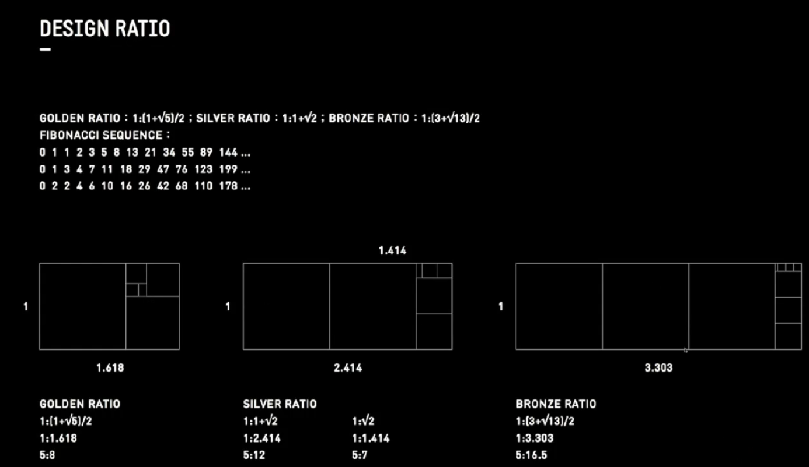

## 构成

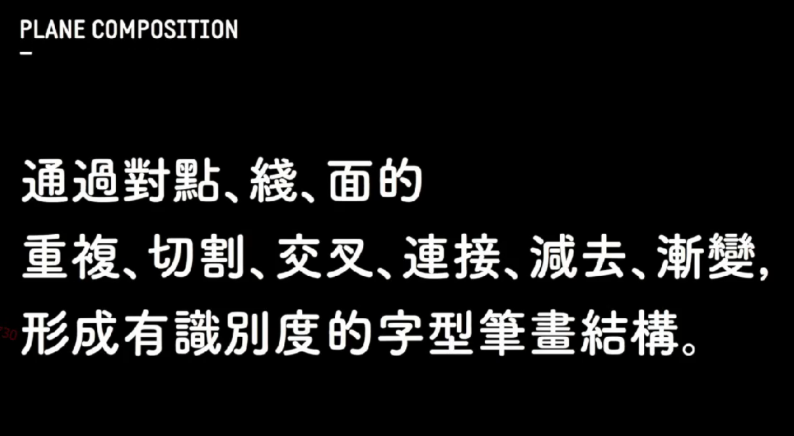

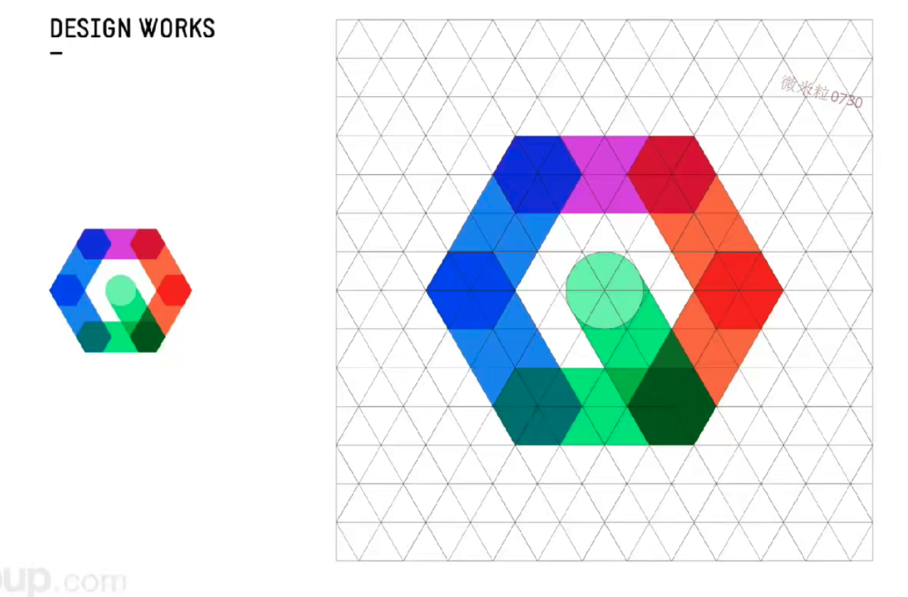

## 常识

## 西文书写（哥特体）

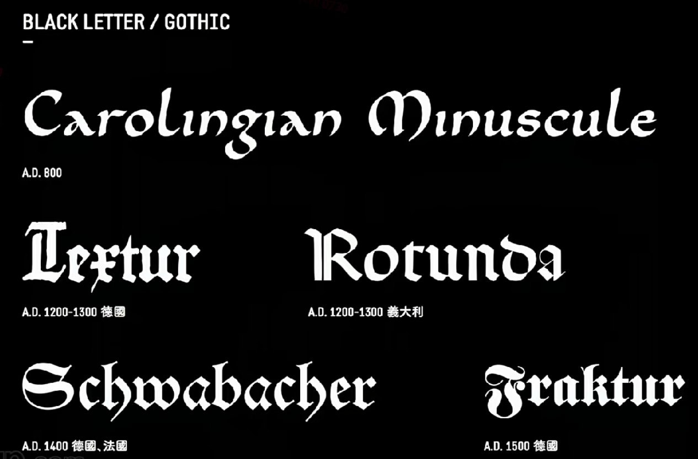

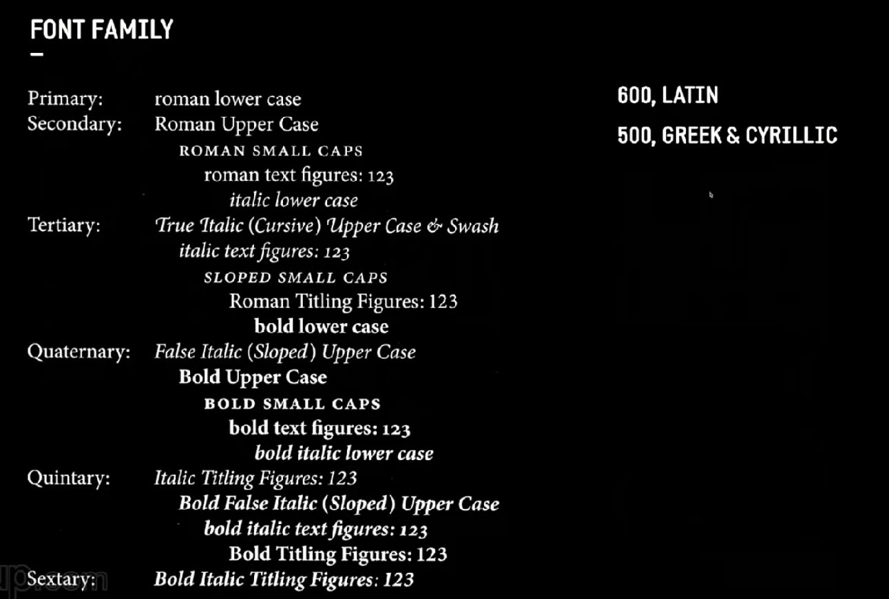

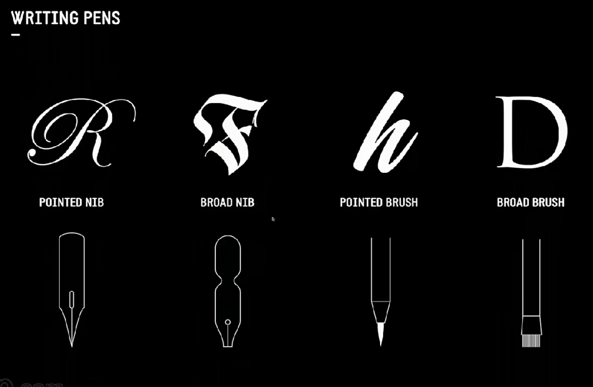

### 中文书写

骨骼线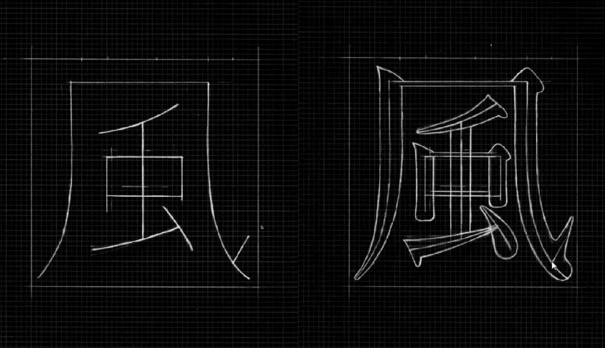

### 仿型、成型、破型

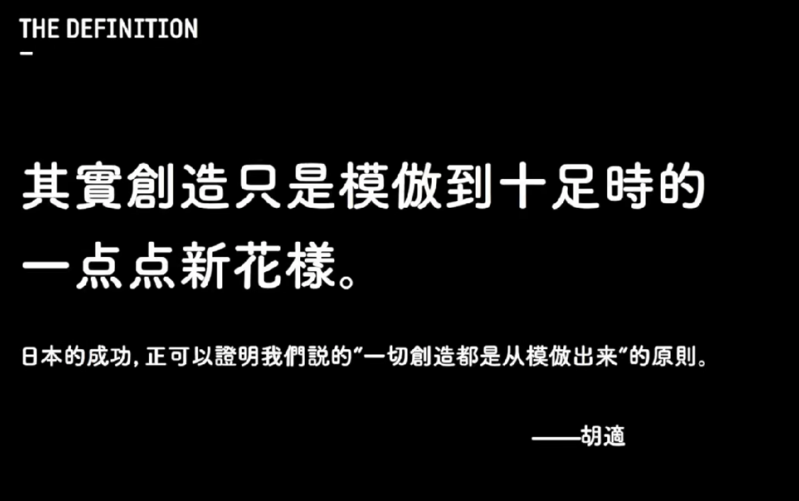

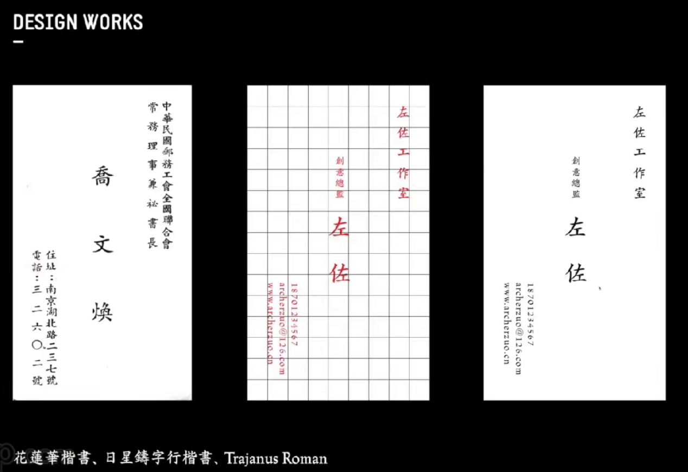

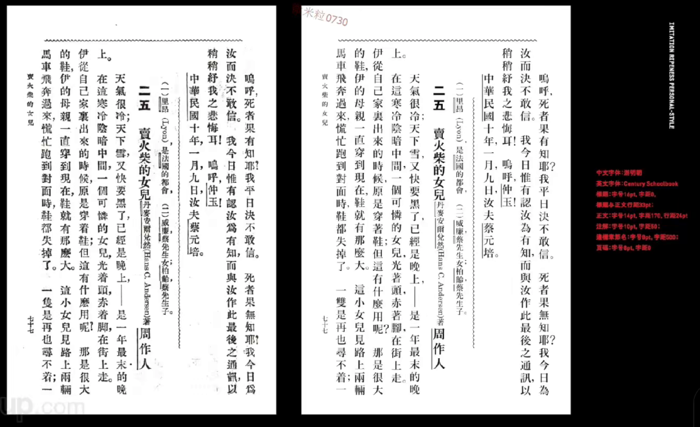

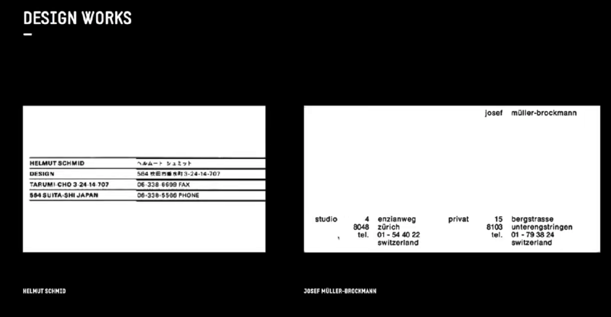

## 字体演变

甲骨文 -> 小纂 -> 隶书 -> 草书 -> 行书 -> 楷体

楷书 -> 欧、颜、柳、赵四大楷书（欧阳询、颜真卿、柳公权、赵孟頫）
