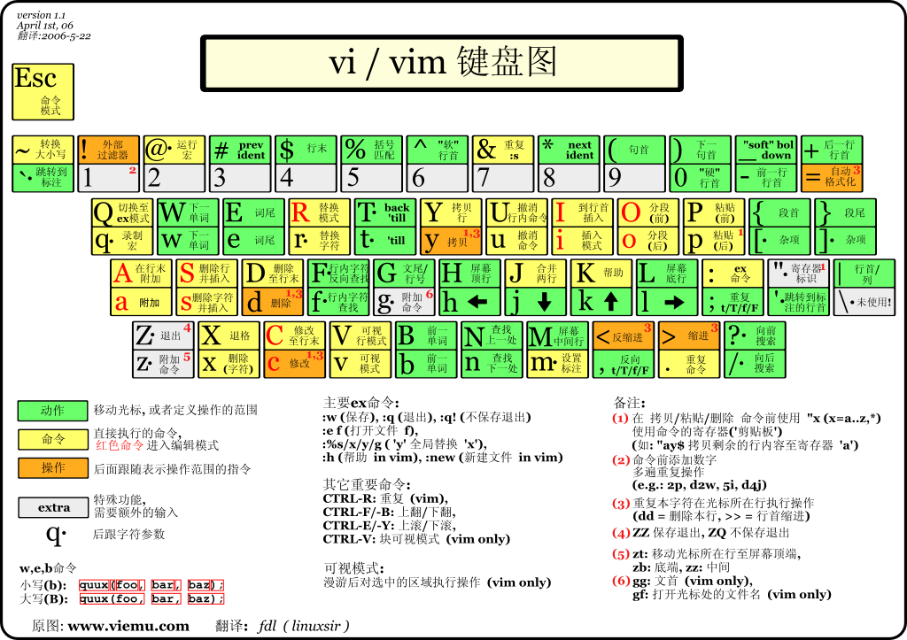

# Linux 学习

## 在Linux 世界里，一切皆文件


`/bin` 最经常使用的命令

`/sbin` 系统管理员管理程序

`/home` 普通用户主目录

`/root` 超级管理权限

`/lib` 动态连接共享库

`/lost+found`

`/etc` 配置文件

`usr` 用户安装的程序

`boot` 启动linux核心文件

`/proc` 虚拟目录

`/src`

`/sys`

`/tmy`

`/dev` 设置管理器

`/mnt` 挂载

`/media` 识别一些设备

`/opt` 安装软件存放的目录

`/usr/local`

`/var`

## 远程登录

1. 远程Xshell
2. 文件-xftp

## vi和vim

vi 文本编辑器

vim 具有程序编辑的能力

三种模式

1. 正常模式
2. 插入模式
    `i/I/o/O/a/A/r/R` 按下全面这些键可以进入编辑模式。（一般是i）

    按`esc`,再输入`：`进入命令行模式

    `：wq`保存并退出

    `q!`强制退出，不保存

    `q`退出

3. 命令行模式





## 关机&重启命令

`shutdown -h now` 立刻进行关机

`shutdown -h 1` “hello,1分钟后会关机了”

`shutdown -r now` 现在重启动计算机

`halt` 关机

`reboot` 现在重新启动计算机

`sync` 把内存的数据同步到磁盘

## 登录注销

`logout`注销


## 用户管理

### 创建用户名

```shell
useradd jack
```

创建了一个jack的用户(“jack”是用户名)

> 1. 当创建用户成功后，会自动创建和用户名的家目录。
> 2. 也可以通过useradd -d 指定目录（新的用户名，给新创建的用户指定家目录）

```shell
useradd -d /home/test king
```

### 设置密码

```shell
passwd jack #为jack用户设置密码
```

jack指的是用名，为jack用户设置密码。

> 注意一定要输入用户名不然为root 设置密码

### 删除用户

```shell
userdel jack #会保留家目录
userdel -r jack #删除用户及用户主目录
```

jack 是用户名；（会保留家目录）

建议保留用户名、如果你不知道要不要删除，建议保留。

## 查看用户信息

```shell
id jack #jack是用户名
```

## 切换用户

```shell
su - jack #jack是用户名
```

> 1. 从权限高的用户切换到权限低的用户，不需要输入密码，反之需要。
> 2. 当需要返因到原来用户时，使用exit/logout指令。

## 查看当前用户信息

```shell
who am i #查看当前用户信息（登录用户）
```

## 用户组（权限）

## 运行级别

`0、1、2、3、4、5、6`(0是关机，1是单用户，2多用户，3多用户，4系统未使用保留给用户，5图形界面，6系统重启。常用3、5)

```shell
init [0123456]

systemctl get-default #查看当前运行级别

systemctl set-get-default TARGET.target
```

## 找回root密封

## 帮助指令

```shell
man ls  #ls可以是命令或配置文件

ls -a #会显示隐藏文件（.开头的文件是隐藏文件）

ls -l #单列显示

ls -al #可以组合使用，字母先后没有关系

help ls #ls可以是命令

```

## 文件目录类

```shell
pwd  #显示当前工作目录的绝对路径

ls -a #会显示隐藏文件（.开头的文件是隐藏文件）

ls -l #单列显示

ls -al #可以组合使用，字母先后没有关系

cd abc # 切换到指的abc目录

cd ~ #回到自己家目录

cd .. #回到当目录的上一级目录

mkdir abc #创建了一个abc的目录

mkdir abc/a1 -p #在创建了一个abc目录，在ABC目录下创建了a1目录。-p(创建多级目录)

rmdir abc #删除abc的空目录（删除的是空目录，如果目录下有内容时无法删除）

rm -rf abc #删除非空目录,需谨慎删除。

touch test.md #建了一个文件为test.md的空文件

```
