# Offfice 技巧

## 你知道超级表吗？Excel中的“超级英雄”

工作中，我们总免不了用 Excel **制作表格——整理数据——美化表格。**

一般来说，我们刚刚整理完数据以后，表格大致是这个亚子的：

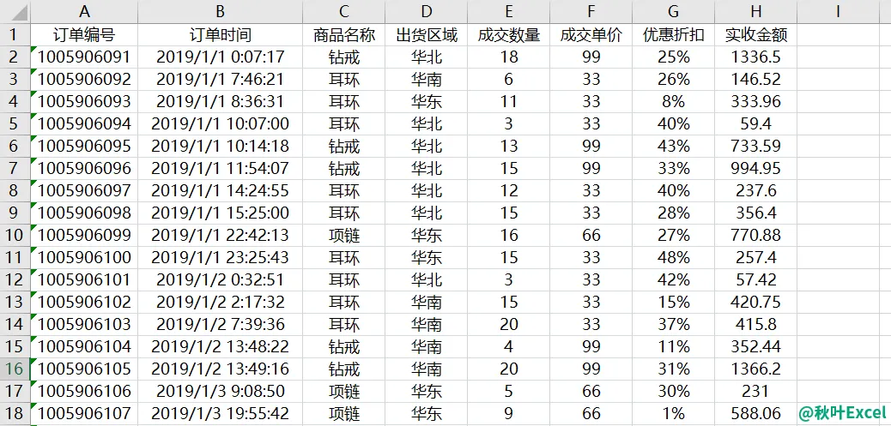

不用我说，大家也都知道，这样的表格没有进行任何美化加工，肯定要被扣🍗啦~

如果你学过一点 Excel，那一定会想到，利用【Ctrl+T】将表格转化为「超级表」，就可以快速美化数据。喏，就是下图这样：

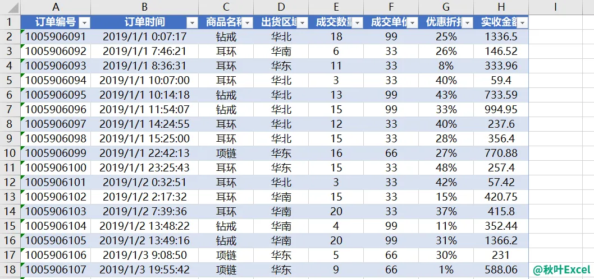

转化为超级表后，数据不仅变得**更加美观，并且便于查看，不宜错行。**

但超级表的功能远不止如此，小安这就来带大家学习一下它的 9 大功能！


### **自动填充公式**

在超级表中输入公式，会自动填充一列，省去了下拉填充的步骤（也可以撤销这个填充操作）。

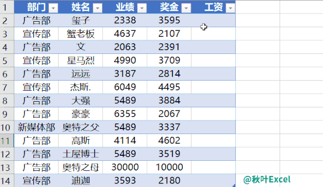


### **自动更新序号**

在 A2 单元格输入公式：

```html
=ROW()-1
```

公式自动填充到超级表最后一行，生成从 1 开始的序号；并且添加行、删除行后，序号均可自动更新。

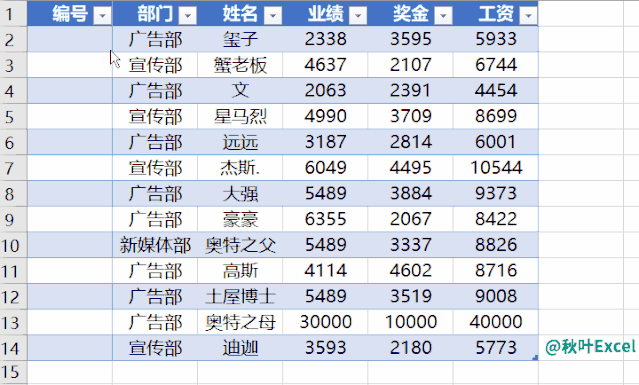

当然，如果不套用超级表，直接使用 ROW 函数，插入新行序号也是可以更新的。

区别在于，**超级表插入的新行会自动编号，而普通表格插入的新行则不会自动产生序号。**

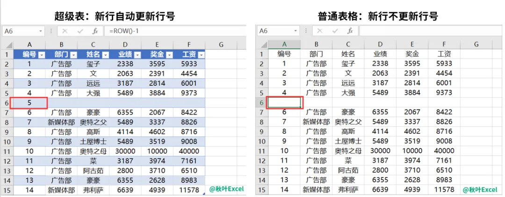


### 显示标题行

转化为超级表后，向下滚动查看数据，标题行会始终显示在「列标签」上，尤其是有很多行数据时，我们查看数据就非常方便啦！

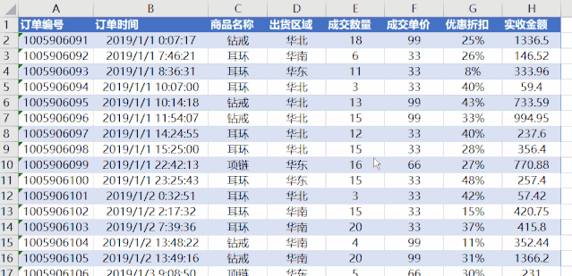

想想看，这个是不是和冻结窗格很类似呢？但是，它是自动的哦~


### 自动扩展数据区域

如果我们在超级表最后一行继续录入数据，录入的新数据会自动套入超级表中，

这个功能，也为**数据透视表及图表的联动变化**奠定了基础。

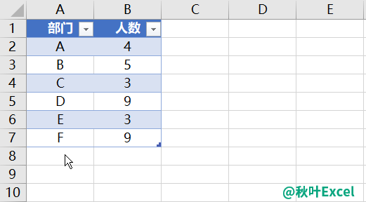

PS：联动变化，就是在超级表中录入新数据时，数据透视表和图表也会自动将新数据汇总进来。


### 联动数据透视表

新数据录入后，会自动套入超级表格式，基于此，再插入数据透视表。

这样数据透视表也就拥有了联动更新的功能，**即刷新数据透视表后，新数据自动录入数据透视表中。**

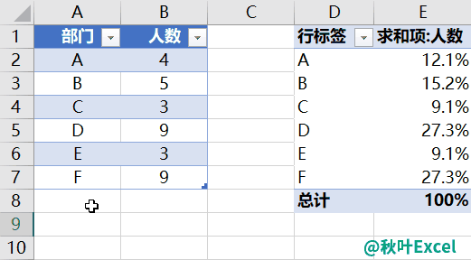


### 联动图表

除了数据透视表可以联动更新以外，图表也是一样的道理！

在表格中录入新数据，图表会自动更新：

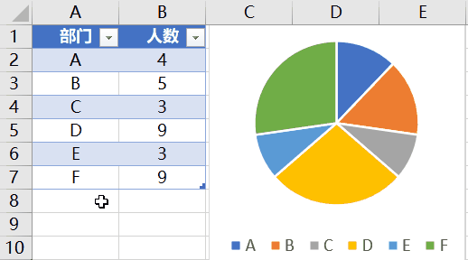


### 自带筛选功能

转化为超级表后，数据区域会自动生成筛选按钮，可以直接筛选数据。

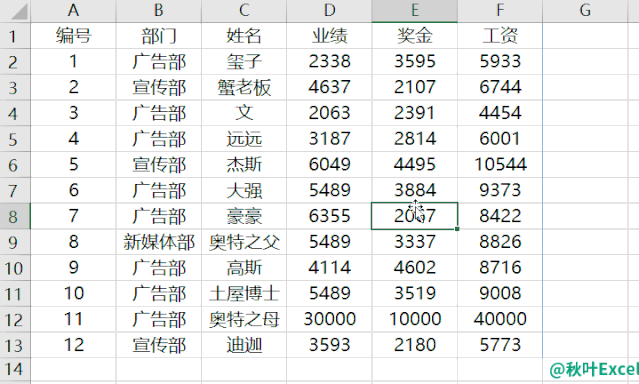

如果想关闭筛选功能，可以使用快捷键【Ctrl+Shift+L】。


### 切片器快速筛选

我们都知道，切片器可以用在图表或者数据透视表中，方便我们展示数据；

但是在 Office 2010 以上版本，切片器也会对超级表生效，可以**实现快速筛选！**

首先我们按照部门插入切片器：【插入】——【切片器】——「部门」；

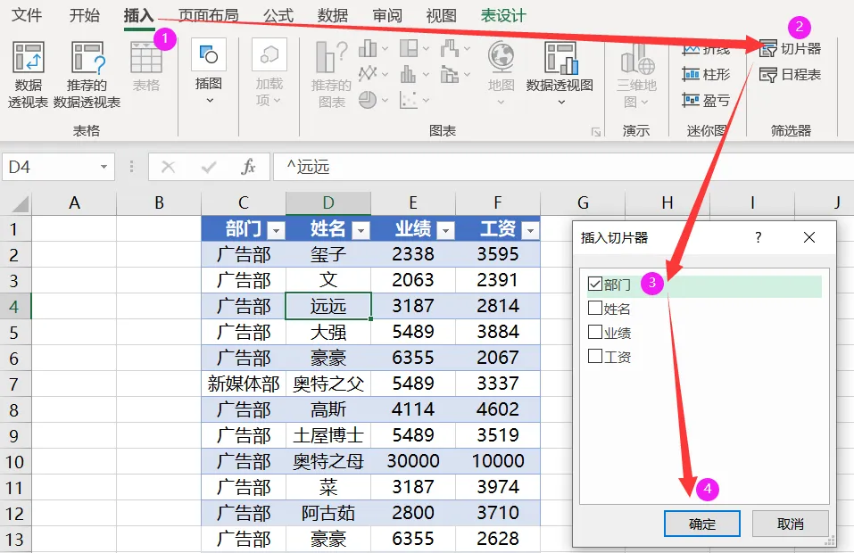

点击切片内的选项可以看到，超级表会根据切片的选项，筛选出相应的内容，如下图：

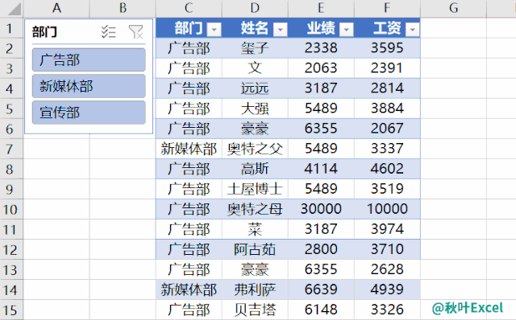

这种筛选方式看起来是不是更加高大上呢~


### 多种汇总方式

将表格转化为超级表后，将光标定位在表格内，可以看到上方多出了【表设计】选项卡；

勾选「汇总行」即可在原数据下方出现汇总行，如下图：

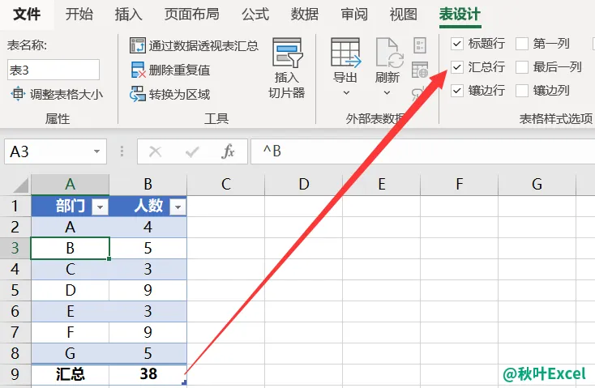

这里的汇总方式，可以随意选择：

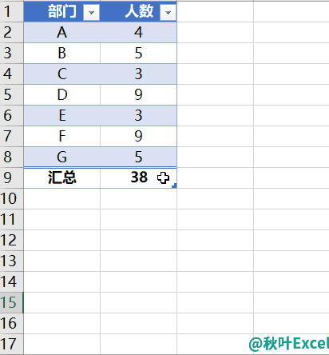

当然，这个汇总方式是用函数计算的，我们可以在编辑栏看到，这是 SUBTOTAL 函数；

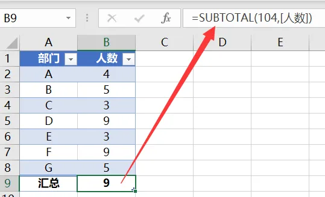

因此汇总行，仅仅对可见单元格数据进行汇总，配合筛选使用非常方便哦~

好了，对于超级表的介绍就到这啦里，如果文章对你有所帮助，记得分享给更多的人哦~

💬

【Ctrl+T】可以将表格转化为「超级表」，那你知道如何将超级表转化为普通表格吗？在留言区告诉大家吧！

## 两个表格快速核对，Excel数据透视表轻松搞定

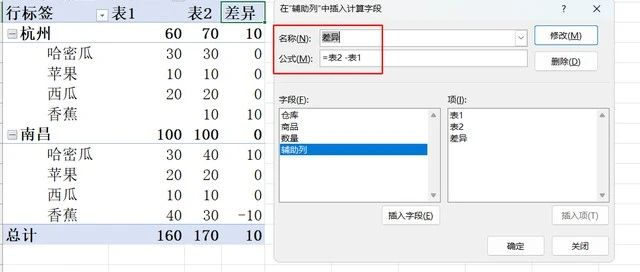

举个工作中的例子，我们有两个表格，里面都列出了各区域，各商品的销售数量

我们想快速核对这两个表格之间的差异在哪里

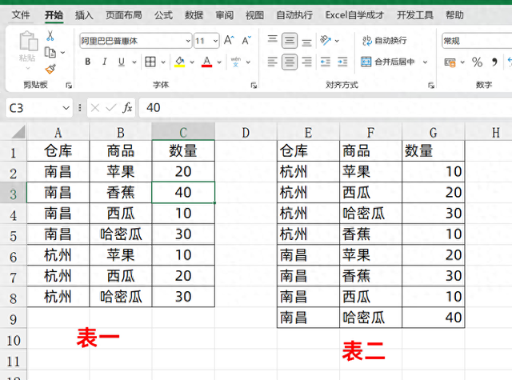

表一和表二之间的数据顺序是不一样的

而且表一和表二之间项目有多有少

需要快速核对差异，可以使用Excel数据透视表法，轻松搞定

### 1、添加辅助列

我们需要建立一个子表，然后建立辅助列，然后将两个表格的数据粘贴过来

同时在辅助列，对于不同的表格数据区域分别标记，表1和表2

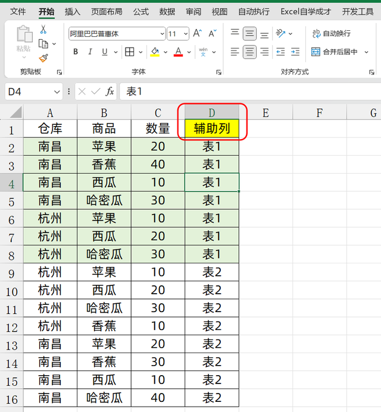

### 2、建立数据透视表

我们选中数据区域，然后在插入选项下，点击数据透视表，在弹出窗口，直接点击确定

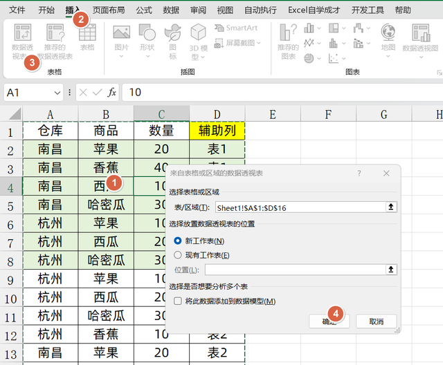

在一个新的工作表中，将仓库和商品字段放在行标签，将辅助列，放在列标签，将数量放在值里面，然后会得到如下的数据透视表

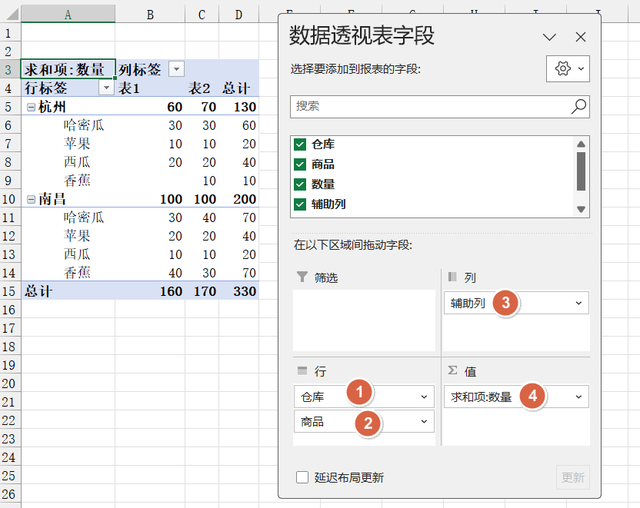

这里面竖向的总计是不需要的，我们可以进行取消，在设计，里面点击总计，仅对列启用，如下所示

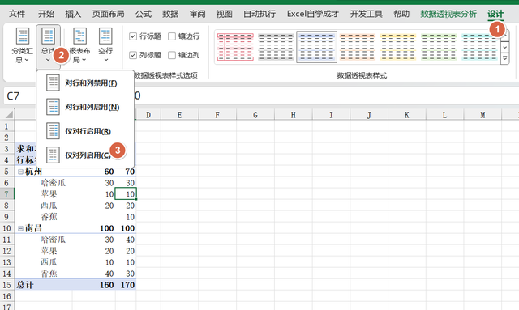

### 3、找出差异

有两种方法，第一种方法，直接用减号进行运算，我们输入的公式是：

=C5-B5

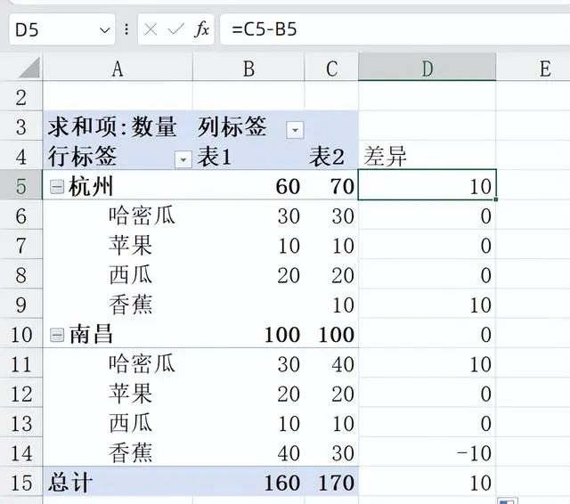

其实上面方法已经可以达到效果，但是还可以尝试用一种更高级的方法来进行计算

我们可以点击透视表中的纵向标题字段

然后点击数据透视表分析，点击字段、项目和集，点击计算项

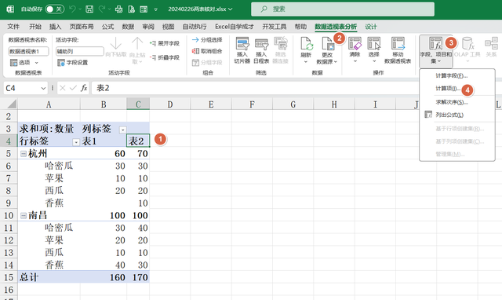

然后在计算项里面，自定义一个名称，输入公式：

=表2-表1

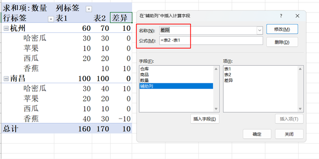

这样的好处是，让我们手动计算的这部分，也成为了数据透视表的一部分，当你添加字段时，数据不会被覆盖

## 数据录入的几个坑，你有没有被坑过？

小伙伴们好啊，今天分享一组和数据录入有关的内容，看看下面这几个坑，你有没有被坑过。

### 1、一言不合就合并

掉坑指数 ☆☆☆☆☆

在工作表中大量使用合并单元格，这样的后果是不能正常排序和筛选，也无法填充公式。

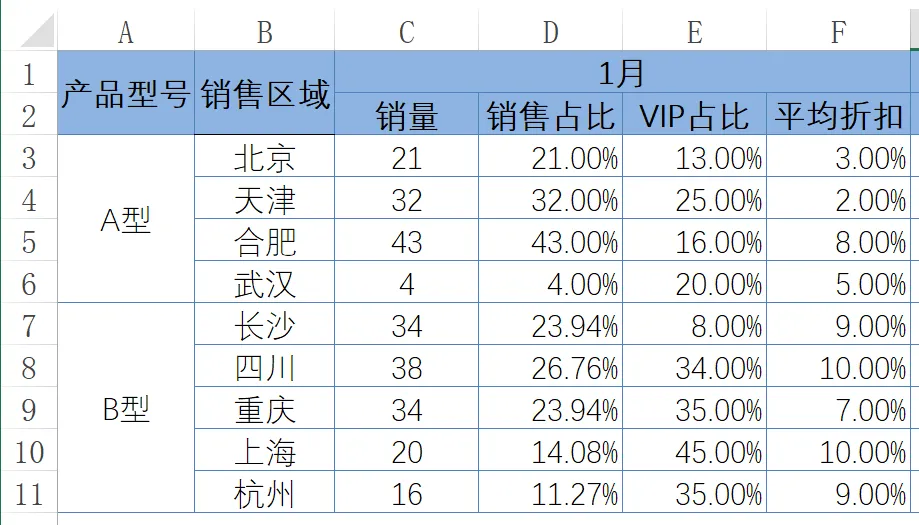

**避坑建议**：除了要直接打印或是领导有特殊要求的表格，其他表格你就规规矩矩的录入吧。

### 2、字数不够空格凑

掉坑指数 ☆☆☆☆☆

很多小伙伴习惯用空格对齐两个字的姓名，殊不知“罗燕”和“罗 燕”会被Excel识别为不同的内容，在查找或是汇总数据时，麻烦就来了。

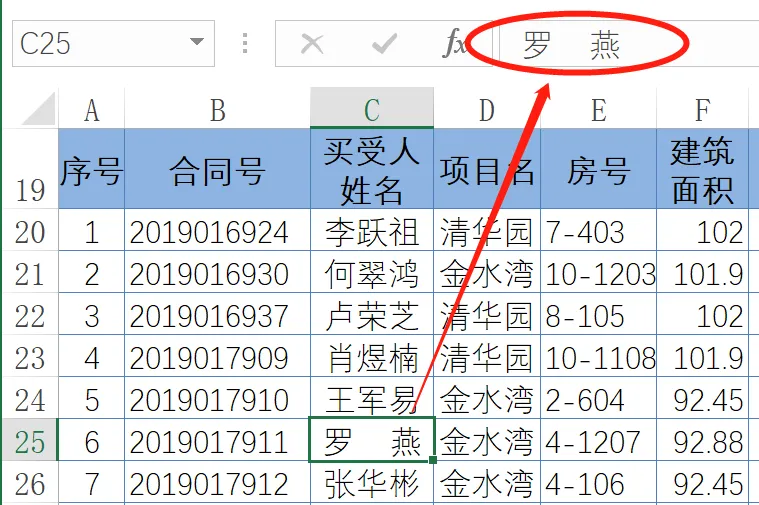

**避坑建议**：如需对两个字的姓名对齐，可以选中单元格区域，按Ctrl+1组合键打开【设置单元格格式】对话框，将水平对齐方式设置为分散对齐。

### 3、满屏都是批注点

掉坑指数☆☆☆☆

在Excel文档中使用批注，可以对需要特殊数据进行进一步的说明。但是批注的内容使用常规方法无法提取，里面的数字也无法汇总，一旦被滥用，那就是自讨苦吃了，就像下图中的批注，你要怎么汇总？

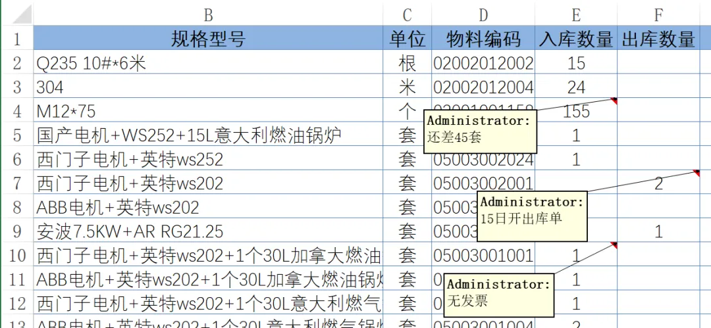

**避坑建议**：必要时可以加上一列备注来替代批注功能，这样在编辑、汇总时都会方便很多了。

### 4、填充颜色随意标

掉坑指数☆☆☆

对符合特定条件的数据使用手工标记颜色，虽然外表看着美观了，但是Excel无法按照颜色进行汇总，一旦要按指定条件汇总数据，就只能干瞪眼。时间久了，自己都不知道这些颜色表示啥意思了：

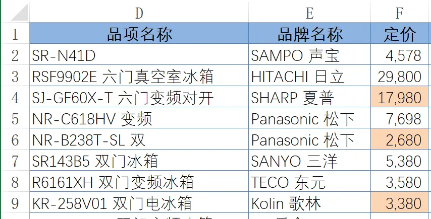

**避坑建议**：如果要对符合某种条件的数据进行标记，别忘了使用条件格式。需要汇总时，可以根据条件格式的规则来指定汇总规则。

### 5、数、量合伙不分家

掉坑指数☆☆☆

把Excel当成Word用，眉毛胡子一把抓，所有内容都放到一个单元格里，这样的数据，你怎么汇总？

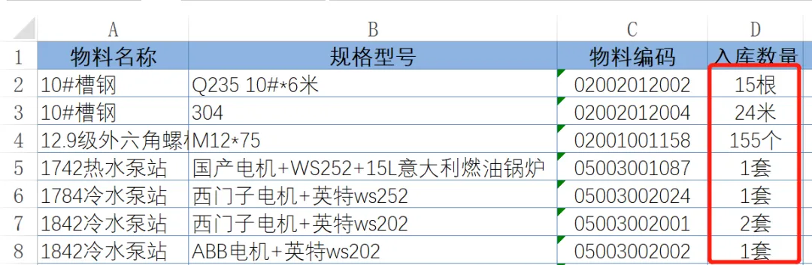

**避坑建议**：养成记流水账的习惯，同一个项目单独记录一行，每个单元格中只存放一项内容。

### 6、日期数据随意写

掉坑指数 ☆☆☆

8位数字的日期、小数点间隔的日期，想必小伙伴们都遇到过，一旦要按日期进行汇总，马上歇菜。

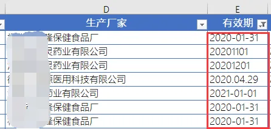

**避坑建议**：规规矩矩录入，别动花花肠子，2020/2/5或是2020-2-5都可以识别，其他的还是省省吧。

### 7、一个单位N个名

掉坑指数☆☆

同一个单位的名称各式各样，简称全称齐上阵，A1是“上海测量研究所”，到A10就成了“上测所”，到最后自己都不知道谁和谁是一家了。

以上这些是刚刚学习Excel时最常挖的一些坑，说一说，你还遇到过哪些坑呢？

好了，今天咱们的分享就是这些吧，最后留一个小问题，将任意工作表命名为“**历史记录**”，成功的小伙伴请举手。


## 38岁的VLOOKUP要光荣退休了？这个新函数好用到爆哭

**Vlookup**可以说是 Excel 使用最广泛的函数之一。

不知不觉，它已经陪我们度过了 38 个春秋，它让千千万万人免于加班脱发之苦，然鹅……

早在 2019 年，微软官方就放了个大招，发布**Xlookup** 函数，但是只有**Office 365 版本**才可以使用；不过现在下载新版 **WPS 版**，也可以免费使用 Xlookup 函数了**。**


和 Vlookup 相比，只是字母从 V 变成了 X，**功能却强大了好几倍！**


接下来，我们先了解一下「什么是 Xlookup？」，再通过 6 个常见的需求，看看 Xlookup 函数到底厉害在哪儿~

PS. 本文演示版本：WPS Office 最新版；练习文件获取方式见文末。


### 普通查找

Vlookup 我们都再熟悉不过啦，主要就是查询匹配数据。

Xlookup 的用法也是一样滴，But 它还可以看做是**Lookup 家族的合体版！！**


Lookup 家族：Vlookup、Hlookup、Lookup、Index、Match。（可见合体版有多强大……）

举个栗子！

这里我们要根据「姓名」，查询每个人的「在职状态」。

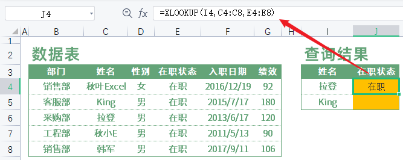

用 Xlookup 来实现，简单的很~

在 J4 单元格中输入公式：

公式是啥意思呢？解释一下：

`XLOOKUP(要查找的值,查找的区域,返回的区域)`

对应上图一起来看，是不是很好理解。

Xlookup 函数的优势就在于，**在确定要查找的区域、返回的区域时，我们可以直接选中一整列，**比如这里就选中了 C 列、E 列数据~

这样公式只需 3 个参数就搞定啦！


But 用 Vlookup，我们需要写 4 个参数……

而且！要一次性选中整个区域，再来挨个数数，看返回的区域在整个区域中排第几位……

公式如下：

`=VLOOKUP(I4,C3:E19,3,0)`

解释一下就是：

**\*=VLOOKUP(要查找的数值,查找的区域,查找返回列,查找模式)\*\*\***


这样一比较，你是不是发现 Xlookup 函数在普通查找中表现更优秀？


### 多条件查找

写到这里隔壁小 E 跑过来吐槽：

切，不就是少了一个参数，值得把 Xlookup 吹上天吗？你个喜新厌旧的坏人！


那我们再来看一个案例，还是根据「姓名」，查询「在职状态」。

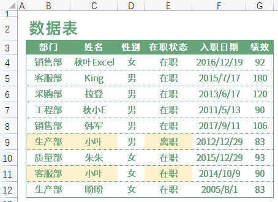

但是……眼神好的同学一定发现啦，数据中有两个同名的「小叶」，直接查找一定会出错！

所以，要**同时根据「部门」和「姓名」**，来查找在职状态~

先用 Xlookup 函数，把公式写出来给你们看：

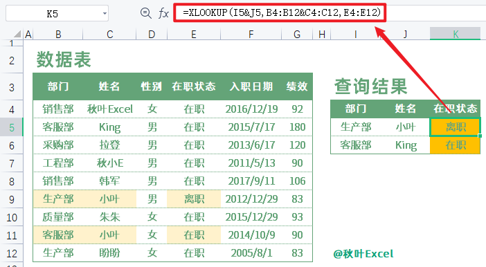

什么意思呢？思路是这样的：

❶ 把查询结果中，「部门 I 列」和「姓名 J 列」合并，一起作为「要查找的值」：

❷ 选择「查找区域」时，也把「部门 B 列」和「姓名 C 列」合并起来查找：

❸ 最后，选择「返回的区域」为：

我们会发现，Xlookup 函数居然可以直接用&符号，把列合并起来！这也太方便了吧！


但同样的思路，用 Vlookup 就复杂了……

光说这公式，我就先晕辽：

▲ 左右滑动查看

> 参数 1，用&符号，把部门和姓名合并在了一起。 参数 2，用 IF 函数，构建查找列 B4:B12&C4:C12 和返回列 E4:E12。 参数 3，返回第 2 列。 参数 4，精确查找。


参数 2 的写法，实在是看不懂啊。这里还构建了一个动态区域：

这段公式相当于构建了下面的数据：


看不明白吧？看不明白就对了！

这不就说明了，Xlookup 更好用嘛！


### 未找到值

当我们在查找一个不存在的值，表格通常会返回一个错误乱码。

这时，在 Xlookup 中，可以添加一个较为特殊的参数[未找到值]，它的作用是**在我们查找不存在的值时，能够返回指定内容**。

来看看这个案例，查询「丽丽」所在的「入职日期」。

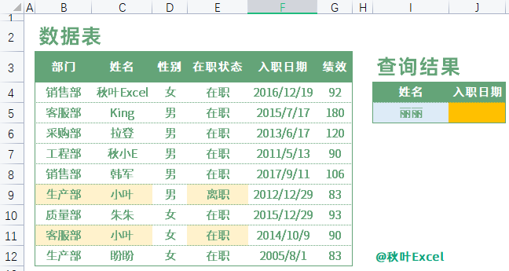

用 Xlookup 函数查询很简单，公式如下：

但是结果……是这样滴……

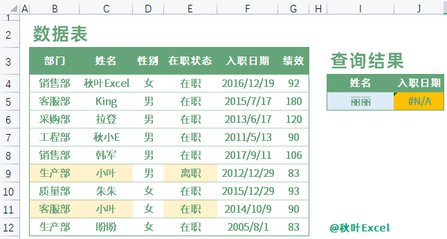

这说明公司里并没有这名员工，所以入职日期这一栏才会显示#N/A。

如果我们在[未找到值]填入一个信息，比如「查无此人」（需要用英文双引号框起来），那么单元格就会显示设定好的内容：

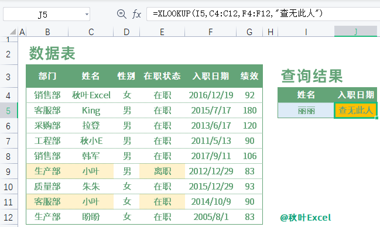

而 Vlookup，不用说，它并没有这样的功能。


### 反向查找

前面 3 个案例，相信大家已经感受到 Xlookup 的简单、好用了，但是离上天，还差点儿。

再来看这个需求，要根据「姓名」查询「部门」。

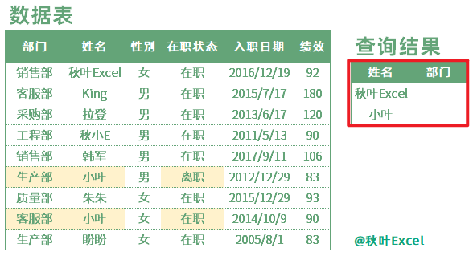

非常简单嘛，和按「姓名」查找「在职状态」没两样啊？！

fine，咱先不说 Xlookup，没有对比就没有伤害，先看 Vlookup。

用过 Vlookup 同学都知道，它有一个通病：**只能从左往右查找。**

也就是说这里需要「姓名」在左边，「部门」在右边，才方便查找。

而表格中「部门」在左边，所以查找起来会很麻烦。

公式如下：

▲ 左右滑动查看

我天，又是 IF({1,0})的方法，再见。


再看 Xlookup，一如既往地简单优雅：

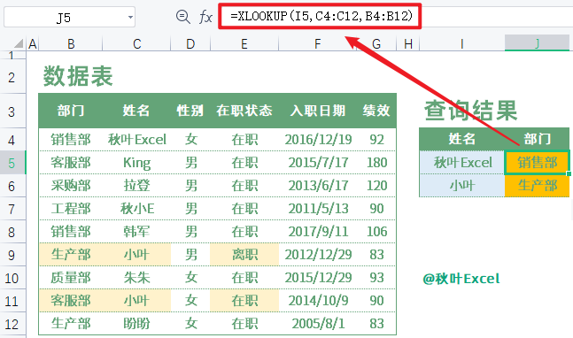

Xlookup 在选择时，只需要分别选择查找列和返回列就行，所以根本不存在左右的问题~


再说了，这里查找「小叶」的部门时，因为有两个小叶（重名）。

而**Vlookup 默认只能查找到第 1 条记录**，也就是「生产部」。

如果我想查找在「客服部」的「小叶」，要怎么写呢？

给 Xlookup 加个参数「0,-1」就可以了：


「0,-1」这个参数并不难，来解释一下：

> 0 表示匹配模式为精确匹配。 -1 表示从下往上查找；如果输入 1，表示从上往下查找；输入 2，表示升序排序的二进制文件搜索；输入-2：表示降序排序的二进制文件搜索。（后两种搜索模式一般不用）

所以填写 -1，就能找到最下面位于「客服部」的「小叶」~


### 一对多查找

现在我们要根据姓名，把员工的全部信息都查找出来，共计 4 列，所以返回值也有 4 个。

如果用 Vlookup 函数，为了解决返回列变化的问题，需要**结合 Column 函数**来写公式。

▲ 左右滑动查看

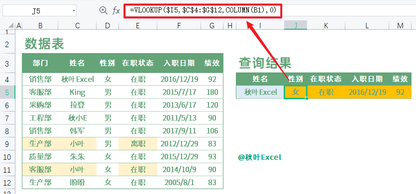

公式填写好之后，向右拖动填充即可。

但……如果你不会 Column 函数，解决这个问题最好的方法，就是赶紧关掉 Excel，眼不见为净。


在这个问题上，Xlookup 的处理方式会更高级。

简简单单一个公式就搞定：

注意！返回数组须框选所有区域，输入公式后按下【**Ctrl+Shift+Enter**】才能得出正确结果。

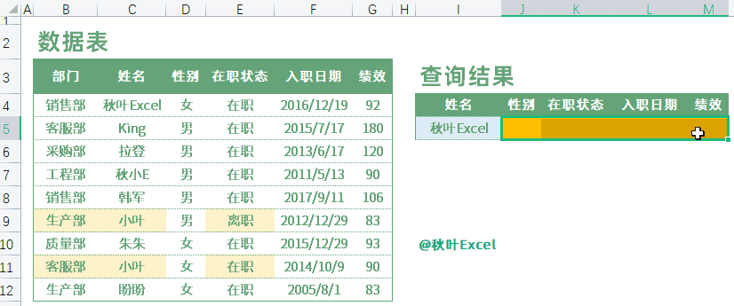

奥秘就在第 3 个参数「D3:G12」上。

参数 3，选择返回列的时候，把所有需要返回的列，一次性都选上。

聪明的 Xlookup 同学，**会根据返回列的列数，自动填充相邻的数据列~**

高效又简单，大家快给我夸夸！


### 模糊查找

这里我们要根据 G 列的「绩效」，算出 I 列的「绩效评比」结果。

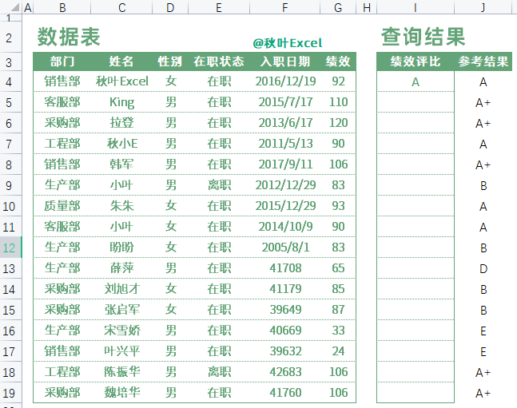

评比规则如下：

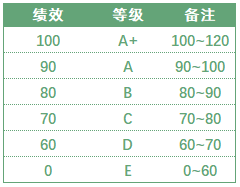

我猜，很多人遇到这种问题，都会写长长的 IF 函数吧？

▲ 左右滑动查看

这种情况其实可以用 Vlookup 解决~

在一些**绩效、提成**的计算上，用 Vlookup 模糊查找，可以避免反复地写 IF 函数嵌套。

在 I4 列输入公式：

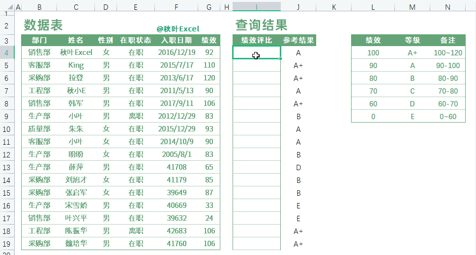

糟糕，好像翻车了……


小伙伴们注意啦！！！

在使用这种模糊查找方法时，「绩效」列的数字必须**从小到大**排序，否则查询就会出错。

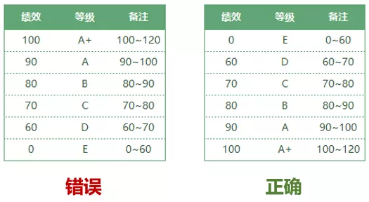

正确操作：

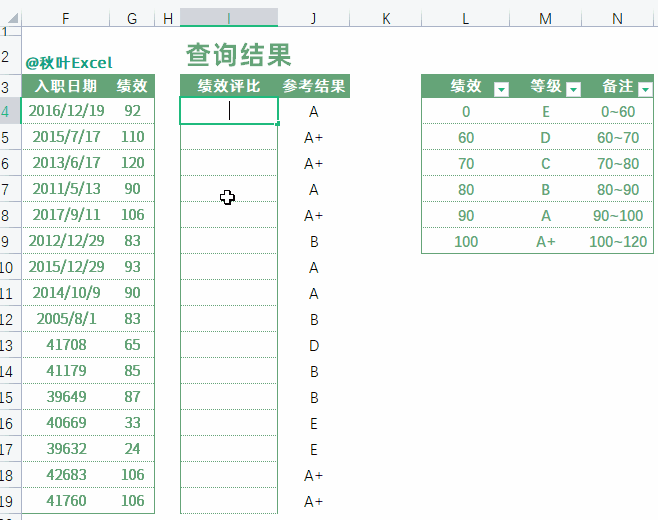

但是！没错，但是来了——

Xlookup 的解决方法，更加简单易懂，改一下参数就好。

▲ 左右滑动查看

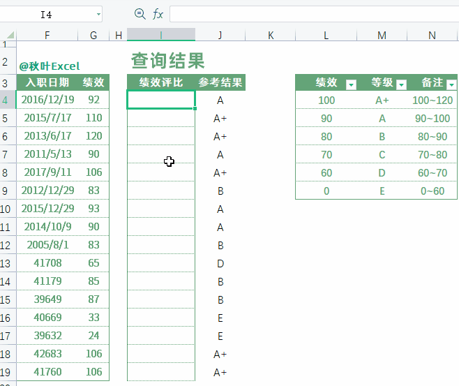

前 3 个参数和 Vlookup 道理一样，重点是第 4 个参数：**设置查询匹配的模式**。

参数 4 有下面几种用法：

> 0 表示精确匹配，若未找到所查找内容返回#N/A。 2 表示可使用通配符匹配 。 1 表示精确匹配，若未找到所查找内容返回较大项。 -1 表示精确匹配，若未找到所查找内容返回较小项。

这样一来，不管「绩效」列的数字按什么顺序排，都不会影响我们查找结果！

又比 Vlookup 函数节省了好几分钟呢~


怎么样，看完这篇文章，是不是感觉 Xlookup 比 Vlookup 强大了好几倍呢？

## 选择性粘贴，5个高级用法，你会么？

当你还在普通复制粘贴的时候，你同事已经用上了选择性粘贴，提升工作效率，告别加班，今天分享选择性粘贴的5个高级用法，最后一个大部分人没用过

### 1、快速行列转置

如下所示，左边的竖向数据，和右边的横向数据，我们需要相互转换

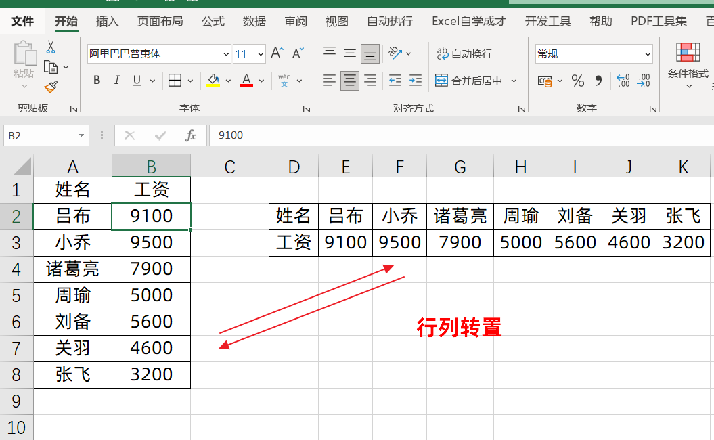

我们只需要复制数据，然后右键，选择性粘贴，勾选转置即可，如果原始数据中有公式，则需要勾选粘贴成值，操作动图如下所示：

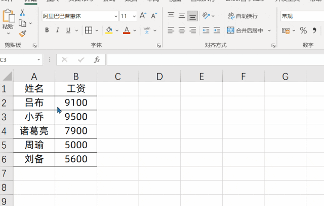

### 2、快速进行加减乘除

例如，我们有一份工资表数据，现在需要对每个员工的工资加500

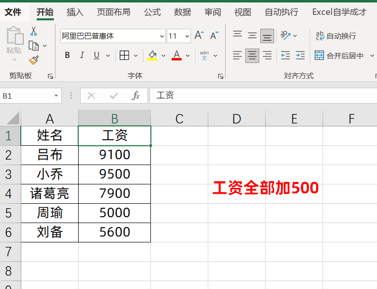

我们可以在任意空白单元格，输入数字500，复制之后，选中工资数据区域，右键，选择性粘贴，勾选加号，就能快速统一的将原来的数字加上500

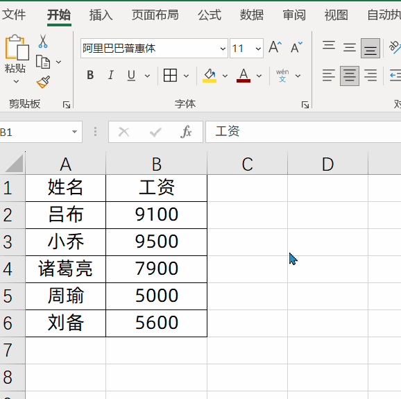

同理还可以进行减，乘，除等统一操作

### 3、去掉文本，只保留数字

例如，左边的表格，我们想快速去除里面的文本，只保留数字


我们可以选中数据区域，复制，在一个空白的地方，选择性粘贴，选择加，然后再将结果复制粘贴成原数据区域，如下所示操作动图：


### 4、跳过空白单元格粘贴

例如，我们有一份工资表，然后调整了部分员工的工资数据，现在我们需要修正调整部分数据


我们可以复制调整工资数据，在原工资数据上选择性粘贴，选择跳过空白单元格


### 5、单元格内容批量转换成文本框

左边有一列姓名，我们想批量生成文本框


我们可以选中数据区域，取消边框线，添加一个任意的底色，然后复制粘贴，选择性粘贴，选择图片，然后我们选中图片，重复操作两次取消组合，就得到了所有的文本框，操作动图如下：


关于这几个小技巧，你学会了么？动手试试吧！

## 扔掉Vlookup，Xlookup才是版本答案

工作中，不会Vlookup公式，就没法完成老板交待的任务，但是Vlookup公式，4个参数，学起来难，也会频繁使用出错，从右向左查询也不方便


干脆直接不要学Vlookup了，直接学习XLOOKUP公式

### 1、基本用法

XLOOKUP有6个参数，前3个是必填的，后3个是选填的，我们用的比较多的是前3个必填的，它的用法是：

=XLOOKUP(查找值，查找列，结果列)

所以说遇到上述同样的问题，只需找到3个参数

查找值，这里是F2单元格

查找列，这里是B列

结果列，这里是A列

所以我们使用的公式是：

=XLOOKUP(F2,B:B,A:A)

是不是超级简单


### 2、XLOOKUP第4参数

当我们表格里面查找不到结果的时候，会显示为错误值#N/A

有一个需求，我们想让错误值不显示出来


这个时候，就用到第4参数了，当XLOOKUP结果为错误值时，我们可以设置第4参数，让它显示成我们想要的，如果想要显示为空白，那就双引号，里面什么都不填，如：

=XLOOKUP(F2,B:B,A:A,"")


### 3、Xlookup 多条件查询

举个例子，我们需要根据两个条件，来查找匹配我们的结果


同样的原理，找到3个参数

查找值，这里是2个值，所以我们用F2&G2连接起来

查找列，也是两个查找列连接起来即A:A&C:C

结果列，就是工资，对应D:D

所以我们输入的公式是：

=XLOOKUP(F2&G2,A:A&C:C,D:D)


是不是超级好用，动手试试吧！

## 史上最全的数据透视表

### 一、基本操作

1、创建数据透视表


2、更改数据源


3、数据透视表转换为普通表格


4、数据透视表刷新


5、数据透视表排序


6、数据透视表插入公式


7、套用设计模板


8、使用切片器


9、恢复经典数据透视表样式

07及以上版本制作的数据透视表无法用鼠标拖放，可以修改为经典模式：


### 二、布局与格式调整

1、计数项改为求和项


注：如果需要修改的很多，可以重新以前2行为数据源制作数据透视表，最后再更改数据源为全部数据行。

2、隐藏汇总行

可以分字段隐藏，也可以一次性隐藏或显示


3、刷新后保持列宽不变


3、合并标签所在单元格


4、删除求和项


5、标签项重复显示


### 三、组合功能

1、按年、季度、月汇总报表


2、按数字步长组合


### 四、数据分析

1、各部门人数占比

统计每个部门占总人数的百分比


2、各个年龄段人数和占比

公司员工各个年龄段的人数和占比各是多少呢？


3、各个部门各年龄段占比

分部门统计本部门各个年龄段的占比情况


4、各部门学历统计

各部门大专、本科、硕士和博士各有多少人呢？


5、按年份统计各部门入职人数

每年各部门入职人数情况


### 五、多表合并

1、多区域合并


## 数据透视表14种分析方法

数据透视表的最常用的功能是分类汇总，其实它还有很强大的数据分析功能。在数据透视表右键菜单的值显示方式中，可以看到有14个很实用的分析选项。很多同学不知道它们有什么作用，今天兰色就一个个揭开它们的神秘面纱。


### 1、总计的百分比


作用：透视表中每一个数字（包括汇总行、总计行）占**右下角总计**的百分比。下图所示下面透视表为设置前数据，上面透视表为设置后效果（后面示例同）


### 2、列汇总的百分比


**作用：**每个数据占最下方总计行的百分比。


### 3、行汇总的百分比


**作用：**每个数据占最右侧总计列的百分比。


### 4、百分比


**作用**：以某个数据为参照，计算同一分类下所有数据和该数据的百分比


### 5、父行汇总百分比


**作用**：每个数字和上一级**行**汇总的百分占比。

如下面78.26%=36/46


### 6、父列汇总百分比


**作用**：每个数字和上一级**列**汇总的百分占比。

如下图 61.02% = 72/118


### 7、父级汇总百分比

**作用*：明细占指定父级汇总的百分比。


### 8、差异

**作用**：和指定数据的差异


### 9、差异百分比

**作用**：和指定数据的差异百分比


### 10、按某一字段汇总

作用：实用累加运算


### 11、按某一字段汇总百分比

**作用**：累计百分比


### 12、升序排列

**作用**：生成中国式排名（数字越小，排名越高）


### 13、升序排列

**作用**：生成中国式排名（数字越大，排名越高）


### 14、指数

**作用：**计算一个数字对整体的重要度

计算公式为：=（数字总计数） / （行总行列总计）

如下图中 0.42 = 14*391/(166*78)


兰色说：透视表的值显示方式是一个学习的难点，网上也很少有系统的总结。这次兰色也是花费了大力气才完成本文。希望能对同学们有用。

## 选择性粘贴跳过空单元格

懒，是创造力的根源。而我，专注偷懒20年！

那么关于题主在答案中的疑问：

> 不知大家有没有更好的办法，或者有没有直接的办法不用新建就能把S列有内容的单元格补充到R列？

答案是 ***有的！**

> *复制粘贴**就可以了！*

有人会说那不是覆盖掉了么？ 额 …我们可以有选择地粘贴嘛~

首先，先让我们看两篇微小说陶冶一下情操…


可以看到我已经将两篇文章错开了行，那么是时候展示真正的偷懒了：

1、选中需要合并的区域（一般不包括标题）复制


2、在目标区域右键选择"选择性粘贴"


3、在"选择性粘贴"的选项中选择"跳过空单元"


4、完工！可以**保留格式**的合并棒棒哒！


最后，让我默默地文艺一下…


## 你离精通数据透视表还差这两招，百分之九十的人不会

我一直觉得透视表是Excel中性价比最高的一个功能，因为数据透视表本身是一个数据分析的利器，并且只需要很小的学习成本就可以掌握它百分之八十的功能，但是今天介绍的功能有90%的人都不会用，今天大家看下面几个功能你会不会。

### 一、将数据按周汇总

如何将左边变成右边


首先选择数据插入一张数据透视表


在数据透视表上右键，“组合”，“步长”选择“日”，“天数”选择7。到这一步，我们先不要急着点确定。大家看上面的日期起始默认是数据源的第一天，并不是我们潜意识里的周一哦，2021年8月18日是周三。需要手动将起始日期改成周一。


我们可以用=WEEKDAY(A2,2)函数知道第一个起始日期是周几，这里是3说明是周三，时间往前推两天就是周一啦。


所以起始日期手动输入2021-8-16.


点击确定后透视表日期就是按2021-8-16开始的了。


### 二、数据透视表非重复计数

什么叫“非重复计数”

举个例子，大家看这是数据源


我筛选“酷冷”生产商可以看到对应的客户有37个。但是这37个有很多重复的客户，如何才能知道不重复的是多少呢？


如果你用数据透视表的话，会发现透视表计数告诉你的也是37个，说明透视表默认的也是重复计数。


如何才能计算不重复？没错，数据透视表其实可以做到，下面跟我一起来看看。

在插入透视表的时候记得勾选“将此数据添加到数据模型”，勾选之后点确定


然后将“生产商”拉到“行”，“客户”拉到“值”，在透视表上点击右键，“值字段设置”，“值汇总方式”选择“非重复计数”，点确定。


点完确定后，就可以看到非重复的客户啦。


## 年轻不识透视表，错把公式当成宝


数据透视表操作简单，汇总方便，拖动几下鼠标就可以完成数据的分析汇总，今天老祝就和大家分享一组数据透视表的使用技巧。

### 创建动态数据范围的数据透视表

默认情况下生成的数据透视表，数据源增加数据后是无法添加到透视表中的。其实咱们在制作透视表之前，先插入表格，就OK了。

利用表格能自动扩展的特性，给透视表提供一个动态的数据源。


### 二维表转换为一维表

所谓二维表，通常是指同一类数据出现在多列中，这样的表格不方便咱们的汇总分析。如何转换成流水账形式的一维表呢？

依次按下 Alt D P键，选择多重合并计算数据区域，插入默认的透视表后，双击右下角的“合计”，就可以得到明细数据了。


### 按年、月、季度快速汇总销售数据

利用透视表中的组合功能，可以快速按照年月季度来汇总数据。


### 销售业绩排名和汇总

要得到不同业务员的销售汇总、销售排名和销售占比，只要咱们选择不同的值汇总方式就OK。


### 按销售区域提取前三名的销售记录

一些看起来比较复杂的汇总要求，使用透视表完成也非常简单。

如果要按照不同的销售区域提取前三名的销售记录，只要在透视表中做一个筛选就好。


### 多行多列提取不重复姓名

在多行多列的值班表中，如何提取出不重复的名单呢？

依次按下 Alt D P键，选择多重合并计算数据区域，插入默认的透视表。

在数据透视表字段列表中，分别将“页1”、“行”和“列”拖动到字段列表之外，然后将“值”拖动到行区域即可。

由于使用多重合并计算区域时，会将数据源中的首列默认作为行标签，所以选择数据区域的时候，第一列中不能包含要提取的姓名。


### 使用切片器查看不同地区销售数据

切片器就像是一个高级筛选器，能够使筛选过程更加直观，在2010及以上版本中如果不使用切片器，可真是有点可惜了。


### 克隆数据透视表

选中一个数据透视表按Ctrl+C复制，然后按Ctrl+V粘贴，可以快速得到一个新的数据透视表，只要调整一下字段位置，就能得到不同汇总角度的两个透视表了。


### 使用切片器控制多个透视表

对于使用同一个数据源生成的透视表，可以先插入切片器，再设置切片器的报表连接，使其能同时控制多个透视表，实现联动效果。


### 使用切片器制作动态图表

传说中的交互式图表，使用数据透视图那是相当简单。


### 按客户拆分工作表

要根据不同客户名称，把数据拆分到不同工作表里，也是简单的不要不要的。


## XLOOKUP函数你向我这样学就对了

入门篇还没学习看这个（[入门篇](http://mp.weixin.qq.com/s?__biz=MzU2NTIyMTI3OA==&mid=2247486296&idx=1&sn=c7968100d98cd511309347600c606199&chksm=fcbe49a9cbc9c0bf5b9e9e5fb1b41f8e6da6d77746945cb94f4d1114152b81a2db1801af2ba5&scene=21#wechat_redirect)），算是XLOOKUP的基础用法，今天主要是通过10个案例来进一步学习！这应该是目前XLOOKUP这个新函数最全面的教程了！

### 案例01 | 近似查找（区间查找）


小结：

1、XLOOKUP第五参数有四种模式：


2、0-精确匹配为默认值，相当于VLOOKUP第四参数的FALSE，只是VLOOKUP默认的是近似查找。

3、本案例使用的是-1根据说明，能精确匹配到的按精确匹配，否则返回较小的项，这个其实跟VLOOKUP的近似查找基本一致，案例可以看出

### 案例02 | 近似查找，返回较大者


小结：这个是VLOOKUP所无法做到的，之前我们是查找不到返回小于的部分，现在是向下找，返回较大的！

虽然帮助文件中没有说明数据源排序要求，但是测试来看应该要求升序排列

-1和1的模式你可能一时想不到应用，我来简单说一个，比如我们要查11月20日的库存，如果没有就差19日的，那么-1模式就可以上了.

### 案例03 | 通配符-模糊查找


小结：

1、XLOOKUP也有模糊查找，但是却单独提示出来，VLOOKUP本身第一参数支持通配符模糊匹配。

2、案例中一共3种特殊的符号，分别是~?*,他们具体的含义如下：


如果先表示"*"和 "?" 本身就需要提成成~?和~*,~相当于让他们现出原形，而不是通配！

3、XLOOKUP单独分来出来更清晰，但是却不如VLOOKUP简洁了

### 案例04 | 数据搜索方式


小结：

1、参数六一共有4种模式（两对），目前二进制模式基本很少使用这里不举列，主要分享常规的两种机制（1和-1）：


2、1从上往下，默认值，符合我们常规使用习惯，-1从下往上（倒序）查找！

3、案例中正序，我们VLOOKUP常规用法一致，从下往上，需要我们使用LOOKUP来给大家模拟！


### 案例05 | 抢了HLOOKUP的活


小结：HLOOKUP表示在水平方向查找和VLOOKUP是一对兄弟！

XLOOKUP不仅抢了VLOOKUP的活，HLOOKUP也没放过，甚至LOOKUP部分都被干下！

### 案例06 | 交叉查找


小结：

1、我们之所以能使用以上两个公式是因为XLOOKUP的结果是引用，这一点应该很少有人提出，这点之前的版本极少函数结果返回是引用的，目前知道的有OFFSET和INDEX。

判断一个函数结果是否是引用可以使用ISREF，大部分函数都是FALSE！


2、很多人会问第一个公式的意思，这个空格是交叉运算符，虽然很基础的知识，但是很多人不知道，表示两个区域重叠相交的部分！

### 案例07 | 多条件查找


小结：相对传统的VLOOKUP重构区域的写法，好简洁很多，也更好理解！

### 案例08 | 结果保留引用属性


小结：可能上面的案例你还没能明白结果是引用的含义，那么这个案例进一步阐述，A1：B1，你肯定不陌生，表示对应的矩形区域，其中的冒号表示区域运算符，两个需要是单元格引用，这里的B9：公式

公式部分查找到4月所在的合计单元格，然后返回B9、C9、D9、E94个单元格的值，使用SUM函数聚合求和！

### 案例09 | 不连续多列


小结：XLOOKUP查找连续多列是非常方便借助了数组自动溢出的理论，但是不连续就有些麻烦，我们需要借助CHOOSE等函数重构结果区域！这里就是通过CHOOSE把3个区域重新组合！从而满足XLOOKUP不连续查找！

### 案例10 | 第一参数多单元格


关于XLOOKUP函数，我们就到这里！

## Xlookup

语法：XLOOKUP(`查找值`,`查找数组`，`返回数组`,`[未找到值]`,`[匹配模式]`,`[搜索模式]`)

1. 基本用法
    xlookup(`查询条件`，`查询条件范围`，`查询结果范围`)
   1. 向左查询xlookup(查询条件，查询条件范围`f4`，查询结果范围`f4`)
   2. 错误提示＝vlookup+iferror
2. 错误提示
    xlookup(`查询条件`，`查询条件范围``f4`，`查询结果范围``f4`，“查无此人”)

    iferror(vlookup(),“查无此人”)
3. 近似比对(分层级-发奖金/评优良)
    xlookup(`查询条件`，`查询条件范围-层级`，`查询结果范围``f4`,不写错误提示,-1)*金额

    > 分层级的数据要从小到到。
    >`0`精确匹配；`-1`精确匹配或下一个较小的项目；`1`精确匹配或下一个较大的项目；`2`通配符匹配
4. 横向查询
    xlookup(`查询条件`，`查询条件范围``f4`，`查询结果范围``f4`,,-1)

    -1近似比对
5. 模糊查询，通配符`*`+输入2使用万用字元
    xlookup(`李*`，`查询条件范围``f4`，`查询结果范围``f4`,,2)

6. 逆向查询xlookup(`查询条件`，`查询条件范围``f4`，`查询结果范围``f4`,,,-1)
    -1逆向查询。变更列的查询方向-由下而上

    >`1`从第一项到最后一项搜索；`-1`从第最后项到第一项搜索；`2`分搜索排序（升序）；`-2`分搜索排序（降序）
7. 双向筛选。两个xlookup叠加

    xlookup(查找条件，查找范围，xlookup(查找条件，查找范围，结果范围))

## 跨栏功能的过度使用

ctrl+1,单元格式设置，文字对齐方式，跨列局中。分散对齐。

## 不常用快捷键来提升效率

 alt+下箭头，输入之前输入的内容。

shift+拖动，可快速移一行数据。

ctrl+方向键，可快速移到第一或最后一个单元格

ctrl+shift+方向键，可选中整或整列。

ctrl+shift+“+/-”，可增加一行或删除一行

## 资料类型的误用

比如日期格式输入错误，9月1日，输入成“9.1”

## 未善用单元格的参考功能

正确的做法是在数据旁边增加一个参照单元格

动太订单编号


## 未发现隐藏栏位潜在的问题

用subtotal可以把隐藏的单元格不记算在内


## 忽略表格的功能带来的好处

## Tidy Data 简洁数据结构

"Tidy Data"是数据科学和数据分析中的一个重要概念，由Hadley Wickham在2014年的一篇论文中提出。整洁的数据（Tidy Data）是指数据按照变量（变量是数据的列）和观察值（观察值是数据的行）进行组织，并且每个观察值都是一个独立的行。这种数据组织方式有助于简化数据分析过程，使得数据更容易操作、模型构建和可视化。

Tidy Data需要遵循以下四个原则：

1. 每行表示一个观察单位（例如，一个样本、一个个体等）。
2. 每列表示一个变量（例如，身高、体重、年龄等）。
3. 每个观察单位（行）都必须有一个独特的标识符（例如，ID）。
4. 每个变量都必须有一个明确的、独一无二的名称。

这种数据组织方式使得数据分析变得更加容易，因为可以使用标准的统计方法来处理整洁的数据。同时，整洁的数据也有助于开发更有效的数据分析工具，包括输入和输出整洁数据集的工具。

## 真正的难题

不知道自己，不知道的是什么。

## 真正的高手

用简单的方法，解决复杂的问题。

## 十种不合理设计

1. 多余的表头（标题位置不合适）；

    >使用工作簿或工作表名称；

2. 字段排序不合理；时间->人物->人物属性->事件->事件属性；

    >列换位置，选中列，`shift+左键`

3. 数据摆放不连续；上下左右数据全挨着；

    >删除多列->定位空值，删整列
    >转置——>选择性粘粘，转置

    

4. 合计行破坏源表
    >合计行莫用手填，Excel帮你变
5. 多表头引发问题
    >同属性字段记一列
    >
    >
    >
    >
    >
6. 合并单元格后患无穷
    > 原数据表“打死”不合并
    > 1、`F5`定位；2、批量录入（ctrl+enter）
    >
    > 
    >
7. 源数据缺胳膊少腿
    > 字段设计-分析、拓展、补全
    > 流程解析——工作顺序、录入方式
8. 分数据容易牵手难
    > 源数据累积在“一张表”
    > 源表使用小贴士——另存为；
9. Excel错当Word用
    >一列一数据
    >
    >
    >
    >
    >
10. 分类汇总变成手工活儿

## 小技巧

### 右键按月填充

单元格右下角，十字的时候，可以以工作日填充，按月填充。按年填充。


### 打印网格线

视图，打印网格线

### 下拉列表

在数据有效性里面，选择系列。在值上用“,”分格

### 二级有效性

先要定要名称（名称在公式里面选指定）；来源里面写上=indirect(名称)。

### 动态下拉选项

插入-表格，定义名称

设置单元格格式：`ctrl+1`

编号，自定义格式，改为000

姓名，对齐，分散对齐，缩进1

小数点保留2位

日期，补零，yyyy,mm,dd；自定义为yyyy/mm/dd;@


`ctrl+shift+下键头`批量选中数据

### 查找功能

`*`是查找所有的。`?`是查找一位数


### 设置随机日期

一个日期区间如：2022/2/1～2022/02/28之前的随机日期。

第一、选择单元格里两个日期ctrl+1，单元格格式中把日期设置为常规。

第二、使用randbetween(最小值，最大值)函数，按ctrl+A。这样就可以得到随机日期了。

### 设置可变动的序号

在单无格中用=row()-1

### 创建超级表

1. Control+A 选上数据；
2. Control+T 创建超级表

### 数据分列

数据菜单，分列

### 函数

Weekday()星期几，Networkdays()工作日，Weeknum()年周，Datedif()工龄

### 查看公式

ctrl+`

### F4

1. 编辑公式时可以后切换引用；
2. 可以重复上一步操作。

## 伍昊

好表or坏表

### 一、设计表格

1. 做好一张“天下第一表”
2. 只做一维表
3. 见单录入
4. 同一属性字段放在一列做记录
5. 原数据表，不能有分割的行或列
6. 表格的里子与面子


### 二、神级必杀技

#### 一、Vlookup


#### 二、数据透视表(横竖就是要汇总)

> 手工——公式——透视表
> 特点：简单、快捷、准确、不怕错
>数据透视表是做数据分析的；
>
>汇总表“躺着”不如“站着”；
>
>数据透视表不要多表头；
>
>双击显示数据明细
>
>手动与自动刷新数据
>
>新增的数据能被自动添加吗？(可以把数据多选一些)
>
>数据透视表一个生多个

1. 数据透视表汇总数排排站

    

2. 更新数据锁定列宽

    

    复选框去掉，`更新时自动调整列宽`

3. 切片器可一对多筛选

    

### 三、核心四大功能

1. 有效性
2. 条件格式
3. 名称
4. 函数

### 四、录入/清选/处理

1. 快速录入

   

   **单无格很“挑食”**

   > 数和量分列记录，约**写在标题栏**

   

   **文本怪象**

   

   > 爱词不爱句
   >
   > 同属性一列记录
   >
   > 不同属性分列记录
   >
   > 一列数据一种属性
   >
   

   **向左走、向右走**

   

   **眼见为“虚”**

   `@`、``特殊``，``;;;``，``#``

   

   **日期为什么会变成数字？**在`设置单元格格式`中把日期设置为常规，日期就变为一个数字。

   **录入序列？**选两个后，会出现十字架，双击复制。会对齐到参照列；

   

   **展开一切下拉菜单？**`alt+向下方向键`

   **批量录入？**`ctrl+enter`

2. 有效清洗

   **查找与替换？**在选项中可以打开更多选项，可以按字体颜色，字体是否加粗，对齐方式，背景颜色等进行查找。

    

   **排序？**添加一个辅助列，可还原被打乱的系列

   

3. 错误修复等等

## Excel 快捷键

### F家族

`F2`——编辑单元格（也可重命名文件）

`F3`——使用已定义的名称

`F4`——切换公式单元格引用状态（A2→$A$2）

`F4`——重复上一次菜单操作（如填充底色）

`F5`——调用“定位”功能

`F9`——使Rand和Randbetween函数重获新结果

`F9`——选中公式某部分显示结果（Ctrl+Z撤销）

> （5#注：某些键盘要按Fn+F2）

`F12`直接进入另存为窗口

### Ctrl家族

`Ctrl+1`——调用“单元格格式设置”

`Ctrl+R`——将选中区域最左列单元格向右复制

`Ctrl+D`——将选中区域首行单元格向下复制

`Ctrl+Z`——撤销上一个操作

`Ctrl+S`——保存工作簿

`Ctrl+F`——查找

`Ctrl+H`——替换

`Ctrl+P`——打印

`Ctrl+G`——调用“定位”

`Ctrl+~`——显示公式（与~同键）

`Ctrl+N`——新建工作簿

`Ctrl+A`——选中当前单元格四周的连续数据区域

`Ctrl+A`→A——全选整张工作表

`Ctrl+A`——=函数名称，Ctrl+A，调用参数设置

`Ctrl+Tab`——在多个Excel工作簿中切换

`Ctrl+PgDn`——切换至下一张工作表

`Ctrl+PgUp`——切换至上一张工作表

`Ctrl+;`——输入当前计算机日期

`Ctrl+↓`——光标跳转至连续数据区域的下边缘

`Ctrl+Enter`——选中多个单元格时进行批量录入

`Ctrl+F3`——调用“定义名称”

> （5#注：Ctrl+C/X/V常识，Ctrl+E依赖版本）

### Alt家族

`Alt+=`——自动求和

`Alt+Tab`——在两个常用文件中进行切换

`Alt+Enter`——编辑单元格时进行单元格内换行

`Alt+↓`——将单元格上方已有内容形成可选列表

`Alt`——显示工具栏菜单快捷调用字母

> （5#注：Alt+↓只针对文本，对数字无效）

### Shift两兄弟

`Shift+F3`——从公式单元格中打开函数设置面板

`Shift+F11`——新建工作表

`ctrl+N`——新建工作簿

> （5#注：`Shift+F3`用于公式的修改）

### Ctrl/Shift全家老小

`Ctrl+Shift+↓/→`——当前单元格向下/右全选

`Ctrl+Shift+End`——当前单元格到数据右下角

`Ctrl+Shift+F3`——批量定义名称

> （5#注：Ctrl+Shift+End不要求数据连续）

### Windows键

`Windows+D`——返回桌面（办公室保命技）

`Windows+E`——打开“我的电脑”（天天用）

## 100个Excel实用技巧

> 花了一天时间，整理了这份超实用 100+Excel 快捷键和实用技巧大全。文末有文本版汇总！一、办公常用的 7 大技…

花了一天时间，整理了这份超实用 **100+Excel 快捷键和实用技巧大全。**

### 文本型数字隐藏的秘密


### 大小写转换技巧


### 字符串合并技巧


### 日期时间转换技巧


### 数字格式转换


### 显示系统时间或日期


### 隐藏行或列


### 选择数据


### 显示对话框


### 编辑数据


### 将文字颠倒顺序


复制正常顺序对象→在字体前加 @→点击向下旋转文字→点击自动换行

### 制作打钩方框


输入 "R"→设置字体为 Wingdings2

### 用斜线分割单个单元格


选中对象→插入形状（直线）→ALT + 鼠标 快速定位单元格边角→F4 重复动作，添加分割线→插入文本框→调整字体

### 隐藏不需要显示区域


选中对象→Ctrl+1→点击自定义→输入；；；

### 分段显示手机号码


选中号码→Ctrl+1→点击自定义→输入 000-0000-0000

### 数据以万为单位显示


选中对象→Ctrl+1→点击自定义→输入 0！.0,"万”

## 智能工作表协作

1. 可以@联系人；
2. 也可以@云文档

## 库存管理系统


## 批量调整表格行高列宽


## 两个日期&时间相减得出值为小时

**应用场景：工时计算**
`=(TEXT([结束时间]-[开始时间],"d")*24)+(TEXT([结束时间]-[开始时间],"h"))`

或

`=INT(([结束时间]-[开始时间])*24)`

**进阶公式：**

`=INT(([结束时间]-[开始时间])*24*2)/2`

`工时计算还有一个进阶版的，一般要求以 0.5 小时为步长，超过 30 分钟就加 0.5，不足 30 分钟可忽略`

## 多文本字段拼接

**应用场景：设置唯一识标识 / 编号 / 名称，当表格中某类字段值不唯一时，进行跨表自动关联引用**
`CONCATENATE([订单编号],"-",[产品名],"-",[提交编号])`

## 百分比进度条展示效果

**应用场景：生产进度量化、项目完成进度量化**
判定状态对应统计值：`IF([A 类项状态]="已完成",20,0)`

量化计算完成百分比：`([A 类项统计值]+[B 类项统计值]+[C 类项统计值]+[D 类项统计值]+[E 类项统计值])/100`
