# Offfice 技巧

# Word

## 双击鼠标定位启始输入位置
把鼠标移动到你需要输入的那个位置上**双击鼠标**，直接输入你需要的内容。省去回车空格的时间。

## 校对
经常输入的长句子或者生僻词，可以做自动替换。在文件】|【选项】【校对】|【自动更正选项】中替换。

## 项目编号
1. 你只要记住在Word中`enter`回车表示换段，编号自动连续下去；
2. `shift+enter`表示换行。这也是我们常说的软回车。编号不会自动生成。

## word 快捷键

1. 快速调整字体大小。`ctrl+]` 快速放大字体；`ctrl+[` 快速缩小字体。
2. 切换英文大小写。选中要调整的英文内容`shift+f3`

## 替换

`ctrl+H`快速打开查找替换；

替换功能不仅能替换文字，还能进行文字格式的替换。

`ctrl+单击`目录，可以快速定位到文章

复制网页上的内容时，在最后选择`只粘贴文本`

查找`^p^p`，替换为`^p`,直到全部替换0处。

- 学会复制中的智能标记用法。
- 删除文字之间多余的“段落标记”，需要先替换空格，再进行“两个段落标记”替换成'一个段落标记”的多次操作即可。

**电话隐私保护**
- 把电话`13888886666`，替换为`138********`

- 在查找中输入`(1??)(????)(????)`,在替换中`\1****\3`。勾选`使用通配符`

## 长篇文档排版

双击`格式刷`可以重复设置格式。

双击“格式刷”可以完美解决点击格式刷”反复点击的困惑，双击一次就可以一刷到底。

**选择**，选择，选定`所有格式类似的文本`

**样式**
- 样式就是一系列格式的集合体。
- 做文档输入的时候要边输入，边设置样式，这样能够快捷的调整文件样式
- 替换功能不止能够替换文字，还可以替换各种不同样式
- 使用了`样式`功能了“牵一修改格式就有了发而动全身”的效果
- **导航窗格**，设置了样式后，在 `视图`菜单中找到`导航`窗口。运用导航窗格，可认快速到达想要的位置。
- 还可以直接在导航窗格里拖拽标题。来快速调整顺序。
  
## word 转ppt

只要把`.docx` 扩展名改为`.ppt`

## 字，行，段，页，节

我们要先让每一书的标题都独立成一页然后可以根据自己的需要在设置【首页不同】或者【奇偶页不同】

## 页眉中的横线

- 要去掉页眉中的横线，只需要在“边框”选择“无边框
- 拐弯的箭头可以在【文件】|【选项】|【显示】中找到

## 长文档排版逻辑

`页面设置`->`样式`->`分节`->`样式`->`页眉页脚`->`目录`->`封面和内页`的美化。

## 行距
- 公文的行间距是固定值28磅和1.与倍行距；
- 标书、论文等建议使用最小值26磅
- 行中间，设置为最小值，只要行间距不小于最小值。行间距会随着字体的大小变化。

## 段间距

- 段前间距：段前半行（0.5行）或6磅
- 段后间距：一搬比较少使用，通常一个段文字后面跟着表格。设置段后距12磅。

## 删除分节

使用查找，查找`^b`替换

# Excel

## Excel数据验证-选择性粘贴-分列-快速填充

为什么你做了一天的表格，老板看一眼就不想看了？

处理简单的数据没问题，但是一有较为复杂的数据就懵了。一行一行地去手动处理数据，交给老板后却发现错误百出。

Excel作为职场人必备的底层能力，几乎每个人的简历上都写着“熟练掌握”，但是真正懂门道的可能没几个。

其实Excel比我们想象的要智能很多，学会数据验证、快速填充等功能，我们的效率不仅能提高，准确率也能大幅提升。

不要让你的劳力去弥补技能的不足。如果你还不会快速处理较为复杂的数据，就让我们一起进入这期的Excel魔法学院，学学吧！

### 数据验证

数据验证，也就是数据有效性，是指对单元格设置一定的规则，**符合规则的允许录入，而不符合规则的则禁止录入。**

数据验证是一种效率极高的数据输入方式，可以对**数据的类型、范围、输入条件等进行限定，**是Excel中非常有价值的工具。

#### 技巧1：限制数据输入长度

很多信息都有固定的长度，比如手机号是11位，身份证号一般是18位，如何保证数据的输入长度不多不少呢？

操作步骤：选中数据区域，调出【数据验证】对话框，【允许】下拉列表中选择【文本长度】，【数据】为【等于】，长度为【11】，点击【确定】。手机号输入必须是11位就设置完成啦！

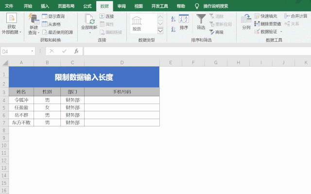

#### 技巧2：限制重复输入

如何避免信息重复录入？

操作步骤：选中数据区域，调出【数据验证】对话框，【允许】下拉列表中选择【自定义】，【公式】中输入=COUNTIF($A$4:$A$7,$A4)=1，点击【确定】。

在这里我们通过COUNTIF函数来协助，只要数据个数是1，就代表不重复，超过1，就代表重复了，不能输入。


#### 技巧3：设置下拉菜单，变输入为选择

对于表格中需要输入的固定信息，比如部门名称、性别、城市等，我们可以通过**设置下拉菜单的方式变输入为选择。**

操作步骤：选中数据区域，调出【数据验证】对话框，【允许】下拉列表中选择【序列】，【来源】处单击右侧折叠按钮，选中菜单项所在区域，点击【确定】。

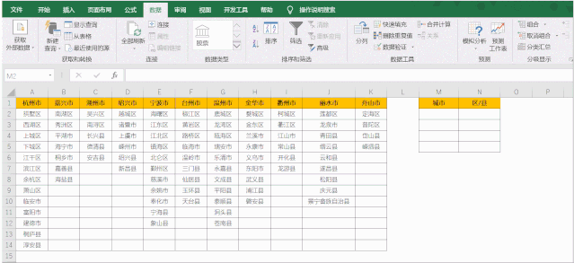

#### 技巧4：设置二级联动下拉菜单

数据间经常存在着前后关联关系，比如某个部门下对应的员工列表，某个地市所辖的区县等。那么，设置完一级下拉菜单后，对应的二级下拉菜单能否随着一级下拉菜单的不同而出现的选项也不同呢。

答案当然是可以的。下面我们以关联地市-区县的二级下拉菜单为例进行设置。

##### 步骤一：批量创建名称

在Excel中，名称可以用来代替单元格区域的引用。通过定义名称，可以搭建起一级、二级下拉菜单的桥梁。

操作步骤：同时按下【CTRL】+【G】，在【定位条件】对话框中，选择【常量】，点击【确定】。我们这样就选中了包含信息的所有单元格。

之后在【公式】选项卡下，选择【根据所选内容进行创建】命令，默认勾选【首选】，批量创建名称完成。

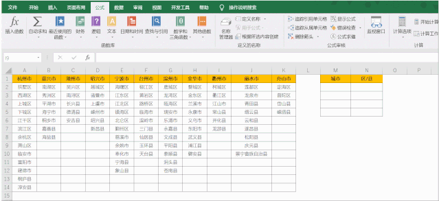

调出名称管理器，我们可以看到已经定义的名称及其包含的数据区域。

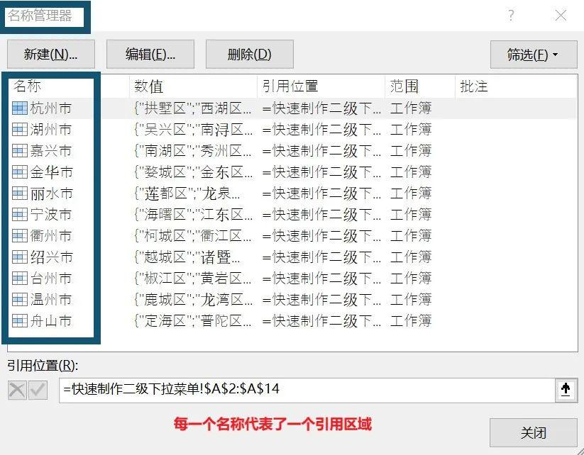

##### 步骤二：设置二级菜单

在城市信息列中，我们已经设置了一级菜单项。接下来在区/县信息列中设置二级下拉菜单。

操作步骤：选中数据区域，调出【数据验证】对话框，【允许】下拉列表中选择【序列】，【来源】中输入“=INDIRECT($M2)”，点击【确定】。

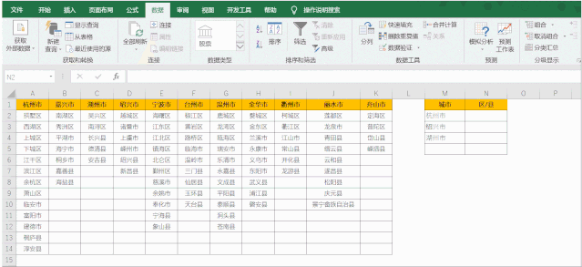

#### 技巧5：设置事先提醒

**数据验证，不仅能够制定数据输入规则，还能提醒你该如何填写**是不是非常贴心！

操作步骤：选中数据区域，调出【数据验证】对话框，点击上方【输入信息】项，可以设置标题和信息。比如我们输入信息“请输入信件可送达的地址”，填写时，就会出现这句提醒了。

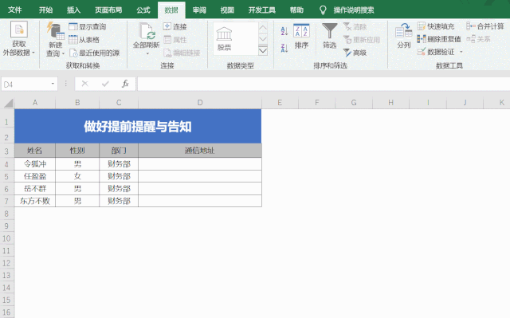

#### 技巧6：数据无效，那就圈出来

**数据验证还能对已经存在的数据进行检查。**检查无效，那就圈出来。

操作步骤：先设置数据验证，选中数据区域，调出【数据验证】对话框，【允许】下拉列表中选择【整数】，【数据】选择【介于】，【最小值】为60，【最大值】为100，点击【确定】。

然后在【数据验证】下点击【圈释无效数据】，不在60-100之间的而成绩就被“朱批”出来了。

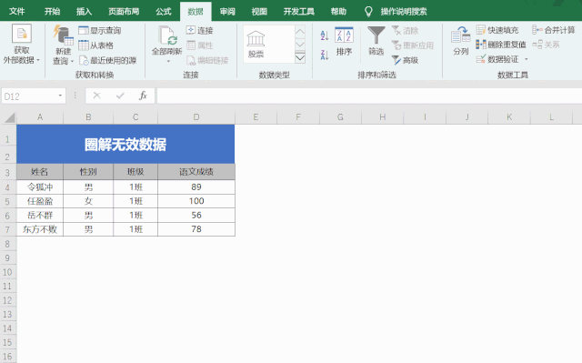


### 选择性粘贴

复制粘贴似乎人人都会，不就是CTRL+C/CTRL+V。但其实很多人都不知道，**在粘贴下方还有一个被大多数人忽略的选择性粘贴，**其实非常实用，不仅能进行数据转换，还能进行各种计算。

#### 技巧7：将公式粘贴为数值

有时候我们希望直接呈现结果而不保留计算过程，就需要将带有公式的数据区域转换为数值。如何转换呢？

操作步骤：复制已填充公式的数据区域，在【开始】选项卡的【粘贴】下，选择【粘贴数值】，公式即可转为数值。

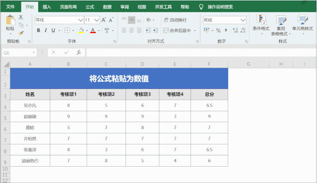

#### 技巧8：将文本转换为数值

从数据系统里导出的表格经常无法求和，SUM一下就会显示结果为0。这都是数字格式惹的祸，看起来像数值，实则为文本格式。如何将这种文本转换为数值？

操作步骤：先在某个空白单元格输入1，复制这个数字1。

选中要将文本转换为数值的单元格区域，调出【选择性粘贴】对话框，点选【数值】按钮，运算选择【乘】，点击【确定】。

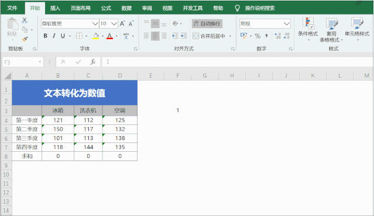

#### 技巧9：金额显示单位为万元

如何将数字单位显示变成以万为单位？只要我们将数值批量缩小10000倍，显示的数值就是以万为单位。如何快速实现呢？

操作步骤：先在某个空白单元格输入10000，复制。选中现将金额显示以万为单位的区域，调出【选择性粘贴】对话框，点选【数值】按钮，运算选择【除】，点击【确定】。

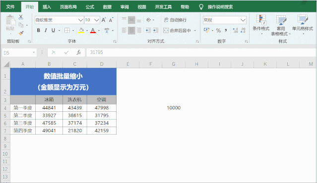

#### 技巧10：快速两表比对

**速核对两个数据表的值是否一致？**选择性粘贴给你解决这个问题的新方法。

操作步骤：先复制其中一个表格，然后选中另一个表格，调出【选择性粘贴】对话框，运算选择【减】，点击【确定】。

两个表格相减为0，则数据一致；不为0，则数据不一致。

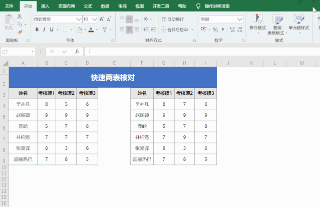

#### 技巧11：粘贴为图片/带链接的图片

有时为了排版简洁或阅读方便，我们需要**将数据表转换为图片格式**可如果当图中数据会反复发生变化时，就会很麻烦。

不用烦恼，我们可以转换为带链接的图片，原数据表变化，图片上的数据也会直接变化。

操作步骤：复制数据区域，选中任意一个空白单元格，在【开始】选项卡的【粘贴】下，点击【其他粘贴选项】中的“粘贴为带链接的图片”标识。

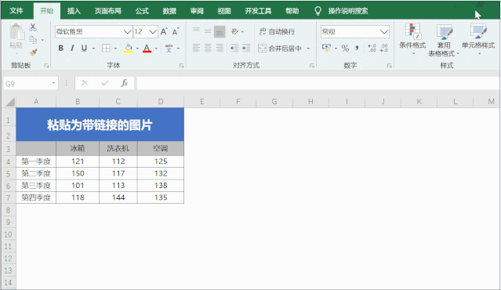


### 分列功能

Excel中的分列功能，相信大家都有所耳闻，平常也可能经常会用到。**分列功能非常强大，不仅可以拆分、提取，还能规范数据。**

#### 技巧12：根据固定符号拆分

当我们要对打卡信息进行拆分，将日期和时间放在两列，但日期和时间中间都存在着空格符号。我们就可以以空格这个固定符号来进行信息拆分。

操作步骤：选中数据列，点击【数据】选项卡下的【分列】，在【文本】分列向导中选择【分隔符号】，下一步中勾选【空格】，在下一步中选择存放数据的位置，点击【确定】，拆分完成。

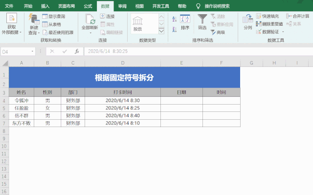

#### 技巧13：根据固定宽度拆分

除了根据固定符号，还可以根据固定宽度来拆分。比如提取邮政编码，固定宽度都是6位，用分列就非常容易。

操作步骤：选中数据列，点击【数据】选项卡下的【分列】，在【文本】分列向导中选择【固定宽度】，在下一步中，单击目标区域即可添加分割线，分割完成后，点击【确定】，拆分完成。

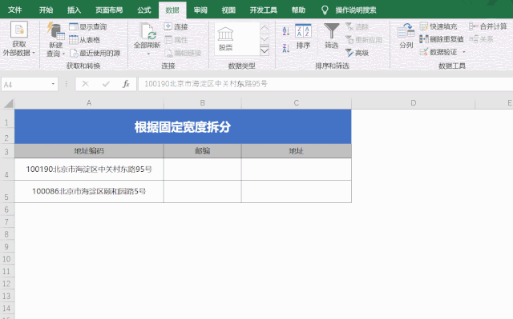

#### 技巧14：批量修改日期格式

分列还可以直接用来修改数据格式，比如对于各种不规范的日期数据，通过分列功能，可以马上规范统一起来。

操作步骤：选中数据列，点击【数据】选项卡下的【分列】，在【文本】分列向导中直接点击【下一步】，一直到最后一步，将【列数据格式】选择为日期，点击【确定】。

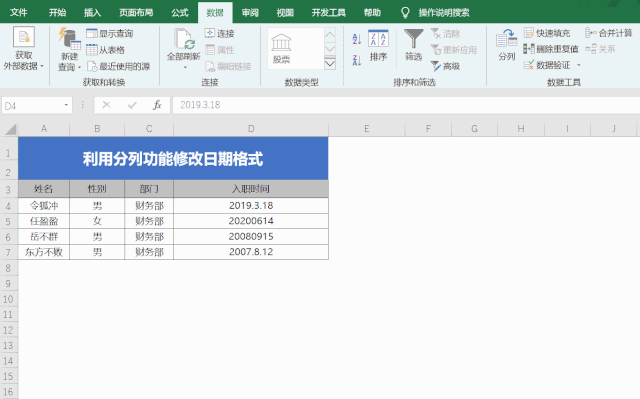


### 快速填充

自Excel2013以来,表格中就多了“快速填充”功能。什么是快速填充呢？**速填充是“基于示例填充数据，自动识别数据规律并重复运行，能让一些不太复杂的字符串处理工作变得更简单”。**

使用快速填充，我们可以轻松完成提取/拆分、合并/组合、位置转换等操作。快速填充的操作非常简单，先输入1-2个数据结果，拖曳填充后，填充方式选择【快速填充】即可。

#### 技巧15：智能合并

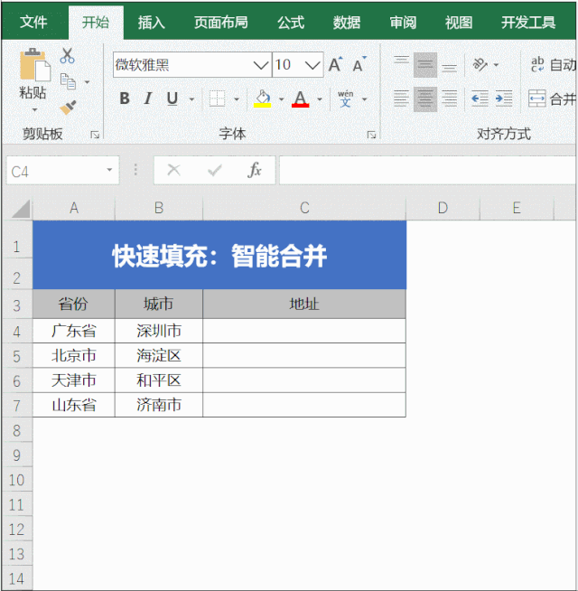

#### 技巧17：智能提取

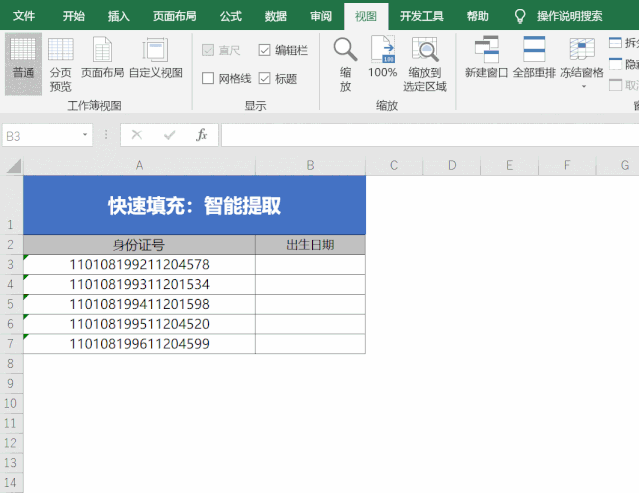

#### 技巧18：智能组合

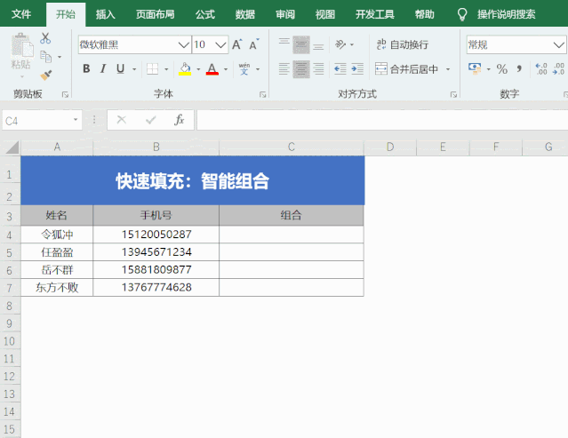

今天的内容就到这里了，下周将会给大家带来排序、筛选、单元格格式及条件格式的内容，敬请期待！

## Excel 快捷键

### F家族

`F2`——编辑单元格（也可重命名文件）

`F3`——使用已定义的名称

`F4`——切换公式单元格引用状态（A2→$A$2）

`F4`——重复上一次菜单操作（如填充底色）

`F5`——调用“定位”功能

`F9`——使Rand和Randbetween函数重获新结果

`F9`——选中公式某部分显示结果（Ctrl+Z撤销）

> （5#注：某些键盘要按Fn+F2）

`F12`直接进入另存为窗口

### Ctrl家族

`Ctrl+1`——调用“单元格格式设置”

`Ctrl+R`——将选中区域最左列单元格向右复制

`Ctrl+D`——将选中区域首行单元格向下复制

`Ctrl+Z`——撤销上一个操作

`Ctrl+S`——保存工作簿

`Ctrl+F`——查找

`Ctrl+H`——替换

`Ctrl+P`——打印

`Ctrl+G`——调用“定位”

`Ctrl+~`——显示公式（与~同键）

`Ctrl+N`——新建工作簿

`Ctrl+A`——选中当前单元格四周的连续数据区域

`Ctrl+A`→A——全选整张工作表

`Ctrl+A`——=函数名称，Ctrl+A，调用参数设置

`Ctrl+Tab`——在多个Excel工作簿中切换

`Ctrl+PgDn`——切换至下一张工作表

`Ctrl+PgUp`——切换至上一张工作表

`Ctrl+;`——输入当前计算机日期

`Ctrl+↓`——光标跳转至连续数据区域的下边缘

`Ctrl+Enter`——选中多个单元格时进行批量录入

`Ctrl+F3`——调用“定义名称”

> （5#注：Ctrl+C/X/V常识，Ctrl+E依赖版本）

### Alt家族

`Alt+=`——自动求和

`Alt+Tab`——在两个常用文件中进行切换

`Alt+Enter`——编辑单元格时进行单元格内换行

`Alt+↓`——将单元格上方已有内容形成可选列表

`Alt`——显示工具栏菜单快捷调用字母

> （5#注：Alt+↓只针对文本，对数字无效）

### Shift两兄弟

`Shift+F3`——从公式单元格中打开函数设置面板

`Shift+F11`——新建工作表

`ctrl+N`——新建工作簿

> （5#注：`Shift+F3`用于公式的修改）

### Ctrl/Shift全家老小

`Ctrl+Shift+↓/→`——当前单元格向下/右全选

`Ctrl+Shift+End`——当前单元格到数据右下角

`Ctrl+Shift+F3`——批量定义名称

> （5#注：Ctrl+Shift+End不要求数据连续）

### Windows键

`Windows+D`——返回桌面（办公室保命技）

`Windows+E`——打开“我的电脑”（天天用）

## Excel-数据透视表-Vlookup

职场上，人人都很忙。但只有少数人能忙得“有效率”。

**“表哥”、“表姐”们总告诉我们，20%的Excel技能就可以解决80%的工作问题。**

不懂Excel的操作方法，别人可以用半天搞定100张以上的数据报表，你得手动计算一整周。  

**今天要就和大家分享下Microsoft Excel中一些最强大、最实用的操作技能？**

学会这些快准狠的技巧，你一定也能完胜“表哥”、“表姐”们。


### 数据透视表

**权重：50%+**
**重要程度：★★★★★**
**学习难度：★★★★**

数据透视表是数据分析的神器，我们日常工作中要统计的各种报表都可以通过这一功能来实现。

作为一种交互式的图表，它允许用户根据需要对各类数据维度进行划分，通过快捷地拖动各类数据维度，将他们进行不同的重组，实现我们想要的结果。

#### 技巧1:拖拖拽拽”，快速制作统计报表，完成数据统计

根据你需要统计的数据维度和表格结构，“拖拖拽拽”，快速制作出你需要的统计报表，完成相应的数据统计。

**操作步骤：选中原始数据表中的任意单元格—【插入】—【数据透视表】—【数据透视表字段及区间】—根据报表行列呈现需要，在字段列表中选定该字段并按住鼠标左键拖放到下方的矩阵窗口中，数据透视表布局即完成。**

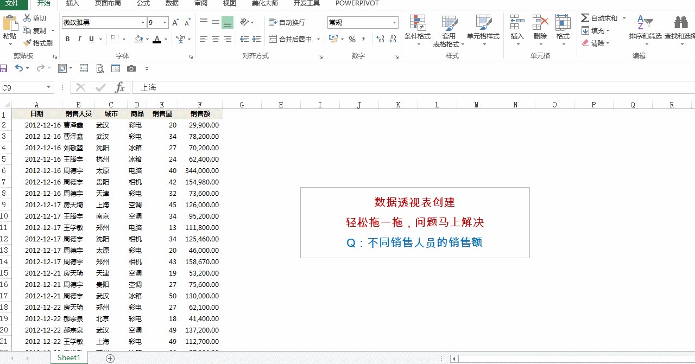

图1:1-数据透视表创建（GIF）

#### 技巧2:多种数值统计方式，轻松完成

数据透视表提供了求和、计数、最值、平均值、标准差、百分比等多种数值统计方式，你想要的结果它都可以呈现

**操作步骤：需要几种统计方式就拖入几次计算**【值字段设置】—【值显示方式】—【百分比】。

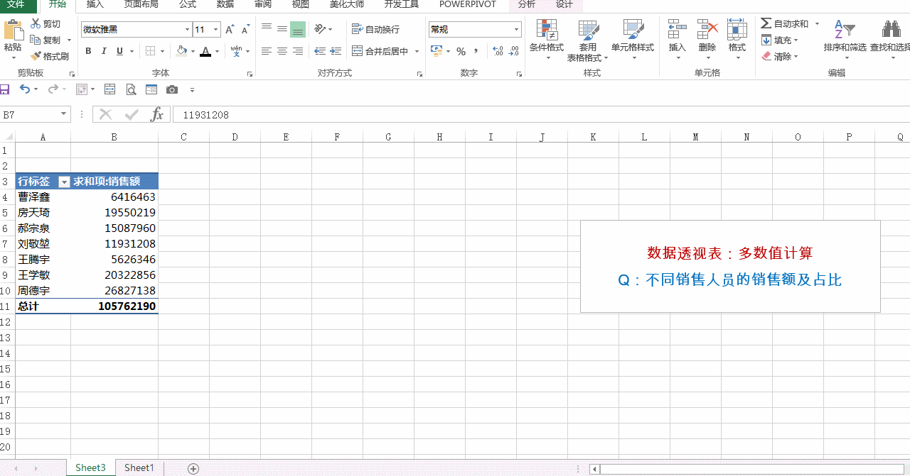

图2:2-数据透视：多数值计算（GIF）

#### 技巧3:根据时间变化创建组，报表多元显示

不只是日期，数据按照月份、季度、年度或者它们的组合展示，统统都可以。

**操作步骤：选中任一日期数据，右键创建组，选中月份，按住CTRL,再选中年，可以随意组合的。这个也可以进行年龄分段统计等问题。**

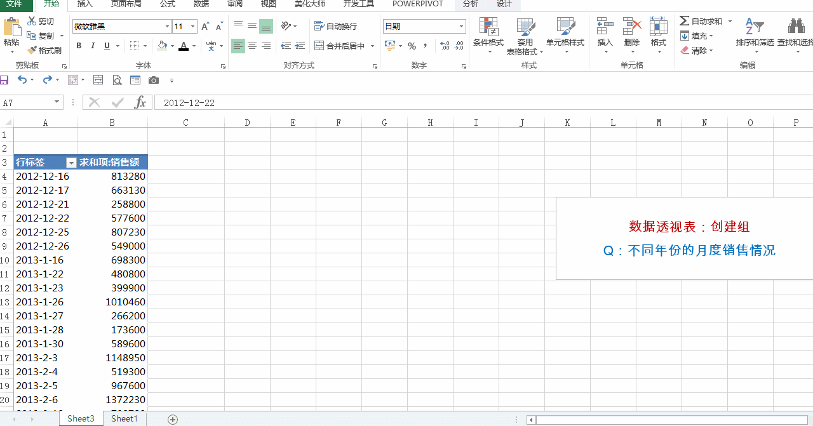

图3:3-数据透视-创建组-时间（GIF）

#### 技巧4：城市组合成区域，只要手动创建一下

北京、天津、沈阳，这些城市如何组合成【华北区】？老板就要的大区级的数据统计，我该怎么办？不要担心，手动创建一下，瞬间完成

**操作步骤：选中要组合的标签（CTRL进行多选）—右键创建组—修改数据标签。**

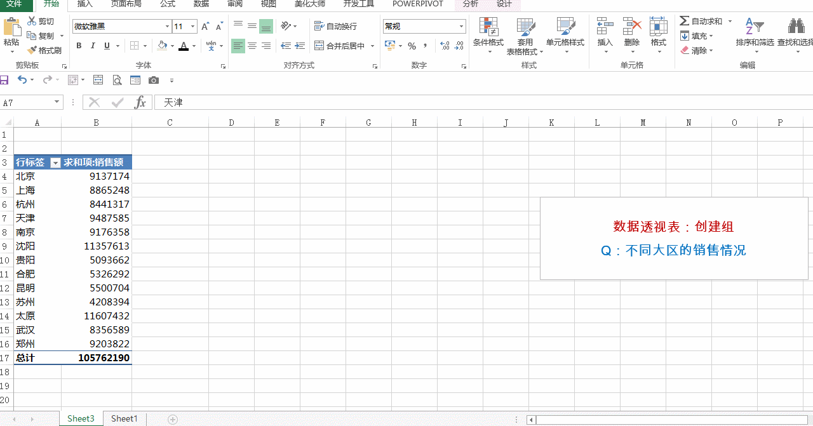

图4:4-数据透视-创建组-区域组合（GIF）

#### 技巧5:数据透视表下，数据排序依然有效

在数据透视表下，将数据升序、降序或者你自己定义的顺序排序？

**操作步骤：选中要排序的任一一数据—右键选择排序—选择升序或者降序。如果是自定义排序，先通过【选项】嵌入自定义排序，然后再选择升序或者降序操作。**

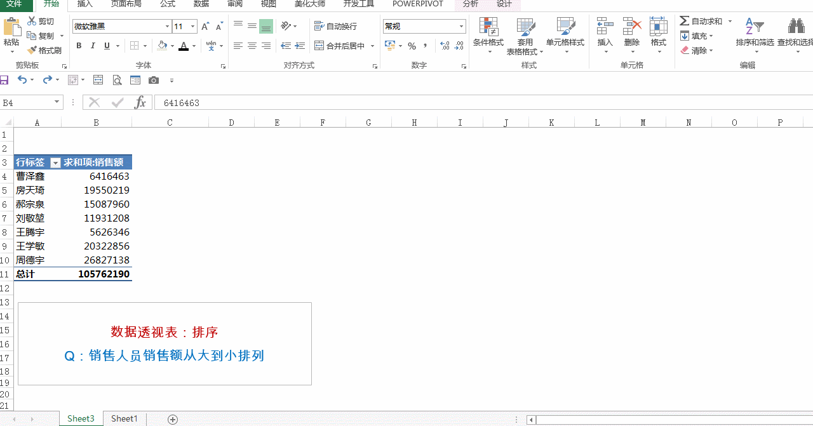

图5:5-数据透视表：排序（GIF）

#### 技巧6:数据也可筛选，想要什么找出什么

找出销售量TOP3的明星销售员？筛选一下，就是这么简单

**操作步骤：选中任一一数据标签—右键筛选—【前10个】—修改为按照销售额最大的3个。**

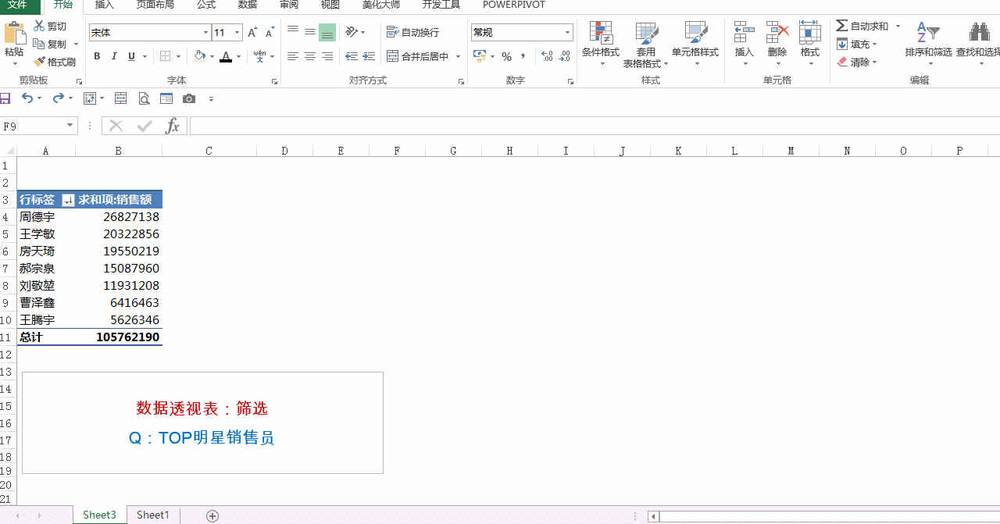

图6:6-数据透视表：筛选（GIF）

#### **技巧7:数据变化了，刷新一下，数据透视表随之而动**

根据统计的维度，我们就可以制作数据透视表模板了。数据一有变化，我们就更新一下，统计结果马上出来，连“拖拖拽拽”的功夫都省了，这就是自动化！

**操作步骤：选中数据透视表中任一数据—右键点击刷新。这个刷新操作是无法自动完成，手动一下，手动一下就好。**

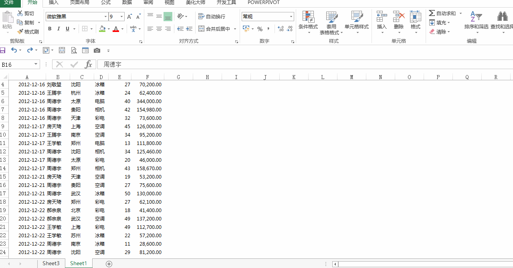

图7:7-数据透视表：手动刷新（GIF）

#### 技巧8:总表分多表，利用筛选器，告别复制粘贴

从系统内导出的总表数据，如何根据我们的需要，比如销售城市、销售部门等标签分成多个分表呢？数据透视表中的筛选器瞬间实现

**操作步骤：将分表的数据标签拖入数据透视表中的筛选器—数据透视表选项—显示报表筛选页—确定。**

双击各个报表的汇总值，符合要求的原始数据就显现了，amazing！


图8:8-数据透视表-筛选器-分页（GIF）

#### 技巧9：数据按照时间轴滚动，日程表来了

让重要数据按照时间轴展现？怎么可能实现得了。插入一个日程表，就足够了。

**操作步骤：选中数据透视表任一单元格—插入日程表，拖拉一下日程表下方的滚动轴，想看哪个月就看哪个月，想看哪几个月就看哪几个月。**

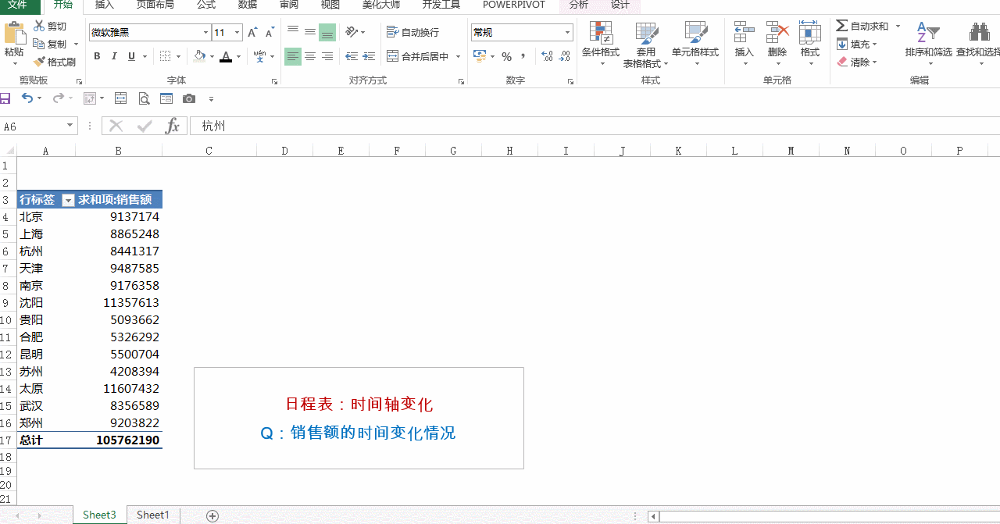

图9:9-数据透视表—插入日程表（GIF）

#### 技巧10:数据的遥控器，切片器

数据演示的时候，老板突然说要看看某个类别的数据，匆匆忙忙赶紧找。唉，能不能给我个数据遥控器，想看什么，点击个菜单。哈哈哈，切片器就是来满足你这个要求了。


图10:10-数据透视表—插入切片器（GIF）

#### 技巧11:切片器多报表链接，按一键即可掌控

切片器不仅能构建多个，而且一个切片器可以链接多个报表。同一个遥控器，按一键，控制的可是多个报表，数据展现轻松畅快。

**操作步骤：选中切片器—右键选择报表链接—选中你需要的数据透视表即可。**

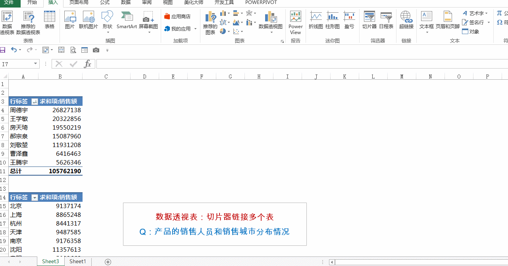

图11:11-数据透视表—切片器—多表链接（GIF）

#### 技巧12:不只有表，还有图形展示：数据透视图

完成的数据报表不只是可以通过表格实现，直接还可以生成图表。如果再配合一个切片器，图表竟然动了起来。

**操作步骤：选中数据透视表任一单元格—数据透视图—选中你需要的图表类型—结合切片器，图表就成为了动态图表。**

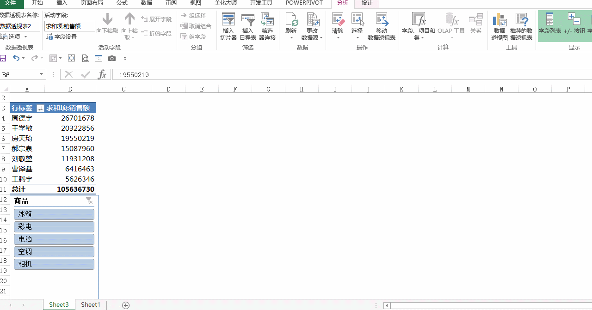

图12:12-数据透视表—插入数据透视图（GIF）

数据透视表的功能是不是很强大，如果再让你完成100张数据统计报表，是不是工作效率瞬间倍增。

**但在这里，还是要给大家一个小贴士：**

数据透视表好用，但原始数据一定要规范：数据标签行只有一行、数据完整、不要汇总统计、不要合并单元格、数据格式规范。千万要记住！


### **VLOOKUP函数**

**权重：25%+**
**重要程度：★★★★★**
**学习难度：★★★★**

在我们的工作中，基本每天都会遇到这样的场景。比如从总表中，根据姓名匹配身份证号信息，根据考核等级确定奖金比例。

这些工作本质上都是匹配调用：匹配同样的数据，调用出我们需要的数据。

要解决这个问题，最常用到的就是VLOOKUP函数。VLOOKUP函数是Excel中的大众情人。我们曾经做过“如果只能选择学习Excel中的一项功能，你会选择哪个”的调查，VLOOKUP函数竟然高居第二位。

**那么VLOOKUP函数究竟如何使用呢？**

VLOOKUP函数语法结构：VLOOKUP(Lookup_value,Table_array,Col_index_number,Range_lookup),即VLOOKUP（查找值，查找范围，返回的数值所在的列数，精确匹配还是模糊匹配）。

#### 技巧13:VLOOKUP函数精确匹配，返回你需要的唯一数据

比如根据姓名匹配身份证号信息，对于这种匹配调用唯一的数据，就要用到VLOOKUP函数的精确匹配了。

**操作步骤：查找范围为绝对引用，可按快捷键F4，精确匹配下参数为0或FALSE。**

注意事项：查找范围和要返回的数值所在的列数都是要从查找值所在的列开始计算。

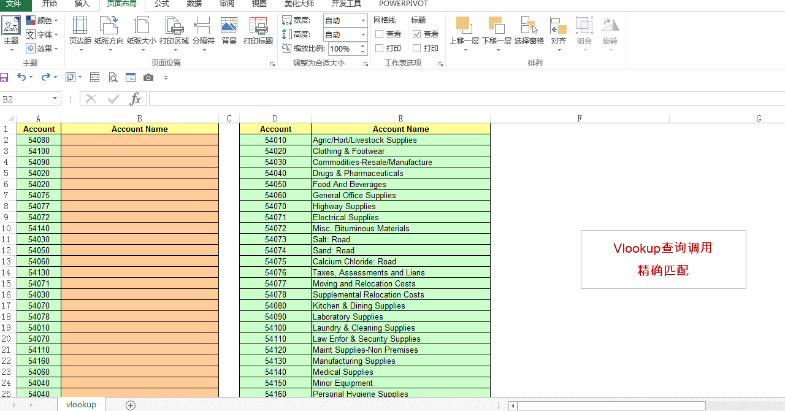

图13:13-VLOOKUP查询调用精确匹配（GIF）

#### 技巧14:VLOOKUP函数模糊匹配，返回你需要的区间数据

比如根据考核等级确定奖金比例，对于这种在区间范围内匹配调用数据，就要用到VLOOKUP函数的模糊匹配了，这个功能完全可以替代掉IF函数的多层嵌套，再也不用为写错顺序发愁。

**操作步骤：查找范围依然为绝对引用，可按快捷键F4，模糊匹配下参数为1或TRUE。**

注意事项：等级表的编制要从小到大

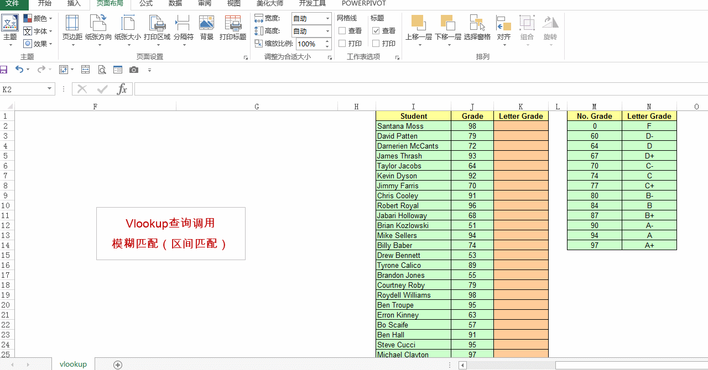

图14:14-VLOOKUP查询调用模糊匹配（GIF）


### **图表制作与可视化**

**权重：20%+**
**重要程度：★★★★**
**学习难度：★★★★**

俗话说：能用数据显示的，绝不用文字说明；能用图形显示的，绝不用数据说明。

#### 技巧15:柱线组合图：数据差异再大，依然清晰展示

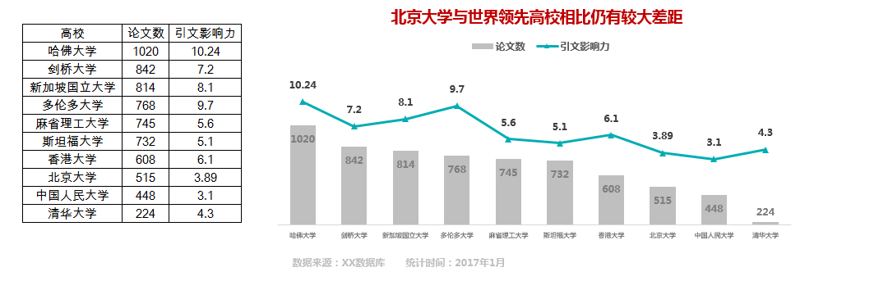

图15:15-图表效果（JPG）

这种工作场景你一定会经常碰到：老板看的数据，既要汇总值，还要变化率，一张图表上如何体现这两类数据差异如此之大的图表呢。

第一步：插入图表，创建组合图

**操作步骤：全选数据—插入图表—二维柱形图—选中图表后在【格式】选项卡下选中“系列引文影响力”—【设计】选项卡下更改图表类型—系列引文影响力变为折线图，同时勾选次坐标轴。**

注意：对于数据差异比较大的数据，次坐标轴一定要学会用

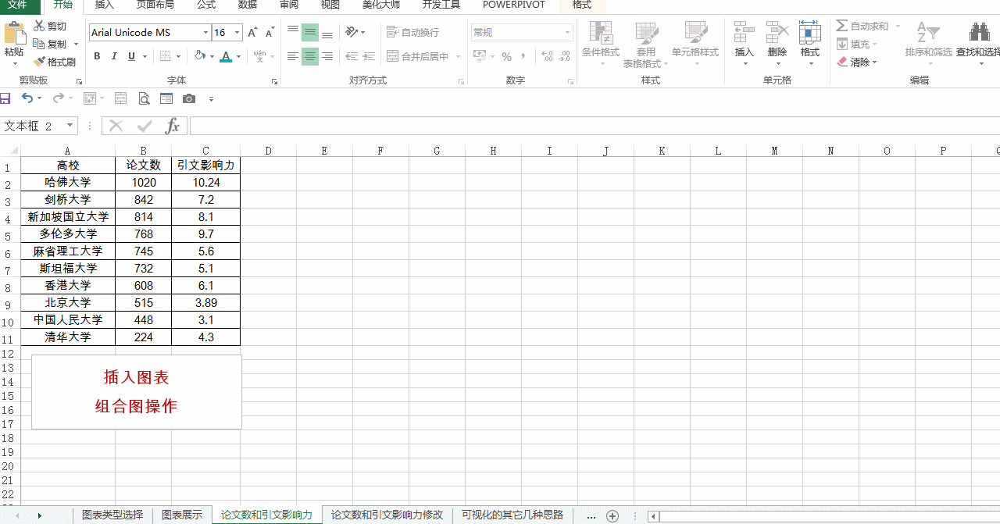

图16:16-插入图表-组合图（GIF）

第二步：添加图表元素，添加数据标签

操作步骤：选中图表—点击图表右侧的+号—勾选数据标签项—选择添加位置。

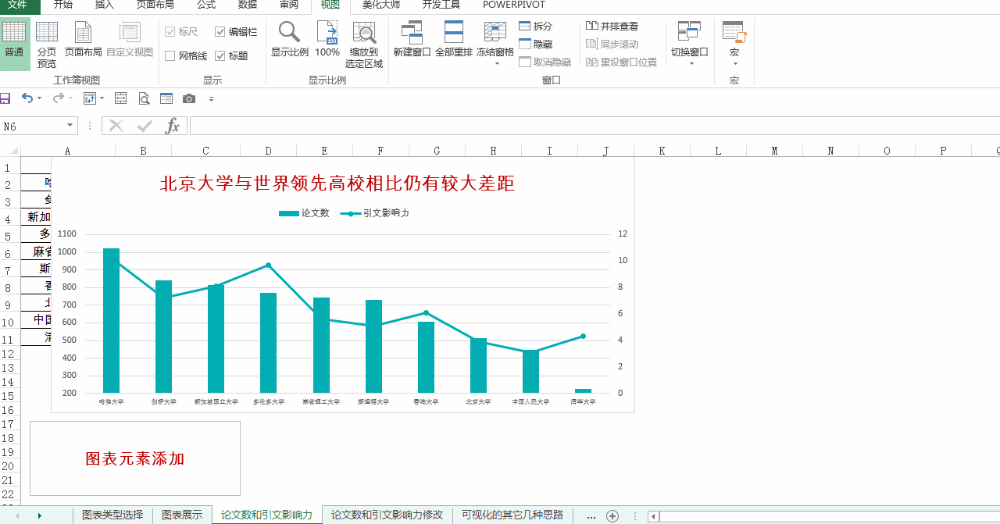

图17:17-图表元素添加-添加数据标签（GIF）

第三步：坐标轴设置与隐藏，柱线分离，网格线删除

当添加完数据标签后，坐标轴存在的意义就不大了。

**操作步骤：先双击主坐标轴（左边）—【坐标轴选项】起点200，间隔400，柱形图相应下降，标签位置选择无（隐藏）。**

双击次坐标轴（右边）—【坐标轴选项】起点-10，折线图相应上升标签位置选择无（隐藏）

选中网格线，直接按Delete键或者取消网格线勾选

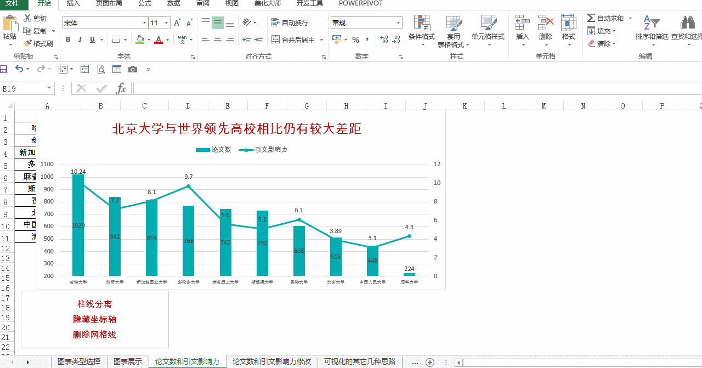

图18:18-柱线分离—隐藏坐标轴—删除网格线（GIF）

第四步：基本美化设置

**操作步骤：柱形图间距比例调整为75%-100%，折线图数据标签选择三角形等。**

注意：标题可以改得更加醒目，给出直接结论更好；添加数据来源，显得更加规范。图表中的字体可以使用微软雅黑或者Arial Unicode MS，配色可以去模仿商业杂志的配色，图表就会看起来非常专业。

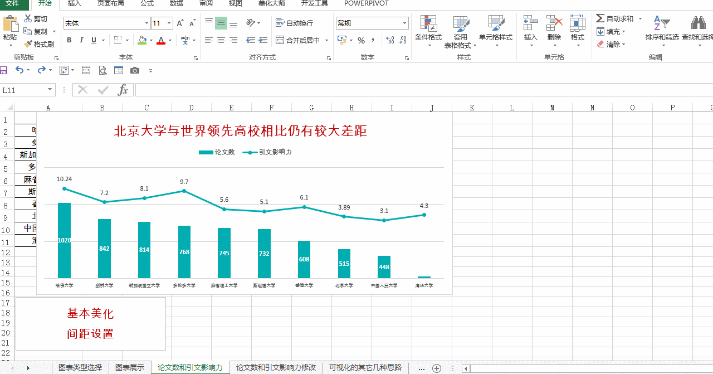

图19:19-基本美化-间距设置（GIF）

让图表嵌入到单元格或以诸如条形图等方式展示，也是除了图表之外，让数据可视化的常用手段。这里给大家带来三种。

#### 技巧16:条件格式，让你的数据会说话

我们经常会这么做：对于增长的数据我们标注绿色的上升箭头，不变的变为平行的黄色箭头，减少的标注红色的下降箭头。

这就是条件格式，它提供条形图、色阶、图标集等很多种显示方式，功能强大。

**操作步骤：选择数据—条件格式—条件格式类型选择。**

对于已经设置好的条件格式，我们也可以通过编辑进行再次设置。

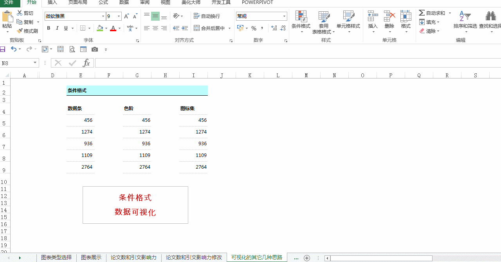

图20:20-条件格式（GIF）

#### 技巧17:REPT，函数也可以制作条形图

不只是通过插入图表设置条形图，函数也可以哒。=REPT（text，number_times)。即REPT（“符号”，次数）

**操作步骤：“|”位置输入键在ENTER键上方（\键），重复次数可根据情况使用原值或扩大或减小，比如重复次数\*2。**

最后设置字体为Playbill，更改字体颜色即更改条形图颜色。

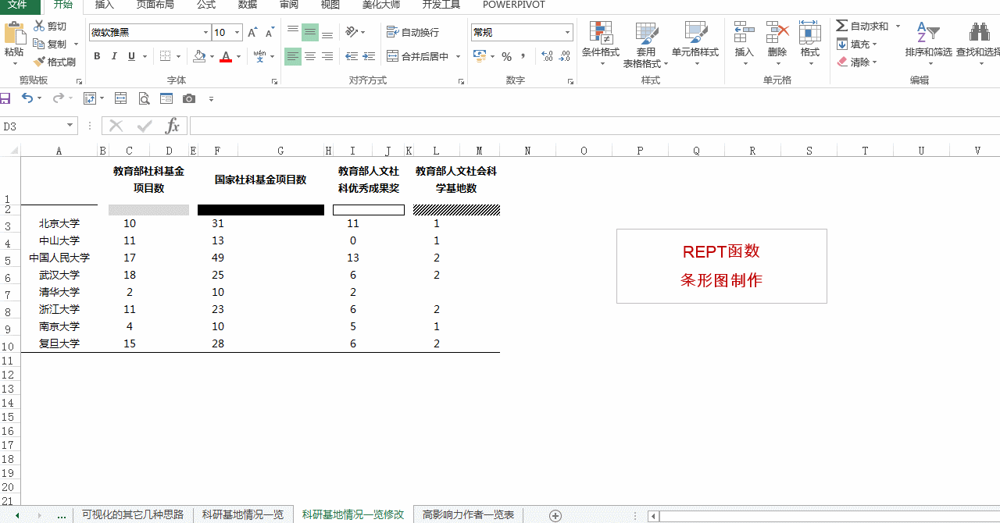

图21:21-REPT函数，条形图制作（GIF）

#### 技巧18:迷你图，让数据更直观

将柱状图、折线图、盈亏图等嵌入单元格里有没有很酷炫的感觉？插入迷你图，就可以实现了，效果绝对棒棒哒！

**操作步骤：全选数据—插入迷你图—选择迷你图类型—选择迷你图插入位置。**

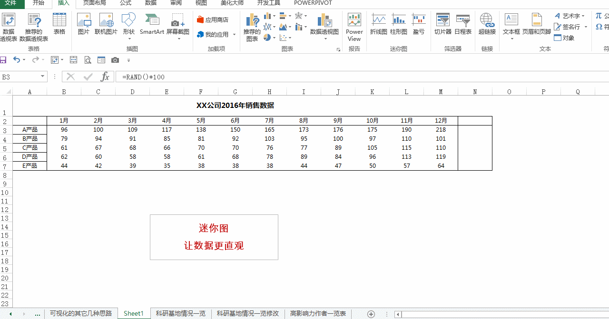

图22:22-迷你图（GIF）

**心动不如行动，马上学习起来吧！**

**请持续关注LinkedIn专栏【Office魔法学院】：**

[北大硕士给大脑植入Excel病毒，工作效率提升了好几倍](https://mp.weixin.qq.com/s?__biz=MzA4ODM1MTMzMQ==&mid=2651801655&idx=1&sn=26a2e1f69d933cbd1633a0c1a91f53d2&chksm=8bd09f3bbca7162de2fefd47368f3818384e027d925c10bd7ddf78edd6be4fa574dc6de43a4b&key=6b0fbfcb936d93fa84b70fbbc3b8c7cba72ef5629132c5c3eec17da9cbf1804326a4beb64790740c73148e53c9a6ba99274cbc67e7e88e6dd5ee6c18a79be3ab82dd00630e9f8f356112ba66e6153da2&ascene=0&uin=MTAzMjg1Mjg2MA%3D%3D&devicetype=iMac+MacBookAir7%2C2+OSX+OSX+10.11.3+build(15D21)&version=12020010&nettype=WIFI&fontScale=100&pass_ticket=eOB%2BnSmDwhWDJdDIZQxk2S0f8qyhHt5XXBU0V%2BR15XeyP3dQdqW9vkRtqCB6U91C)

[真正的Excel，](http://mp.weixin.qq.com/s?__biz=MzA4ODM1MTMzMQ==&mid=2651796448&idx=1&sn=bede656a094c0bdba4e3cb289259bfdd&chksm=8bd0e4ecbca76dfa12d9e9348a307a9dc9d18a27a28f4db4c711fe951ce9fd2d98f39e20b469&scene=21#wechat_redirect)[其实你只用过1%](http://mp.weixin.qq.com/s?__biz=MzA4ODM1MTMzMQ==&mid=2651796448&idx=1&sn=bede656a094c0bdba4e3cb289259bfdd&chksm=8bd0e4ecbca76dfa12d9e9348a307a9dc9d18a27a28f4db4c711fe951ce9fd2d98f39e20b469&scene=21#wechat_redirect)

[如何使用Excel“拖拽”技巧，10倍提升工作效率？](http://mp.weixin.qq.com/s?__biz=MzA4ODM1MTMzMQ==&mid=2651797773&idx=3&sn=849a4a4a3051ad55872c7b65edf67494&chksm=8bd0ee01bca767174d99fc1145edfc5f6556e0089320633faaf76b9275b980492254ce487c7b&scene=21#wechat_redirect)


本周四，领英系列职人纪录片***\**\*《我的职业日记》**即将放出第二集，本集的主人公是辩论女王、奇葩之王、媒体创业者***\**\*马薇薇**。

接下来，我们会把摄像头对准一个万千少女羡慕嫉妒的职业——时尚电商的美妆产品采购，也就是***\**\*美妆买手**。

每天接触最新最潮的彩妆，“买买买”、“花花花”是TA们的日常，只为了和更多人分享美丽。

***\**\*不论你是女生还是男生，你有什么问题想要问美妆买手吗？关于这份工作和这个行业，有哪些方面是你希望了解的呢？**

## 王者级函数，XLOOKUP发布即封神，秒杀VLOOKUP

首先简单了解一下XLOOKUP的语法：


XLOOKUP有6个参数，后面3个参数在大多数使用情况下可以省略，初学者先学会前面3个参数如何使用即可。

再回顾一下，函数或者公式的标点符号运用：


接下来通过实际案例来学习XLOOKUP，如果你有WPS建议使用WPS学习XLOOKUP哈。

### 1. 正向查找

我们需要找出学号19105的学生姓名。

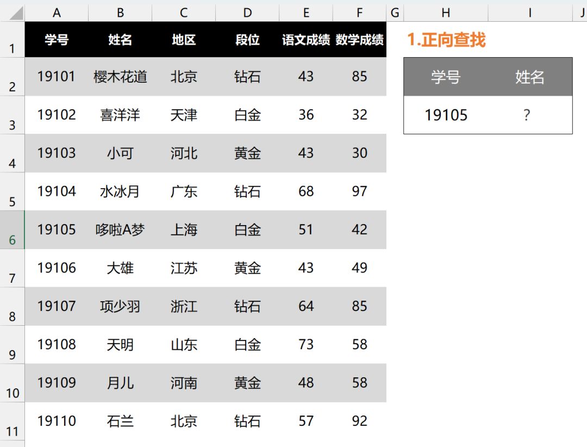

这种情况直接输入公式：=XLOOKUP(H3,A:A,B:B)

翻译中文就是：=XLOOKUP(查找值,查找值所在列,结果所在列)

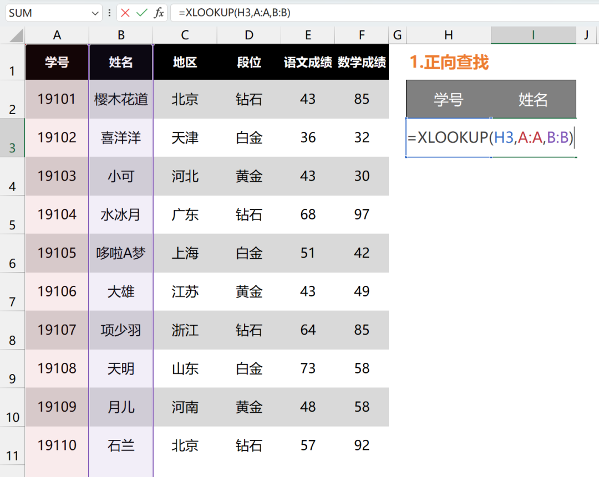

这里的第2和第3个参数可以选择整列内容，或单元格区域如：=XLOOKUP(H3，A1:A11,B1:B11）

### 2.反向查找

在之前使用VLOOKUP，最害怕是反向查找，因为VLOOKUP只能看到由查找列右边的数据，看不到左边的数据。

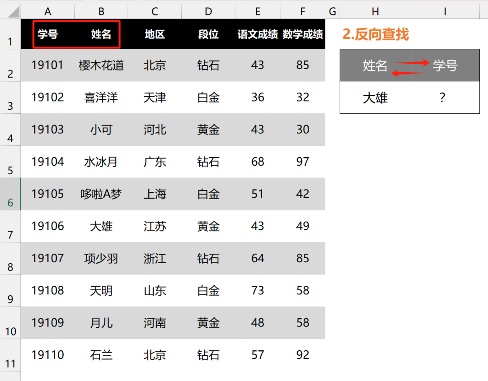

XLOOKUP就很好改进了这点，和正向查找一样丝滑，直接输入公式：=XLOOKUP(H3,B:B,A:A)

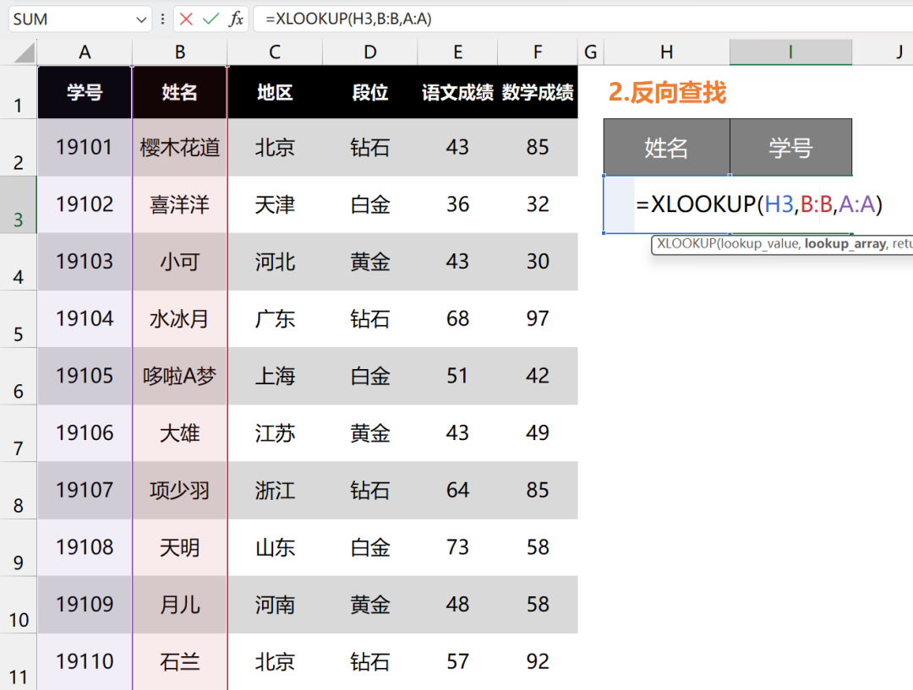

### 3.横向查找

作为一名全能战士，横竖都能找。之前我们使用HLOOKUP查找，现在直接用XLOOKUP解决。

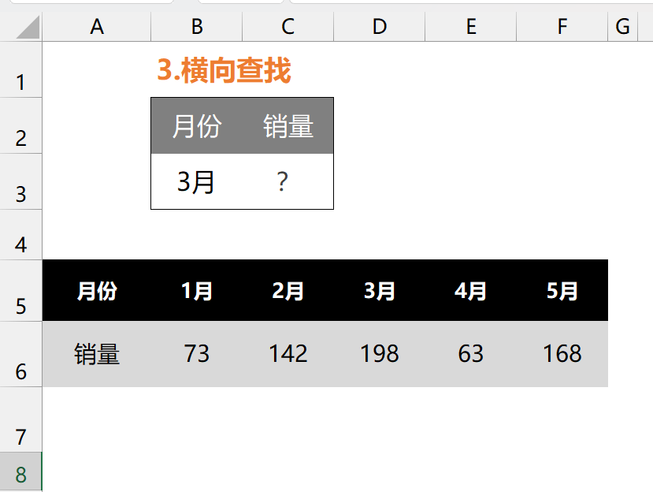

输入公式：=XLOOKUP(B3,A5:F5,A6:F6)

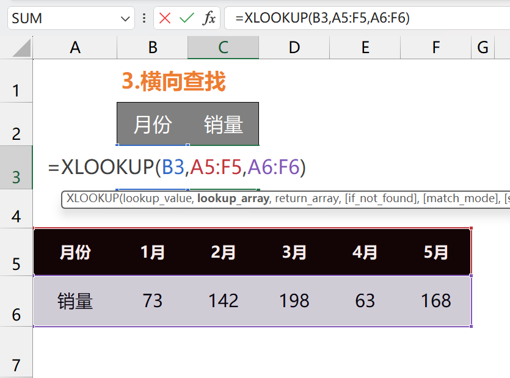

横向和竖向公式最大的区别就是第2和第3参数，由列换为行，A列B列换为第5行，第6行的单元格区域。

### 4.查找多列

查找多列的前提条件是要的多列数据与数据源的顺序一致，如下图红框的顺序对应的才能使用该方法。

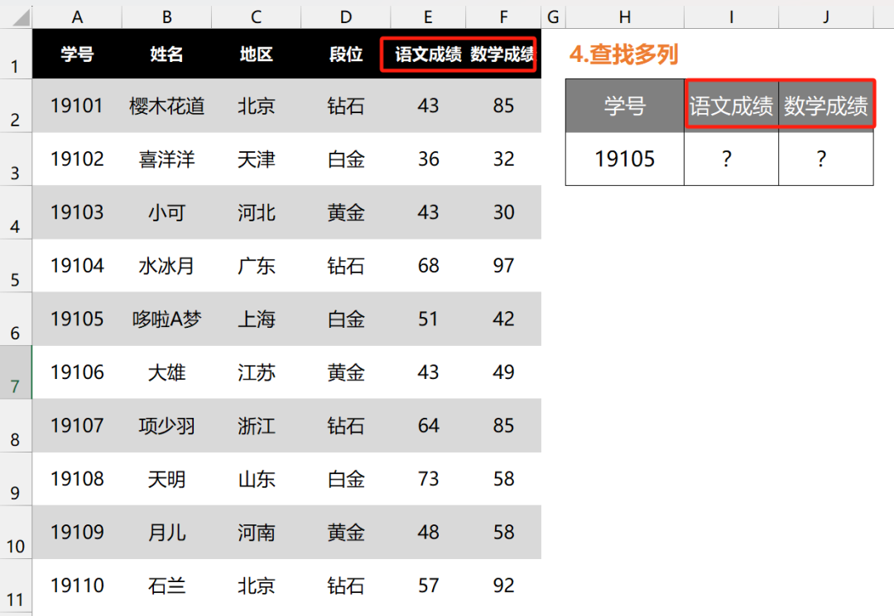

一起选择到I3:J3这2个单元格，输入公式：=XLOOKUP(H3,A:A,E:F)

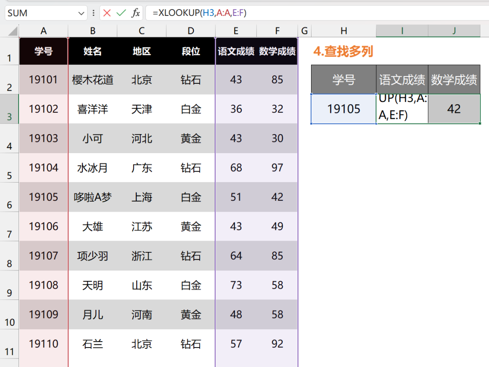

这里值得注意是第3个参数选择了E和F列，而不是我们前面案例中的单列。还有输入完所有公式后，需要按**Ctrl+shift+Enter**三键结束。

因为返回是数组都是要以**Ctrl+shift+Enter**三键结束，2个数值或以上称为数值，语文和数学成绩2个数。结束后再编辑栏看到公式会被{}大括号包围的效果。

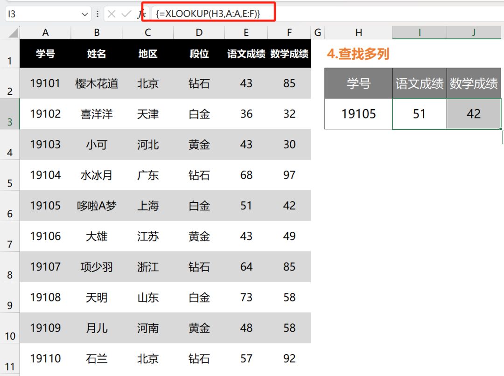

### 5.多条件查找

在遇到某些条件一样时，我们会使用到多条件查找。

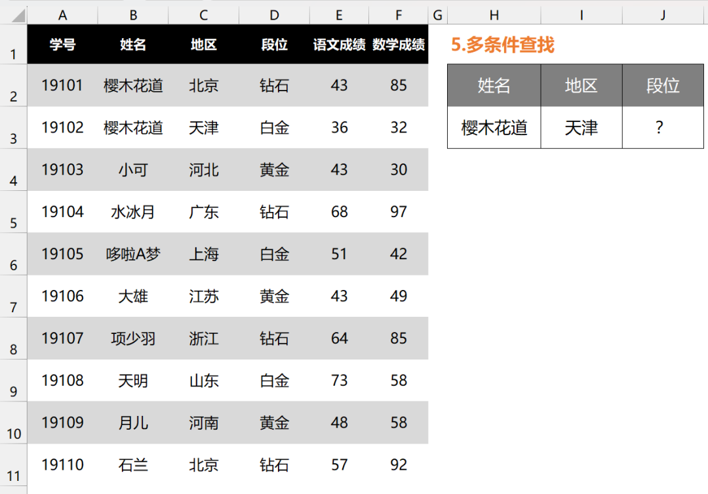

这里输入的公式是：=XLOOKUP(H3&I3,B:B&C:C,D:D)

多条件查找公式：=XLOOKUP(查找值①&查找值②,查找值①所在列&查找值②所在列,结果所在列)

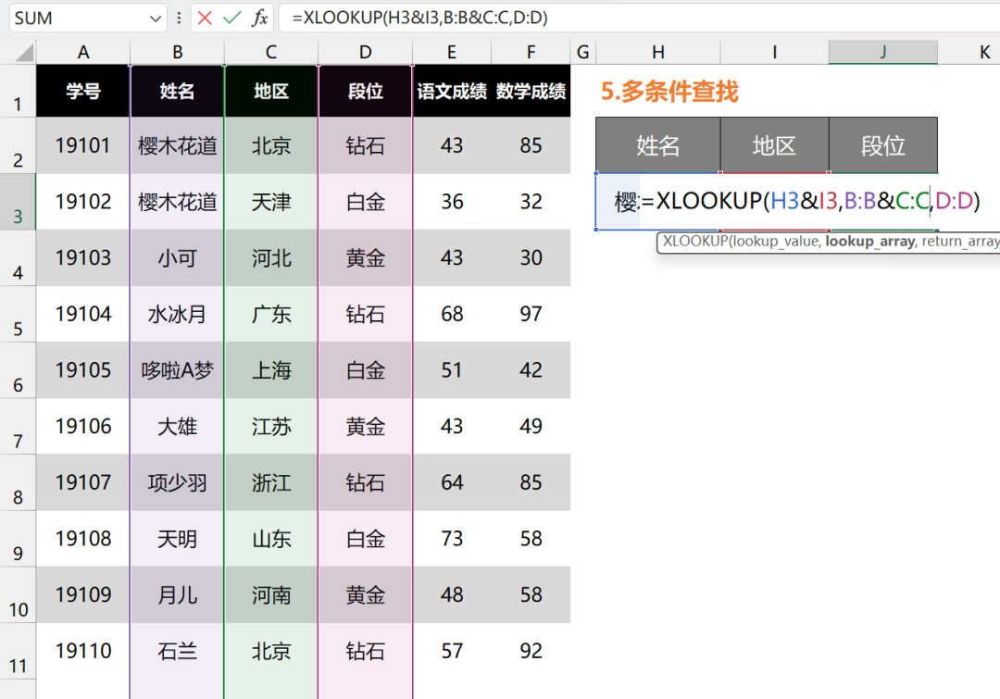

别看多条件查找公式长，但它还是3个参数。第一个参数需要2个单元格，这里使用&把2个单元格链接起来，不用&单元格则会变成文本“H3I3”，无法发挥实际作用。

第一个参数&链接起来，那第二个参数也是用&链接2个查找值所在列。

接下来3个案例就使用到后面3个可以省略的参数，可以简单了解一下哈。

### 6.找不到值

因为案例中喜洋洋和喜羊羊名字不匹配，所有找不到正确的值，返回#N/A错误值。

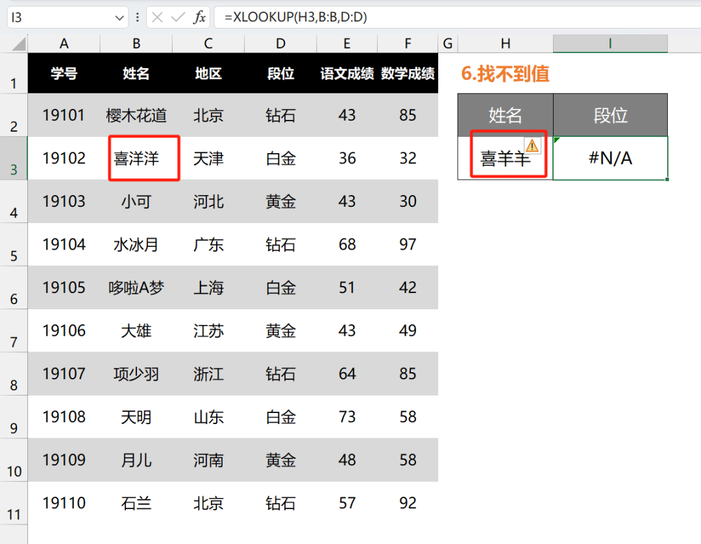

有许多同学不知道这个是怎么错了，这里我们可以使用第4个参数提示错误。

公式：=XLOOKUP(H3,B:B,D:D,"**姓名错误**")


第4个参数这里的中文，需要用英文的双引号引着。"**姓名错误**"

### 7.近似匹配


输入公式：=XLOOKUP(E3,A:A,B:B,,-1)


这公式与之前最大不同就是第3参数后面有2个,,逗号，这里的逗号用于占位，第4个参数省略了，到了第5个参数的输入位置。

到了第5参数输入时，第5个参数颜色更深一些。这里也有公式提示如0精确匹配，-1精确匹配或下一个较小的项目。我们题目要求是-1。


### 8.逆向查找

逆向查找，是从最后一行查找到最前面一行，才会使用到第6个参数。因为第3参数到第6隔开3个，用3个逗号占位。

输入公式：=XLOOKUP(E3,B:B,C:C,,,-1)


后面这3个参数在常见情况下，一般都是直接省略，只有在特殊情况下才会使用。

## 你知道超级表吗？Excel中的“超级英雄”

工作中，我们总免不了用 Excel **制作表格——整理数据——美化表格。**

一般来说，我们刚刚整理完数据以后，表格大致是这个亚子的：


不用我说，大家也都知道，这样的表格没有进行任何美化加工，肯定要被扣🍗啦~

如果你学过一点 Excel，那一定会想到，利用【Ctrl+T】将表格转化为「超级表」，就可以快速美化数据。喏，就是下图这样：


转化为超级表后，数据不仅变得**更加美观，并且便于查看，不宜错行。**

但超级表的功能远不止如此，小安这就来带大家学习一下它的 9 大功能！


### **自动填充公式**

在超级表中输入公式，会自动填充一列，省去了下拉填充的步骤（也可以撤销这个填充操作）。


### **自动更新序号**

在 A2 单元格输入公式：

```html
=ROW()-1
```

公式自动填充到超级表最后一行，生成从 1 开始的序号；并且添加行、删除行后，序号均可自动更新。


当然，如果不套用超级表，直接使用 ROW 函数，插入新行序号也是可以更新的。

区别在于，**超级表插入的新行会自动编号，而普通表格插入的新行则不会自动产生序号。**


### 显示标题行

转化为超级表后，向下滚动查看数据，标题行会始终显示在「列标签」上，尤其是有很多行数据时，我们查看数据就非常方便啦！


想想看，这个是不是和冻结窗格很类似呢？但是，它是自动的哦~


### 自动扩展数据区域

如果我们在超级表最后一行继续录入数据，录入的新数据会自动套入超级表中，

这个功能，也为**数据透视表及图表的联动变化**奠定了基础。


PS：联动变化，就是在超级表中录入新数据时，数据透视表和图表也会自动将新数据汇总进来。


### 联动数据透视表

新数据录入后，会自动套入超级表格式，基于此，再插入数据透视表。

这样数据透视表也就拥有了联动更新的功能，**即刷新数据透视表后，新数据自动录入数据透视表中。**


### 联动图表

除了数据透视表可以联动更新以外，图表也是一样的道理！

在表格中录入新数据，图表会自动更新：


### 自带筛选功能

转化为超级表后，数据区域会自动生成筛选按钮，可以直接筛选数据。


如果想关闭筛选功能，可以使用快捷键【Ctrl+Shift+L】。


### 切片器快速筛选

我们都知道，切片器可以用在图表或者数据透视表中，方便我们展示数据；

但是在 Office 2010 以上版本，切片器也会对超级表生效，可以**实现快速筛选！**

首先我们按照部门插入切片器：【插入】——【切片器】——「部门」；


点击切片内的选项可以看到，超级表会根据切片的选项，筛选出相应的内容，如下图：


这种筛选方式看起来是不是更加高大上呢~


### 多种汇总方式

将表格转化为超级表后，将光标定位在表格内，可以看到上方多出了【表设计】选项卡；

勾选「汇总行」即可在原数据下方出现汇总行，如下图：


这里的汇总方式，可以随意选择：


当然，这个汇总方式是用函数计算的，我们可以在编辑栏看到，这是 SUBTOTAL 函数；


因此汇总行，仅仅对可见单元格数据进行汇总，配合筛选使用非常方便哦~

好了，对于超级表的介绍就到这啦里，如果文章对你有所帮助，记得分享给更多的人哦~

💬

【Ctrl+T】可以将表格转化为「超级表」，那你知道如何将超级表转化为普通表格吗？在留言区告诉大家吧！

## 两个表格快速核对，Excel数据透视表轻松搞定


举个工作中的例子，我们有两个表格，里面都列出了各区域，各商品的销售数量

我们想快速核对这两个表格之间的差异在哪里


表一和表二之间的数据顺序是不一样的

而且表一和表二之间项目有多有少

需要快速核对差异，可以使用Excel数据透视表法，轻松搞定

### 1、添加辅助列

我们需要建立一个子表，然后建立辅助列，然后将两个表格的数据粘贴过来

同时在辅助列，对于不同的表格数据区域分别标记，表1和表2


### 2、建立数据透视表

我们选中数据区域，然后在插入选项下，点击数据透视表，在弹出窗口，直接点击确定


在一个新的工作表中，将仓库和商品字段放在行标签，将辅助列，放在列标签，将数量放在值里面，然后会得到如下的数据透视表


这里面竖向的总计是不需要的，我们可以进行取消，在设计，里面点击总计，仅对列启用，如下所示


### 3、找出差异

有两种方法，第一种方法，直接用减号进行运算，我们输入的公式是：

=C5-B5


其实上面方法已经可以达到效果，但是还可以尝试用一种更高级的方法来进行计算

我们可以点击透视表中的纵向标题字段

然后点击数据透视表分析，点击字段、项目和集，点击计算项


然后在计算项里面，自定义一个名称，输入公式：

=表2-表1


这样的好处是，让我们手动计算的这部分，也成为了数据透视表的一部分，当你添加字段时，数据不会被覆盖

## 数据录入的几个坑，你有没有被坑过？

小伙伴们好啊，今天分享一组和数据录入有关的内容，看看下面这几个坑，你有没有被坑过。

### 1、一言不合就合并

掉坑指数 ☆☆☆☆☆

在工作表中大量使用合并单元格，这样的后果是不能正常排序和筛选，也无法填充公式。


**避坑建议**：除了要直接打印或是领导有特殊要求的表格，其他表格你就规规矩矩的录入吧。

### 2、字数不够空格凑

掉坑指数 ☆☆☆☆☆

很多小伙伴习惯用空格对齐两个字的姓名，殊不知“罗燕”和“罗 燕”会被Excel识别为不同的内容，在查找或是汇总数据时，麻烦就来了。


**避坑建议**：如需对两个字的姓名对齐，可以选中单元格区域，按Ctrl+1组合键打开【设置单元格格式】对话框，将水平对齐方式设置为分散对齐。

### 3、满屏都是批注点

掉坑指数☆☆☆☆

在Excel文档中使用批注，可以对需要特殊数据进行进一步的说明。但是批注的内容使用常规方法无法提取，里面的数字也无法汇总，一旦被滥用，那就是自讨苦吃了，就像下图中的批注，你要怎么汇总？


**避坑建议**：必要时可以加上一列备注来替代批注功能，这样在编辑、汇总时都会方便很多了。

### 4、填充颜色随意标

掉坑指数☆☆☆

对符合特定条件的数据使用手工标记颜色，虽然外表看着美观了，但是Excel无法按照颜色进行汇总，一旦要按指定条件汇总数据，就只能干瞪眼。时间久了，自己都不知道这些颜色表示啥意思了：


**避坑建议**：如果要对符合某种条件的数据进行标记，别忘了使用条件格式。需要汇总时，可以根据条件格式的规则来指定汇总规则。

### 5、数、量合伙不分家

掉坑指数☆☆☆

把Excel当成Word用，眉毛胡子一把抓，所有内容都放到一个单元格里，这样的数据，你怎么汇总？


**避坑建议**：养成记流水账的习惯，同一个项目单独记录一行，每个单元格中只存放一项内容。

### 6、日期数据随意写

掉坑指数 ☆☆☆

8位数字的日期、小数点间隔的日期，想必小伙伴们都遇到过，一旦要按日期进行汇总，马上歇菜。


**避坑建议**：规规矩矩录入，别动花花肠子，2020/2/5或是2020-2-5都可以识别，其他的还是省省吧。

### 7、一个单位N个名

掉坑指数☆☆

同一个单位的名称各式各样，简称全称齐上阵，A1是“上海测量研究所”，到A10就成了“上测所”，到最后自己都不知道谁和谁是一家了。

以上这些是刚刚学习Excel时最常挖的一些坑，说一说，你还遇到过哪些坑呢？

好了，今天咱们的分享就是这些吧，最后留一个小问题，将任意工作表命名为“**历史记录**”，成功的小伙伴请举手。


## 38岁的VLOOKUP要光荣退休了？这个新函数好用到爆哭

**Vlookup**可以说是 Excel 使用最广泛的函数之一。

不知不觉，它已经陪我们度过了 38 个春秋，它让千千万万人免于加班脱发之苦，然鹅……

早在 2019 年，微软官方就放了个大招，发布**Xlookup** 函数，但是只有**Office 365 版本**才可以使用；不过现在下载新版 **WPS 版**，也可以免费使用 Xlookup 函数了**。**


和 Vlookup 相比，只是字母从 V 变成了 X，**功能却强大了好几倍！**


接下来，我们先了解一下「什么是 Xlookup？」，再通过 6 个常见的需求，看看 Xlookup 函数到底厉害在哪儿~

PS. 本文演示版本：WPS Office 最新版；练习文件获取方式见文末。


### 普通查找

Vlookup 我们都再熟悉不过啦，主要就是查询匹配数据。

Xlookup 的用法也是一样滴，But 它还可以看做是**Lookup 家族的合体版！！**


Lookup 家族：Vlookup、Hlookup、Lookup、Index、Match。（可见合体版有多强大……）

举个栗子！

这里我们要根据「姓名」，查询每个人的「在职状态」。


用 Xlookup 来实现，简单的很~

在 J4 单元格中输入公式：

公式是啥意思呢？解释一下：

`XLOOKUP(要查找的值,查找的区域,返回的区域)`

对应上图一起来看，是不是很好理解。

Xlookup 函数的优势就在于，**在确定要查找的区域、返回的区域时，我们可以直接选中一整列，**比如这里就选中了 C 列、E 列数据~

这样公式只需 3 个参数就搞定啦！


But 用 Vlookup，我们需要写 4 个参数……

而且！要一次性选中整个区域，再来挨个数数，看返回的区域在整个区域中排第几位……

公式如下：

`=VLOOKUP(I4,C3:E19,3,0)`

解释一下就是：

**\*=VLOOKUP(要查找的数值,查找的区域,查找返回列,查找模式)\*\*\***


这样一比较，你是不是发现 Xlookup 函数在普通查找中表现更优秀？


### 多条件查找

写到这里隔壁小 E 跑过来吐槽：

切，不就是少了一个参数，值得把 Xlookup 吹上天吗？你个喜新厌旧的坏人！


那我们再来看一个案例，还是根据「姓名」，查询「在职状态」。


但是……眼神好的同学一定发现啦，数据中有两个同名的「小叶」，直接查找一定会出错！

所以，要**同时根据「部门」和「姓名」**，来查找在职状态~

先用 Xlookup 函数，把公式写出来给你们看：


什么意思呢？思路是这样的：

❶ 把查询结果中，「部门 I 列」和「姓名 J 列」合并，一起作为「要查找的值」：

❷ 选择「查找区域」时，也把「部门 B 列」和「姓名 C 列」合并起来查找：

❸ 最后，选择「返回的区域」为：

我们会发现，Xlookup 函数居然可以直接用&符号，把列合并起来！这也太方便了吧！


但同样的思路，用 Vlookup 就复杂了……

光说这公式，我就先晕辽：

▲ 左右滑动查看

> 参数 1，用&符号，把部门和姓名合并在了一起。 参数 2，用 IF 函数，构建查找列 B4:B12&C4:C12 和返回列 E4:E12。 参数 3，返回第 2 列。 参数 4，精确查找。


参数 2 的写法，实在是看不懂啊。这里还构建了一个动态区域：

这段公式相当于构建了下面的数据：


看不明白吧？看不明白就对了！

这不就说明了，Xlookup 更好用嘛！


### 未找到值

当我们在查找一个不存在的值，表格通常会返回一个错误乱码。

这时，在 Xlookup 中，可以添加一个较为特殊的参数[未找到值]，它的作用是**在我们查找不存在的值时，能够返回指定内容**。

来看看这个案例，查询「丽丽」所在的「入职日期」。


用 Xlookup 函数查询很简单，公式如下：

但是结果……是这样滴……


这说明公司里并没有这名员工，所以入职日期这一栏才会显示#N/A。

如果我们在[未找到值]填入一个信息，比如「查无此人」（需要用英文双引号框起来），那么单元格就会显示设定好的内容：


而 Vlookup，不用说，它并没有这样的功能。


### 反向查找

前面 3 个案例，相信大家已经感受到 Xlookup 的简单、好用了，但是离上天，还差点儿。

再来看这个需求，要根据「姓名」查询「部门」。


非常简单嘛，和按「姓名」查找「在职状态」没两样啊？！

fine，咱先不说 Xlookup，没有对比就没有伤害，先看 Vlookup。

用过 Vlookup 同学都知道，它有一个通病：**只能从左往右查找。**

也就是说这里需要「姓名」在左边，「部门」在右边，才方便查找。

而表格中「部门」在左边，所以查找起来会很麻烦。

公式如下：

▲ 左右滑动查看

我天，又是 IF({1,0})的方法，再见。


再看 Xlookup，一如既往地简单优雅：


Xlookup 在选择时，只需要分别选择查找列和返回列就行，所以根本不存在左右的问题~


再说了，这里查找「小叶」的部门时，因为有两个小叶（重名）。

而**Vlookup 默认只能查找到第 1 条记录**，也就是「生产部」。

如果我想查找在「客服部」的「小叶」，要怎么写呢？

给 Xlookup 加个参数「0,-1」就可以了：


「0,-1」这个参数并不难，来解释一下：

> 0 表示匹配模式为精确匹配。 -1 表示从下往上查找；如果输入 1，表示从上往下查找；输入 2，表示升序排序的二进制文件搜索；输入-2：表示降序排序的二进制文件搜索。（后两种搜索模式一般不用）

所以填写 -1，就能找到最下面位于「客服部」的「小叶」~


### 一对多查找

现在我们要根据姓名，把员工的全部信息都查找出来，共计 4 列，所以返回值也有 4 个。

如果用 Vlookup 函数，为了解决返回列变化的问题，需要**结合 Column 函数**来写公式。

▲ 左右滑动查看


公式填写好之后，向右拖动填充即可。

但……如果你不会 Column 函数，解决这个问题最好的方法，就是赶紧关掉 Excel，眼不见为净。


在这个问题上，Xlookup 的处理方式会更高级。

简简单单一个公式就搞定：

注意！返回数组须框选所有区域，输入公式后按下【**Ctrl+Shift+Enter**】才能得出正确结果。


奥秘就在第 3 个参数「D3:G12」上。

参数 3，选择返回列的时候，把所有需要返回的列，一次性都选上。

聪明的 Xlookup 同学，**会根据返回列的列数，自动填充相邻的数据列~**

高效又简单，大家快给我夸夸！


### 模糊查找

这里我们要根据 G 列的「绩效」，算出 I 列的「绩效评比」结果。


评比规则如下：


我猜，很多人遇到这种问题，都会写长长的 IF 函数吧？

▲ 左右滑动查看

这种情况其实可以用 Vlookup 解决~

在一些**绩效、提成**的计算上，用 Vlookup 模糊查找，可以避免反复地写 IF 函数嵌套。

在 I4 列输入公式：


糟糕，好像翻车了……


小伙伴们注意啦！！！

在使用这种模糊查找方法时，「绩效」列的数字必须**从小到大**排序，否则查询就会出错。


正确操作：


但是！没错，但是来了——

Xlookup 的解决方法，更加简单易懂，改一下参数就好。

▲ 左右滑动查看


前 3 个参数和 Vlookup 道理一样，重点是第 4 个参数：**设置查询匹配的模式**。

参数 4 有下面几种用法：

> 0 表示精确匹配，若未找到所查找内容返回#N/A。 2 表示可使用通配符匹配 。 1 表示精确匹配，若未找到所查找内容返回较大项。 -1 表示精确匹配，若未找到所查找内容返回较小项。

这样一来，不管「绩效」列的数字按什么顺序排，都不会影响我们查找结果！

又比 Vlookup 函数节省了好几分钟呢~


怎么样，看完这篇文章，是不是感觉 Xlookup 比 Vlookup 强大了好几倍呢？

## 选择性粘贴，5个高级用法，你会么？

当你还在普通复制粘贴的时候，你同事已经用上了选择性粘贴，提升工作效率，告别加班，今天分享选择性粘贴的5个高级用法，最后一个大部分人没用过

### 1、快速行列转置

如下所示，左边的竖向数据，和右边的横向数据，我们需要相互转换


我们只需要复制数据，然后右键，选择性粘贴，勾选转置即可，如果原始数据中有公式，则需要勾选粘贴成值，操作动图如下所示：


### 2、快速进行加减乘除

例如，我们有一份工资表数据，现在需要对每个员工的工资加500


我们可以在任意空白单元格，输入数字500，复制之后，选中工资数据区域，右键，选择性粘贴，勾选加号，就能快速统一的将原来的数字加上500


同理还可以进行减，乘，除等统一操作

### 3、去掉文本，只保留数字

例如，左边的表格，我们想快速去除里面的文本，只保留数字


我们可以选中数据区域，复制，在一个空白的地方，选择性粘贴，选择加，然后再将结果复制粘贴成原数据区域，如下所示操作动图：


### 4、跳过空白单元格粘贴

例如，我们有一份工资表，然后调整了部分员工的工资数据，现在我们需要修正调整部分数据


我们可以复制调整工资数据，在原工资数据上选择性粘贴，选择跳过空白单元格


### 5、单元格内容批量转换成文本框

左边有一列姓名，我们想批量生成文本框


我们可以选中数据区域，取消边框线，添加一个任意的底色，然后复制粘贴，选择性粘贴，选择图片，然后我们选中图片，重复操作两次取消组合，就得到了所有的文本框，操作动图如下：


关于这几个小技巧，你学会了么？动手试试吧！

## 扔掉Vlookup，Xlookup才是版本答案

工作中，不会Vlookup公式，就没法完成老板交待的任务，但是Vlookup公式，4个参数，学起来难，也会频繁使用出错，从右向左查询也不方便


干脆直接不要学Vlookup了，直接学习XLOOKUP公式

### 1、基本用法

XLOOKUP有6个参数，前3个是必填的，后3个是选填的，我们用的比较多的是前3个必填的，它的用法是：

=XLOOKUP(查找值，查找列，结果列)

所以说遇到上述同样的问题，只需找到3个参数

查找值，这里是F2单元格

查找列，这里是B列

结果列，这里是A列

所以我们使用的公式是：

=XLOOKUP(F2,B:B,A:A)

是不是超级简单


### 2、XLOOKUP第4参数

当我们表格里面查找不到结果的时候，会显示为错误值#N/A

有一个需求，我们想让错误值不显示出来


这个时候，就用到第4参数了，当XLOOKUP结果为错误值时，我们可以设置第4参数，让它显示成我们想要的，如果想要显示为空白，那就双引号，里面什么都不填，如：

=XLOOKUP(F2,B:B,A:A,"")


### 3、Xlookup 多条件查询

举个例子，我们需要根据两个条件，来查找匹配我们的结果


同样的原理，找到3个参数

查找值，这里是2个值，所以我们用F2&G2连接起来

查找列，也是两个查找列连接起来即A:A&C:C

结果列，就是工资，对应D:D

所以我们输入的公式是：

=XLOOKUP(F2&G2,A:A&C:C,D:D)


是不是超级好用，动手试试吧！

## 史上最全的数据透视表

### 一、基本操作

1、创建数据透视表


2、更改数据源


3、数据透视表转换为普通表格


4、数据透视表刷新


5、数据透视表排序


6、数据透视表插入公式


7、套用设计模板


8、使用切片器


9、恢复经典数据透视表样式

07及以上版本制作的数据透视表无法用鼠标拖放，可以修改为经典模式：


### 二、布局与格式调整

1、计数项改为求和项


注：如果需要修改的很多，可以重新以前2行为数据源制作数据透视表，最后再更改数据源为全部数据行。

2、隐藏汇总行

可以分字段隐藏，也可以一次性隐藏或显示


3、刷新后保持列宽不变


3、合并标签所在单元格


4、删除求和项


5、标签项重复显示


### 三、组合功能

1、按年、季度、月汇总报表


2、按数字步长组合


### 四、数据分析

1、各部门人数占比

统计每个部门占总人数的百分比


2、各个年龄段人数和占比

公司员工各个年龄段的人数和占比各是多少呢？


3、各个部门各年龄段占比

分部门统计本部门各个年龄段的占比情况


4、各部门学历统计

各部门大专、本科、硕士和博士各有多少人呢？


5、按年份统计各部门入职人数

每年各部门入职人数情况


### 五、多表合并

1、多区域合并


## 数据透视表14种分析方法

数据透视表的最常用的功能是分类汇总，其实它还有很强大的数据分析功能。在数据透视表右键菜单的值显示方式中，可以看到有14个很实用的分析选项。很多同学不知道它们有什么作用，今天兰色就一个个揭开它们的神秘面纱。


### 1、总计的百分比


作用：透视表中每一个数字（包括汇总行、总计行）占**右下角总计**的百分比。下图所示下面透视表为设置前数据，上面透视表为设置后效果（后面示例同）


### 2、列汇总的百分比


**作用：**每个数据占最下方总计行的百分比。


### 3、行汇总的百分比


**作用：**每个数据占最右侧总计列的百分比。


### 4、百分比


**作用**：以某个数据为参照，计算同一分类下所有数据和该数据的百分比


### 5、父行汇总百分比


**作用**：每个数字和上一级**行**汇总的百分占比。

如下面78.26%=36/46


### 6、父列汇总百分比


**作用**：每个数字和上一级**列**汇总的百分占比。

如下图 61.02% = 72/118


### 7、父级汇总百分比

**作用*：明细占指定父级汇总的百分比。


### 8、差异

**作用**：和指定数据的差异


### 9、差异百分比

**作用**：和指定数据的差异百分比


### 10、按某一字段汇总

作用：实用累加运算


### 11、按某一字段汇总百分比

**作用**：累计百分比


### 12、升序排列

**作用**：生成中国式排名（数字越小，排名越高）


### 13、升序排列

**作用**：生成中国式排名（数字越大，排名越高）


### 14、指数

**作用：**计算一个数字对整体的重要度

计算公式为：=（数字总计数） / （行总行列总计）

如下图中 0.42 = 14*391/(166*78)


兰色说：透视表的值显示方式是一个学习的难点，网上也很少有系统的总结。这次兰色也是花费了大力气才完成本文。希望能对同学们有用。

## 选择性粘贴跳过空单元格

懒，是创造力的根源。而我，专注偷懒20年！

那么关于题主在答案中的疑问：

> 不知大家有没有更好的办法，或者有没有直接的办法不用新建就能把S列有内容的单元格补充到R列？

答案是 ***有的！**

> *复制粘贴**就可以了！*

有人会说那不是覆盖掉了么？ 额 …我们可以有选择地粘贴嘛~

首先，先让我们看两篇微小说陶冶一下情操…


可以看到我已经将两篇文章错开了行，那么是时候展示真正的偷懒了：

1、选中需要合并的区域（一般不包括标题）复制


2、在目标区域右键选择"选择性粘贴"


3、在"选择性粘贴"的选项中选择"跳过空单元"


4、完工！可以**保留格式**的合并棒棒哒！


最后，让我默默地文艺一下…


## 你离精通数据透视表还差这两招，百分之九十的人不会

我一直觉得透视表是Excel中性价比最高的一个功能，因为数据透视表本身是一个数据分析的利器，并且只需要很小的学习成本就可以掌握它百分之八十的功能，但是今天介绍的功能有90%的人都不会用，今天大家看下面几个功能你会不会。

### 一、将数据按周汇总

如何将左边变成右边


首先选择数据插入一张数据透视表


在数据透视表上右键，“组合”，“步长”选择“日”，“天数”选择7。到这一步，我们先不要急着点确定。大家看上面的日期起始默认是数据源的第一天，并不是我们潜意识里的周一哦，2021年8月18日是周三。需要手动将起始日期改成周一。


我们可以用=WEEKDAY(A2,2)函数知道第一个起始日期是周几，这里是3说明是周三，时间往前推两天就是周一啦。


所以起始日期手动输入2021-8-16.


点击确定后透视表日期就是按2021-8-16开始的了。


### 二、数据透视表非重复计数

什么叫“非重复计数”

举个例子，大家看这是数据源


我筛选“酷冷”生产商可以看到对应的客户有37个。但是这37个有很多重复的客户，如何才能知道不重复的是多少呢？


如果你用数据透视表的话，会发现透视表计数告诉你的也是37个，说明透视表默认的也是重复计数。


如何才能计算不重复？没错，数据透视表其实可以做到，下面跟我一起来看看。

在插入透视表的时候记得勾选“将此数据添加到数据模型”，勾选之后点确定


然后将“生产商”拉到“行”，“客户”拉到“值”，在透视表上点击右键，“值字段设置”，“值汇总方式”选择“非重复计数”，点确定。


点完确定后，就可以看到非重复的客户啦。


## 年轻不识透视表，错把公式当成宝


数据透视表操作简单，汇总方便，拖动几下鼠标就可以完成数据的分析汇总，今天老祝就和大家分享一组数据透视表的使用技巧。

### 创建动态数据范围的数据透视表

默认情况下生成的数据透视表，数据源增加数据后是无法添加到透视表中的。其实咱们在制作透视表之前，先插入表格，就OK了。

利用表格能自动扩展的特性，给透视表提供一个动态的数据源。


### 二维表转换为一维表

所谓二维表，通常是指同一类数据出现在多列中，这样的表格不方便咱们的汇总分析。如何转换成流水账形式的一维表呢？

依次按下 Alt D P键，选择多重合并计算数据区域，插入默认的透视表后，双击右下角的“合计”，就可以得到明细数据了。


### 按年、月、季度快速汇总销售数据

利用透视表中的组合功能，可以快速按照年月季度来汇总数据。


### 销售业绩排名和汇总

要得到不同业务员的销售汇总、销售排名和销售占比，只要咱们选择不同的值汇总方式就OK。


### 按销售区域提取前三名的销售记录

一些看起来比较复杂的汇总要求，使用透视表完成也非常简单。

如果要按照不同的销售区域提取前三名的销售记录，只要在透视表中做一个筛选就好。


### 多行多列提取不重复姓名

在多行多列的值班表中，如何提取出不重复的名单呢？

依次按下 Alt D P键，选择多重合并计算数据区域，插入默认的透视表。

在数据透视表字段列表中，分别将“页1”、“行”和“列”拖动到字段列表之外，然后将“值”拖动到行区域即可。

由于使用多重合并计算区域时，会将数据源中的首列默认作为行标签，所以选择数据区域的时候，第一列中不能包含要提取的姓名。


### 使用切片器查看不同地区销售数据

切片器就像是一个高级筛选器，能够使筛选过程更加直观，在2010及以上版本中如果不使用切片器，可真是有点可惜了。


### 克隆数据透视表

选中一个数据透视表按Ctrl+C复制，然后按Ctrl+V粘贴，可以快速得到一个新的数据透视表，只要调整一下字段位置，就能得到不同汇总角度的两个透视表了。


### 使用切片器控制多个透视表

对于使用同一个数据源生成的透视表，可以先插入切片器，再设置切片器的报表连接，使其能同时控制多个透视表，实现联动效果。


### 使用切片器制作动态图表

传说中的交互式图表，使用数据透视图那是相当简单。


### 按客户拆分工作表

要根据不同客户名称，把数据拆分到不同工作表里，也是简单的不要不要的。


## XLOOKUP函数你向我这样学就对了

入门篇还没学习看这个（[入门篇](http://mp.weixin.qq.com/s?__biz=MzU2NTIyMTI3OA==&mid=2247486296&idx=1&sn=c7968100d98cd511309347600c606199&chksm=fcbe49a9cbc9c0bf5b9e9e5fb1b41f8e6da6d77746945cb94f4d1114152b81a2db1801af2ba5&scene=21#wechat_redirect)），算是XLOOKUP的基础用法，今天主要是通过10个案例来进一步学习！这应该是目前XLOOKUP这个新函数最全面的教程了！

### 案例01 | 近似查找（区间查找）


小结：

1、XLOOKUP第五参数有四种模式：


2、0-精确匹配为默认值，相当于VLOOKUP第四参数的FALSE，只是VLOOKUP默认的是近似查找。

3、本案例使用的是-1根据说明，能精确匹配到的按精确匹配，否则返回较小的项，这个其实跟VLOOKUP的近似查找基本一致，案例可以看出

### 案例02 | 近似查找，返回较大者


小结：这个是VLOOKUP所无法做到的，之前我们是查找不到返回小于的部分，现在是向下找，返回较大的！

虽然帮助文件中没有说明数据源排序要求，但是测试来看应该要求升序排列

-1和1的模式你可能一时想不到应用，我来简单说一个，比如我们要查11月20日的库存，如果没有就差19日的，那么-1模式就可以上了.

### 案例03 | 通配符-模糊查找


小结：

1、XLOOKUP也有模糊查找，但是却单独提示出来，VLOOKUP本身第一参数支持通配符模糊匹配。

2、案例中一共3种特殊的符号，分别是~?*,他们具体的含义如下：


如果先表示"*"和 "?" 本身就需要提成成~?和~*,~相当于让他们现出原形，而不是通配！

3、XLOOKUP单独分来出来更清晰，但是却不如VLOOKUP简洁了

### 案例04 | 数据搜索方式


小结：

1、参数六一共有4种模式（两对），目前二进制模式基本很少使用这里不举列，主要分享常规的两种机制（1和-1）：


2、1从上往下，默认值，符合我们常规使用习惯，-1从下往上（倒序）查找！

3、案例中正序，我们VLOOKUP常规用法一致，从下往上，需要我们使用LOOKUP来给大家模拟！


### 案例05 | 抢了HLOOKUP的活


小结：HLOOKUP表示在水平方向查找和VLOOKUP是一对兄弟！

XLOOKUP不仅抢了VLOOKUP的活，HLOOKUP也没放过，甚至LOOKUP部分都被干下！

### 案例06 | 交叉查找


小结：

1、我们之所以能使用以上两个公式是因为XLOOKUP的结果是引用，这一点应该很少有人提出，这点之前的版本极少函数结果返回是引用的，目前知道的有OFFSET和INDEX。

判断一个函数结果是否是引用可以使用ISREF，大部分函数都是FALSE！


2、很多人会问第一个公式的意思，这个空格是交叉运算符，虽然很基础的知识，但是很多人不知道，表示两个区域重叠相交的部分！

### 案例07 | 多条件查找


小结：相对传统的VLOOKUP重构区域的写法，好简洁很多，也更好理解！

### 案例08 | 结果保留引用属性


小结：可能上面的案例你还没能明白结果是引用的含义，那么这个案例进一步阐述，A1：B1，你肯定不陌生，表示对应的矩形区域，其中的冒号表示区域运算符，两个需要是单元格引用，这里的B9：公式

公式部分查找到4月所在的合计单元格，然后返回B9、C9、D9、E94个单元格的值，使用SUM函数聚合求和！

### 案例09 | 不连续多列


小结：XLOOKUP查找连续多列是非常方便借助了数组自动溢出的理论，但是不连续就有些麻烦，我们需要借助CHOOSE等函数重构结果区域！这里就是通过CHOOSE把3个区域重新组合！从而满足XLOOKUP不连续查找！

### 案例10 | 第一参数多单元格


关于XLOOKUP函数，我们就到这里！

## Xlookup

语法：XLOOKUP(`查找值`,`查找数组`，`返回数组`,`[未找到值]`,`[匹配模式]`,`[搜索模式]`)

1. 基本用法
    xlookup(`查询条件`，`查询条件范围`，`查询结果范围`)
   1. 向左查询xlookup(查询条件，查询条件范围`f4`，查询结果范围`f4`)
   2. 错误提示＝vlookup+iferror
2. 错误提示
    xlookup(`查询条件`，`查询条件范围``f4`，`查询结果范围``f4`，“查无此人”)

    iferror(vlookup(),“查无此人”)
3. 近似比对(分层级-发奖金/评优良)
    xlookup(`查询条件`，`查询条件范围-层级`，`查询结果范围``f4`,不写错误提示,-1)*金额

    > 分层级的数据要从小到到。
    >`0`精确匹配；`-1`精确匹配或下一个较小的项目；`1`精确匹配或下一个较大的项目；`2`通配符匹配
4. 横向查询
    xlookup(`查询条件`，`查询条件范围``f4`，`查询结果范围``f4`,,-1)

    -1近似比对
5. 模糊查询，通配符`*`+输入2使用万用字元
    xlookup(`李*`，`查询条件范围``f4`，`查询结果范围``f4`,,2)

6. 逆向查询xlookup(`查询条件`，`查询条件范围``f4`，`查询结果范围``f4`,,,-1)
    -1逆向查询。变更列的查询方向-由下而上

    >`1`从第一项到最后一项搜索；`-1`从第最后项到第一项搜索；`2`分搜索排序（升序）；`-2`分搜索排序（降序）
7. 双向筛选。两个xlookup叠加

    xlookup(查找条件，查找范围，xlookup(查找条件，查找范围，结果范围))

## 跨栏功能的过度使用

ctrl+1,单元格式设置，文字对齐方式，跨列局中。分散对齐。

## 不常用快捷键来提升效率

 alt+下箭头，输入之前输入的内容。

shift+拖动，可快速移一行数据。

ctrl+方向键，可快速移到第一或最后一个单元格

ctrl+shift+方向键，可选中整或整列。

ctrl+shift+“+/-”，可增加一行或删除一行

## 资料类型的误用

比如日期格式输入错误，9月1日，输入成“9.1”

## 未善用单元格的参考功能

正确的做法是在数据旁边增加一个参照单元格

动太订单编号


## 未发现隐藏栏位潜在的问题

用subtotal可以把隐藏的单元格不记算在内


## 忽略表格的功能带来的好处

## Tidy Data 简洁数据结构

"Tidy Data"是数据科学和数据分析中的一个重要概念，由Hadley Wickham在2014年的一篇论文中提出。整洁的数据（Tidy Data）是指数据按照变量（变量是数据的列）和观察值（观察值是数据的行）进行组织，并且每个观察值都是一个独立的行。这种数据组织方式有助于简化数据分析过程，使得数据更容易操作、模型构建和可视化。

Tidy Data需要遵循以下四个原则：

1. 每行表示一个观察单位（例如，一个样本、一个个体等）。
2. 每列表示一个变量（例如，身高、体重、年龄等）。
3. 每个观察单位（行）都必须有一个独特的标识符（例如，ID）。
4. 每个变量都必须有一个明确的、独一无二的名称。

这种数据组织方式使得数据分析变得更加容易，因为可以使用标准的统计方法来处理整洁的数据。同时，整洁的数据也有助于开发更有效的数据分析工具，包括输入和输出整洁数据集的工具。

## 真正的难题

不知道自己，不知道的是什么。

## 真正的高手

用简单的方法，解决复杂的问题。

## 十种不合理设计

1. 多余的表头（标题位置不合适）；

    >使用工作簿或工作表名称；

2. 字段排序不合理；时间->人物->人物属性->事件->事件属性；

    >列换位置，选中列，`shift+左键`

3. 数据摆放不连续；上下左右数据全挨着；

    >删除多列->定位空值，删整列
    >转置——>选择性粘粘，转置

    

4. 合计行破坏源表
    >合计行莫用手填，Excel帮你变
5. 多表头引发问题
    >同属性字段记一列
    >
    >
    >
    >
    >
6. 合并单元格后患无穷
    > 原数据表“打死”不合并
    > 1、`F5`定位；2、批量录入（ctrl+enter）
    >
    > 
    >
7. 源数据缺胳膊少腿
    > 字段设计-分析、拓展、补全
    > 流程解析——工作顺序、录入方式
8. 分数据容易牵手难
    > 源数据累积在“一张表”
    > 源表使用小贴士——另存为；
9. Excel错当Word用
    >一列一数据
    >
    >
    >
    >
    >
10. 分类汇总变成手工活儿

## 小技巧

### 右键按月填充

单元格右下角，十字的时候，可以以工作日填充，按月填充。按年填充。


### 打印网格线

视图，打印网格线

### 下拉列表

在数据有效性里面，选择系列。在值上用“,”分格

### 二级有效性

先要定要名称（名称在公式里面选指定）；来源里面写上=indirect(名称)。

### 动态下拉选项

插入-表格，定义名称

设置单元格格式：`ctrl+1`

编号，自定义格式，改为000

姓名，对齐，分散对齐，缩进1

小数点保留2位

日期，补零，yyyy,mm,dd；自定义为yyyy/mm/dd;@


`ctrl+shift+下键头`批量选中数据

### 查找功能

`*`是查找所有的。`?`是查找一位数


### 设置随机日期

一个日期区间如：2022/2/1～2022/02/28之前的随机日期。

第一、选择单元格里两个日期ctrl+1，单元格格式中把日期设置为常规。

第二、使用randbetween(最小值，最大值)函数，按ctrl+A。这样就可以得到随机日期了。

### 设置可变动的序号

在单无格中用=row()-1

### 创建超级表

1. Control+A 选上数据；
2. Control+T 创建超级表

### 数据分列

数据菜单，分列

### 函数

Weekday()星期几，Networkdays()工作日，Weeknum()年周，Datedif()工龄

### 查看公式

ctrl+`

### F4

1. 编辑公式时可以后切换引用；
2. 可以重复上一步操作。

## 伍昊

好表or坏表

### 一、设计表格

1. 做好一张“天下第一表”
2. 只做一维表
3. 见单录入
4. 同一属性字段放在一列做记录
5. 原数据表，不能有分割的行或列
6. 表格的里子与面子


### 二、神级必杀技

#### 一、Vlookup


#### 二、数据透视表(横竖就是要汇总)

> 手工——公式——透视表
> 特点：简单、快捷、准确、不怕错
>数据透视表是做数据分析的；
>
>汇总表“躺着”不如“站着”；
>
>数据透视表不要多表头；
>
>双击显示数据明细
>
>手动与自动刷新数据
>
>新增的数据能被自动添加吗？(可以把数据多选一些)
>
>数据透视表一个生多个

1. 数据透视表汇总数排排站

    

2. 更新数据锁定列宽

    

    复选框去掉，`更新时自动调整列宽`

3. 切片器可一对多筛选

    

### 三、核心四大功能

1. 有效性
2. 条件格式
3. 名称
4. 函数

### 四、录入/清选/处理

1. 快速录入

   

   **单无格很“挑食”**

   > 数和量分列记录，约**写在标题栏**

   

   **文本怪象**

   

   > 爱词不爱句
   >
   > 同属性一列记录
   >
   > 不同属性分列记录
   >
   > 一列数据一种属性
   >
   

   **向左走、向右走**

   

   **眼见为“虚”**

   `@`、``特殊``，``;;;``，``#``

   

   **日期为什么会变成数字？**在`设置单元格格式`中把日期设置为常规，日期就变为一个数字。

   **录入序列？**选两个后，会出现十字架，双击复制。会对齐到参照列；

   

   **展开一切下拉菜单？**`alt+向下方向键`

   **批量录入？**`ctrl+enter`

2. 有效清洗

   **查找与替换？**在选项中可以打开更多选项，可以按字体颜色，字体是否加粗，对齐方式，背景颜色等进行查找。

    

   **排序？**添加一个辅助列，可还原被打乱的系列

   

3. 错误修复等等

## 100个Excel实用技巧

> 花了一天时间，整理了这份超实用 100+Excel 快捷键和实用技巧大全。文末有文本版汇总！一、办公常用的 7 大技…

花了一天时间，整理了这份超实用 **100+Excel 快捷键和实用技巧大全。**

### 文本型数字隐藏的秘密


### 大小写转换技巧


### 字符串合并技巧


### 日期时间转换技巧


### 数字格式转换


### 显示系统时间或日期


### 隐藏行或列


### 选择数据


### 显示对话框


### 编辑数据


### 将文字颠倒顺序


复制正常顺序对象→在字体前加 @→点击向下旋转文字→点击自动换行

### 制作打钩方框


输入 "R"→设置字体为 Wingdings2

### 用斜线分割单个单元格


选中对象→插入形状（直线）→ALT + 鼠标 快速定位单元格边角→F4 重复动作，添加分割线→插入文本框→调整字体

### 隐藏不需要显示区域


选中对象→Ctrl+1→点击自定义→输入；；；

### 分段显示手机号码


选中号码→Ctrl+1→点击自定义→输入 000-0000-0000

### 数据以万为单位显示


选中对象→Ctrl+1→点击自定义→输入 0！.0,"万”

## 智能工作表协作

1. 可以@联系人；
2. 也可以@云文档

## 库存管理系统


## 批量调整表格行高列宽


## 两个日期&时间相减得出值为小时

**应用场景：工时计算**
`=(TEXT([结束时间]-[开始时间],"d")*24)+(TEXT([结束时间]-[开始时间],"h"))`

或

`=INT(([结束时间]-[开始时间])*24)`

**进阶公式：**

`=INT(([结束时间]-[开始时间])*24*2)/2`

`工时计算还有一个进阶版的，一般要求以 0.5 小时为步长，超过 30 分钟就加 0.5，不足 30 分钟可忽略`

## 多文本字段拼接

**应用场景：设置唯一识标识 / 编号 / 名称，当表格中某类字段值不唯一时，进行跨表自动关联引用**
`CONCATENATE([订单编号],"-",[产品名],"-",[提交编号])`

## 百分比进度条展示效果

**应用场景：生产进度量化、项目完成进度量化**
判定状态对应统计值：`IF([A 类项状态]="已完成",20,0)`

量化计算完成百分比：`([A 类项统计值]+[B 类项统计值]+[C 类项统计值]+[D 类项统计值]+[E 类项统计值])/100`
