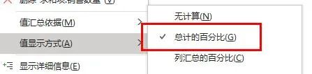
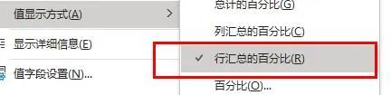
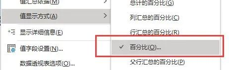
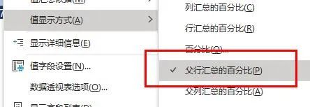
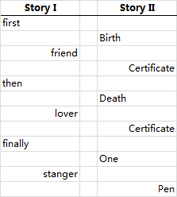
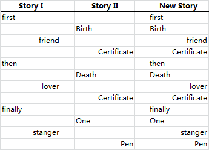
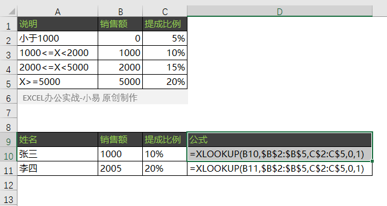

# Offfice 技巧

## 数据透视表14种分析方法

数据透视表的最常用的功能是分类汇总，其实它还有很强大的数据分析功能。在数据透视表右键菜单的值显示方式中，可以看到有14个很实用的分析选项。很多同学不知道它们有什么作用，今天兰色就一个个揭开它们的神秘面纱。

### 1、总计的百分比

作用：透视表中每一个数字（包括汇总行、总计行）占**右下角总计**的百分比。下图所示下面透视表为设置前数据，上面透视表为设置后效果（后面示例同）

### 2、列汇总的百分比

**作用：**每个数据占最下方总计行的百分比。

### 3、行汇总的百分比

**作用：**每个数据占最右侧总计列的百分比。

### 4、百分比

**作用**：以某个数据为参照，计算同一分类下所有数据和该数据的百分比

### 5、父行汇总百分比

**作用**：每个数字和上一级**行**汇总的百分占比。

如下面78.26%=36/46

### 6、父列汇总百分比

**作用**：每个数字和上一级**列**汇总的百分占比。

如下图 61.02% = 72/118

### 7、父级汇总百分比

**作用*：明细占指定父级汇总的百分比。

### 8、差异

**作用**：和指定数据的差异

### 9、差异百分比

**作用**：和指定数据的差异百分比

### 10、按某一字段汇总

作用：实用累加运算

### 11、按某一字段汇总百分比

**作用**：累计百分比

### 12、升序排列

**作用**：生成中国式排名（数字越小，排名越高）

### 13、升序排列

**作用**：生成中国式排名（数字越大，排名越高）

### 14、指数

**作用：**计算一个数字对整体的重要度

计算公式为：=（数字总计数） / （行总行列总计）

如下图中 0.42 = 14*391/(166*78)

兰色说：透视表的值显示方式是一个学习的难点，网上也很少有系统的总结。这次兰色也是花费了大力气才完成本文。希望能对同学们有用。

## 选择性粘贴跳过空单元格

懒，是创造力的根源。而我，专注偷懒20年！

那么关于题主在答案中的疑问：

> 不知大家有没有更好的办法，或者有没有直接的办法不用新建就能把S列有内容的单元格补充到R列？

答案是 ***\*有的！\****

> *复制粘贴**就可以了！*

有人会说那不是覆盖掉了么？ 额 …我们可以有选择地粘贴嘛~

首先，先让我们看两篇微小说陶冶一下情操…

可以看到我已经将两篇文章错开了行，那么是时候展示真正的偷懒了：

1、选中需要合并的区域（一般不包括标题）复制

2、在目标区域右键选择"选择性粘贴"

3、在"选择性粘贴"的选项中选择"跳过空单元"

4、完工！可以***\*保留格式\****的合并棒棒哒！

最后，让我默默地文艺一下…

## 你离精通数据透视表还差这两招，百分之九十的人不会

我一直觉得透视表是Excel中性价比最高的一个功能，因为数据透视表本身是一个数据分析的利器，并且只需要很小的学习成本就可以掌握它百分之八十的功能，但是今天介绍的功能有90%的人都不会用，今天大家看下面几个功能你会不会。

### 一、将数据按周汇总

如何将左边变成右边

首先选择数据插入一张数据透视表

在数据透视表上右键，“组合”，“步长”选择“日”，“天数”选择7。到这一步，我们先不要急着点确定。大家看上面的日期起始默认是数据源的第一天，并不是我们潜意识里的周一哦，2021年8月18日是周三。需要手动将起始日期改成周一。

我们可以用=WEEKDAY(A2,2)函数知道第一个起始日期是周几，这里是3说明是周三，时间往前推两天就是周一啦。

所以起始日期手动输入2021-8-16.

点击确定后透视表日期就是按2021-8-16开始的了。

### 二、数据透视表非重复计数

什么叫“非重复计数”

举个例子，大家看这是数据源

我筛选“酷冷”生产商可以看到对应的客户有37个。但是这37个有很多重复的客户，如何才能知道不重复的是多少呢？

如果你用数据透视表的话，会发现透视表计数告诉你的也是37个，说明透视表默认的也是重复计数。

如何才能计算不重复？没错，数据透视表其实可以做到，下面跟我一起来看看。

在插入透视表的时候记得勾选“将此数据添加到数据模型”，勾选之后点确定

然后将“生产商”拉到“行”，“客户”拉到“值”，在透视表上点击右键，“值字段设置”，“值汇总方式”选择“非重复计数”，点确定。

点完确定后，就可以看到非重复的客户啦。

## 年轻不识透视表，错把公式当成宝

数据透视表操作简单，汇总方便，拖动几下鼠标就可以完成数据的分析汇总，今天老祝就和大家分享一组数据透视表的使用技巧。

### 创建动态数据范围的数据透视表

默认情况下生成的数据透视表，数据源增加数据后是无法添加到透视表中的。其实咱们在制作透视表之前，先插入表格，就OK了。

利用表格能自动扩展的特性，给透视表提供一个动态的数据源。

### 二维表转换为一维表

所谓二维表，通常是指同一类数据出现在多列中，这样的表格不方便咱们的汇总分析。如何转换成流水账形式的一维表呢？

依次按下 Alt D P键，选择多重合并计算数据区域，插入默认的透视表后，双击右下角的“合计”，就可以得到明细数据了。

### 按年、月、季度快速汇总销售数据

利用透视表中的组合功能，可以快速按照年月季度来汇总数据。

### 销售业绩排名和汇总

要得到不同业务员的销售汇总、销售排名和销售占比，只要咱们选择不同的值汇总方式就OK。

### 按销售区域提取前三名的销售记录

一些看起来比较复杂的汇总要求，使用透视表完成也非常简单。

如果要按照不同的销售区域提取前三名的销售记录，只要在透视表中做一个筛选就好。

### 多行多列提取不重复姓名

在多行多列的值班表中，如何提取出不重复的名单呢？

依次按下 Alt D P键，选择多重合并计算数据区域，插入默认的透视表。

在数据透视表字段列表中，分别将“页1”、“行”和“列”拖动到字段列表之外，然后将“值”拖动到行区域即可。

由于使用多重合并计算区域时，会将数据源中的首列默认作为行标签，所以选择数据区域的时候，第一列中不能包含要提取的姓名。

### 使用切片器查看不同地区销售数据

切片器就像是一个高级筛选器，能够使筛选过程更加直观，在2010及以上版本中如果不使用切片器，可真是有点可惜了。

### 克隆数据透视表

选中一个数据透视表按Ctrl+C复制，然后按Ctrl+V粘贴，可以快速得到一个新的数据透视表，只要调整一下字段位置，就能得到不同汇总角度的两个透视表了。

### 使用切片器控制多个透视表

对于使用同一个数据源生成的透视表，可以先插入切片器，再设置切片器的报表连接，使其能同时控制多个透视表，实现联动效果。

### 使用切片器制作动态图表

传说中的交互式图表，使用数据透视图那是相当简单。

### 按客户拆分工作表

要根据不同客户名称，把数据拆分到不同工作表里，也是简单的不要不要的。

## XLOOKUP函数你向我这样学就对了

入门篇还没学习看这个（[入门篇](http://mp.weixin.qq.com/s?__biz=MzU2NTIyMTI3OA==&mid=2247486296&idx=1&sn=c7968100d98cd511309347600c606199&chksm=fcbe49a9cbc9c0bf5b9e9e5fb1b41f8e6da6d77746945cb94f4d1114152b81a2db1801af2ba5&scene=21#wechat_redirect)），算是XLOOKUP的基础用法，今天主要是通过10个案例来进一步学习！这应该是目前XLOOKUP这个新函数最全面的教程了！

### 案例01 | 近似查找（区间查找）

小结：

1、XLOOKUP第五参数有四种模式：

2、0-精确匹配为默认值，相当于VLOOKUP第四参数的FALSE，只是VLOOKUP默认的是近似查找。

3、本案例使用的是-1根据说明，能精确匹配到的按精确匹配，否则返回较小的项，这个其实跟VLOOKUP的近似查找基本一致，案例可以看出

### 案例02 | 近似查找，返回较大者

小结：这个是VLOOKUP所无法做到的，之前我们是查找不到返回小于的部分，现在是向下找，返回较大的！

虽然帮助文件中没有说明数据源排序要求，但是测试来看应该要求升序排列

-1和1的模式你可能一时想不到应用，我来简单说一个，比如我们要查11月20日的库存，如果没有就差19日的，那么-1模式就可以上了.

### 案例03 | 通配符-模糊查找

小结：

1、XLOOKUP也有模糊查找，但是却单独提示出来，VLOOKUP本身第一参数支持通配符模糊匹配。

2、案例中一共3种特殊的符号，分别是~?*,他们具体的含义如下：

如果先表示"*"和 "?" 本身就需要提成成~?和~*,~相当于让他们现出原形，而不是通配！

3、XLOOKUP单独分来出来更清晰，但是却不如VLOOKUP简洁了

### 案例04 | 数据搜索方式

小结：

1、参数六一共有4种模式（两对），目前二进制模式基本很少使用这里不举列，主要分享常规的两种机制（1和-1）：

2、1从上往下，默认值，符合我们常规使用习惯，-1从下往上（倒序）查找！

3、案例中正序，我们VLOOKUP常规用法一致，从下往上，需要我们使用LOOKUP来给大家模拟！

### 案例05 | 抢了HLOOKUP的活

小结：HLOOKUP表示在水平方向查找和VLOOKUP是一对兄弟！

XLOOKUP不仅抢了VLOOKUP的活，HLOOKUP也没放过，甚至LOOKUP部分都被干下！

### 案例06 | 交叉查找

小结：

1、我们之所以能使用以上两个公式是因为XLOOKUP的结果是引用，这一点应该很少有人提出，这点之前的版本极少函数结果返回是引用的，目前知道的有OFFSET和INDEX。

判断一个函数结果是否是引用可以使用ISREF，大部分函数都是FALSE！

2、很多人会问第一个公式的意思，这个空格是交叉运算符，虽然很基础的知识，但是很多人不知道，表示两个区域重叠相交的部分！

### 案例07 | 多条件查找

小结：相对传统的VLOOKUP重构区域的写法，好简洁很多，也更好理解！

### 案例08 | 结果保留引用属性

小结：可能上面的案例你还没能明白结果是引用的含义，那么这个案例进一步阐述，A1：B1，你肯定不陌生，表示对应的矩形区域，其中的冒号表示区域运算符，两个需要是单元格引用，这里的B9：公式

公式部分查找到4月所在的合计单元格，然后返回B9、C9、D9、E94个单元格的值，使用SUM函数聚合求和！

### 案例09 | 不连续多列

小结：XLOOKUP查找连续多列是非常方便借助了数组自动溢出的理论，但是不连续就有些麻烦，我们需要借助CHOOSE等函数重构结果区域！这里就是通过CHOOSE把3个区域重新组合！从而满足XLOOKUP不连续查找！

### 案例10 | 第一参数多单元格

关于XLOOKUP函数，我们就到这里！

## Xlookup

语法：XLOOKUP(`查找值`,`查找数组`，`返回数组`,`[未找到值]`,`[匹配模式]`,`[搜索模式]`)

1. 基本用法
    xlookup(`查询条件`，`查询条件范围`，`查询结果范围`)
   1. 向左查询xlookup(查询条件，查询条件范围`f4`，查询结果范围`f4`)
   2. 错误提示＝vlookup+iferror
2. 错误提示
    xlookup(`查询条件`，`查询条件范围``f4`，`查询结果范围``f4`，“查无此人”)

    iferror(vlookup(),“查无此人”)
3. 近似比对(分层级-发奖金/评优良)
    xlookup(`查询条件`，`查询条件范围-层级`，`查询结果范围``f4`,不写错误提示,-1)*金额

    > 分层级的数据要从小到到。
    >`0`精确匹配；`-1`精确匹配或下一个较小的项目；`1`精确匹配或下一个较大的项目；`2`通配符匹配
4. 横向查询
    xlookup(`查询条件`，`查询条件范围``f4`，`查询结果范围``f4`,,-1)

    -1近似比对
5. 模糊查询，通配符`*`+输入2使用万用字元
    xlookup(`李*`，`查询条件范围``f4`，`查询结果范围``f4`,,2)

6. 逆向查询xlookup(`查询条件`，`查询条件范围``f4`，`查询结果范围``f4`,,,-1)
    -1逆向查询。变更列的查询方向-由下而上

    >`1`从第一项到最后一项搜索；`-1`从第最后项到第一项搜索；`2`分搜索排序（升序）；`-2`分搜索排序（降序）
7. 双向筛选。两个xlookup叠加

    xlookup(查找条件，查找范围，xlookup(查找条件，查找范围，结果范围))

## 跨栏功能的过度使用

ctrl+1,单元格式设置，文字对齐方式，跨列局中。分散对齐。

## 不常用快捷键来提升效率

 alt+下箭头，输入之前输入的内容。

shift+拖动，可快速移一行数据。

ctrl+方向键，可快速移到第一或最后一个单元格

ctrl+shift+方向键，可选中整或整列。

ctrl+shift+“+/-”，可增加一行或删除一行

## 资料类型的误用

比如日期格式输入错误，9月1日，输入成“9.1”

## 未善用单元格的参考功能

正确的做法是在数据旁边增加一个参照单元格

动太订单编号

## 未发现隐藏栏位潜在的问题

用subtotal可以把隐藏的单元格不记算在内

## 忽略表格的功能带来的好处

## Tidy Data 简洁数据结构

"Tidy Data"是数据科学和数据分析中的一个重要概念，由Hadley Wickham在2014年的一篇论文中提出。整洁的数据（Tidy Data）是指数据按照变量（变量是数据的列）和观察值（观察值是数据的行）进行组织，并且每个观察值都是一个独立的行。这种数据组织方式有助于简化数据分析过程，使得数据更容易操作、模型构建和可视化。

Tidy Data需要遵循以下四个原则：

1. 每行表示一个观察单位（例如，一个样本、一个个体等）。
2. 每列表示一个变量（例如，身高、体重、年龄等）。
3. 每个观察单位（行）都必须有一个独特的标识符（例如，ID）。
4. 每个变量都必须有一个明确的、独一无二的名称。

这种数据组织方式使得数据分析变得更加容易，因为可以使用标准的统计方法来处理整洁的数据。同时，整洁的数据也有助于开发更有效的数据分析工具，包括输入和输出整洁数据集的工具。

## 真正的难题

不知道自己，不知道的是什么。

## 真正的高手

用简单的方法，解决复杂的问题。

## 十种不合理设计

1. 多余的表头（标题位置不合适）；

    >使用工作簿或工作表名称；

2. 字段排序不合理；时间->人物->人物属性->事件->事件属性；

    >列换位置，选中列，`shift+左键`

3. 数据摆放不连续；上下左右数据全挨着；

    >删除多列->定位空值，删整列
    >转置——>选择性粘粘，转置

    

4. 合计行破坏源表
    >合计行莫用手填，Excel帮你变
5. 多表头引发问题
    >同属性字段记一列
    >
    >
    >
    >
    >
6. 合并单元格后患无穷
    > 原数据表“打死”不合并
    > 1、`F5`定位；2、批量录入（ctrl+enter）
    >
    > 
    >
7. 源数据缺胳膊少腿
    > 字段设计-分析、拓展、补全
    > 流程解析——工作顺序、录入方式
8. 分数据容易牵手难
    > 源数据累积在“一张表”
    > 源表使用小贴士——另存为；
9. Excel错当Word用
    >一列一数据
    >
    >
    >
    >
    >
10. 分类汇总变成手工活儿

## 小技巧

### 右键按月填充

单元格右下角，十字的时候，可以以工作日填充，按月填充。按年填充。

### 打印网格线

视图，打印网格线

### 下拉列表

在数据有效性里面，选择系列。在值上用“,”分格

### 二级有效性

先要定要名称（名称在公式里面选指定）；来源里面写上=indirect(名称)。

### 动态下拉选项

插入-表格，定义名称

设置单元格格式：`ctrl+1`

编号，自定义格式，改为000

姓名，对齐，分散对齐，缩进1

小数点保留2位

日期，补零，yyyy,mm,dd；自定义为yyyy/mm/dd;@

`ctrl+shift+下键头`批量选中数据

### 查找功能

`*`是查找所有的。`?`是查找一位数

### 设置随机日期

一个日期区间如：2022/2/1～2022/02/28之前的随机日期。

第一、选择单元格里两个日期ctrl+1，单元格格式中把日期设置为常规。

第二、使用randbetween(最小值，最大值)函数，按ctrl+A。这样就可以得到随机日期了。

### 设置可变动的序号

在单无格中用=row()-1

### 创建超级表

1. Control+A 选上数据；
2. Control+T 创建超级表

### 数据分列

数据菜单，分列

### 函数

Weekday()星期几，Networkdays()工作日，Weeknum()年周，Datedif()工龄

### 查看公式

ctrl+`

### F4

1. 编辑公式时可以后切换引用；
2. 可以重复上一步操作。

## 伍昊

好表or坏表

### 一、设计表格

1. 做好一张“天下第一表”
2. 只做一维表
3. 见单录入
4. 同一属性字段放在一列做记录
5. 原数据表，不能有分割的行或列
6. 表格的里子与面子

### 二、神级必杀技

#### 一、Vlookup

#### 二、数据透视表(横竖就是要汇总)

> 手工——公式——透视表
> 特点：简单、快捷、准确、不怕错
>数据透视表是做数据分析的；
>
>汇总表“躺着”不如“站着”；
>
>数据透视表不要多表头；
>
>双击显示数据明细
>
>手动与自动刷新数据
>
>新增的数据能被自动添加吗？(可以把数据多选一些)
>
>数据透视表一个生多个

1. 数据透视表汇总数排排站

    

2. 更新数据锁定列宽

    

    复选框去掉，`更新时自动调整列宽`

3. 切片器可一对多筛选

    

### 三、核心四大功能

1. 有效性
2. 条件格式
3. 名称
4. 函数

### 四、录入/清选/处理

1. 快速录入

   

   **单无格很“挑食”**

   > 数和量分列记录，约**写在标题栏**

   

   **文本怪象**

   

   > 爱词不爱句
   >
   > 同属性一列记录
   >
   > 不同属性分列记录
   >
   > 一列数据一种属性
   >
   

   **向左走、向右走**

   

   **眼见为“虚”**

   `@`、``特殊``，``;;;``，``#``

   

   **日期为什么会变成数字？**在`设置单元格格式`中把日期设置为常规，日期就变为一个数字。

   **录入序列？**选两个后，会出现十字架，双击复制。会对齐到参照列；

   

   **展开一切下拉菜单？**`alt+向下方向键`

   **批量录入？**`ctrl+enter`

2. 有效清洗

   **查找与替换？**在选项中可以打开更多选项，可以按字体颜色，字体是否加粗，对齐方式，背景颜色等进行查找。

    

   **排序？**添加一个辅助列，可还原被打乱的系列

   

3. 错误修复等等

## Excel 快捷键

### F家族

`F2`——编辑单元格（也可重命名文件）

`F3`——使用已定义的名称

`F4`——切换公式单元格引用状态（A2→$A$2）

`F4`——重复上一次菜单操作（如填充底色）

`F5`——调用“定位”功能

`F9`——使Rand和Randbetween函数重获新结果

`F9`——选中公式某部分显示结果（Ctrl+Z撤销）

> （5#注：某些键盘要按Fn+F2）

`F12`直接进入另存为窗口

### Ctrl家族

`Ctrl+1`——调用“单元格格式设置”

`Ctrl+R`——将选中区域最左列单元格向右复制

`Ctrl+D`——将选中区域首行单元格向下复制

`Ctrl+Z`——撤销上一个操作

`Ctrl+S`——保存工作簿

`Ctrl+F`——查找

`Ctrl+H`——替换

`Ctrl+P`——打印

`Ctrl+G`——调用“定位”

`Ctrl+~`——显示公式（与~同键）

`Ctrl+N`——新建工作簿

`Ctrl+A`——选中当前单元格四周的连续数据区域

`Ctrl+A`→A——全选整张工作表

`Ctrl+A`——=函数名称，Ctrl+A，调用参数设置

`Ctrl+Tab`——在多个Excel工作簿中切换

`Ctrl+PgDn`——切换至下一张工作表

`Ctrl+PgUp`——切换至上一张工作表

`Ctrl+;`——输入当前计算机日期

`Ctrl+↓`——光标跳转至连续数据区域的下边缘

`Ctrl+Enter`——选中多个单元格时进行批量录入

`Ctrl+F3`——调用“定义名称”

> （5#注：Ctrl+C/X/V常识，Ctrl+E依赖版本）

### Alt家族

`Alt+=`——自动求和

`Alt+Tab`——在两个常用文件中进行切换

`Alt+Enter`——编辑单元格时进行单元格内换行

`Alt+↓`——将单元格上方已有内容形成可选列表

`Alt`——显示工具栏菜单快捷调用字母

> （5#注：Alt+↓只针对文本，对数字无效）

### Shift两兄弟

`Shift+F3`——从公式单元格中打开函数设置面板

`Shift+F11`——新建工作表

`ctrl+N`——新建工作簿

> （5#注：`Shift+F3`用于公式的修改）

### Ctrl/Shift全家老小

`Ctrl+Shift+↓/→`——当前单元格向下/右全选

`Ctrl+Shift+End`——当前单元格到数据右下角

`Ctrl+Shift+F3`——批量定义名称

> （5#注：Ctrl+Shift+End不要求数据连续）

### Windows键

`Windows+D`——返回桌面（办公室保命技）

`Windows+E`——打开“我的电脑”（天天用）

## 100个Excel实用技巧

> 花了一天时间，整理了这份超实用 100+Excel 快捷键和实用技巧大全。文末有文本版汇总！一、办公常用的 7 大技…

花了一天时间，整理了这份超实用 **100+Excel 快捷键和实用技巧大全。**

### 文本型数字隐藏的秘密

### 大小写转换技巧

### 字符串合并技巧

### 日期时间转换技巧

### 数字格式转换

### 显示系统时间或日期

### 隐藏行或列

### 选择数据

### 显示对话框

### 编辑数据

### 将文字颠倒顺序

复制正常顺序对象→在字体前加 @→点击向下旋转文字→点击自动换行

### 制作打钩方框

输入 "R"→设置字体为 Wingdings2

### 用斜线分割单个单元格

选中对象→插入形状（直线）→ALT + 鼠标 快速定位单元格边角→F4 重复动作，添加分割线→插入文本框→调整字体

### 隐藏不需要显示区域

选中对象→Ctrl+1→点击自定义→输入；；；

### 分段显示手机号码

选中号码→Ctrl+1→点击自定义→输入 000-0000-0000

### 数据以万为单位显示

选中对象→Ctrl+1→点击自定义→输入 0！.0,"万”

## 智能工作表协作

1. 可以@联系人；
2. 也可以@云文档

## 库存管理系统

## 批量调整表格行高列宽

## 两个日期&时间相减得出值为小时

**应用场景：工时计算**
`=(TEXT([结束时间]-[开始时间],"d")*24)+(TEXT([结束时间]-[开始时间],"h"))`

或

`=INT(([结束时间]-[开始时间])*24)`

**进阶公式：**

`=INT(([结束时间]-[开始时间])*24*2)/2`

`工时计算还有一个进阶版的，一般要求以 0.5 小时为步长，超过 30 分钟就加 0.5，不足 30 分钟可忽略`

## 多文本字段拼接

**应用场景：设置唯一识标识 / 编号 / 名称，当表格中某类字段值不唯一时，进行跨表自动关联引用**
`CONCATENATE([订单编号],"-",[产品名],"-",[提交编号])`

## 百分比进度条展示效果

**应用场景：生产进度量化、项目完成进度量化**
判定状态对应统计值：`IF([A 类项状态]="已完成",20,0)`

量化计算完成百分比：`([A 类项统计值]+[B 类项统计值]+[C 类项统计值]+[D 类项统计值]+[E 类项统计值])/100`
