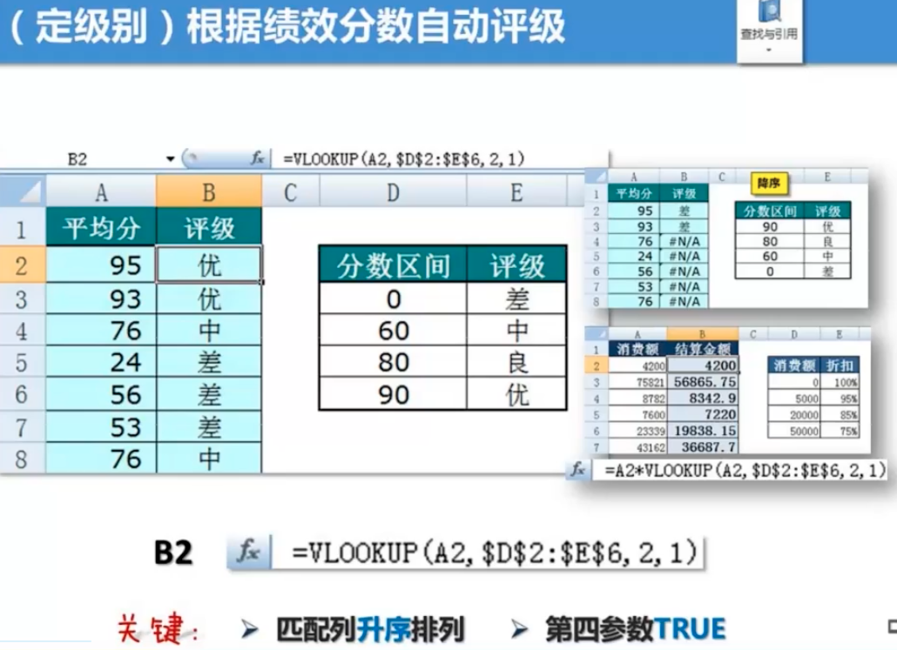

# Offfice 技巧

## 跨栏功能的过度使用

ctrl+1,单元格式设置，文字对齐方式，跨列局中。分散对齐。

## 不常用快捷键来提升效率

 alt+下箭头，输入之前输入的内容。

shift+拖动，可快速移一行数据。

ctrl+方向键，可快速移到第一或最后一个单元格

ctrl+shift+方向键，可选中整或整列。

ctrl+shift+“+/-”，可增加一行或删除一行

## 资料类型的误用

比如日期格式输入错误，9月1日，输入成“9.1”

## 未善用单元格的参考功能

正确的做法是在数据旁边增加一个参照单元格

动太订单编号

## 未发现隐藏栏位潜在的问题

用subtotal可以把隐藏的单元格不记算在内

## 忽略表格的功能带来的好处

## Tidy Data 简洁数据结构

"Tidy Data"是数据科学和数据分析中的一个重要概念，由Hadley Wickham在2014年的一篇论文中提出。整洁的数据（Tidy Data）是指数据按照变量（变量是数据的列）和观察值（观察值是数据的行）进行组织，并且每个观察值都是一个独立的行。这种数据组织方式有助于简化数据分析过程，使得数据更容易操作、模型构建和可视化。

Tidy Data需要遵循以下四个原则：

1. 每行表示一个观察单位（例如，一个样本、一个个体等）。
2. 每列表示一个变量（例如，身高、体重、年龄等）。
3. 每个观察单位（行）都必须有一个独特的标识符（例如，ID）。
4. 每个变量都必须有一个明确的、独一无二的名称。

这种数据组织方式使得数据分析变得更加容易，因为可以使用标准的统计方法来处理整洁的数据。同时，整洁的数据也有助于开发更有效的数据分析工具，包括输入和输出整洁数据集的工具。

## 真正的难题

不知道自己，不知道的是什么。

## 真正的高手

用简单的方法，解决复杂的问题。

## 十种不合理设计

1. 多余的表头（标题位置不合适）；

    >使用工作簿或工作表名称；

2. 字段排序不合理；时间->人物->人物属性->事件->事件属性；

    >列换位置，选中列，`shift+左键`

3. 数据摆放不连续；上下左右数据全挨着；

    >删除多列->定位空值，删整列
    >转置——>选择性粘粘，转置

    

4. 合计行破坏源表
    >合计行莫用手填，Excel帮你变
5. 多表头引发问题
    >同属性字段记一列
    >
    >
    >
    >
    >
6. 合并单元格后患无穷
    > 原数据表“打死”不合并
    > 1、`F5`定位；2、批量录入（ctrl+enter）
    >
    > 
    >
7. 源数据缺胳膊少腿
    > 字段设计-分析、拓展、补全
    > 流程解析——工作顺序、录入方式
8. 分数据容易牵手难
    > 源数据累积在“一张表”
    > 源表使用小贴士——另存为；
9. Excel错当Word用
    >一列一数据
    >
    >
    >
    >
    >
10. 分类汇总变成手工活儿

## 小技巧

### 右键按月填充

单元格右下角，十字的时候，可以以工作日填充，按月填充。按年填充。

### 打印网格线

视图，打印网格线

### 下拉列表

在数据有效性里面，选择系列。在值上用“,”分格

### 二级有效性

先要定要名称（名称在公式里面选指定）；来源里面写上=indirect(名称)。

### 动态下拉选项

插入-表格，定义名称

设置单元格格式：`ctrl+1`

编号，自定义格式，改为000

姓名，对齐，分散对齐，缩进1

小数点保留2位

日期，补零，yyyy,mm,dd；自定义为yyyy/mm/dd;@

`ctrl+shift+下键头`批量选中数据

### 查找功能

`*`是查找所有的。`?`是查找一位数

### 设置随机日期

一个日期区间如：2022/2/1～2022/02/28之前的随机日期。

第一、选择单元格里两个日期ctrl+1，单元格格式中把日期设置为常规。

第二、使用randbetween(最小值，最大值)函数，按ctrl+A。这样就可以得到随机日期了。

### 设置可变动的序号

在单无格中用=row()-1

### 创建超级表

1. Control+A 选上数据；
2. Control+T 创建超级表

### 数据分列

数据菜单，分列

### 函数

Weekday()星期几，Networkdays()工作日，Weeknum()年周，Datedif()工龄

### 查看公式

ctrl+`

### F4

1. 编辑公式时可以后切换引用；
2. 可以重复上一步操作。

## 伍昊

好表or坏表

### 一、设计表格

1. 做好一张“天下第一表”
2. 只做一维表
3. 见单录入
4. 同一属性字段放在一列做记录
5. 原数据表，不能有分割的行或列
6. 表格的里子与面子

### 二、神级必杀技

#### 一、Vlookup

#### 二、数据透视表(横竖就是要汇总)

> 手工——公式——透视表
> 特点：简单、快捷、准确、不怕错
>数据透视表是做数据分析的；
>
>汇总表“躺着”不如“站着”；
>
>数据透视表不要多表头；
>
>双击显示数据明细
>
>手动与自动刷新数据
>
>新增的数据能被自动添加吗？(可以把数据多选一些)
>
>数据透视表一个生多个

1. 数据透视表汇总数排排站

    

2. 更新数据锁定列宽

    

    复选框去掉，`更新时自动调整列宽`

3. 切片器可一对多筛选

    

### 三、核心四大功能

1. 有效性
2. 条件格式
3. 名称
4. 函数

### 四、录入/清选/处理

1. 快速录入

   

   **单无格很“挑食”**

   > 数和量分列记录，约**写在标题栏**

   

   **文本怪象**

   

   > 爱词不爱句
   >
   > 同属性一列记录
   >
   > 不同属性分列记录
   >
   > 一列数据一种属性
   >
   

   **向左走、向右走**

   

   **眼见为“虚”**

   `@`、``特殊``，``;;;``，``#``

   

   **日期为什么会变成数字？**在`设置单元格格式`中把日期设置为常规，日期就变为一个数字。

   **录入序列？**选两个后，会出现十字架，双击复制。会对齐到参照列；

   

   **展开一切下拉菜单？**`alt+向下方向键`

   **批量录入？**`ctrl+enter`

2. 有效清洗

   **查找与替换？**在选项中可以打开更多选项，可以按字体颜色，字体是否加粗，对齐方式，背景颜色等进行查找。

    

   **排序？**添加一个辅助列，可还原被打乱的系列

   

3. 错误修复等等

## Excel 快捷键

### F家族

`F2`——编辑单元格（也可重命名文件）

`F3`——使用已定义的名称

`F4`——切换公式单元格引用状态（A2→$A$2）

`F4`——重复上一次菜单操作（如填充底色）

`F5`——调用“定位”功能

`F9`——使Rand和Randbetween函数重获新结果

`F9`——选中公式某部分显示结果（Ctrl+Z撤销）

> （5#注：某些键盘要按Fn+F2）

`F12`直接进入另存为窗口

### Ctrl家族

`Ctrl+1`——调用“单元格格式设置”

`Ctrl+R`——将选中区域最左列单元格向右复制

`Ctrl+D`——将选中区域首行单元格向下复制

`Ctrl+Z`——撤销上一个操作

`Ctrl+S`——保存工作簿

`Ctrl+F`——查找

`Ctrl+H`——替换

`Ctrl+P`——打印

`Ctrl+G`——调用“定位”

`Ctrl+~`——显示公式（与~同键）

`Ctrl+N`——新建工作簿

`Ctrl+A`——选中当前单元格四周的连续数据区域

`Ctrl+A`→A——全选整张工作表

`Ctrl+A`——=函数名称，Ctrl+A，调用参数设置

`Ctrl+Tab`——在多个Excel工作簿中切换

`Ctrl+PgDn`——切换至下一张工作表

`Ctrl+PgUp`——切换至上一张工作表

`Ctrl+;`——输入当前计算机日期

`Ctrl+↓`——光标跳转至连续数据区域的下边缘

`Ctrl+Enter`——选中多个单元格时进行批量录入

`Ctrl+F3`——调用“定义名称”

> （5#注：Ctrl+C/X/V常识，Ctrl+E依赖版本）

### Alt家族

`Alt+=`——自动求和

`Alt+Tab`——在两个常用文件中进行切换

`Alt+Enter`——编辑单元格时进行单元格内换行

`Alt+↓`——将单元格上方已有内容形成可选列表

`Alt`——显示工具栏菜单快捷调用字母

> （5#注：Alt+↓只针对文本，对数字无效）

### Shift两兄弟

`Shift+F3`——从公式单元格中打开函数设置面板

`Shift+F11`——新建工作表

`ctrl+N`——新建工作簿

> （5#注：`Shift+F3`用于公式的修改）

### Ctrl/Shift全家老小

`Ctrl+Shift+↓/→`——当前单元格向下/右全选

`Ctrl+Shift+End`——当前单元格到数据右下角

`Ctrl+Shift+F3`——批量定义名称

> （5#注：Ctrl+Shift+End不要求数据连续）

### Windows键

`Windows+D`——返回桌面（办公室保命技）

`Windows+E`——打开“我的电脑”（天天用）

## 100个Excel实用技巧

> 花了一天时间，整理了这份超实用 100+Excel 快捷键和实用技巧大全。文末有文本版汇总！一、办公常用的 7 大技…

花了一天时间，整理了这份超实用 **100+Excel 快捷键和实用技巧大全。**

### 文本型数字隐藏的秘密

### 大小写转换技巧

### 字符串合并技巧

### 日期时间转换技巧

### 数字格式转换

### 显示系统时间或日期

### 隐藏行或列

### 选择数据

### 显示对话框

### 编辑数据

### 将文字颠倒顺序

复制正常顺序对象→在字体前加 @→点击向下旋转文字→点击自动换行

### 制作打钩方框

输入 "R"→设置字体为 Wingdings2

### 用斜线分割单个单元格

选中对象→插入形状（直线）→ALT + 鼠标 快速定位单元格边角→F4 重复动作，添加分割线→插入文本框→调整字体

### 隐藏不需要显示区域

选中对象→Ctrl+1→点击自定义→输入；；；

### 分段显示手机号码

选中号码→Ctrl+1→点击自定义→输入 000-0000-0000

### 数据以万为单位显示

选中对象→Ctrl+1→点击自定义→输入 0！.0,"万”

## 智能工作表协作

1. 可以@联系人；
2. 也可以@云文档
