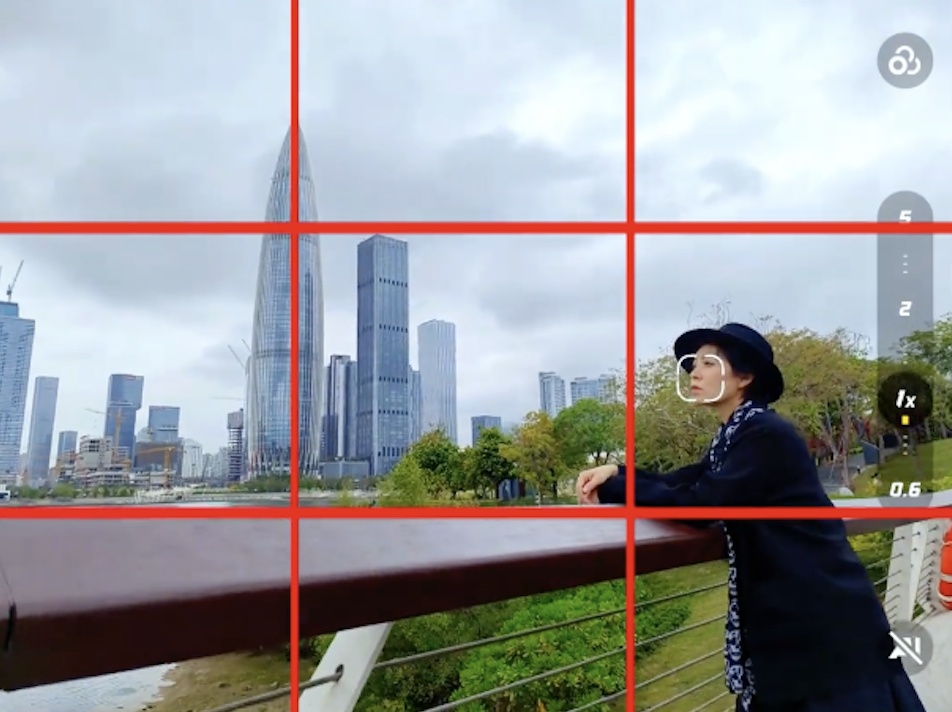

# 摄影

## 旅行遇到地标如何拍照？

**人四格，景四格。**

## 曝光三要素

**拍静态 / 人像 / 风光**：光圈 → 快门 → ISO（新手首选）

**拍运动 / 抓拍**：快门 → 光圈 → ISO

**夜景长曝光（三脚架）**：光圈 → 快门（慢门）→ ISO（尽量 100）

## 三参数进光逻辑：

**光圈**：数值越小→光圈越大→进光越多

**快门**：分母越大→速度越快→进光越少

**ISO**：数值越高→感光越强→画面越亮（代价：噪点变多）

> 补充：逆光
> 
> 主体容易发黑，适当**开大光圈 / 放慢快门**，让标尺回 0；不要盲目拉高 ISO。
>

## 快速补救口诀

1. 画面太暗（欠曝）   
    优先：开大光圈 → 放慢快门 → 最后提高 ISO

2. 画面太亮（过曝）
    优先：缩小光圈 → 加快快门 → 最后降低 ISO

3. 画面糊了
    立刻提高快门速度，再用光圈 + ISO 补回曝光。

## 品牌标识对照

|功能	|佳能|	尼康 / 宾得|	索尼|
|---|---|---|---|
|手动	|M	|M	|M|
|光圈优先	|Av|	A|	A|
|快门优先	|Tv|	S|	S|
|程序自动|	P|	P|	P|