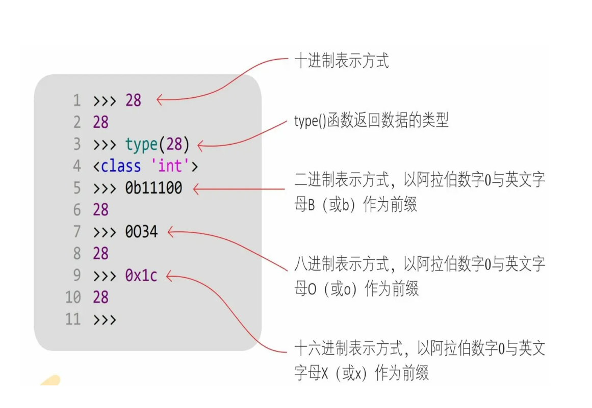
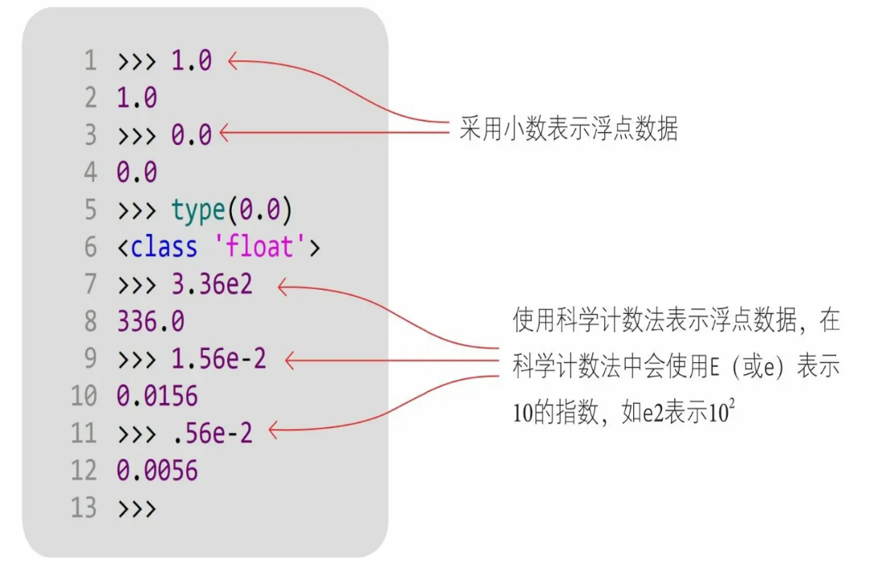
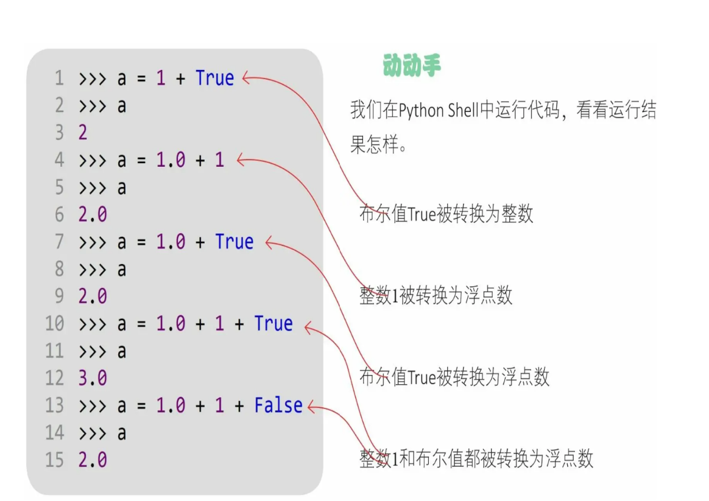

# Python

## Python 能做什么？

1. 办公自动化
2. 数据分析
3. 爬虫
4. web开发
5. 人工智能
6. 智能体

## 标识符

Python中标识符的命名规则如下。
1. 区分大小写：Myname与myname是两个不同的标识符。
2. 首字符可以是下画线（_）或字母，但不能是数字。
3. 除首字符外的其他字符必须是下画线、字母和数字。
4. 关键字不能作为标识符。
5. 不要使用Python的内置函数作为自己的标识符。

## 关键字

| False  | None    | True     |
| ------ | ------- | -------- |
| if     | raise   | del      |
| return | elif    | in       |
| and    | else    | is       |
| as     | except  | lambda   |
| assert | finally | nonlocal |
| break  | for     | not      |
| from   | or      | continue |
| pass   | def     | import   |
| try    | while   | with     |
| yield  | class   | global   |

在Python中只有**33个关键字**，从这个角度来看，Python是不是很简单啊！在这33个关键字中，只有**False、None和True**的首字母大写，其他关键字全部小写。  

## 语句

在Python中，一行代码表示一条语句，在一般情况下语句结束时不加分号。

Python链式赋值语句可以同时给多个变量赋相同的数值。

```python
a=b=c=100
```

## 代码注释

在使用＃（井号）时，＃位于注释行的开头，＃后面有一个空格，接着是注释的内容。

```python

# -*- coding: utf-8 -*-

# 或

# encoding=utf-8

# 或

# coding=utf-8
```

## 模块

一个模块就是一个文件。

一个模块可以访问另外一个模块的代码元素：

有三种形式：

``` python
# coding=utf-8

# m1

import m2
y=20
print(m2.x)
```

``` python
# coding=utf-8

# m2

x=20
```
方法1：

import <模块名>：通过这种方式会导入m2模块的所有代码元素，在访问时需要加前缀“m2.”。

方法2：

from＜模块名＞import＜代码元素＞：通过这种方式会导入m2中的x变量，在访问时不需要加前缀“m2.”

方法3：

from＜模块名＞import＜代码元素＞as＜代码元素别名＞：与②类似，在当前m1模块的代码元素（x变量）与要导入的m2模块的代码元素（x变量）名称有冲突时，可以给要导入的代码元素（m2中的x）一个别名x2

## 数字类型

在Python中有6种主要的内置数据类型：数字、字符串、列表、元组、集合和字典。

Python中的数字类型有4种：整数类型、浮点类型、复数类型和布尔类型。需要注意的是，布尔类型也是数字类型，它事实上是整数类型的一种。





## 布尔类型

布尔类型是整数类型的子类。

任务类型数据可以通过bool()函数转换为布尔值。没有的，“空的”值会被转换为false。其它都转换成True

## 类型转换

在Python的数字类型中，除复数外，其他三种数字类型如整数、浮点和布尔都可以相互转换，分为隐式类型的转换和显式类型的转换。



