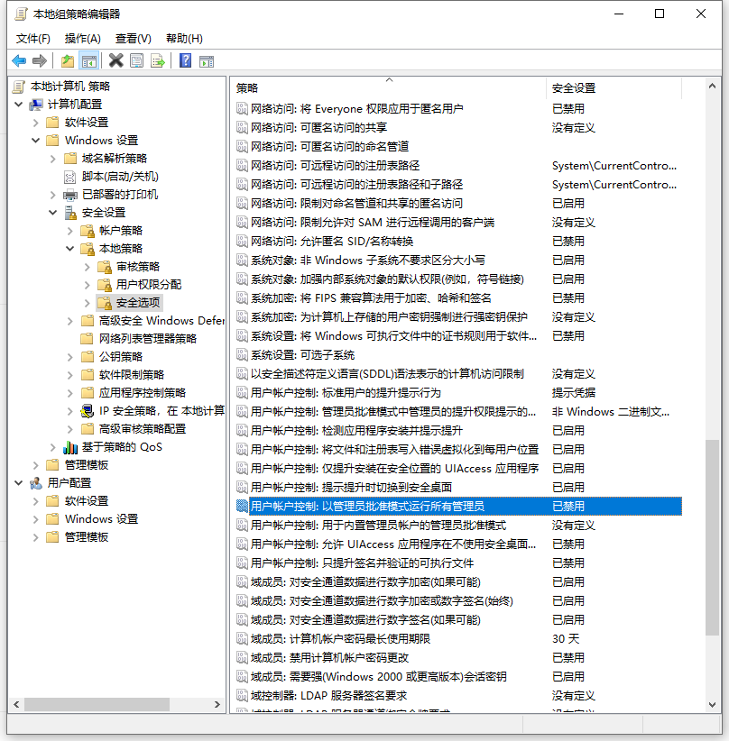

# Microsoft Windows 10

## Win保存文件权限

win10保存文件时出现你没有权限在此位置中保存文件，请与管理员联系获得相应权限。
在开始菜单中打开运行命令，输入`gpedit.msc`

## windows 10 安装

UEFI启动+GUID分区表，

Legacy启动+MBR分区

P1为微软官方ISO镜像文件直接写入安装教程

P2为使用微PE便携式操作系统辅助安装教程

## 软件推荐

1. 7-Zip [官网](https://sparanoid.com/lab/7z/)

2. Geek Uninstaller [官网](https://geekuninstaller.com/)

3. Microsoft Edge [官网](https://www.microsoft.com/en-us/edge)

4. PotPlayer [官网](https://potplayer.daum.net/?lang=zh_CN)

5. IDM [官网](http://www.internetdownloadmanager.com/)

6. QuickLook Windows商店搜索即可

7. Notepads Windows商店搜索即可

8. CCleaner [官网](https://www.ccleaner.com/)

9. Wox [官网](https://github.com/Wox-launcher/Wox/releases)

10. Everything [官网](https://www.voidtools.com/zh-cn/)

11. Listary

12. Bandizip

## windows10操作系统环境下快捷键

1. win+ctrl+D 创建虚拟桌面
2. win+ctrl+左右箭头 切换桌面
win+ctrl+F4 关闭当前虚拟桌面
(按win+tab 可以通过鼠标操作虚拟桌面的创建、切换与删除)
3. win+M 全部窗口最小化
(win+D 可在最小化全部窗口与恢复全部窗口状态 间自由切换
4. win+数字 打开任务栏中从左到右的应用，数字代表该程序的位置
5. win+左右箭头，可将当前程序置于左半或右半部分屏幕，用此热键可实现两个应用分屏。
6. 应用切换
ctrl+alt+tab显示当前桌面运行的所有应用程序
win+tab 显示所有正在运行的程序以及可用桌面
ctrl+tab 向右切换切换选项卡
7. ctrl+shift+Esc 打开任务管理器
8. win+E 打开文件资源管理器
9. win+加号/减号 打开放大镜
10. win+PrtScr截取当前屏幕并保存到图片文件夹中PrtScr仅截取当前屏幕不保存至文件夹
11. win+A打开操作中心
12. win+I打开设置
13. 聆听模式下按 win+C打开小娜
14. win+G打开游戏录制工具栏
15. win+L 锁定PC
F4+Alt关闭当前窗口，焦点在桌面时则是关机

## 百度百科快捷键大全

[百度百科快捷键](https://baike.baidu.com/item/Windows%E5%BF%AB%E6%8D%B7%E9%94%AE%E5%A4%A7%E5%85%A8/407192?fr=aladdin)

## 最简单粗暴的方式——快捷键

`Windows+Tab`调出虚拟桌面
`Alt+Tab` 切换不同的窗口
`Windows+Ctrl+D` 创建新的虚拟桌面
`Windows+Ｃtrl+F4` 关闭当前虚拟桌面
`Ctrl＋Windows＋左右箭头`　虚拟桌面切换

## 一些常用cmd命令

1. appwiz.cpl：程序和功能（程序卸载）
2. calc：启动计算器
3. charmap：启动字符映射表
4. chkdsk.exe：Chkdsk磁盘检查（管理员身份运行命令提示符）
5. cleanmgr： 打开磁盘清理工具
6. 自动关机命令Shutdown -s -t 600：表示600秒后自动关机,（有没有人像我一样使用番茄工作法？其实很多时候很难控制自己，这是一个很好的方法）
7. shutdown -a ：可取消定时关机
8. Shutdown -r -t 600：表示600秒后自动重启
9. rundll32 user32.dll，LockWorkStation：表示锁定计算机
10. control：控制面版
11. msdt：微软支持诊断工具
12. notepad：打开记事本
13. Rstrui：系统还原（这个很有用，我上次乱改注册表，电脑开机就黑屏，我依靠盲操作用这项命令还原了电脑）

## 使用「库」

- 功能整理多个文件夹「库」是在 Windows7 之后加入到资源管理器中的功能。
- 一个「库」可以整合不同位置的多个文件夹。非常利于整理不同位置的同类文件。在

资源管理器中找到「库」视图，右键可以新建库。

在任何库上点击右键菜单中的「属性」，可以选择将哪些文件夹包含到这个库中。下次访问这个库的时候就可以直接查看到所有包含在这个库中的文件夹了。

例如，将不同位置的多个音乐文件夹包含到同一个库中，就可以在一个库中同时查看它们了。

## 快速访问

- 除了分类文件和利用「库」整理文件，你还可以把最常用的文件夹添加到侧边栏的「快速访问」中，方便你在任何路径随时访问最常用的文件夹。
- 按下 Windows+e 可以随时快速打开资源管理器。

## 炫酷关机（WIN10）

按`WIN+R`，输入`slideToShutDown`
