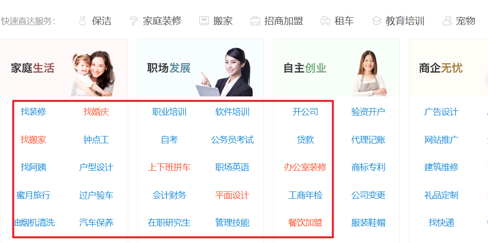

# 道理

## 关于学习

### 多读书

特别是多读一些能成熟心智、拓展视野的书像心理学、经济学等等，建立自己的知识体系。

### 学习投资理财

努力存钱积累第一桶金，学习投资理财。学会存钱，让钱生钱。

### 学习时间管理

克服拖延症，能节约我们很多的宝贵时间。

### 精力/注意力管理

对人来说最重要的财富不是时间，而是我们的注意力:注意力>时间>金钱 这才是三者的价值排序，而很多人忽略了注意力对于我们每个人的价值。注意力即为能有价值产出的时间。珍惜自己的注意力和精力，把它用在最有价值的地方，去学习，工作，成长。而不是玩抖音手机里千万不要下抖音、快手这些时间黑洞应用里。长期来看这些玩这些东西基本没用，当然要你完全戒除肯定很难，不过可以慢慢减少花在这上面的时间。

### 培养兴趣爱好

坚持一到两个兴趣爱好，用心去经营，这会让你的生活变得有趣，拓展你的生活维度。你还会因为这个找到很多有趣的人。

### 有写东西的不读书了，有打电竞的不读书了，有做生意的不读书了等等

但是这些例子都和你没关系，他们都是某件事情做到极致才不读书的，不要妄想我不读书也能和他们一样成功。

### 很多事情就像是旅行一样

当你决定要出发的时候，最困难的那部分其实就已经完成了。

### 少做高刺激低收益的事

比如王者荣耀、抖音等等，多做高收益的事情比如看书、学一门乐器、健身。因为王者荣耀那些东西长远来看对你的人生基本没有帮助。抖音不可怕，可怕的是你因为长时间坐高刺激的事情提高了自己的阈值，再也不能沉下心思考了。

## 关于健康

### 早睡早起要有自律意识，控制好自己的生活习惯

做到早睡早起，让自己每天都精力充沛，提高生活效率。

### 坚持锻炼健康的身体

充沛的精力对你来说都非常重要，每天的锻炼还可以有效缓解负面情绪。

### 定期体检

根据体检情况，了解自己的身体状况，借此调整生活习惯，可以让你活得更长。

### 戒烟

少喝酒有害自己身体健康的事情，尽量少做。

### 保护好眼睛

成年后，视力依旧会下降，所以不要天天盯着手机，更不要在黑暗的环境下玩手机。

### 记得要给自己和家人买保险

当你工作之后会发现，周围的人除了基本的医保还会买其他的保险，经济困难的话可以单纯买健康险，能保个平安，给家人和自己一个保障，一个普通的家庭是没有办法承担那些重大疾病的打击的，生病之后很容易压垮一个人，毁灭一个家庭。

### 精力不好的人要养成午睡的习惯

中午若是不能得到休息，那么下午和晚上的精力就会非常的差，做事的效率会大打折扣。这比你节省半个小时去做其他低效率学习的事情，效果好太多了！

总结：一个健康的身体是你想要做成任何事的地基。 有精力的人，做什么都能顺顺利利的。而这一切的根基，就是有一个健康的身体，所以要养成健身的习惯。

## 关于工作

### 找到一个朝阳行业

如果你进入了朝阳行业，就算进错了公司，你至少积累了经验，未来还能翻盘，但你选择了一个夕阳行业就很难有上升空间了，如果你在这个行业相信深有体会。

### 关注个人成长

职业生涯是场长跑，选择工作的时候，关注的点在成长上，刚毕业或是职场新人，不要天天把全部的心思都放在工资有多高，要想清楚这份工作能让你学到什么。

### 多向前辈请教

不管你从事哪个行业，找到老司机，就找到了职场上的快车道。和他们交流，因为知道你面对的那些障碍，正是他们曾经面对过的。

### 自觉地持续优化自我

工作中，不做伸手党，遇到问题自己先想办法，要锻炼自己思考的能力。问别人只是为了优化自己的答案。领导交代的工作，做之前先问清楚和领导确认一遍，这样做事有清晰的目标，有反馈。这样才能做得更好。

### 任何一份工作都不会永恒存在的,工作内容会变

相关的同事会变，重要的不是你做了多少工作，干了多少活，而是你能不能得到相关的积累（方法论、资源方面）否则工作再久也不会给你带来质的改变。

### 尽快独立，在经济上，和情感上

经济独立了才能有独立的人格，才有一个自己说了算的人生，情感上的独立就是说难过了、受伤了、孤独了都能自己一个人扛过去，扛过几次你就明白：这些痛苦都是暂时的，你总能习惯。

### 同样的问题只问一次，记录下来，忘记可重新翻阅

刚来公司，新接触业务，不熟可以问同事，但是同样的问题你重复问，人家就会礼貌反问你“你以前不是问过吗”，有时候别人也会反感。所以不要浪费自己的时间，而且也应该珍惜别人的时间。你实在记不住就乖乖写在纸上、手机上，以后就可反复查看。

### 对自己负责，不要因为对象而选择一个城市和一个公司

你选择一个工作必须是为了自己今后的发展做考虑，不然，你背井离乡为了爱情付出的种种努力，最后很可能只是方便了那些乘虚而入的人。因为社会上总有各种各样的诱惑，你不能保证别人一定能100%像你想的那样，始终如一，你要做的就是尽可能对自己负责。做到没了爱人还能在这个城市立足，发展，而不是举目无亲。

### 工作上敢于尝试

不要因为所学专业限制了自己，多去尝试不同的职业，不要怕犯错，年轻没有失败。

## 人际交往

### 毕业之后，有两种人需要你主动去接触，一个是比你优秀的人，一个是正能量的人，经常接触这两类人，你很难不进步

同时要远离负能量的人，因为你难免会被感染。

### 分手了不要在朋友圈发特别伤感的段子

尤其是被别人甩了之后，因为这不仅不能挽回什么，还会让自己被别人看扁。

### 朋友不是总是用来宣泄负能量的

每个人都有自己的事情要办，没有人喜欢一直抱怨的人 。

### 和一个人认识，无论别人多厉害多有钱

最重要的是平等，而不是无底线地对对方好，更不是为了讨好对方，轻易廉价的做任何事。对方不理你，你要先想办法提高自己的价值。

### 许多热衷于请吃饭、抢着买单的人（真心的朋友除外），其实并不是真正地慷慨大方

他们只是想让你强行欠下人情，然后在某些利益相关的时刻让你还出来。（该条略有争议）

### 逢人藏不住事，遇事沉不住气

生气兜不住火，是一种幼稚的表现，应该是一个成熟的人所杜绝的，发火很容易，谁都会，难就难在能在生气的时候控制自己的行为，并冷静地处理好问题，这才是值得提倡的。

### 在人际交往中，性格比相貌更重要

不过比性格更重要的是能提高自己与他人相处时的愉悦程度。比交不到朋友更无趣的是，自以为是地觉得自己是个很有趣的人。

### 不要在自己还很弱、没多少实力的时候费力去搞关系

每个人的精力都是有限的，实力如果和别人相差过大，关键时刻总会被人忽略。

### 一直隐忍不是美德，敢于表达才是美德

做不到的事情，就要敢于拒绝；如果需要资源支持，就要敢于向对方寻求资源：“这件事我一个人完成有点难，你可以给我找个助手吗？” 你想不想做，能做多少，别人是不知道的，别人只会通过你的语言和行为来推测你的感受和想法。所以一定要敢于表达。

### 世界上本就没有标准答案

如果有，那就是以你想要的方式度过一生，每天认真做好自己该做的事：多读书，按时睡觉，保持善良，怀有爱心。遇见难题，不要到处在别人面前矫情，而是学会一个人静静面对，自己慢慢把道理想通。这样的人单身又怎么样呢？你那么努力地在做好自己，一定会遇到更好的人。

### 两个人如果想长远的相互陪伴着走下去，只依靠喜欢是不够的，爱的真谛其实是学会温柔的

包容和相互的体谅。
如果你和别人分手之后，还能很自然的做朋友，做很久。那一般只有两种情况，你们根本不该分手。又或者，你们根本就应当是朋友。

### 多说话，多练习

表达很多人对表达好与否并不看重，认为只要在重要场合前背背稿子撑过去就行了，然而高效表达的好处渗透到生活的方方面面。原因很简单：同一件事，A说明白花一分钟而B只需30秒，你更想和谁一起共事和生活呢？除此之外，人们往往认为表达能力好的人聪明又优秀，在人群中格外显眼，这种气质不是单靠外在打扮就行的。即便不出于功利的目的也应该多练习表达，节约对方时间本就是对他人的尊重。
建议通过输出和回听的方式找到自己表述的缺陷，再长期反复练习训练加深效果。手机自带的语音备忘录简单但是不能练习对话，现在一款名叫声昔的语音日记APP，这里练口语的人很多，好的氛围会让你事半功倍。当然用什么工具不重要，最重要的是敢于迈出第一步。

## 思维模块

### 学会理财

别听你周围的人说，就你那点工资，理什么财，等钱多了再理吧，先去提升自己。但是你没有拿去理财的钱，真的是拿去提升自己了吗？你每个月买多少钱的书？花了多少钱去上什么课了呢？大多数情况，你的钱都被你无意识地“挥霍”掉了。真的，所以赶紧学习理财吧！

### 做事情要果断

不适合自己的，该放弃时就要放弃，之前投入的那些精力、时间等等资源就当做沉没成本吧！要敢于承担沉没成本，如果意识到自己在某些地方并没有天赋，就不要强求自己一定要在这些地方取得非凡的成就了，能意识到自身的局限也是成长的进步。

### 认识你自己

这句名言，从古至今一直是真理，如果你能真正地认识自己，知道自己想要什么东西，想要追求什么样的生活，想和什么样的人在一起，你就会不再迷茫。

### 失败不是成功之母，只有对失败的反思才能增加成功的概率

你要反思当时做决策时的思考过程，究竟是哪个环节出了问题，最终导致的失败？现在如果重来你会怎样做，这些对失败的反思会让你快速成长，不再稚嫩。

### 知道很多大道理，却做不到。不是因为你知道得太多，而是因为你知道的不够多。你不能从道理的本质、适用性、与你究竟何有关系等方面考虑。你仅仅是了解这个概念的皮毛罢了

比如说，你知道你要减肥，然后你订了一个月减肥2kg的计划，但是无法成功，于是你很沮丧。但其实一个真正能减肥成功的人应该是这样做的：了解自己体脂率，身体的健康情况，然后找到最适合自己的运动，更重要的是结合自己的精力状况，饮食、运动和情绪状况、意志力等等，这样才能找到真正适合自己又能保证效果的减肥方案。所以不是因为你知道得太多，而是因为你知道的不够多

### 学会独立思考

我们中国几乎不教我们如何独立思考，培养批判性思维，教授、专家说的话就一定是对的吗？那些网络谣言如此荒谬，为何还有一堆人上当受骗？而独立思考的能力注定是一个人能有所成就的必备的能力，一个人如果不会独立思考，很大程度上被谣言所蒙骗，被传销所迷惑。甚至可能仅仅因为某些砖家推荐了几个“涨停板”，就全仓杀入股市，到头来连“底裤”都输光。。。

### 唯有行动才能解决焦虑

很多事情在我们没有开始做之前，总是会有很多错误的判断，会有很多疑惑，会很焦虑，不知道自己能不能做好。其实，我们在明白了一定的原理之后就可以开始去做了，因为往往只有我们行动了才能有更深的体会，行动了大部分焦虑就自然解决了，在行动中学习，学习中行动，即互联网思维中的：小步试错，快速迭代。

### 具有灰度思维

在黑和白之间存在着一个广阔区域，就叫做灰度区域。但是很多人，要么只能看到黑色区域，要么只能看到白色区域。这种形式反应到我们的思维模式当中，就是一种非黑即白的思维模式。灰度思维就是不要用二元对立的方法来看待我们周围的人和事。
世界上没有一个人是100%的坏人，也没有一个人是100%的好人。每一个人都有优缺点。要么完全信任别人，要么完全不相信别人，互不往来。要么认为别人的成功全靠运气，要么认为别人的成功全靠努力。可为什么我们不能加入比例进去呢？比如80%地相信别人，20%的怀疑别人，具体的比例看情况。总之，不要用二元对立的方法来看待我们周围的人和事。

## 情续管理

### 不要害怕

很多你怕的事情并不会发生。比如有的身体健康的人会担心自己会不会突然有一天与世长辞，其实这些都是多余的。

### 通过情绪进行自我检查

如果一件事情特别容易触发你的负面情绪，那么这件事情可能指向了你内心的一些难言的伤口或者不合理的观点。比如有人无意中提到了某些事情，你非常生气。很可能意味着，你的某些想法在一定程度上被他说中了。

### 人活着最重要的是要看清自己

找不清自己定位的人，总把安全感寄托在外界身上，什么都要别人来督促、评价，这样下去一辈子浑浑噩噩是大概率的事。

### 永远不要对人心和感情太过乐观

也不要对努力的前景太过悲观，每天用心做好当下的事，这就够了。

### 有些人和你非亲非故

但是会无缘无故的对你伸出援助之手，却不要求任何回报；而有些人则会想方设法地陷害你，哪怕对他一点好处都没有；这就是生命中贵人和小人的区别。

## 认知模块

### 学会抉择,人生路虽然很长,但关键处只有几步,大学院校,专业选择,结婚，第一份工作，定居城市等等

走得好，事半功倍，抓住了制胜点，赢得了战略；关键点选错了，就要花费巨大的努力，才能扳回一城。

### 物理

世界上的万事万物都有它独特的运行规律，如果你能发现并运用这个规律，就能做的比大多数人好。如果你想提高学习成绩，最具有实操性的方法是什么呢？ 那就是去观察那些学霸是怎么学习的，看他们具体的学习方法是怎么样的：看看他们是如何听课、如何写作业，如何复习的，他们上自习的时候用什么样的方式保持专注并且学会自控的，他们遇到难题是怎么处理的，看和你有什么不一样？等等。借此改进，才能取得进步。同理，这个道理也可以运用在其他方面。

### 实践是最重要的

你觉得这些道理都有点用而不行动，等于在死循环里继续挣扎。

### 代表你人生前半生的一面白纸上可能已经被画得乱七八糟

不过你不需要去费力否认、擦除，只需要把它反过来即可，即接纳过去不完美的自己，你随时可以做全新的自己。过去的，已经过去了，唯有做好当下的事。

### 活在未来，而不是当下

1. 你对未来有个预测；

2. 那个预测需要时间才能得到结果；

3. 你笃信你的预测是正确的；

4. 于是你提前按照那个预测的结果行动，选择，思考；

5. 你终将走到那个结果出现的时刻；

6. 最终你的预测是正确的；

7. 那么，由于你提前按未来正确的结果行动、选择、思考，于是，在相当长一段时间里，你的生活中的一部分，就是“活在未来”的。（来自新东方某老师）巴菲特因为对股票、公司有了很深地研究，他有足够的信心判断只有时间足够长，价格终将回到公司的实际价值，所以他才能靠投资成为首富级别的人物。所以说巴菲特是一个活在未来的人。

   PS：其实我也是这样的人，哈哈。。。

### 晚上的时候，人的大脑的前额皮层对情绪的控制能力会减弱

容易做出和说出一些比往常极端一些的事，当你要做某些重要的事情或决定的时候，尽量不要在晚上去做去说。

### 世界有多大，取决于你认识和见过多少人和事

如果你认识的人多一些，见过的事情多一些，那么属于你的世界就会大一些。其实属于每个人的世界并不是很大，只有那些我们见过的美景、尝过的美食以及真正关心我们的朋友。

### 旧的光环三年左右就开始褪色了

比如高中生的中考成绩，实习时的高考成绩。这个时候你应该用其他东西来证明自己的优秀了。

### 我们每次给别人讲道理时，最心累的莫过于

纵使你再苦口婆心，再循循善诱，他们只能听进去他们本来就想听到的，然后再把别人栽过的跟头再栽一遍，最后受伤了又后悔当初要是听进去别人说的话该多好......

## 其它

### 及时养成复盘的习惯何谓复盘？

复盘是对以前做过的事情如以前做过的项目（如主持的会议、考试的过程）进行一次回顾和总结,从中发现问题，这就像刻意练习里说的那样，只有对反馈进行总结并且调整优化，我们才有可能进步，否则你说你练习了几十年，但你其实只是把1天的经验机械地重复了几十年而已。

### 唯有行动才能解决焦

虑很多事情在我们没有开始做之前，总是会有很多错误的判断，会有很多疑惑，会很焦虑，不知道自己能不能做好。其实，我们在明白了一定的原理之后就可以开始去做了，因为往往只有我们行动了才能有更深的体会，行动了大部分焦虑就自然解决了，在行动中学习，学习中行动，即互联网思维中的：小步试错，快速迭代。

### 精力、注意力管理

对人来说最重要的财富不是时间，而是我们的注意力:注意力>时间>金钱 这才是三者的价值排序，而很多人忽略了注意力对于我们每个人的价值。注意力即为能有价值产出的时间。珍惜自己的注意力和精力，把它用在最有价值的地方，去学习，工作，成长。而不是玩抖音手机里千万不要下抖音、快手这些时间黑洞应用里。长期来看这些玩这些东西基本没用，当然要你完全戒除肯定很难，不过可以慢慢减少花在这上面的时间。

### 独立思考

我们中国几乎不教我们如何独立思考，培养批判性思维，教授、专家说的话就一定是对的吗？那些网络谣言如此荒谬，为何还有一堆人上当受骗？而独立思考的能力注定是一个人能有所成就的必备的能力，一个人如果不会独立思考，很大程度上被谣言所蒙骗，被传销所迷惑。甚至可能仅仅因为某些砖家推荐了几个“涨停板”，就全仓杀入股市，到头来连“底裤”都输光。。

### 给自己和家人买保险

当你工作之后会发现，周围的人除了基本的医保还会买其他的保险，经济困难的话可以单纯买健康险，能保个平安，给家人和自己一个保障，一个普通的家庭是没有办法承担那些重大疾病的打击的，生病之后很容易压垮一个人，毁灭一个家庭

### 少做低收益的事

比如王者荣耀、抖音等等，多做高收益的事情比如看书、学一门乐器、健身。因为王者荣耀那些东西长远来看对你的人生基本没有帮助。抖音不可怕，可怕的是你因为长时间坐高刺激的事情提高了自己的阈值，再也不能沉下心思考了。

### 持续优化自我

工作中，不做伸手党，遇到问题自己先想办法，要锻炼自己思考的能力。问别人只是为了优化自己的答案。领导交代的工作，做之前先问清楚和领导确认一遍，这样做事有清晰的目标，有反馈。这样才能做得更好。

### 正确对待金钱

钱重要吗？的确很重要，可它是不是世界上最重要的东西呢？其实不是并不是越富有就越幸福人们会适应财富的增加，收入水平存在一个临界点，过了这个点，幸福感的增强速度远慢于收入的增长速度。（虽然平均来讲，收入的增加总是伴随着幸福感的增加）

比如对大多数人而言5千万和5亿的幸福感差距不太大。

所以我们应该在“视金钱如粪土”和”金钱至上”之间保持一个微妙的平衡，这个平衡点对不同的人，具体的位置也不同。

### 不要像机器人一样，做繁琐和精确到分钟的计划表

比如网上盛传的浙大学霸那个学习计划表（甚至精确到秒）这种看起来很好的习惯，但本质上，它是存在很大误区的，生活中的突发事件有很多，我们不能完全按照计划表上的事情做好，偶然的突发事情让计划脱离了轨道，就会很受挫，得不偿失！

### 越早学会理财越好（更准确地说是学会理财的思维）

很多人说：我工资才5000，用不了几下就月光了，怎么理财啊，等我有钱再理吧！现实情况是“你不理财，财不理你”即使有一天你走大运，中了500万大奖，相信我不出两年，你迟早给它败光。这里的理财思维指的是一种金钱的分配方式，比如X%存XX宝，Y%当做救济金，Z%买基金，以及一些节流的思维。和财富的绝对值没有那么相关。

### 不背后说人坏话

因为在微信群等等里背后讨论别人，难免会被其他人截图传到当事人那里，从而造成关系的决裂，很可能别人一辈子都不会信任你，不会跟你有深入的合作，因为你背地里都这样，谁知道你究竟是个什么样的人？**所以我们不要在背后说人坏话，哪怕是线下，不会被截图**，这不仅是为了提高修养，更是为了保护自己的安全。

### 快速从过程导向转变为结果导向的思维

什么是结果导向呢？结果导向指的是做一件事情，以结果为最终目标，以如何完成目标为导向的思考方式，与之相对的就是过程导向：只关心做事情的过程，不在乎结果。结果导向只关心事情的结果，不在乎你用什么方法完成的事情（只要没有违反道德、法律）。

日本经营四圣之一的稻盛和夫在自传中提过这样一件事：在京瓷刚创立的时候，为了抢到订单，无论客户有什么技术上的要求，他都答应，其中有很多“看似不可能完成的任务”，但是他都一一解决了。**只有当你以结果为导向，对结果负责，而不是沉浸在“我已经很努力了的过程里面”你才不会遇到困难找借口，总想着逃避。**

### 升米恩，斗米仇

**不要成为一个没有原则的滥好人**，否则你帮助过的人不会感谢你，你没帮助到的人会怨恨你。我想起了有一个笑话，某个乞丐在街上祈祷，A路过后天天给了他10块钱，B看乞丐好欺负，天天打他一顿。某天A突然忘带零钱了，乞丐问他说你今天怎么不给我钱! 某天B忘记打了乞丐，乞丐却感激涕零觉得B内心其实是一个好人。虽然是个笑话，不过对我们理解道理有所帮助。

### 不要看对方说了什么，而是思考他说这个的真实需求（其实就是追问黄金圈里的那个why是什么）

比如说你爸妈突然给你打了个电话，给你说你们那里的天气怎么样怎么样,叫你注意保暖等等。表面上看是她想和你聊天气，但其实是你好久没回家，他们想你了，这时候你不应该回答：我知道了，我会注意保暖的。而应该说我XX时候就回来了。因为时代、观念的原因，他们只好这样表达他们的想法。

### 年轻没多少钱的时候

**尽量把大多数可调用的钱砸在提升自己上**，这是回报最高的投资方式了。
你说你去投资一年20%的净收益率算高了吧？50W的本金能挣10W，可是刚毕业的大学生有几个人有50W以上呢？只有2W块钱的时候与其把精力全花在炒股上，不如先拿来提升自己，等你有了10W以上再想着投资也不迟。

### 实践最重要

**很多人都说：为什么我看了这么多书，懂得了这么多道理，可为何还是过不好这一生？那我想问你按书中的实践了吗？你有刻意地按照某些书里的道理控制自己的行为吗？这就好比一个人听了很多游泳的理论却从未下过一次水，却说：老天啊，我为什么不能成为一个游泳高手呢？**你觉得这些道理都有点用而不行动，等于在死循环里继续挣扎。

### 决策的时候记得考虑机会成本和沉没成本

举个例子上班的时候很多人为了省钱，选择租离公司很远的房子，**通勤就要2个小时但是租金却比较低，以为自己赚到了。但是你还忽略了时间这个成本啊，**你租一个离公司通勤只需半个小时的房子，虽然租金贵但大大地减少你时间、精力的浪费也许更划算呢？

### 人生比我们想得还短暂，只有900个方格

**每隔一个月，我就亲手把一块方格涂黑。**
以前我总以为时间还很长，自己还很年轻，直到有一天我了解了这个东西。

死亡方格：以平均寿命75年计算，人生只有900个月。把这900个月以格子的形式画在纸上，对应900个格子。

如果你今年20岁，那么已经走完的人生是这样的。

如果你今年50岁，那么已经走完的人生是这样的。

其实死亡一天天地都在接近我们，只是我们在大学的时候忙于打游戏、K歌，上班的时候忙于加班，中年的时候忙于带孩子。可是什么时候有时间做自己真正想做的事情呢？做那些让你激动不已的事情？当你60岁格子快涂满的时候，你会不会后悔要是自己在20岁时多努力一点，在25岁的时候多去看一看这个世界？**所以说趁年轻多去做一做你梦想的事情吧，因为每一天，每一个月你都在划去这900个方格里的一格啊！**

### 为你自己打工，对自己的成长负责

很多人这样想：我们付出自己的工作时间，老板付我们报酬，那么老板付我多少钱，我就干多少钱的活，拿6000块我就干6000块的活，要是我在工作之余打打游戏，只干了5000块的活我就赚了！然而这样想完全是错误的，给老板打工，我们会总觉得老板在剥削自己，自己是那个“受害者”。不可否认，总会有不太公平的老板，不会按照你做的贡献、你的工作水平给你相应的薪资。**可是你始终是为自己打工**啊，你工作里面获得的成长，积累的项目经验，做出的业绩等等完全是自己的，别人都抢不走。

如果你因为公司环境不好，老板不公平的环境而放弃好好工作，那就太傻了。环境不好，那我好好干积累项目经验跳槽就是。假如因为老板不公平，你作为一个程序员，选择每天上班就是网上随便找个代码复制再随便修改了事，你又得到了什么呢？除了那基本薪水外你什么都没有得到，技术没有得到提升，还浪费了最宝贵的光阴，如果再过两年还这样，估计要被老板开除了…… **记住你永远都在为一家叫做“自己”的无限责任公司打工。**

### 给别人鼓励或者给别人点赞

会让你的运气变好，这是有心理学效应的（这叫皮格马利翁效应）

1. 事情没有做成之前，不要告诉任何人。
2. 世界不是善意的，收起你的天真。
3. 自己明确知道没有意义的事情，就不要去做，真正学会自控。
4. 毅力和自控力是很可怕的东西，因为99%的人根本不具备这种品质。拥有它你就比大多数人都要强。
5. 这些年我一直提醒自己一件事情，千万不要自己感动自己。大部分人看似的努力，不过是愚蠢导致的。
6. 人生，除了生老病死，其他都是小事，这世上最重要的是你的性命，在此基础上才可以谈及其他。
7. 如果某件事情唯一的好处就是让你有片刻的痛快，尽量不要去做。
8. 人到了一定的年龄，就要扔掉四样东西:没意义的酒局，不爱你的人，看不起你的亲戚，虚情假意的朋友。必须拥有四样东西:扬在脸上的自信，长在心底的善良，融进血液的骨气，刻在生命里的坚强。
9. 一定要摆脱讨好型人格！建立在讨好上的社交关系百分之九十以上都是无效的。不要再依赖被人喜欢的样子活下去。是活不下去也过不好人生的。那样的人生简直就是废墟一片。
10. 千万不要有任何改变别人的想法，你拯救不了任何人，你也改变不了任何人。人只能被自己改变，你要知道，以后走任何的路，你只能控制你自己一个人。你无法选择考试时旁边是音响还是石头，你只能依靠改变自己才能保证自己的人生。
11. 在工作上学会喜怒不形于色，若你的情绪一眼被老板看穿，那你的前途便需要重新考虑。
12. 圈子不同，不必强融。
13. 不如意事常八九，可与人言无二三。
14. 别工作了就忘记学习，学习能够让你有更多的选择。
15. 不要光看别人说什么，要结合他做什么一起去想他的目的是什么。
16. 每一个人都在自己的智识、情感、欲望、经验等限制条件下做出了给自己利益最佳的选择，每个人都在为自己而战，谁也不比谁高尚。不要再说什么自私，太幼稚了。
17. 一个人如果去了做了自己不适合的工作，那他所有的优点都会变成缺点。一个人如果做了自己喜欢且适合的工作，那他所有的特点（注意是特点，不含缺点）都会化成优点。
18. 与人交往，先想好自己能够提供的价值是否是别人需要的。
19. 如果家人文化程度低，做大事不要与他们商量，但要对他们展现出你无比的敬意。
20. 读书是最低成本的成长方式。大多数人的生活之所以会越来越糟糕，是因为把时间都用在了游戏、吃喝玩乐刷手机上，而那些越来越牛逼的人，「想要」跟「得到」的欲望非常强烈，他们把时间都花在了提升自己的事情上。我一直认为读书是最低成本的成长方式，如果你想读书学习却不知道怎么开始，可以关注我的公众号蒋山山，后台回复书单，领取一份被18W人收藏过的必读书单，这份书单可以让你三年内不用再去找书读。
21. 越早明白越好的道理：每天发生在自己身上的99%的事情对于别人而言根本毫无意义。世界上没有感同身受。
22. 人们普遍知道的很多，但是能照做到、能想开的很少。人最重要的，就是应该清楚自己想要什么，并且认真的去对待。
23. 别等全会再做，边做边学。
24. 健康永远是第一位的，早睡，早起，运动。
25. 钱是非常重要的，学会自己正当的挣钱，记账，节俭，理财。
26. 学会表达，不要让对方猜。
27. 当下的感受，要学会说出来。
28. 不要在深夜做一个重要的决定，很容易后悔，大多数人深夜是非常脆弱的，很容易产生极端的想法。
29. 真正的醒悟，是需要实实在在的经历的。
30. 有机会帮助别人时，尽量多帮助别人，不求回报。人生，都是不断在结缘。结善缘，得善果。今天你帮了他，明天他又可能帮了你。积善之家必有余庆。

31. 当一个人

- 当一个人去追求生活的必需品的时候，他往往是勤奋和勇敢的。
- 当一个人去追求生活的消费品的时候，这个时候往往变得懒惰和温和。
- 当一个人去追求生活的奢侈品的时候，这个人就变得软弱了。

1. 玩命读书
2. 玩命工作
3. 强身健体

发现问题的能力比解决问题更重要，勇于寻找问题比坐以待毙强太多了。

时间是财富，是我们改命的机会。

我怎样才能付得起？

“真正能让你走远的，都是自律、积极和勤奋。”——卢思

种一棵树最好的时间是十年前，其次是现在。

心在哪里，时间就在哪里。

我必须富有，因为我有孩子。

“贫穷和破产的区别是：破产是暂时的，而贫穷是永久的。”

只有知识才能解决问题并创造财富，那些不是靠财务知识挣来的钱也不会长久。

从长远来看，重要的不是你挣了多少钱，而是你能留下多少钱，以及能够留住多久。

资产就是能把钱放进你口袋里的东西。

负债是把钱从你口袋里取走的东西。

财富就是支撑一个人生存多长时间的能力，或者说，如果我今天停止工作，我还能活多久？

富人买入资产。 穷人只有支出。

从事你所学的专业的可怕后果在于，它会让你忘记关注自己的事业。人们耗尽一生去关注别人的事业并使他人致富。

只有你把额外的收入用来购买可产生收入的资产，你才能获得真正的财务安全。

我们都拥有巨大的潜能——这是上天赏赐的礼物。然而，我们都或多或少地存在着某种自我怀疑的心理，从而阻碍前进的步伐。这种障碍很少是缺乏某种技术性的东西，更多的是缺乏自信。有些人更容易受到外界的影响。

穷人有一些不好的习惯，其中一个普遍的坏习惯就是随便动用储蓄。富人知道储蓄只能用于创造更多的收入，而不是用来支付账单。

“真正能让你走远的，都是自律、积极和勤奋。”——卢思浩

 种一棵树最好的时间是十年前，其次是现在。

心在哪里，时间就在哪里。

你要做的，不是刷新公司的下限，而是突破你自己的上限。

不要提前去消费

资产就是把钱放入口袋的东西，负债就是把钱拿出口袋的东西。

吃喝玩乐

亲，我们负责的是简单平面设计哦，不满意可以在一个版面上进行修改，对排版期望期较高，希望是创意设计的，或是试一试心情的心态，请慎重考虑下单，以免耽误您的宝贵时间。

奖励确实能激励孩子做事，但也会使孩子的行动依赖于奖励，一旦奖励停止，行动也会停止。即使孩子本身对这件事情很感兴趣也不行。

凡是大众赞同的，我们就要去思考；
凡是大众反对的，我们就要去研究；
凡是大众厌恶的，我们就要去搞懂。

卖什么，不要卖什么。

树立自己的核心竞争力

永辉、新华都、麦当劳、肯德基

大家好，新人报道，请多多关照！

马云曾经说过员工离职的原因：1.钱没有给到位 2.心委屈了。

客户是人，而不是模式化的形象。

锁定目标受众时推荐的做法：
锁定小范围的群体：从受众群体的细节特征入 手。
想其所想：换位思考，用他们的视角评判你的产品／服务。
深入挖掘：注意他们所处的环境、消费心态、情绪、动机和內心渴望。
开展调查：检验你的理论，并用数据支撑它。

疟疾

书中自有黄金屋，书中自有颜如玉。

再富不能富孩子，再穷不能穷教育。

舍得便是获得。

因为有爱，每句话要好好说。

如果当你一天到晚拿着手机刷着微博，
坐在家里 宅着看电视，
天天上着网，
做着那些80岁以后都能干的事
你要青春干什么呢？？？

梦想不会逃跑，逃跑的总是自己。

吃不穷喝不穷，算计不到才穷。

## 有哪些值得长期坚持下去的好习惯？

1. 心情糟糕时认真清理房间，心情莫名就开始清爽起来；
2. 受人恩惠帮助后除了说声谢谢，再赠送一件小礼品，可以结识到更亲密的关系；
3. 每周问候几位优质而“无用”的朋友；
4. 将朋友圈有趣真实的人，设为星标，偶尔主动点赞，点赞是一种连接和支持；
5. 在聚会中遇见一位感觉不错的人，进行一对一交谈，主动请求加微信，第二天表达初识之喜与问候；
6. 出差、旅行，记得带上一双跑鞋，一身运动服，去陌生城市/地域的清晨跑个步，或许收获新的灵感；
7. 晨起刷牙时问问自己，如果要过好这一天，有什么可改良创造之处；
8. 睡前1小时远离手机和任何电子设备；
9. 戒糖，戒所有含糖饮料，将可口可乐改为零度可乐（之类无糖甜味饮料）；
10. 每天在线或当面对所遇见的人表达某方面的欣赏和激励；
11. 遇见心仪的异性，用大方得体的方式释放好感；
12. 为自己做一张能量及时间管理表格，规划一天中的高能时间要完成的事情，以及低能时间可以做的事情；
13. 为自己做一张能量建设表格，列出哪些事情可以让自己增加能量（为自己充电），保持良好状态，比如早睡、早起、健身、和喜欢的人在一起、做喜欢的事情……等等；
14. 当出现负面情绪和自我否定时，想办法转移自己的负面情绪，听增强自信的音乐，或者看励志书籍/电影，或者找人夸夸自己；
15. 误解或伤害过他人，一定要专门去道歉和解释；
16. 睡前5小时，绝对不进食，戒糖，低碳，控制体重；
17. 改变饮食结构，从一天三顿主食，过渡到一天一到两顿主食，多吃优质蛋白和蔬菜，远离肥胖；
18. 清理家中一年以上未使用的非必须物品/衣物，来一次断舍离，多余的送人；
19. 每天问问自己，最重要的人，最重要的事情，最重要的目标，到底是什么；对那些不重要的人、事、物，尽可能少分配精力；
20. 给人第二次机会，但不要给第三次，圣经上说过：凡第二次犯错者，必有第三次；
21. 在熟悉的城市找到自己的避难所和舒适区，也许是一个饭馆，一个街区，一个酒吧，一个朋友的住处，一个人的心里。总有些时候，我们会猝不及防地崩溃，我们需要逃离现实去到那里。就像日剧里的深夜食堂。
22. 建立自己的日常事项，比如日常写日记，日常有氧健身半小时，用恒定不变的习惯，抵抗人生的无常。会建立自信，缓解焦虑。

坚持下来，会看到不一样的自己，那更美。 我们都一起，每日每月以求寸进，加油！

## 二八定律

二八定律，你的80%的成就来自于你的20%的行为。
二八定律如何应用到生活中去？

告诉我你的一个目标。
告诉我为了达到这个目标，你正在做的5件事情。
这5件事中，哪一件最有可能帮你达成这个目标？
那么，在这件事情上，你应该投入最大的精立和注意力。

## 笔记

## 创业机会

1. 社交电商
2. 自媒体
3. 知识付费
4. 情感咨询

## 5W1H

5W+1H：是对选定的项目、工序或操作，都要从原因（何因Why）、对象（何事What）、地点（何地Where）、时间（何时When）、人员（何人Who）、方法（何法How）等六个方面提出问题进行思考。

1. **对象 （What）**——什么事情
   公司生产什么产品？车间生产什么零配件？为什么要生产这个产品？能不能生产别的？我到底应该生产什么？例如:如果这个产品不挣钱，换个利润高点的好不好？
2. **场所 （Where）**——什么地点
   生产是在哪里干的？为什么偏偏要在这个地方干？换个地方行不行？到底应该在什么地方干？这是选择工作场所应该考虑的。
3. **时间和程序 （When）**——什么时候
   例如这个工序或者零部件是在什么时候干的？为什么要在这个时候干？能不能在其他时候干？把后工序提到前面行不行？到底应该在什么时间干？
4. **人员 （Who**）——责任人
   这个事情是谁在干？为什么要让他干？如果他既不负责任，脾气又很大，是不是可以换个人？有时候换一个人，整个生产就有起色了。
5. **为什么（Why）**——原因
   为什么采用这个技术参数？为什么不能有变动？为什么不能使用？为什么变成红色？为什么要做成这个形状？为什么采用机器代替人力？为什么非做不可？
6. **方式 （How）**——如何
   手段也就是工艺方法，例如，我们是怎样干的？为什么用这种方法来干？有没有别的方法可以干？到底应该怎么干？有时候方法一改，全局就会改变。

## 天道酬勤、厚德载物

1. 天道酬勤：意思是上天会按照每个人付出的勤奋，给予相应的酬劳。多一分耕耘，多一分收获，只要你付出了足够的努力，将来也一定会得到相应的收获。出自《周易》中的卦辞：“**天行健，君子以自强不息；地势坤，君子以厚德载物**”。
2. 厚德载物：意思是指君子的品德应如大地般厚实可以承载万物。厚德载物，作为中华民族的精神和优良传统是十分重要的。一个有道德的人，应当像大地那样宽广厚实，像大地那样承载万物和生长万物。语出《周易》：“地势坤，君子以厚德载物。”

## 为什么要努力读书

1. 努力读书，不一定能挣很多钱，却可以看见更大的世界。
2. 努力读书，不一定能大富大贵，却能有更多的选择机会。
3. 努力读书，不一定会让你的智商更高，却能让你从容应对生活。
4. 努力读书，不一定能让您成为完美的人，却能帮您不断完善自我。

## 营销

1. 客户说考虑一下？

无非你还没有解决他心里的担心和疑虑，万能公式（赞同+提问+提问）

对方还是觉得贵?

> 好的产品价格自然回归，以您的身份和品位，要我给您推荐便宜的，估计你也看不上呀!

他说他要考虑一下?

> 购买一个好产品确实需要慎重考虑，看得出来你对我们产品还是感兴趣的，否则也不会花时间来考虑，那么您现在是顾虑哪方面呢？你可以把我当成朋友咱们就聊聊天，毕竟我在这个行业做了很长时间了，相对还是比较专业的，可以给我的朋友一些客观的建议，你觉着呢。

当客户把问题说出来后，我们就可以针对问题去解决问题。

## 私域

定位定天下，定价定江山。

1. 高客单
2. 高复购

私域五力

1. 加微力
2. 内容力
3. 运营力
4. IP力
5. 产品力

## 电商

### 选品思路总结

1. 通过找无货源同行卖的好的好产品来选品
2. 通过生意参谋找蓝海词，再找蓝海品来选品
3. 找同行同等级店铺卖得好的产品来跟品选品
4. 通过抖音快手小红书等网红热点产品来选品
5. 通过阿里巴巴、同行店铺投广告刷单力推的产品、类似特征产品选品。别人力推的产品一般是经过筛选的的可能爆品(经过别人筛选过一次的产品了)
6. 看优秀供应商出的一些有市场竞争力的新品新款来选品(优秀供应商的相应市场洞察力比我们深刻)
7. 选品原则：选择竞争小、竞争对手弱(对手销量不要太高，太高打不过，也不要太低，太低没市场)，同时有一定市场需求的，竞争对手有较高毛利的产品(说明有的玩，有利润玩)
8. 选品原则：做高客单高毛利的产品，对手毛利高的产品，做一个词语下能卖高价的产品，以单位时间利润为导向!
9. 蓝海品法则：人无我有，人有我优，人优我特，人特我专
10. 跨界跨平台选品，再判断验证参考
11. 无货源出单好的产品选品，再判断验证参
12. 创造蓝海选品，新手可以看用市场已有的类似产品，再判断验证
13. 思路之，用别人已经在市场经过验证接受的产品来选品
14. 跨界蓝海，在一个平台上火的产品，别的平台还没有，移植过来就行了。

### 拼多多快速盈利法

1. 领券中心玩法高额券。10-25 之间的券，不需要开车。一两个星期后，一般就会有1500左右的免费访客。一天出个几十单，做10个链接，可以一天出几百单，大概一天1000多的利润，并且后续还会增长。这个玩法的特点是，拼多多领券中心高额券权重高的规则逻辑，可以完全不开车拿到免费流量。单量不大，对于怕亏损的玩家可以先从这个开始玩。一般一两周就可以进入盈利期。
2. 9.9五折抢2000件玩法。首先确定品评分OK，然后就是报2000份的活动，活动结束恢复目标价。一般只留5元，2元领券中心，2元留给直通车，1元作为利润。然后推广跟上，其他不动。活动结束直接有9.9活动资源位，权重很高，没有历史最低价记录。后续平台各种活动可以接着玩，基本上一个月左右这个品就可以进入盈利期。
3. 限量折扣工具玩法。建议细分市场的小品类，直接通过后台的限量折扣工具，不用求小二。第一次5折300件，第二次6折500件，第三次就7折卖500件，后面慢慢涨，基本上到了8折的时候就会进入盈利期了。这个期间直通车一直开车。如果是细分市场的品，基本上3到7天就会打爆，进入销量排行榜。其他资源位蜂拥而来。前提也是品要靠谱，评分要能稳住。这个不求小二，自己做5折抢，亏损可控，打爆速度很快。一般一个月左右进入盈利期。

### 客户哪些需求没有被更好地满足?

只要天天想这个问题，就能够持续发现市场中存在的机会。

同时，你也能学到很多优秀商家的经验，学习他们是怎么满足用户需求的。哪怕我住酒店，我都能看到这家酒店做得有哪些优秀的地方，让我很舒服。而营销技巧这个级别的事情，只要你足够勤奋，把同行最好的东西学过来，执行力强，学习力强，你就不会差。比如说同行的广告图，同行的包装，这些都是只要看到就能够抄过来的东西。

但是对客户需求的思考和理解，才是你能够超越你同行的地方。

### 影响标品转化率的因素

1. **价格因素**同类产品而言，在其他因素相同的情况下,你比竞争对手价格低一点，转化率明显会超过对手。
2. **销量因素**标品受到价格排名的影响因素更大，因此马太效应会更加明显，也就是说卖得好的会非常好，卖的差的会非常差。
3. **品牌因素**大品牌它会自带品牌流量，也有平台流量倾斜，一般会挤压内幕的生存空间。
4. **服务因素**一般包括发货、配送速度、售后能力、评价、质量等。

我在电商近八九年了，我认为**排名**对卖家来说是比较重要的，因为用户更倾向选择销量靠前的店铺。另外要重视**评价**的重要性，负面评价的内容也会影响买家的购买决策，而且它转化周期比较长，买家会反复加购,反复货比。还有服务的专业度，买家更看重我们店铺的服务能力，客服专业度和售后满意度，他们也很关注促销、大促之类的优惠活动，这样更能促进买家的下单欲望。

另一个是**标品的文案**，一般主图看文案，文案看价格，文案最大的卖点都集中在价格上。价格差距较小，销量排序下排名靠前的产品价格处于同一区间的话，销量差距会比较大，一般第一名和第一页和最后一页，销量差距往往是10~20倍的。

还有对**供应链的掌控能力**，因为随着我们体量增加，店铺的资金盘也会水涨船高，风险市场也大大增强，所以在供应链端我们一定要把控好。

未来我们更应该向品质化、专业化、品牌化方向发展。因为只有品牌化，才有溢价空间,前期可以靠着低价和排名去抢占市场，但价格战始终不是长久之计，杀敌一千，自损八百，没有钱赚的生意是不能长久维持的，品质化才能长久，而且如果不能保证品质，也会增加非常多的维护成本，难以在竞争中保持下去。

## 金融

### 72这个数字很神奇

用72除以收益点数，等于资产翻倍所用的时间。比如余额宝的收益率为3%，那存一万到余额宝，变成两万，需要72÷3=24年。如果房价每年涨6%，一百万的房子变成200万，需要72÷6=12年。（这个72公式只适用于大致估算，如果收益率太高，超过20%，就会不太准确了。但世界上其实没太多收益很高的投资）

### 信用卡分期年利率大约要乘以2才是真实利率

比如，刷了1万元，办理分期，分期月费率0.75%，月还本金833.33，手续费75元。那真实年利率其实是：0.75%×12×12÷6.5=16.6%

### 市值不等于现金

比如一栋大楼，有一百套房子。如果A来花一百万成交了一套房，这个大楼的市值就变成1亿，如果B来花200万成交了一套房，这个大楼的市值就变成2亿，如果C来花1000万成交了一套房，这个大楼的市值就变成10亿。但这个大楼里面的房东都有1000万了吗？没有。如果没人来买了，房东们都要降价才能卖出去，如果50万都能成交了，所有房东的市值立马损失950万。股票同理。

### 外汇储备

一加手机在美国卖了1亿美元，把这1亿美元打回国内的工商银行，工行先上交给央行，央行再印7亿人民币给一加的工行账户，这1亿美元就是中国的外汇储备。

### 通货膨胀

外汇储备如果增多，对应国内流通的人民币也会增多，除此之外，央行也会主动印钱刺激经济，这种情况下，如果物资生产不增长，那物价就会上涨。这就是通货膨胀。

### 美国国债

外汇储备是美元，放在那里是一笔死钱，央行为了让它增值，就拿一部分买了美国的国债，为的是赚利息。并不是美国强迫我们买的。

### 通货紧缩

如果生产的货物供给太多，远大于需求，不断降价都就卖不出去。这种情况下，货物就不值钱了，而钱则更值钱了。如果各行各业都是这样，全国就会通货紧缩。

### 零和游戏

不创造价值的金融活动的本质都是零和游戏。比如赌博、期货和传销资金盘，一个人赚，就必定对应有一个人或者多个人亏；一个人亏，就必然对应有一个人或者几个人赚。再比如一些毫无内生价值的股票和数字货币，都是零和游戏。零和游戏万万别参与，注定亏钱。

### 贷款买房不是投资，而是负债

很多人一提到买房，就说房子是有价值的投资，可以抵抗通货膨胀，未来增值可以赚钱。但是，房子的本质是负债，不是投资。人们之所以会产生房子是投资的错觉，是因为过去几十年房价一直在稳定上涨的。但是未来不一定还会是这种情况。另外，许多很偏远的地方，房价十年都不会涨，甚至因为太偏远而卖不出去，那相当于跌到零了。许多一线城市，比如北京、杭州，都曾经经历过大跌，只是现在很多人已经忘记了而已。正确地定义房子，我认为应该叫奢侈品。

### 金融危机

可分为四种。货币危机（汇率不可承受地大幅变动）、债务危机（国际借贷领域，还不起债）、银行危机（银行资不抵债）、次贷危机（给穷人房贷太多，还不起）。通常这四种危机可能同时出现。总之，都是金融资产的大幅下跌，导致资不抵债引发了危机。

### 经济危机

经济危机指的是生产能力过剩，严重超过了需求。比如一个国家只有10亿人，却生产了20亿空调、电视、汽车，完全消费不完。这种情况下，企业贷款会出问题，现金流也会出问题，还会导致大面积的失业，社会动荡。

## 知识管理

### 01-什么是知识管理？

#### 什么是知识管理？

**提问人**： 拉登Dony

1- 看不见摸不到

>知识管理是一个看不见、摸不到，但让人非常向往的东西。
>所以在学习知识管理的路上，每个人的理解各不相同，也会有很多错误的、低效的做法。

2- 知识管理就是笔记软件吗？

>是不是印象笔记、Notion、幕布、Flomo等笔记软件？
>只要用好这些软件，我就会知识管理了？

到底什么才是知识管理呢？

**回答人：** 拉登老师

知识管理是一个【管理工作】，就像是人力管理一样，最终的目的是希望，我们管理的人，能在需要的时候帮我们解决问题。

##### 1- 知识管理，最终目标是解决问题

>当我们遇到问题时，能够快速的检索出需要的知识，来解决问题。比如最近很火的「东方甄选」董宇辉老师，从三尺讲台到带货直播间，他在自己的知识储备中，快速找出了带货商品需要的知识，给新东方带来了带货的顶流。这是知识管理的经典案例。

##### 2- 知识管理的产出物，是一个知识库

> 所以知识管理的最终产出物，应该是一个你专属的「私人百度」，它能帮你：
>
> - 整理。把你一生学到的知识，有条理的整理起来。
> - 检索。能够快速检索出需要的知识
> - 有效。遇到问题时，这些知识能有效的解决问题。

##### 3- 笔记软件，是搭建知识库的工具

>这个知识库可以是纸质笔记本、电脑、手机等工具。也可以是印象笔记、GoodNotes、Notion、幕布等软件。
>真正的高手像「董宇辉」老师一样，他们的知识库就是大脑。
>只要能实现知识的整理、检索、有效存储，就可以。

##### 4- 知识管理先做加法，再做减法

>知识管理，就是管理自己知识储备，这是一个先加法，再做减法的过程。
> 【1】加法
>是通过学习，丰富自己的知识储备。
>当你知识储备很少时，不用去做筛选，各种知识对你来说，都是一种成长，所以要做加法。
>【2】减法
>如果一直专注研究某个领域，比如Excel、写作、金融、编程等等，专业知识的积累越来越多，这
>个时候要尝试做减法。
>把时间、精力用在你擅长的领域，减少无关信息的干扰，不断的深挖一个领域，成为专家。

在这个系列教程中，我们先从加法开始，一起学习如何高效的做知识管理。

### 02- 知识管理，我曾经做过的五件错误的事情

#### 知识管理，有哪些错误的习惯？

**提问人：** 拉登Dony如题，整理了我曾经做过的6个错误的方法。
你还有哪些困扰，欢迎在评论区互动。
**回答人：** 拉登老师

##### 1- 用不同层级的文件夹来管理文件

> 在管理文件夹的时候，用不同的文件夹做分类管理，再建立一个子文件夹，区分完成和未完成，再用子子文件夹，来记录不同的月份。。。
文件夹的层级越多，文件的打开率就越低。这些文件就会被打入十八层地狱，收藏吃灰了。

##### 2- 用文件管理软件，来美化文件夹

>比如腾讯桌面管理等软件，在桌面上对文件夹分类管理；或者给文件夹换一个颜色等等。
这些软件针对文件比较少的需求，可以临时应对，当你的文件多到几百上千个，桌面放不开的时候，这些方法还是治标不治本。
最好的方法，还是清单管理。

##### 3- 在文件名称里标记状态

> 在文件名称里添加备注信息，应该大部分人都做过吧。
      年终总结.ppt
      年终总结 第1版.ppt
      年终总结 第2版.ppt
      年终总结 第2版审核后.ppt
      年终总结 第2版审核后修改.ppt
无论备注的多么的详细，你总会有找不到最新版是哪个的困惑。

##### 4- 文件修改时间，最新的文件

>寄期望于文件列表里的【修改时间】属性，来找到最新的文件。
经常是，这个文件我只是打开了一下，没做任何的修改，随后Ctrl+S了一下，就变成最新的了。
实际最新的哪个，就找不清了，只能一个一个打开，重新确认。

##### 5- 尝试手动给文件夹，加编码

> 网上很多讲知识管理的文章，都教大家对文件、笔记添加编号来管理，而且不同类型的文件、笔记，要用不同的字母来开头。
这是一个很好的习惯，但是当你的文件多到几百个，文件分类有十几个字母的时候，添加编码是一个让人烦恼，而且工作量很大的事情。

##### 6- 用在线的工具来管理本地文件

> 用比如notion，印象笔记等来管理本地的文件，把本地的文件，拖动到笔记里作为附件。
如果只是Excel、Word、PPT，还说的过去，如果你有一些专业文件，比如PS、CAD、视频项目文件，或者文件大小在几十M、上百M的时候，这些文件放在在线工具中，每次还要再下载电脑上。
更新完了，还得再上传，这版本的管理，又会变的非常复杂！

### 03-做知识管理的目的是什么？

#### 做知识管理的目的是什么？

**提问人：** 拉登Dony
知识管理到底有什么用？有什么大家熟悉的场景，可以用来理解知识管理？
**回答人：** 拉登老师
1- 知识管理，就像下象棋
>“马走日字象走田，兵卒过河横竖走，士象不离老王边，车行直路炮翻山。”
上面是一个象棋口诀，快速记住每个棋子的作用、规则，并学会使用这些棋子：

- 用什么棋子，可以吃掉哪些棋子？
- 没个棋子怎么走？
- 有哪些下期的常用技巧？

知识管理，就是管理你掌握的知识，这些知识就像是象棋中的“棋子”。

所以想要做好知识管理，你需要：

1. 有知识储备。有“棋子”可以为你所用。
2. 有明确目标。象棋的目标是吃掉对方的将帅。知识管理也要明确目标，解决什么问题，否则掌握十万大军，也是纸上谈兵。
3. 了解知识用法。不要一维的收藏，每个知识就像一颗棋子，要明白这个知识能用来干什么，解决什么问题？

##### 2- 知识管理，不是做笔记

知识管理常常会被理解成【做笔记】。

- 比如，手帐笔记。用什么颜色？什么样的符号代表什么含义？
- 比如，康奈尔笔记。笔记分成3个部分，每个部分记录什么内容？

这些都只是表现形式，知识管理的目标是解决问题，而不仅仅是表现形式好看。
我们遇到问题，第1反应是去百度搜索，而不是去优酷、抖音搜索，因为百度给出的答案，更快速、更直接。
手帐笔记、康奈尔笔记是非常好的表现形式，但是在知识的搜索速度上，没有百度来的更快、更直接。

##### 3- 知识管理，就是建立“通讯录”

知识管理的目标，就像是建立【私人百度】，或者个人知识【通讯录】。
我们非常清楚的知道，通讯录号码后面的人是谁？能解决什么问题？比如：

1. 开锁电话
2. 快递电话
3. 酒店电话等等

知识管理的目标，就是梳理一个个的知识，给他们建立好【通讯录】需要的时候，快速找到需要的号码快速解决问题。

### 04-做不做知识管理，前后的区别是什么？

#### 做不做知识管理，前后的区别是什么？

**提问人：** 拉登Dony
我不会做知识管理，不知道做完知识管理有什么用？
有什么通俗易懂的比喻吗？
**回答人：** 拉登老师

知识管理，用“通讯录管理”来理解。假设：

- 你要搬家，需要找搬家人员的电话
- 马桶坏了，需要找维修人员的电话
- 门锁坏了，需要找开锁人员的电话等等

你会去哪里找呢？有下面几种方法：

1. 翻翻通讯录，徒劳的尝试一下
2. 去楼下转转、小广告看看，碰运气找人。
3. 问问楼下大爷，请教有经验的人
4. 打开美团app【生活服务】搜索相关内容。

从上往下，信息获取的效率，精准度都在不断的提高，知识管理也是类似的。
知识管理的目的

##### 1- 提高检索的效率

> 通多对信息进行分类整理。
在美团里，单击顶部的分类图标，就可以聚焦信息。

##### 2- 降低信息检索的门槛

> 不用看小广告，不用社恐怎么问楼下的大爷。
打开美团app，统一的入口，随用随走。
做了知识管理，会怎么样？

快速搜索
> 在需要的时候，从知识库里快速检索出需要的信息。
可以精准、高效的解决问题

有效对策
> 搜索到的知识，可以有效的解决问题

知识体系
> 对于某个领域的知识，有丰富的积累，完整的知识体系
对知识有效的整理，可以做专题式的分享，成为领域的专家

**不做知识管理，会怎么样？**

- 学不会，对于知识感觉似曾相识，但是真正让你去说，又说不出东西来
- 记不住，看过很多的文章、学过很多的知识，但是记不住
- 用不上，收藏了很多的干货，但是遇到问题，还是只会百度
- 不深入，对于某个领域知识，思考不深入，居于表面

### 05-知识管理的流程是什么样的？

#### 知识管理的流程是什么样的？

**提问人：** 拉登Dony

我该从哪里开始，具体操作的步骤是什么样的？

**回答人：** 拉登老师

步骤很简单，3步：

1. 获取信息
2. 整理信息
3. 输出信息

##### 1- 获取信息

知识管理的前提，是有“知识”可以管理。获取知识，有一定的知识沉淀，才会产生知识管理的需求。

在这个阶段需要解决的问题：

1. 提升学习积极性。通过手帐、思维导图等等视觉化的方式，提升学习的积极性。
2. 简化入口，降低获取信息的阻碍。

##### 2- 整理信息

信息积累到了一定的数量，查阅起来效率也会随之降低。

对信息进行分类整理，提升检索信息的效率，是整理信息的目的。

##### 3- 输出信息

百度搜索信息时，输入关键字，搜索框就会给出相关的提示。

信息的输出，就是在需要某个信息的时候，能够把相关的内容，快速的关联起来，更准确的解决当前的问题。

所以信息的输出，需要做的有：

1. 能够快速整合知识，综合运用解决问题
2. 能够建立知识体系，输出专业化、专题化的内容

### 06-新手如何开始知识管理？

#### 新手如何开始知识管理？

**提问人：** 拉登Dony

我是新手，我从哪里开始，迈出知识管理学习的第1步？

**回答人：** 拉登老师

##### 1- 先开始写

不要纠结用什么笔记的方式，什么笔记软件。

可以写纸质的笔记、手绘笔记等等都可以。关键是开始写笔记，收集知识。

##### 2- 笔记模板

按照一个固定的笔记模板，不断的重复，形成笔记习惯。

这个模板尽可能的简单，简单到不用思考就能做笔记。比如：

- 123方法。每个笔记写第1点，第2点，第3点。
- 故事6要素法。人物、时间、地点、起因、经过、结局
- QA笔记法。一个问题，一个回答。

一定要不断地重复一种方法，让这个方法成为肌肉记忆，下次启动的时候变的越来越简单。

##### 3- 输入为主，整理为辅

先不要着急整理，整理分类的时候，会让人陷入选择困难症，给输入增加阻碍。

先建立好输入的习惯。积累一定数量之后，再开始分类整理。通过观察不同的笔记，归纳总结出分类方法，比凭空想象更加有效。

收藏的内容、尽量放在一个统一的、固定的入口，就像我买电子产品只用京东，买菜、外卖只用美团，不需要选择。

入口越多，越容易吃灰，越容易放弃。

### 07-知识管理的前提是什么？

#### 知识管理的前提是什么？

**提问人：** 拉登Dony

是不是所有的人，都需要知识管理？

- 我是大学生，需要知识管理吗？
- 刚工作1年，需要知识管理吗？
- 部门经理，平时没怎么学习，需要知识管理吗？

**回答人：** 拉登老师

##### 1- 一切信息都是知识

知识管理，本质上是信息的管理，在遇到问题时，能够快速调用自己过去的经验，来解决问题。比如：

- 做了很多，得不到领导肯定怎么办？
- 被同事抢功了怎么办？
- 下属不服从管理怎么办？
- 逢年过节怎么给领导送礼更合适？

知识不一定是书本上的知识，自己过去的经验都是知识，能用来解决问题的方法都是知识。

##### 2- 明确问题，有意识的积累知识

遇到问题的时候，有意识的把自己想过的、搜索到的、向别人请教过的经验，总结下来，变成自己的知识库。

比如下面的这些问题，总能随着时间慢慢的解决掉；但是下次遇到依然是一头雾水，不知道怎么做？

- 做了很多，得不到领导肯定怎么办？
- 被同事抢功了怎么办？
- 下属不服从管理怎么办？
- 逢年过节怎么给领导送礼更合适？

把这些问题都归类成【职场社交】问题，后续有意思的收集整理，才能在这个话题上，积累更多的经验。

##### 3- 别纠结分类，先有足够多的积累

新手做知识管理，容易纠结怎么做分类，看到网上各种分类的管理方法就照搬。

1. 分类方法，其实就是知识体系。没有足够多的积累，是无法找到适合自己的分类的。
2. 分类是长出来的。即便是自己的做的分类，也会随着认知阅读、深度越广，不断的优化分类。

所以先持续的输入，不断的积累，至少有50个积累，再考虑做分类的事情。

##### 4- 尝试输出，才能有更多学习的动力

知识就是力量，力量的表现方式就是能解决问题，最好是帮助被人解决问题。

一个问题影响的人数越广，带来的激励就会越大，让你有源源不断的动力持续学习。

### 08-如何做到有效的知识管理？

#### 如何做到有效的知识管理？

**提问人：** 拉登Dony

什么样的知识管理，才是有效的知识管理？

- 有好用的软件就算吗？
- 做好分类管理就算吗？

**回答人：** 拉登老师

##### 1- 知识要能解决问题

在富士康工作的时候，办公室墙上贴着标语【会必议、议必决、决必行、行必果】。

- 会必议。会议要有明确的目标，不要为了开会而开会。
- 议必决。会议后要有解决问题的决策、对策，不能走形式。
- 决必行。有了决策要坚决落实执行，列出执行计划。
- 行必果。执行计划要有追踪、有反馈、有结果、有考核。

> 具体参考链接：
[www.360doc.com](http://www.360doc.com/content/22/1207/13/242467_1059306171.shtml)

知识管理和开会一样，要能解决问题，而不是一味的收藏，最关键的是要有能落实执行的计划，有结果的追踪、反馈。

>工作中遇到很多烦心事情，父母会过来安慰你呀，要注意休息啊，要注意饮食作息规律等等。
>虽然他们的建议都非常对、也非常好，但是解决不了你的问题，起不了作用。

现在太多所谓的知识博主的方法，都非常的正确，让人忍不住收藏。收藏过后放下手机，还是按照之前的方法按部就班的工作，没有起到实际的作用。

记住，知识管理也要【会必议、议必决、决必行、行必果】。

##### 2- 知识要经常使用

需要频繁的使用积累的知识解决问题。

> 上学的时候我们学习了很多文化知识，用来解决【考试】的问题。
> 工作后遇到的问题，和学校里学的知识没有关系，学过的知识就会慢慢被遗忘。

因为和需求不匹配，不常用就会很快遗忘。

##### 3- 知识要轻松获取

获取难度越大，阻碍就越大，就越容易放弃。

> 考试的时候，我们喜欢直接抄别人的作业，即便是开卷考试，也懒的去翻书，因为【抄】是获得正确结果最快的方法。

行动法则MAT中有一个行动的计算公式：

> 行为（Behavior）=动力（Motivation）+能力（Ability）+触发器（Trigger），要发生一个行为，需要三者同时满足。

其中Ability是指，我们有没有能力去做一件事情。要考虑到几个成本：

1. 金钱成本
2. 形象成本
3. 决策成本
4. 学习成本
5. 时间成本

任何一个成本的增加，都会成为行动的阻碍。

所以知识一定要轻松的获取，否则可能为了管理而去做知识管理。

### 09-不同水平的人，学习知识管理，有什么区别？

#### 不同水平的人，学习知识管理，有什么区别？

**提问人：**  拉登Dony

是不是每个人的知识管理方法、需求都一样的？

**回答人：** 拉登老师

不同人对知识管理的需求，可以分成下面几点：

- 目标需求
- 输入方式
- 输出方式

##### 1- 小学，目标清晰，知识资源丰富

1. 目标需求清晰

   > 小学、初中、高中的时候，学习目标、教学大纲非常清晰，都是固定的科目：语数英、物理、化学、生物、地理、历史政治。
   >按照教学大纲一步步的学习即可。

2. 输入简单，被动思考

   > 学生不同思考要学什么，按照老师教的、书上写的，被动的填鸭式的学习。
   > 不需要动脑思考的问题，都是简单的体力劳动，实现起来难度不大。

3. 输出标准明确，努力方向清晰且单一

   > 无论什么年代，什么地方，上学的输出结果明确、非常统一，就是高考！
   > 努力的方向也非常清晰，尽可能掌握固定科目的所有内容，正确回答试卷中的问题。

需要掌握的能力

1. 会思考。老师教的内容，能理解。
2. 死记硬背。把学到的内容记下来，考试的时候用。

##### 2- 大学，目标清晰 ，知识资源较少

1. 目标清晰

   >目标依然非常清晰，按照教学大纲学习、考试、毕业。

2. 输入困难，资源较少

   >从小学到高中，有9年的时间，学习的都是相关的科目，语数英、物理、化学、地理。2022年全国的中小学生共计月1亿人，各种学习资料，琳琅满目。
   > 大学只有4年，2022年大学毕业生1000万人，学习的科目从来都没接触过，都是细分的领域，资源相对也少很多，学习难度也难度大一些。

3. 输出标准明确，但是方向更多

   >考试、毕业依然是大学生最基本的目标。也是最简单、最单一的目标。
   >相比中小学，大学毕业的下一个阶段，会有不同的努力方向。

   1. 考研，考公。标准明确，相对简单
   2. 工作。标准模糊，要学哪些知识？用这些知识解决什么问题？应聘哪些工作？都非常的模糊。大部分人在毕业哪一年才思考这些问题。

需要掌握的能力：

1. 主动学习。大学不再是填鸭式学习，老师只负责教，学不学是自己的事情。
2. 主动思考。老师不会像中小学老师那么有耐心，我们要用更短的时间，掌握更复杂的知识。要自己学会思考。
3. 拓展新科目。考研、考公不会发课本，也不在教学大纲里。招聘单位也不会告诉你他们需要你掌握什么能力，这一切都要自己明确方向，拆解成学习的计划。

##### 3- 职场，目标模糊 ，知识资源匮乏

1. 目标需求模糊

   > 要学哪些知识？解决哪些问题？目标不明确。
   > 没有教学大纲，没人告诉你职场要学哪些科目、哪些技能。需要学习哪些东西，需要自己去寻找。

2. 输入复杂，信息过载

   没有固定的教材，固定的教学大纲，学习的信息来源非常复杂：

      1. 跟公司文件学习。新员工入职培训之类的学习。
      2. 跟同事、领导、客户学习。在事儿上总结学习。
      3. 通过网络学习。抖音、小红书等各种渠道学习。

   信息太杂，太多，让人无从下手。不断的收藏吃灰。

3. 输出标准模糊，努力方向模糊

   > 怎么做工作？工作做到什么程度？也没有统一的考试，知识的产出物，产出标准都是模糊的。
   >职场人的能力，很多时候都是摸着石头过河，一步步试错总结出来的。

   需要掌握的能力：

   - 明确目标，能够清晰的梳理出自己工作中常见的问题，明确学习目标。
   - 获取知识，标准化信息来源，把零碎的信息渠道，整合到一个中去，注意力更加集中。
   - 整理知识，做好分类管理，遇到问题时，能够更快、更准的找到积累的知识。
   - 输出知识，有明确的交付形式，知道怎么做？做到什么程度？把收藏的支持，都能用到实处。

### 10-如何找到适合自己的知识？
  
#### 如何找到适合自己的知识？

**提问人：** 拉登Dony

进入职场了，没有标准的课程，没有教学大纲了，如何能够找到适合自己的知识？

如何明确自己的学习目标呢？

**回答人：** 拉登老师

##### 1- 先开始做，别考虑太多

新人在学习新知识时，顾虑会比较多，经常被下面这类问题阻碍，无法迈出第1步。比如下面这些问题，你是不是也纠结过？

1. 这个知识要学多长时间能学会？
2. 学完之后能做什么事情？
3. 如何系统的学习xxx知识？
4. 学完之后如果没有用，怎么办？

每个人的需求、环境各不相同，同样的问题，不同人的答案不一样。别人的经验只能给你做借鉴，正确的答案，只有自己尝试过才能真正了解。
> 前公司有个同事和我一个宿舍。一直嚷嚷着要跟我学习Excel。
> 我说可以，等你学好了，记得吃个饭，无条件、毫无保留的教你。
> 同事说：不着急，等我看完这个电视剧，再跟你学。
> 半年后，我跳槽了，那位同事从来没有找我学习过。

进入职场之后，没有人会你的学习成果打包票，也没有人给你做学习承诺。敢给你做各种承诺的人，是想让你花钱买课。

##### 2- 明确目标，专注+积累

迈出第1步之后，尝试做一些积累，不用很多，这一步是为了**明确学习的目标**。

明确了目标，就像是知道了大学专业的课程表，然后定向的去学习这些课程就可以了，不要自己琢磨该学什么。

我经常从下面这些渠道，获得【专业知识】，比如：

- 专业论坛、个人博客
- 优质的公众号、自媒体账号

锁定几个比较优质的账号、作者，持续的学习，不断积累、持续专注，目标会变的越来越清晰。

下面是我学习Power BI时，整理的几个优质公众号的文章，741篇都是免费的。

为了更加专注、更加系统的学习这些知识，我有做了详细的分类。

这些分类，就像是学校里不同的科目、书本里不同的章节，学习起来更加系统，目标更加明确。

##### 3- 花钱买经验，节省时间

关注免费的资源是一种非常好的学习方式，但是需要花费大量的时间去筛选内容，去试错，效率非常低。

花钱买经验是最高效的方法，可以尝试购买图书、课程、培训等，内容上会更加成体系，作者内容的精华输出。

这个阶段的知识，就像是58同城上的民生服务，有开锁的、配钥匙的、修自行车的、搬家的。

这些服务的特色是：

- 快速。可以快速的检索到这些服务
- 专业。可以有效的解决问题
- 省时。无论是从快速、专业度上，都能大量的节省时间

这也是我们学习知识管理，最重要实现的目标。

### 11-如何快速的输入知识？

#### 如何快速的输入知识？

**提问人：** 拉登Dony
我平时获取信息的渠道非常多，比如B站、小红书、抖音、公众号之类的。这算是知识的输入吧。

但是收藏了很多，都没怎么看。
如何有效的、高效的输入知识啊？
**回答人：** 拉登老师

##### 1- 固定信息来源

把收藏的知识，都放在一个统一的入口，下次找的时候更方便，不用翻箱倒柜。
> 就像我们记别人的联系方式一样，别人可能是：
>
> 1. 口头说一个号码
> 2. 微信发一个号码
> 3. 网上搜索到的号码
> 4. 给你一张名片等等
> 这些方法过半年都会忘的一干二净，最有效的方法，就是全部统一记在【通讯录】里，找练习方式，就去【通讯录】。
> 知识管理的输入，也要又一个【通讯录】类型的统一入口。

推荐使用flomo，理由如下：

1. 足够简单，就像发一条微信一样简单，减少行动成本。
2. 全平台支持，可以在手机上收藏，电脑上查看。随时随地都可以收集知识。
3. 功能免费，基础的功能都是免费的，满足日常使用需求。

[flomoapp.com](https://flomoapp.com/)

##### 2- 固定笔记模板

看书的时候，做了很多的笔记，但是遇到问题的第1反应，还是去百度搜索。因为：

- 笔记太慢。查找起来太慢，笔记记得条理不清楚，不能直接解决问题。
- 百度太快。找起来很方便，搜出来的就是答案。

所以，做笔记的时候，不要写的太详细，别做太多的思维导图。
假象一下1年后，你再来翻看笔记是下面这样，怎么快速给那时的自己，提供出更有价值的信息？

目前来看，最快速、最高效的方式，还是文字搜索，不是视觉化呈现。

所以笔记就要：

1. 点明价值。笔记中，明确点名这个知识点的价值，能解决问题。
2. 回答简洁。把书中的关键知识点，做精简、做总结，用第1点、第2点、第3点的方式做笔记，让1年后（甚至更多年后）的自己，快速找到答案，获得有价值的信息。

思维导图、康奈尔笔记法等等都是非常经典的笔记方法，但是1年后再看这些笔记，从上面两点来看，效率太低了。

我自己总结了一个【QA笔记法】，

1. **Q问题。**每个知识点，都转换成一个问题，总结知识点的价值，能解决什么问题？
2. **A答案。**每个问题下面都跟着答案，1234条，看到总结的小标题，就明白解决的大致方法了。
后面会再详细的讲解。

### 12-快速收集知识的案例有哪些？

#### 快速收集知识的案例有哪些？

**提问人：** 拉登Dony

前面讲的道理都懂、都对，但是自己做的时候，还是无从下手，

输入收集知识的时候，有什么案例方法可以参考吗？

**回答人：** 拉登老师

一定要有目标的去收集知识点。

##### 1- 透过现象-找到有用的知识

一篇文章或视频里面80%的内容是用来激发用户的感受，调动用户情绪，让用户感觉【这个真好】【非常有用】。

但这只是表面上的感受，遇到问题我们依然还是回去百度，因为我们不知道：

- 具体好在哪里？
- 可以用在哪里？
- 怎么去用？
- 用完有什么好处？

能把上面几个问题回答清楚，才能看到剩下20%真正有用的知识。

##### 2- 通过提问，明确目标

日本公司是如何向下属布置任务的，管理者至少会问五遍，让下属更清楚的明确问题要求：

> **第一遍:** 管理者:“渡边君，麻烦你帮我做一件✘✘事。”
> 渡边君:“是！”转身要走。
> **第二遍:** 管理者:“别着急，回来。麻烦你重复一遍。”
> 渡边君:“你是让我去做✘✘事对吗？这次我可以走了吗？”
> **第三遍:** 管理者:“你觉得我让你做这事的目的是什么？”
> “你让我做这事的目的大概是咱们这次能够顺利地召开培训，这次我可以走了吗？”
> **第四遍:** 管理者:“别着急，你觉得做这件事会遇到什么意外？遇到什么情况你需要向我汇报，遇到什么情况你可以自己做决定？”
> 渡边君:“这件事大概有这么几种情况……如果遇到A情况我向您汇报，如果遇到B情况我自己做决定。您看可以吗？”
> **最后一遍:** 管理者:“如果让你自己做这个事，你有什么更好的想法和建议吗？”
> 渡边君:“如果让我来做，可以在某个环节……”

提问的过程，会激发对方去思考，慢慢的明确目标。

>比如，在学习写作表达时，需要学习的内容很多，包括：写作框架、起标题、引用金句、故事带入等等，我总是记不住，写作的时候，也想不到从这些角度去写。
>读到好的文章，也不会向上面那样结构清晰的整理文章的优点。
>后来我想到一个方法，每次遇到好的文章，都会问自己，别人是【如何把100字写成1000字】的？然后一这个问题为标题，收集素材。

久而久之就积累了很多：

从2021年到2022年，一个问题可以把【如何写作】的素材快速串起来，查找起来非常方便。

不断的重复提问，这个问题就变成了一个明确的研究目标方向，在思考和检索的时候，都可以快速唤起你的记忆。

下面是【如何把100字写成1000字】这个问题的积累，让在写作上轻松的迈出第1步。

【01】15- 如何把100字写成1万字？又不显得啰嗦？
   > 1- 给出结论，勾勒正面影响画面。
   > 2- 列举反例，勾勒不好的画面。
   > 3- 多写一些小故事，鸡毛蒜皮有画面感
   > 4- 善用排比句，让人感觉说的很对
   > 5- 学会要赞

【02】16- 如何把100字写成1000字
   1- 整理文档大纲，罗列清单
   2- 分类整理大纲，梳理逻辑
   3- 电影时演绎大纲模块

【03】17- 如何把100字写成1000字
   1- 偷换概念，把问题作为答案展开说明，对答案闭口不提
   2- 多说正确的废话，把好的事务都写上

【04】19- 如何把100字写成1000字？
   1- 善用心理学的专业术语
   2- 举例联想
   3- 找共鸣，描述情绪

【05】22- 100字如何写成10000字

   1- 梳理大纲分模块
   2- 举例子讲故事
   3- 写排比

【06】26- 如何把100字写成1000字

   1- 确定你要表达的观点。
   2- 罗列关键字
   3- 用文字把关键字串联起来

【07】33- 如何把一句话，写成1000字

【08】把【化繁为简】写成1000个字

   1- 什么是化繁为简

【09】如何把100个字，写成1000个字？

   1- 引用经典理论

【10】如何把100个字写成1000字？

   1- 解释概念，描述画面
   2- 插入图片
   3- 讲自己的故事
   4- 写自己的感受

##### 3- 分类标记，熟能生巧

如果不知道怎么提问，可以尝试对笔记、知识进行分类，在分类的过程中，你会思考：

1. 这个问题属于什么分类？
2. 需要新建一个分类？还是放在已有的分类里？
3. 现有的分类合不合理，有没有重复的、交叉的分类？

不断思考分类方式的过程，就是在建立知识体系的过程，也是慢慢明确学习目标，越来越专注、聚焦的过程。

分类的具体操作方式有很多，可以是：

1. 建立文件夹。

   给不同的分类建立对应的文件夹，是我们平时最常用的方法。
   

2. 在名称中分类

   比如【如何把100字写成1000字】这个问题，其实就是在文件、笔记名称中做了分类的标记。

   后续通过筛选，可以快速找出这些分类。
   

3. 添加分类列

   我习惯用表格来管理文件，所以会添加辅助列，来备注笔记的【分类】。
    

通过这些分类，可以更方便的进行多维度的分类管理。

需要特别说明的是，分类管理过程中，我们很容易会纠结【分类是否合理】，然后不断的修改分类方式。

**随着自己的认知越来越深入，分类是不断变化的，这是很正常的过程。**

分类其实就是知识体系，不可能一步到位，我在做知识管理过程中，也在不断的修改、甚至完全推翻之前的分类。这是知识管理必不可少的过程。
