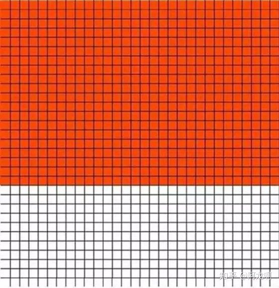

# 道理

## 关于学习

### 多读书

特别是多读一些能成熟心智、拓展视野的书像心理学、经济学等等，建立自己的知识体系。

### 学习投资理财

努力存钱积累第一桶金，学习投资理财。学会存钱，让钱生钱。

### 学习时间管理

克服拖延症，能节约我们很多的宝贵时间。

### 精力/注意力管理

对人来说最重要的财富不是时间，而是我们的注意力:注意力>时间>金钱 这才是三者的价值排序，而很多人忽略了注意力对于我们每个人的价值。注意力即为能有价值产出的时间。珍惜自己的注意力和精力，把它用在最有价值的地方，去学习，工作，成长。而不是玩抖音手机里千万不要下抖音、快手这些时间黑洞应用里。长期来看这些玩这些东西基本没用，当然要你完全戒除肯定很难，不过可以慢慢减少花在这上面的时间。

### 培养兴趣爱好

坚持一到两个兴趣爱好，用心去经营，这会让你的生活变得有趣，拓展你的生活维度。你还会因为这个找到很多有趣的人。

### 有写东西的不读书了，有打电竞的不读书了，有做生意的不读书了等等

但是这些例子都和你没关系，他们都是某件事情做到极致才不读书的，不要妄想我不读书也能和他们一样成功。

### 很多事情就像是旅行一样

当你决定要出发的时候，最困难的那部分其实就已经完成了。

### 少做高刺激低收益的事

比如王者荣耀、抖音等等，多做高收益的事情比如看书、学一门乐器、健身。因为王者荣耀那些东西长远来看对你的人生基本没有帮助。抖音不可怕，可怕的是你因为长时间坐高刺激的事情提高了自己的阈值，再也不能沉下心思考了。

## 关于健康

### 早睡早起要有自律意识，控制好自己的生活习惯

做到早睡早起，让自己每天都精力充沛，提高生活效率。

### 坚持锻炼健康的身体

充沛的精力对你来说都非常重要，每天的锻炼还可以有效缓解负面情绪。

### 定期体检

根据体检情况，了解自己的身体状况，借此调整生活习惯，可以让你活得更长。

### 戒烟

少喝酒有害自己身体健康的事情，尽量少做。

### 保护好眼睛

成年后，视力依旧会下降，所以不要天天盯着手机，更不要在黑暗的环境下玩手机。

### 记得要给自己和家人买保险

当你工作之后会发现，周围的人除了基本的医保还会买其他的保险，经济困难的话可以单纯买健康险，能保个平安，给家人和自己一个保障，一个普通的家庭是没有办法承担那些重大疾病的打击的，生病之后很容易压垮一个人，毁灭一个家庭。

### 精力不好的人要养成午睡的习惯

中午若是不能得到休息，那么下午和晚上的精力就会非常的差，做事的效率会大打折扣。这比你节省半个小时去做其他低效率学习的事情，效果好太多了！

总结：一个健康的身体是你想要做成任何事的地基。 有精力的人，做什么都能顺顺利利的。而这一切的根基，就是有一个健康的身体，所以要养成健身的习惯。

## 关于工作

### 找到一个朝阳行业

如果你进入了朝阳行业，就算进错了公司，你至少积累了经验，未来还能翻盘，但你选择了一个夕阳行业就很难有上升空间了，如果你在这个行业相信深有体会。

### 关注个人成长

职业生涯是场长跑，选择工作的时候，关注的点在成长上，刚毕业或是职场新人，不要天天把全部的心思都放在工资有多高，要想清楚这份工作能让你学到什么。

### 多向前辈请教

不管你从事哪个行业，找到老司机，就找到了职场上的快车道。和他们交流，因为知道你面对的那些障碍，正是他们曾经面对过的。

### 自觉地持续优化自我

工作中，不做伸手党，遇到问题自己先想办法，要锻炼自己思考的能力。问别人只是为了优化自己的答案。领导交代的工作，做之前先问清楚和领导确认一遍，这样做事有清晰的目标，有反馈。这样才能做得更好。

### 任何一份工作都不会永恒存在的,工作内容会变

相关的同事会变，重要的不是你做了多少工作，干了多少活，而是你能不能得到相关的积累（方法论、资源方面）否则工作再久也不会给你带来质的改变。

### 尽快独立，在经济上，和情感上

经济独立了才能有独立的人格，才有一个自己说了算的人生，情感上的独立就是说难过了、受伤了、孤独了都能自己一个人扛过去，扛过几次你就明白：这些痛苦都是暂时的，你总能习惯。

### 同样的问题只问一次，记录下来，忘记可重新翻阅

刚来公司，新接触业务，不熟可以问同事，但是同样的问题你重复问，人家就会礼貌反问你“你以前不是问过吗”，有时候别人也会反感。所以不要浪费自己的时间，而且也应该珍惜别人的时间。你实在记不住就乖乖写在纸上、手机上，以后就可反复查看。

### 对自己负责，不要因为对象而选择一个城市和一个公司

你选择一个工作必须是为了自己今后的发展做考虑，不然，你背井离乡为了爱情付出的种种努力，最后很可能只是方便了那些乘虚而入的人。因为社会上总有各种各样的诱惑，你不能保证别人一定能100%像你想的那样，始终如一，你要做的就是尽可能对自己负责。做到没了爱人还能在这个城市立足，发展，而不是举目无亲。

### 工作上敢于尝试

不要因为所学专业限制了自己，多去尝试不同的职业，不要怕犯错，年轻没有失败。

## 人际交往

### 毕业之后，有两种人需要你主动去接触，一个是比你优秀的人，一个是正能量的人，经常接触这两类人，你很难不进步

同时要远离负能量的人，因为你难免会被感染。

### 分手了不要在朋友圈发特别伤感的段子

尤其是被别人甩了之后，因为这不仅不能挽回什么，还会让自己被别人看扁。

### 朋友不是总是用来宣泄负能量的

每个人都有自己的事情要办，没有人喜欢一直抱怨的人 。

### 和一个人认识，无论别人多厉害多有钱

最重要的是平等，而不是无底线地对对方好，更不是为了讨好对方，轻易廉价的做任何事。对方不理你，你要先想办法提高自己的价值。

### 许多热衷于请吃饭、抢着买单的人（真心的朋友除外），其实并不是真正地慷慨大方

他们只是想让你强行欠下人情，然后在某些利益相关的时刻让你还出来。（该条略有争议）

### 逢人藏不住事，遇事沉不住气

生气兜不住火，是一种幼稚的表现，应该是一个成熟的人所杜绝的，发火很容易，谁都会，难就难在能在生气的时候控制自己的行为，并冷静地处理好问题，这才是值得提倡的。

### 在人际交往中，性格比相貌更重要

不过比性格更重要的是能提高自己与他人相处时的愉悦程度。比交不到朋友更无趣的是，自以为是地觉得自己是个很有趣的人。

### 不要在自己还很弱、没多少实力的时候费力去搞关系

每个人的精力都是有限的，实力如果和别人相差过大，关键时刻总会被人忽略。

### 一直隐忍不是美德，敢于表达才是美德

做不到的事情，就要敢于拒绝；如果需要资源支持，就要敢于向对方寻求资源：“这件事我一个人完成有点难，你可以给我找个助手吗？” 你想不想做，能做多少，别人是不知道的，别人只会通过你的语言和行为来推测你的感受和想法。所以一定要敢于表达。

### 世界上本就没有标准答案

如果有，那就是以你想要的方式度过一生，每天认真做好自己该做的事：多读书，按时睡觉，保持善良，怀有爱心。遇见难题，不要到处在别人面前矫情，而是学会一个人静静面对，自己慢慢把道理想通。这样的人单身又怎么样呢？你那么努力地在做好自己，一定会遇到更好的人。

### 两个人如果想长远的相互陪伴着走下去，只依靠喜欢是不够的，爱的真谛其实是学会温柔的

包容和相互的体谅。
如果你和别人分手之后，还能很自然的做朋友，做很久。那一般只有两种情况，你们根本不该分手。又或者，你们根本就应当是朋友。

### 多说话，多练习

表达很多人对表达好与否并不看重，认为只要在重要场合前背背稿子撑过去就行了，然而高效表达的好处渗透到生活的方方面面。原因很简单：同一件事，A说明白花一分钟而B只需30秒，你更想和谁一起共事和生活呢？除此之外，人们往往认为表达能力好的人聪明又优秀，在人群中格外显眼，这种气质不是单靠外在打扮就行的。即便不出于功利的目的也应该多练习表达，节约对方时间本就是对他人的尊重。
建议通过输出和回听的方式找到自己表述的缺陷，再长期反复练习训练加深效果。手机自带的语音备忘录简单但是不能练习对话，现在一款名叫声昔的语音日记APP，这里练口语的人很多，好的氛围会让你事半功倍。当然用什么工具不重要，最重要的是敢于迈出第一步。

## 思维模块

### 学会理财

别听你周围的人说，就你那点工资，理什么财，等钱多了再理吧，先去提升自己。但是你没有拿去理财的钱，真的是拿去提升自己了吗？你每个月买多少钱的书？花了多少钱去上什么课了呢？大多数情况，你的钱都被你无意识地“挥霍”掉了。真的，所以赶紧学习理财吧！

### 做事情要果断

不适合自己的，该放弃时就要放弃，之前投入的那些精力、时间等等资源就当做沉没成本吧！要敢于承担沉没成本，如果意识到自己在某些地方并没有天赋，就不要强求自己一定要在这些地方取得非凡的成就了，能意识到自身的局限也是成长的进步。

### 认识你自己

这句名言，从古至今一直是真理，如果你能真正地认识自己，知道自己想要什么东西，想要追求什么样的生活，想和什么样的人在一起，你就会不再迷茫。

### 失败不是成功之母，只有对失败的反思才能增加成功的概率

你要反思当时做决策时的思考过程，究竟是哪个环节出了问题，最终导致的失败？现在如果重来你会怎样做，这些对失败的反思会让你快速成长，不再稚嫩。

### 知道很多大道理，却做不到。不是因为你知道得太多，而是因为你知道的不够多。你不能从道理的本质、适用性、与你究竟何有关系等方面考虑。你仅仅是了解这个概念的皮毛罢了

比如说，你知道你要减肥，然后你订了一个月减肥2kg的计划，但是无法成功，于是你很沮丧。但其实一个真正能减肥成功的人应该是这样做的：了解自己体脂率，身体的健康情况，然后找到最适合自己的运动，更重要的是结合自己的精力状况，饮食、运动和情绪状况、意志力等等，这样才能找到真正适合自己又能保证效果的减肥方案。所以不是因为你知道得太多，而是因为你知道的不够多

### 学会独立思考

我们中国几乎不教我们如何独立思考，培养批判性思维，教授、专家说的话就一定是对的吗？那些网络谣言如此荒谬，为何还有一堆人上当受骗？而独立思考的能力注定是一个人能有所成就的必备的能力，一个人如果不会独立思考，很大程度上被谣言所蒙骗，被传销所迷惑。甚至可能仅仅因为某些砖家推荐了几个“涨停板”，就全仓杀入股市，到头来连“底裤”都输光。。。

### 唯有行动才能解决焦虑

很多事情在我们没有开始做之前，总是会有很多错误的判断，会有很多疑惑，会很焦虑，不知道自己能不能做好。其实，我们在明白了一定的原理之后就可以开始去做了，因为往往只有我们行动了才能有更深的体会，行动了大部分焦虑就自然解决了，在行动中学习，学习中行动，即互联网思维中的：小步试错，快速迭代。

### 具有灰度思维

在黑和白之间存在着一个广阔区域，就叫做灰度区域。但是很多人，要么只能看到黑色区域，要么只能看到白色区域。这种形式反应到我们的思维模式当中，就是一种非黑即白的思维模式。灰度思维就是不要用二元对立的方法来看待我们周围的人和事。
世界上没有一个人是100%的坏人，也没有一个人是100%的好人。每一个人都有优缺点。要么完全信任别人，要么完全不相信别人，互不往来。要么认为别人的成功全靠运气，要么认为别人的成功全靠努力。可为什么我们不能加入比例进去呢？比如80%地相信别人，20%的怀疑别人，具体的比例看情况。总之，不要用二元对立的方法来看待我们周围的人和事。

## 情续管理

### 不要害怕

很多你怕的事情并不会发生。比如有的身体健康的人会担心自己会不会突然有一天与世长辞，其实这些都是多余的。

### 通过情绪进行自我检查

如果一件事情特别容易触发你的负面情绪，那么这件事情可能指向了你内心的一些难言的伤口或者不合理的观点。比如有人无意中提到了某些事情，你非常生气。很可能意味着，你的某些想法在一定程度上被他说中了。

### 人活着最重要的是要看清自己

找不清自己定位的人，总把安全感寄托在外界身上，什么都要别人来督促、评价，这样下去一辈子浑浑噩噩是大概率的事。

### 永远不要对人心和感情太过乐观

也不要对努力的前景太过悲观，每天用心做好当下的事，这就够了。

### 有些人和你非亲非故

但是会无缘无故的对你伸出援助之手，却不要求任何回报；而有些人则会想方设法地陷害你，哪怕对他一点好处都没有；这就是生命中贵人和小人的区别。

## 认知模块

### 学会抉择,人生路虽然很长,但关键处只有几步,大学院校,专业选择,结婚，第一份工作，定居城市等等

走得好，事半功倍，抓住了制胜点，赢得了战略；关键点选错了，就要花费巨大的努力，才能扳回一城。

### 物理

世界上的万事万物都有它独特的运行规律，如果你能发现并运用这个规律，就能做的比大多数人好。如果你想提高学习成绩，最具有实操性的方法是什么呢？ 那就是去观察那些学霸是怎么学习的，看他们具体的学习方法是怎么样的：看看他们是如何听课、如何写作业，如何复习的，他们上自习的时候用什么样的方式保持专注并且学会自控的，他们遇到难题是怎么处理的，看和你有什么不一样？等等。借此改进，才能取得进步。同理，这个道理也可以运用在其他方面。

### 实践是最重要的

你觉得这些道理都有点用而不行动，等于在死循环里继续挣扎。

### 代表你人生前半生的一面白纸上可能已经被画得乱七八糟

不过你不需要去费力否认、擦除，只需要把它反过来即可，即接纳过去不完美的自己，你随时可以做全新的自己。过去的，已经过去了，唯有做好当下的事。

### 活在未来，而不是当下

1. 你对未来有个预测；

2. 那个预测需要时间才能得到结果；

3. 你笃信你的预测是正确的；

4. 于是你提前按照那个预测的结果行动，选择，思考；

5. 你终将走到那个结果出现的时刻；

6. 最终你的预测是正确的；

7. 那么，由于你提前按未来正确的结果行动、选择、思考，于是，在相当长一段时间里，你的生活中的一部分，就是“活在未来”的。（来自新东方某老师）巴菲特因为对股票、公司有了很深地研究，他有足够的信心判断只有时间足够长，价格终将回到公司的实际价值，所以他才能靠投资成为首富级别的人物。所以说巴菲特是一个活在未来的人。

   PS：其实我也是这样的人，哈哈。。。

### 晚上的时候，人的大脑的前额皮层对情绪的控制能力会减弱

容易做出和说出一些比往常极端一些的事，当你要做某些重要的事情或决定的时候，尽量不要在晚上去做去说。

### 世界有多大，取决于你认识和见过多少人和事

如果你认识的人多一些，见过的事情多一些，那么属于你的世界就会大一些。其实属于每个人的世界并不是很大，只有那些我们见过的美景、尝过的美食以及真正关心我们的朋友。

### 旧的光环三年左右就开始褪色了

比如高中生的中考成绩，实习时的高考成绩。这个时候你应该用其他东西来证明自己的优秀了。

### 我们每次给别人讲道理时，最心累的莫过于

纵使你再苦口婆心，再循循善诱，他们只能听进去他们本来就想听到的，然后再把别人栽过的跟头再栽一遍，最后受伤了又后悔当初要是听进去别人说的话该多好......

## 其它

### 及时养成复盘的习惯何谓复盘？

复盘是对以前做过的事情如以前做过的项目（如主持的会议、考试的过程）进行一次回顾和总结,从中发现问题，这就像刻意练习里说的那样，只有对反馈进行总结并且调整优化，我们才有可能进步，否则你说你练习了几十年，但你其实只是把1天的经验机械地重复了几十年而已。

### 唯有行动才能解决焦

虑很多事情在我们没有开始做之前，总是会有很多错误的判断，会有很多疑惑，会很焦虑，不知道自己能不能做好。其实，我们在明白了一定的原理之后就可以开始去做了，因为往往只有我们行动了才能有更深的体会，行动了大部分焦虑就自然解决了，在行动中学习，学习中行动，即互联网思维中的：小步试错，快速迭代。

### 精力、注意力管理

对人来说最重要的财富不是时间，而是我们的注意力:注意力>时间>金钱 这才是三者的价值排序，而很多人忽略了注意力对于我们每个人的价值。注意力即为能有价值产出的时间。珍惜自己的注意力和精力，把它用在最有价值的地方，去学习，工作，成长。而不是玩抖音手机里千万不要下抖音、快手这些时间黑洞应用里。长期来看这些玩这些东西基本没用，当然要你完全戒除肯定很难，不过可以慢慢减少花在这上面的时间。

### 独立思考

我们中国几乎不教我们如何独立思考，培养批判性思维，教授、专家说的话就一定是对的吗？那些网络谣言如此荒谬，为何还有一堆人上当受骗？而独立思考的能力注定是一个人能有所成就的必备的能力，一个人如果不会独立思考，很大程度上被谣言所蒙骗，被传销所迷惑。甚至可能仅仅因为某些砖家推荐了几个“涨停板”，就全仓杀入股市，到头来连“底裤”都输光。。

### 给自己和家人买保险

当你工作之后会发现，周围的人除了基本的医保还会买其他的保险，经济困难的话可以单纯买健康险，能保个平安，给家人和自己一个保障，一个普通的家庭是没有办法承担那些重大疾病的打击的，生病之后很容易压垮一个人，毁灭一个家庭

### 少做低收益的事

比如王者荣耀、抖音等等，多做高收益的事情比如看书、学一门乐器、健身。因为王者荣耀那些东西长远来看对你的人生基本没有帮助。抖音不可怕，可怕的是你因为长时间坐高刺激的事情提高了自己的阈值，再也不能沉下心思考了。

### 持续优化自我

工作中，不做伸手党，遇到问题自己先想办法，要锻炼自己思考的能力。问别人只是为了优化自己的答案。领导交代的工作，做之前先问清楚和领导确认一遍，这样做事有清晰的目标，有反馈。这样才能做得更好。

### 正确对待金钱

钱重要吗？的确很重要，可它是不是世界上最重要的东西呢？其实不是并不是越富有就越幸福人们会适应财富的增加，收入水平存在一个临界点，过了这个点，幸福感的增强速度远慢于收入的增长速度。（虽然平均来讲，收入的增加总是伴随着幸福感的增加）

比如对大多数人而言5千万和5亿的幸福感差距不太大。

所以我们应该在“视金钱如粪土”和”金钱至上”之间保持一个微妙的平衡，这个平衡点对不同的人，具体的位置也不同。

### 不要像机器人一样，做繁琐和精确到分钟的计划表

比如网上盛传的浙大学霸那个学习计划表（甚至精确到秒）这种看起来很好的习惯，但本质上，它是存在很大误区的，生活中的突发事件有很多，我们不能完全按照计划表上的事情做好，偶然的突发事情让计划脱离了轨道，就会很受挫，得不偿失！

### 越早学会理财越好（更准确地说是学会理财的思维）

很多人说：我工资才5000，用不了几下就月光了，怎么理财啊，等我有钱再理吧！现实情况是“你不理财，财不理你”即使有一天你走大运，中了500万大奖，相信我不出两年，你迟早给它败光。这里的理财思维指的是一种金钱的分配方式，比如X%存XX宝，Y%当做救济金，Z%买基金，以及一些节流的思维。和财富的绝对值没有那么相关。

### 不背后说人坏话

因为在微信群等等里背后讨论别人，难免会被其他人截图传到当事人那里，从而造成关系的决裂，很可能别人一辈子都不会信任你，不会跟你有深入的合作，因为你背地里都这样，谁知道你究竟是个什么样的人？**所以我们不要在背后说人坏话，哪怕是线下，不会被截图**，这不仅是为了提高修养，更是为了保护自己的安全。

### 快速从过程导向转变为结果导向的思维

什么是结果导向呢？结果导向指的是做一件事情，以结果为最终目标，以如何完成目标为导向的思考方式，与之相对的就是过程导向：只关心做事情的过程，不在乎结果。结果导向只关心事情的结果，不在乎你用什么方法完成的事情（只要没有违反道德、法律）。

日本经营四圣之一的稻盛和夫在自传中提过这样一件事：在京瓷刚创立的时候，为了抢到订单，无论客户有什么技术上的要求，他都答应，其中有很多“看似不可能完成的任务”，但是他都一一解决了。**只有当你以结果为导向，对结果负责，而不是沉浸在“我已经很努力了的过程里面”你才不会遇到困难找借口，总想着逃避。**

### 升米恩，斗米仇

**不要成为一个没有原则的滥好人**，否则你帮助过的人不会感谢你，你没帮助到的人会怨恨你。我想起了有一个笑话，某个乞丐在街上祈祷，A路过后天天给了他10块钱，B看乞丐好欺负，天天打他一顿。某天A突然忘带零钱了，乞丐问他说你今天怎么不给我钱! 某天B忘记打了乞丐，乞丐却感激涕零觉得B内心其实是一个好人。虽然是个笑话，不过对我们理解道理有所帮助。

### 不要看对方说了什么，而是思考他说这个的真实需求（其实就是追问黄金圈里的那个why是什么）

比如说你爸妈突然给你打了个电话，给你说你们那里的天气怎么样怎么样,叫你注意保暖等等。表面上看是她想和你聊天气，但其实是你好久没回家，他们想你了，这时候你不应该回答：我知道了，我会注意保暖的。而应该说我XX时候就回来了。因为时代、观念的原因，他们只好这样表达他们的想法。

### 年轻没多少钱的时候

**尽量把大多数可调用的钱砸在提升自己上**，这是回报最高的投资方式了。
你说你去投资一年20%的净收益率算高了吧？50W的本金能挣10W，可是刚毕业的大学生有几个人有50W以上呢？只有2W块钱的时候与其把精力全花在炒股上，不如先拿来提升自己，等你有了10W以上再想着投资也不迟。

### 实践最重要

**很多人都说：为什么我看了这么多书，懂得了这么多道理，可为何还是过不好这一生？那我想问你按书中的实践了吗？你有刻意地按照某些书里的道理控制自己的行为吗？这就好比一个人听了很多游泳的理论却从未下过一次水，却说：老天啊，我为什么不能成为一个游泳高手呢？**你觉得这些道理都有点用而不行动，等于在死循环里继续挣扎。

### 决策的时候记得考虑机会成本和沉没成本

举个例子上班的时候很多人为了省钱，选择租离公司很远的房子，**通勤就要2个小时但是租金却比较低，以为自己赚到了。但是你还忽略了时间这个成本啊，**你租一个离公司通勤只需半个小时的房子，虽然租金贵但大大地减少你时间、精力的浪费也许更划算呢？

### 人生比我们想得还短暂，只有900个方格

**每隔一个月，我就亲手把一块方格涂黑。**
以前我总以为时间还很长，自己还很年轻，直到有一天我了解了这个东西。

死亡方格：以平均寿命75年计算，人生只有900个月。把这900个月以格子的形式画在纸上，对应900个格子。

如果你今年20岁，那么已经走完的人生是这样的。

如果你今年50岁，那么已经走完的人生是这样的。

其实死亡一天天地都在接近我们，只是我们在大学的时候忙于打游戏、K歌，上班的时候忙于加班，中年的时候忙于带孩子。可是什么时候有时间做自己真正想做的事情呢？做那些让你激动不已的事情？当你60岁格子快涂满的时候，你会不会后悔要是自己在20岁时多努力一点，在25岁的时候多去看一看这个世界？**所以说趁年轻多去做一做你梦想的事情吧，因为每一天，每一个月你都在划去这900个方格里的一格啊！**

### 为你自己打工，对自己的成长负责

很多人这样想：我们付出自己的工作时间，老板付我们报酬，那么老板付我多少钱，我就干多少钱的活，拿6000块我就干6000块的活，要是我在工作之余打打游戏，只干了5000块的活我就赚了！然而这样想完全是错误的，给老板打工，我们会总觉得老板在剥削自己，自己是那个“受害者”。不可否认，总会有不太公平的老板，不会按照你做的贡献、你的工作水平给你相应的薪资。**可是你始终是为自己打工**啊，你工作里面获得的成长，积累的项目经验，做出的业绩等等完全是自己的，别人都抢不走。

如果你因为公司环境不好，老板不公平的环境而放弃好好工作，那就太傻了。环境不好，那我好好干积累项目经验跳槽就是。假如因为老板不公平，你作为一个程序员，选择每天上班就是网上随便找个代码复制再随便修改了事，你又得到了什么呢？除了那基本薪水外你什么都没有得到，技术没有得到提升，还浪费了最宝贵的光阴，如果再过两年还这样，估计要被老板开除了…… **记住你永远都在为一家叫做“自己”的无限责任公司打工。**

### 给别人鼓励或者给别人点赞

会让你的运气变好，这是有心理学效应的（这叫皮格马利翁效应）

1. 事情没有做成之前，不要告诉任何人。
2. 世界不是善意的，收起你的天真。
3. 自己明确知道没有意义的事情，就不要去做，真正学会自控。
4. 毅力和自控力是很可怕的东西，因为99%的人根本不具备这种品质。拥有它你就比大多数人都要强。
5. 这些年我一直提醒自己一件事情，千万不要自己感动自己。大部分人看似的努力，不过是愚蠢导致的。
6. 人生，除了生老病死，其他都是小事，这世上最重要的是你的性命，在此基础上才可以谈及其他。
7. 如果某件事情唯一的好处就是让你有片刻的痛快，尽量不要去做。
8. 人到了一定的年龄，就要扔掉四样东西:没意义的酒局，不爱你的人，看不起你的亲戚，虚情假意的朋友。必须拥有四样东西:扬在脸上的自信，长在心底的善良，融进血液的骨气，刻在生命里的坚强。
9. 一定要摆脱讨好型人格！建立在讨好上的社交关系百分之九十以上都是无效的。不要再依赖被人喜欢的样子活下去。是活不下去也过不好人生的。那样的人生简直就是废墟一片。
10. 千万不要有任何改变别人的想法，你拯救不了任何人，你也改变不了任何人。人只能被自己改变，你要知道，以后走任何的路，你只能控制你自己一个人。你无法选择考试时旁边是音响还是石头，你只能依靠改变自己才能保证自己的人生。
11. 在工作上学会喜怒不形于色，若你的情绪一眼被老板看穿，那你的前途便需要重新考虑。
12. 圈子不同，不必强融。
13. 不如意事常八九，可与人言无二三。
14. 别工作了就忘记学习，学习能够让你有更多的选择。
15. 不要光看别人说什么，要结合他做什么一起去想他的目的是什么。
16. 每一个人都在自己的智识、情感、欲望、经验等限制条件下做出了给自己利益最佳的选择，每个人都在为自己而战，谁也不比谁高尚。不要再说什么自私，太幼稚了。
17. 一个人如果去了做了自己不适合的工作，那他所有的优点都会变成缺点。一个人如果做了自己喜欢且适合的工作，那他所有的特点（注意是特点，不含缺点）都会化成优点。
18. 与人交往，先想好自己能够提供的价值是否是别人需要的。
19. 如果家人文化程度低，做大事不要与他们商量，但要对他们展现出你无比的敬意。
20. 读书是最低成本的成长方式。大多数人的生活之所以会越来越糟糕，是因为把时间都用在了游戏、吃喝玩乐刷手机上，而那些越来越牛逼的人，「想要」跟「得到」的欲望非常强烈，他们把时间都花在了提升自己的事情上。我一直认为读书是最低成本的成长方式，如果你想读书学习却不知道怎么开始，可以关注我的公众号蒋山山，后台回复书单，领取一份被18W人收藏过的必读书单，这份书单可以让你三年内不用再去找书读。
21. 越早明白越好的道理：每天发生在自己身上的99%的事情对于别人而言根本毫无意义。世界上没有感同身受。
22. 人们普遍知道的很多，但是能照做到、能想开的很少。人最重要的，就是应该清楚自己想要什么，并且认真的去对待。
23. 别等全会再做，边做边学。
24. 健康永远是第一位的，早睡，早起，运动。
25. 钱是非常重要的，学会自己正当的挣钱，记账，节俭，理财。
26. 学会表达，不要让对方猜。
27. 当下的感受，要学会说出来。
28. 不要在深夜做一个重要的决定，很容易后悔，大多数人深夜是非常脆弱的，很容易产生极端的想法。
29. 真正的醒悟，是需要实实在在的经历的。
30. 有机会帮助别人时，尽量多帮助别人，不求回报。人生，都是不断在结缘。结善缘，得善果。今天你帮了他，明天他又可能帮了你。积善之家必有余庆。

31. 当一个人

- 当一个人去追求生活的必需品的时候，他往往是勤奋和勇敢的。
- 当一个人去追求生活的消费品的时候，这个时候往往变得懒惰和温和。
- 当一个人去追求生活的奢侈品的时候，这个人就变得软弱了。

1. 玩命读书
2. 玩命工作
3. 强身健体

发现问题的能力比解决问题更重要，勇于寻找问题比坐以待毙强太多了。

时间是财富，是我们改命的机会。

我怎样才能付得起？

“真正能让你走远的，都是自律、积极和勤奋。”——卢思

种一棵树最好的时间是十年前，其次是现在。

心在哪里，时间就在哪里。

我必须富有，因为我有孩子。

“贫穷和破产的区别是：破产是暂时的，而贫穷是永久的。”

只有知识才能解决问题并创造财富，那些不是靠财务知识挣来的钱也不会长久。

从长远来看，重要的不是你挣了多少钱，而是你能留下多少钱，以及能够留住多久。

资产就是能把钱放进你口袋里的东西。

负债是把钱从你口袋里取走的东西。

财富就是支撑一个人生存多长时间的能力，或者说，如果我今天停止工作，我还能活多久？

富人买入资产。 穷人只有支出。

从事你所学的专业的可怕后果在于，它会让你忘记关注自己的事业。人们耗尽一生去关注别人的事业并使他人致富。

只有你把额外的收入用来购买可产生收入的资产，你才能获得真正的财务安全。

我们都拥有巨大的潜能——这是上天赏赐的礼物。然而，我们都或多或少地存在着某种自我怀疑的心理，从而阻碍前进的步伐。这种障碍很少是缺乏某种技术性的东西，更多的是缺乏自信。有些人更容易受到外界的影响。

穷人有一些不好的习惯，其中一个普遍的坏习惯就是随便动用储蓄。富人知道储蓄只能用于创造更多的收入，而不是用来支付账单。

“真正能让你走远的，都是自律、积极和勤奋。”——卢思浩

 种一棵树最好的时间是十年前，其次是现在。

心在哪里，时间就在哪里。

你要做的，不是刷新公司的下限，而是突破你自己的上限。

不要提前去消费

资产就是把钱放入口袋的东西，负债就是把钱拿出口袋的东西。

吃喝玩乐

亲，我们负责的是简单平面设计哦，不满意可以在一个版面上进行修改，对排版期望期较高，希望是创意设计的，或是试一试心情的心态，请慎重考虑下单，以免耽误您的宝贵时间。

奖励确实能激励孩子做事，但也会使孩子的行动依赖于奖励，一旦奖励停止，行动也会停止。即使孩子本身对这件事情很感兴趣也不行。

凡是大众赞同的，我们就要去思考；
凡是大众反对的，我们就要去研究；
凡是大众厌恶的，我们就要去搞懂。

卖什么，不要卖什么。

树立自己的核心竞争力

永辉、新华都、麦当劳、肯德基

大家好，新人报道，请多多关照！

马云曾经说过员工离职的原因：1.钱没有给到位 2.心委屈了。

客户是人，而不是模式化的形象。

锁定目标受众时推荐的做法：
锁定小范围的群体：从受众群体的细节特征入 手。
想其所想：换位思考，用他们的视角评判你的产品／服务。
深入挖掘：注意他们所处的环境、消费心态、情绪、动机和內心渴望。
开展调查：检验你的理论，并用数据支撑它。

疟疾

书中自有黄金屋，书中自有颜如玉。

再富不能富孩子，再穷不能穷教育。

舍得便是获得。

因为有爱，每句话要好好说。

如果当你一天到晚拿着手机刷着微博，
坐在家里 宅着看电视，
天天上着网，
做着那些80岁以后都能干的事
你要青春干什么呢？？？

梦想不会逃跑，逃跑的总是自己。

吃不穷喝不穷，算计不到才穷。

## 有哪些值得长期坚持下去的好习惯？

1. 心情糟糕时认真清理房间，心情莫名就开始清爽起来；
2. 受人恩惠帮助后除了说声谢谢，再赠送一件小礼品，可以结识到更亲密的关系；
3. 每周问候几位优质而“无用”的朋友；
4. 将朋友圈有趣真实的人，设为星标，偶尔主动点赞，点赞是一种连接和支持；
5. 在聚会中遇见一位感觉不错的人，进行一对一交谈，主动请求加微信，第二天表达初识之喜与问候；
6. 出差、旅行，记得带上一双跑鞋，一身运动服，去陌生城市/地域的清晨跑个步，或许收获新的灵感；
7. 晨起刷牙时问问自己，如果要过好这一天，有什么可改良创造之处；
8. 睡前1小时远离手机和任何电子设备；
9. 戒糖，戒所有含糖饮料，将可口可乐改为零度可乐（之类无糖甜味饮料）；
10. 每天在线或当面对所遇见的人表达某方面的欣赏和激励；
11. 遇见心仪的异性，用大方得体的方式释放好感；
12. 为自己做一张能量及时间管理表格，规划一天中的高能时间要完成的事情，以及低能时间可以做的事情；
13. 为自己做一张能量建设表格，列出哪些事情可以让自己增加能量（为自己充电），保持良好状态，比如早睡、早起、健身、和喜欢的人在一起、做喜欢的事情……等等；
14. 当出现负面情绪和自我否定时，想办法转移自己的负面情绪，听增强自信的音乐，或者看励志书籍/电影，或者找人夸夸自己；
15. 误解或伤害过他人，一定要专门去道歉和解释；
16. 睡前5小时，绝对不进食，戒糖，低碳，控制体重；
17. 改变饮食结构，从一天三顿主食，过渡到一天一到两顿主食，多吃优质蛋白和蔬菜，远离肥胖；
18. 清理家中一年以上未使用的非必须物品/衣物，来一次断舍离，多余的送人；
19. 每天问问自己，最重要的人，最重要的事情，最重要的目标，到底是什么；对那些不重要的人、事、物，尽可能少分配精力；
20. 给人第二次机会，但不要给第三次，圣经上说过：凡第二次犯错者，必有第三次；
21. 在熟悉的城市找到自己的避难所和舒适区，也许是一个饭馆，一个街区，一个酒吧，一个朋友的住处，一个人的心里。总有些时候，我们会猝不及防地崩溃，我们需要逃离现实去到那里。就像日剧里的深夜食堂。
22. 建立自己的日常事项，比如日常写日记，日常有氧健身半小时，用恒定不变的习惯，抵抗人生的无常。会建立自信，缓解焦虑。

坚持下来，会看到不一样的自己，那更美。 我们都一起，每日每月以求寸进，加油！
